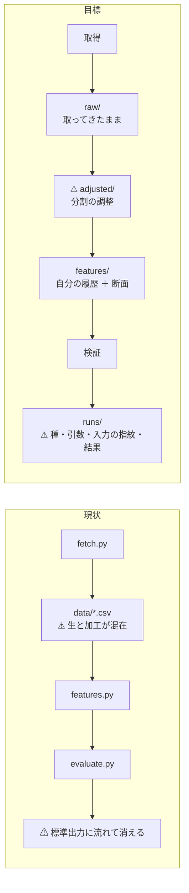
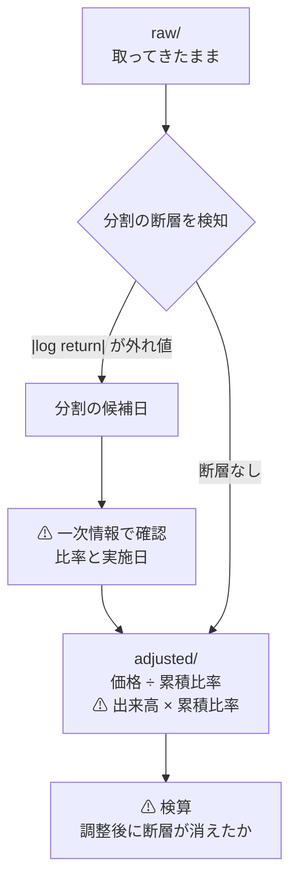
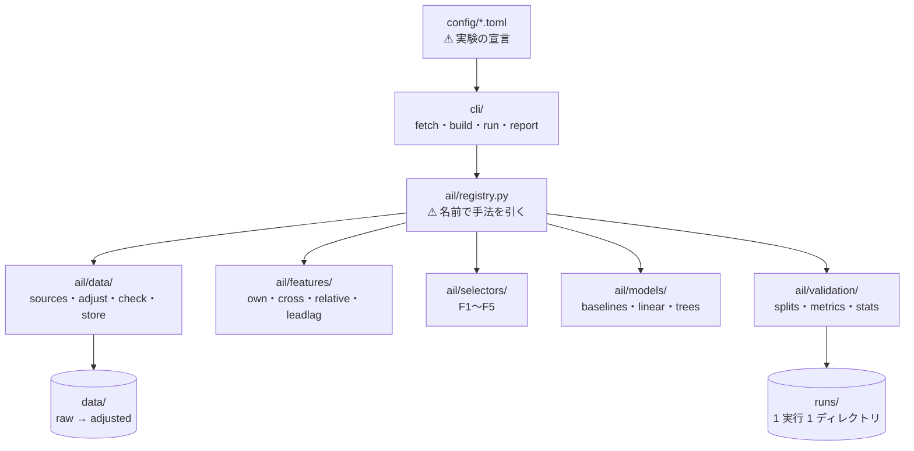
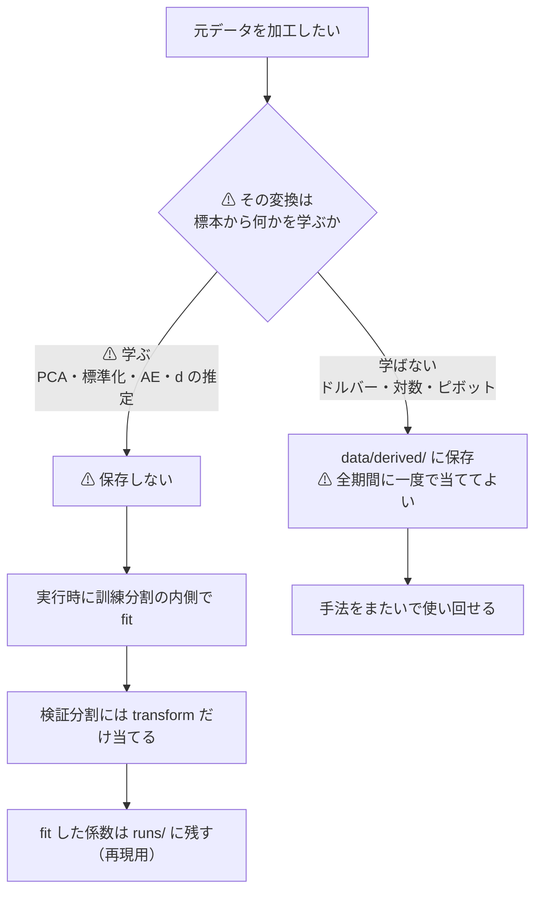

# データと分析手法を構造化する（日々改善して回せる形にする）

作成日: 2026-09-08。対象: `experiments/feature-discovery/` と `docs/specs/experiments/feature-discovery.md`。
派生元: [E8 の記録](../../specs/experiments/e8-signal-methods.md) ／ [特徴量を見つけ出す手法の検証](../../specs/experiments/feature-discovery.md)

## 0. この作業の形

利用者の指示（2026-09-08）: **データ分析は日々改善をしながら進めるので、データや分析手法の構造化を行う。構造化のルールの md ファイルを作り、そこに株式分割の調整も入れる。**

⚠ **主成果物は「ルールの md」**であって、コードの整理はそれに従わせるための作業である。

⚠ **このプランは土台だけを作る。手法の良し悪しの結論は出さない。**
結論は [特徴量を見つけ出す手法の検証](../../specs/experiments/feature-discovery.md) 側が持つ。⚠ **両者が別々に数字を出すと、どちらが正か分からなくなる。**

| 成果物 | 中身 |
| --- | --- |
| **`docs/specs/experiments/feature-discovery/rules.md`** | ⚠ **構造化のルール（本体）。** データの層・調整・命名・不変条件・検証の規約 |
| `experiments/feature-discovery/` | ルールに合わせた作り直し（層の分離・調整・実行記録） |
| [feature-discovery.md](../../specs/experiments/feature-discovery.md) | 入口からルールへ導線を張り、既存の結果に「どのルール以前の結果か」を注記 |

## 1. 目的 — いま構造化しないと何が起きるか

⚠ **1 回だけ回すなら要らない。日々回すなら要る。** 現状で既に起きている問題を並べる。

| # | いま起きていること | 放置するとどうなるか |
| ---: | --- | --- |
| 1 | ⚠ **株式分割の調整が未確認**。日足に分割の断層が入っているか分からない | ⚠ **NVDA の 2024 年 10:1 分割が −90% の偽リターンとして入る。** すべての日足の結果が汚染される |
| 2 | ⚠ **生データと派生データが同じ `data/` に混在** | どれが「取ってきたまま」でどれが「加工後」か分からなくなる。⚠ **加工の誤りを遡れない** |
| 3 | ⚠ **断面（銘柄をまたぐ）の設計が無い**。いまは各行が自分の履歴しか見ないプーリング | ⚠ **系統 J をまるごと試せない。** 特徴量が 35 本しかなく、選別手法の比較が成立しない |
| 4 | ⚠ **実行の記録が残らない**（乱数種・パラメータ・コード版・入力の manifest） | ⚠ **昨日の数字を再現できない。** 日々改善は「前より良くなったか」が言えないと回らない |
| 5 | 特徴量の命名規約が無い | 断面を足すと 2,000 本を超える。⚠ **どの層の特徴量かが名前から分からないと選別結果を読めない** |
| 6 | ⚠ **63 系列の実質的な独立性が未測定**（SPY は残り 48 社を含む） | 行数を標本数と読み違える。⚠ **t 値を過大に読む** |

> この図の主張: いまは「取得 → 特徴量 → 検証」が 1 本の線で、⚠ **どこで加工したかが記録に残らない**。層に割って、層の境目に不変条件と記録を置く。



## 2. 構造化の 3 層

| 層 | 何を置くか | 不変条件（⚠ 破ったら止める） |
| --- | --- | --- |
| **L-D データ** | `raw/` 取ってきたまま ／ `adjusted/` 分割を調整したもの | 時刻が単調増加・重複なし ／ `high ≥ max(open,close)` ／ `low ≤ min(open,close)` ／ 価格 > 0 ／ ⚠ **NaN 番兵の除去** |
| **L-F 特徴量** | 自分の履歴（own）／ 断面（cs）／ 市場相対（rel）／ リードラグ（ll） | ⚠ **足 i の特徴量は足 i までしか見ない** ／ 名前が層を表す ／ ⚠ **対照実験（わざと未来を混ぜる）が通る** |
| **L-V 検証** | ウォークフォワード ／ パージ ／ 基準線 ／ コスト | ⚠ **選別は訓練分割の内側** ／ ⚠ **基準線を必ず併記** ／ 種を記録 |

## 3. ルールの md の章立て（`rules.md`）

⚠ **これが本作業の主成果物。** 各章は「規約」と「⚠ 破ったときに何が起きるか」を対で書く。

| 章 | 中身 | ⚠ 要点 |
| --- | --- | --- |
| 1 | **データの層と置き場** | `raw/` は書き換えない。加工は必ず新しい層へ |
| **2** | ⚠ **株式分割・配当の調整** | **本作業で足す章。詳細は §4** |
| 3 | **時刻と識別子** | UTC ミリ秒・**足の開始時刻**・`BRK/B` はファイル名で `BRK-B` |
| 4 | **不変条件と検査** | §2 の表。⚠ **取得のたびに自動で通す** |
| **4-2** | ⚠ **手法ごとの元データ加工** | ⚠ **推定しない変換は `derived/` にキャッシュ、推定する変換はキャッシュ禁止**（§4-5） |
| 5 | **特徴量の命名と層** | `own_ret_5` / `cs_rank_ret_1` / `rel_spy_resid_5` / `ll_XLK_ret_1` の 4 接頭辞 |
| 6 | ⚠ **先読み禁止** | 窓は i で閉じる ／ ⚠ **対照実験（`--leak`）を毎回通す** |
| 7 | **ラベル** | 地平 k ／ 跨いだ実時間を残す ／ ⚠ **末尾 k 本は捨てる** |
| 8 | **検証の規約** | ウォークフォワード ／ パージとエンバーゴ ／ ⚠ **必須の基準線 4 本** ／ コスト |
| 9 | **実行の記録（runs）** | 種・引数・入力の指紋・コードの版・結果を 1 実行 1 ファイル |
| 10 | ⚠ **数字の扱い** | E8 から継承。**悪い数字は結論、良い数字は根拠「中」が上限** |
| 11 | ⚠ **既知の限界** | 生存バイアス（上場廃止が無い）／ 63 系列の重複 ／ 8,000 本の上限 |

## 4. ⚠ 株式分割・配当の調整（ルール §2 に入れる中身）

> この図の主張: 調整は**生データを壊さずに層を足す**形で行う。⚠ **価格だけ直して出来高を直さない**のが典型的な事故。



| # | 規約 | ⚠ 理由・落とし穴 |
| ---: | --- | --- |
| 1 | ⚠ **`raw/` は絶対に書き換えない。** 調整は `adjusted/` に新しく書く | 加工の誤りを遡れるようにする |
| 2 | ⚠ **価格を割ったら出来高は掛ける。** 10:1 なら価格 ÷10・出来高 ×10 | ⚠ **価格だけ直すと出来高の特徴量（`vratio`・`dollar`）が全部おかしくなる** |
| 3 | 調整は**累積比率**で行い、分割日**以前**の全期間に効かせる | 1 日だけ直すのは誤り |
| 4 | ⚠ **配当は既定では調整しない**（価格リターン）。総収益が要るときは**別の系列**として持つ | ⚠ **配当調整すると「その日の実際の値段」ではなくなり、bp のコスト計算とスプレッドの解釈がずれる** |
| 5 | ⚠ **提供元が既に調整済みかを先に確かめる**。二重に調整するほうが害が大きい | 既知の分割日で終値の連続性を見る |
| 6 | 逆分割・ティッカー変更（FB→META など）も同じ枠で扱う | ⚠ **ティッカー変更は履歴が切れる形で現れることがある** |
| 7 | ⚠ **検知は自動、確定は一次情報**。外れ値検知だけで分割と断定しない | ⚠ **本物の −40% の日（決算の急落）を分割と誤認すると、実在した損失を消してしまう** |
| 8 | 調整の有無・比率・出典を `adjusted/` の manifest に残す | 後から検算できるようにする |

⚠ **本作業の最初の 1 手は「そもそも調整済みか」の確認**である（§6 の Phase 1）。**調整済みなら実装は不要で、ルールと検査だけ残す。**

## 4-2. ディレクトリ構成

⚠ **手法がかなり広範囲に増える前提で組む。** ただし ⚠ **「何でも差し替えられる」形にはしない** — 抽象を増やすほど 1 つ試すのに触るファイルが増えるので、**増える軸だけをプラグインにし、増えない軸は素直に書く。**

| 軸 | 増えるか | 扱い |
| --- | --- | --- |
| 取得元（tastytrade・Kraken・…） | ⚠ **増える** | `ail/data/sources/` に 1 ファイル |
| 特徴量の層（own / cs / rel / ll …） | ⚠ **増える** | `ail/features/` に 1 ファイル |
| 選別手法（F1〜F5 の 25 件〜） | ⚠ **最も増える** | `ail/selectors/` に関数を足すだけ |
| モデル（線形・木・NN …） | ⚠ **増える** | `ail/models/` に 1 ファイル |
| 検証の作法（分割・指標・統計） | 増える | `ail/validation/` に 1 ファイル |
| 銘柄の集合・地平・コスト | ⚠ **組み合わせが増える** | `config/` の宣言だけで増やす（**コードを書かない**） |
| 保存の形式・不変条件・実行記録の形 | ⚠ **増えない** | ⚠ **抽象化しない。** 1 か所に具体的に書く |

> この図の主張: 入口（`cli/`）は薄く、中身（`ail/`）は層で割る。⚠ **手法を足すときに触るのは葉のファイル 1 つだけ**にする。



```
experiments/feature-discovery/
├ README.md                 使い方と、ルールへの導線
├ requirements.txt
├ config/                   ⚠ コードを書かずに実験を増やす場所（TOML。tomllib は標準）
│   ├ universe/             銘柄の集合（いまの symbols.txt の置き換え）
│   │   └ us63.toml
│   ├ dataset/              粒度・期間・調整の指定
│   │   ├ min1.toml
│   │   └ daily.toml
│   └ experiment/           ⚠ 1 実験 1 ファイル（銘柄 × 粒度 × 特徴量の層 × 選別 × モデル × 検証）
│       ├ own_only_h1.toml
│       └ cross_section_h1.toml
├ ail/                      ライブラリ本体
│   ├ registry.py           ⚠ 柔軟性の核。@register で名前を付け、config の文字列から引く
│   ├ contracts.py          層のあいだで渡す型の約束（DataFrame の列と意味）
│   ├ data/
│   │   ├ sources/          ⚠ 取得元を増やす場所
│   │   │   ├ tastytrade.py
│   │   │   └ kraken.py
│   │   ├ adjust.py         ⚠ 分割・配当の調整（ルール §2）
│   │   ├ transforms/       ⚠ **手法ごとの元データ加工**（§4-5）
│   │   │   ├ bars.py       ドルバー・ボリュームバー（推定しない）
│   │   │   ├ series.py     対数・差分・分数差分
│   │   │   ├ panel.py      断面のピボット（時刻 × 銘柄）
│   │   │   └ fitted.py     ⚠ **標本から学ぶ変換（キャッシュ禁止）**
│   │   ├ check.py          不変条件
│   │   └ store.py          raw/ adjusted/ derived/ の読み書きと manifest
│   ├ features/             ⚠ 1 層 1 ファイル。接頭辞が層を表す
│   │   ├ own.py            own_   自分の履歴
│   │   ├ cross.py          cs_    ⚠ 断面（全銘柄を見る）
│   │   ├ relative.py       rel_   市場・セクター相対
│   │   ├ leadlag.py        ll_    ⚠ リードラグ
│   │   └ labels.py         ラベル
│   ├ selectors/            ⚠ 最も増える。関数を 1 つ足すだけで比較対象に入る
│   │   ├ filter.py         F1
│   │   ├ wrapper.py        F2
│   │   ├ embedded.py       F3
│   │   ├ generative.py     F4
│   │   └ representation.py F5
│   ├ models/
│   │   ├ baselines.py      ⚠ 基準線（常に上・直前リターン・全部使う・乱択）
│   │   ├ linear.py
│   │   └ trees.py
│   ├ validation/
│   │   ├ splits.py         ウォークフォワード・パージ・エンバーゴ
│   │   ├ metrics.py        的中率・IC・粗利・純利
│   │   └ stats.py          ⚠ デフレーテッド SR・FDR・実効標本数
│   └ runs.py               実行記録
├ cli/                      ⚠ 入口は薄く保つ（引数を読んで ail を呼ぶだけ）
│   ├ fetch.py   取得       → data/raw/
│   ├ adjust.py  調整       → data/adjusted/
│   ├ build.py   特徴量     → data/features/
│   ├ run.py     実験 1 本  → runs/
│   └ report.py  runs/ を横に並べる
├ tests/                    ⚠ 不変条件・先読み・調整の検算
│   ├ test_invariants.py
│   ├ test_no_lookahead.py
│   └ test_adjust.py
├ data/                     ⚠ git 管理外
│   ├ raw/<source>/<period>/<SYMBOL>.csv        ⚠ 書き換えない
│   ├ adjusted/<period>/<SYMBOL>.csv
│   ├ derived/<変換名>__<引数>/<SYMBOL>.csv     ⚠ **手法ごとの加工（§4-5）**
│   ├ features/<experiment>/<period>.parquet
│   └ manifests/<layer>_<period>.json
└ runs/                     ⚠ git 管理外。1 実行 1 ディレクトリ
    └ 2026-09-08T22-31-00_cross_section_h1/
        ├ config.toml       使った設定の写し
        ├ inputs.json       ⚠ 入力の指紋（行数・最古・最新・ハッシュ）
        ├ result.csv        手法ごとの成績
        └ log.txt
```

### 4-5. ⚠ 手法ごとに元データを加工するとき

⚠ **加工には 2 種類あり、置き場が違う。** ⚠ **この区別を間違えると、そこから先の数字が全部だめになる。**

> この図の主張: ⚠ **標本から何かを学ぶ変換は、キャッシュしてはいけない。** 訓練分割の内側でしか当てられない。



| 種類 | 例 | 置き場 | ⚠ 理由 |
| --- | --- | --- | --- |
| **A 推定しない** | ドルバー・ボリュームバー ／ 対数・差分 ／ 断面のピボット ／ リサンプリング ／ **分割調整** | **`data/derived/<変換名>__<引数>/`** | データだけで決まるので**先読みにならない**。⚠ **重いので手法をまたいで使い回す価値がある** |
| **B ⚠ 推定する** | 標準化 ／ PCA ／ オートエンコーダ ／ クラスタリング ／ **分数差分の次数 d** | ⚠ **保存しない**（`ail/data/transforms/fitted.py`） | ⚠ **全期間で fit してキャッシュすると、検証分割の情報が訓練に漏れる。** [Ambroise-McLachlan (2002)](../../specs/experiments/feature-discovery.md) の選別バイアスと同じ理屈が**前処理にも効く** |

⚠ **迷ったら B として扱う。** A を B にしても遅くなるだけだが、⚠ **B を A にすると数字が嘘になる。**

**A の保存の規約**

| # | 規約 |
| ---: | --- |
| 1 | ディレクトリ名に**変換名と引数**を入れる（例: `dollar_bars__thr=1e7/`）。⚠ **引数違いを別物として並存させる** |
| 2 | 入力の層（`raw` か `adjusted` か）と**入力の指紋**を manifest に残す |
| 3 | ⚠ **`raw/` からは直接作らない。** 原則 `adjusted/` を入力にする（⚠ **分割の断層が入ったままドルバーを切ると足の切れ目がずれる**） |
| 4 | 不変条件（`check`）を通してから使う |
| 5 | ⚠ **`data/` は git 管理外**なので、消えても作り直せるよう**変換の引数を `config/` に置く** |

**B の再現の規約**: fit した係数そのものは `runs/<実行>/fitted/` に残す。⚠ **次の実行では読み込まずに毎回 fit し直す**（読み込むと分割をまたいで漏れる）。

### 4-3. ⚠ 手法を 1 つ足すときに触るファイル

**これが「柔軟な形」の意味である。** 選別手法を足す場合:

```python
# ail/selectors/filter.py に追記するだけ
@register("selector", "F1-8 条件付き相互情報量")
def cmi(X, y, k, ctx):
    ...
    return columns
```

⚠ **配線は触らない。** `config/experiment/*.toml` の `selectors = [...]` に名前を足せば比較に入る。
特徴量の層・モデル・検証の指標も同じ形にする。

### 4-4. ⚠ この構成の代償

| ⚠ 代償 | 抑え方 |
| --- | --- |
| ファイルが増え、1 つ試すのに追う場所が増える | ⚠ **`cli/` を薄く保つ**。ロジックを入口に書かない |
| registry は「名前の打ち間違い」が実行時まで分からない | ⚠ **起動時に config の名前を全部解決してから走る**（失敗なら即止める） |
| 抽象が早すぎると形が合わなくなる | ⚠ **`contracts.py` は最小限**（DataFrame の列の約束だけ）。⚠ **基底クラスを作らない** |
| 既存の 3 本のスクリプトとの二重管理 | ⚠ **Phase 3〜5 で移し終えるまでは旧スクリプトを消さない**。移し終えたら削除する |

## 5. 影響範囲

| 対象 | 中身 |
| --- | --- |
| `docs/specs/experiments/feature-discovery/rules.md` | **新規（主成果物）** |
| `experiments/feature-discovery/` | ⚠ **§4-2 の構成に作り直す**（`config/` `ail/` `cli/` `tests/` `data/` `runs/`） |
| 既存の `fetch.py` `features.py` `evaluate.py` | ⚠ **移し終えるまで残す。** それぞれ `cli/fetch.py`・`ail/features/own.py`・`ail/validation/` へ分解して移す |
| 既存の `data/*.csv` 128 件 | `data/raw/tastytrade/<period>/` へ移す（⚠ **以後は書き換えない**） |
| `symbols.txt` | `config/universe/us63.toml` へ |
| [feature-discovery.md](../../specs/experiments/feature-discovery.md) | ⚠ **既存の結果に「調整前・プーリングのみの結果」と注記する** |
| CLAUDE.md | ⚠ **触らない**（方針は変わらない） |

⚠ **既存の結果（§3・§4）は消さない。** ⚠ **ルール以前の結果として残し、やり直した結果と並べる。**

## 6. Phase

| Phase | 中身 | 完了の目安 |
| --- | --- | --- |
| **1** | ⚠ **分割調整の確認**（既知の分割日で終値の連続性を見る） | 「調整済み／未調整」が確定し、記録に残る |
| **2** | ⚠ **`rules.md` を書く**（§3 の 11 章） | ルールが全部言語化される |
| **3** | ⚠ **§4-2 の骨組みを作り**、データ層を移す（`raw/` ＋ `adjusted/` ＋ `check`） | 不変条件が自動で通る |
| **4** | 特徴量の層（own / cs / rel / ll）と命名規約の実装 | ⚠ **断面を使って NVDA を当てる形になる** |
| **5** | 実行記録（`runs/`）と `cli/run.py`。⚠ **配線が通り、旧 `evaluate.py` と同じ数字が再現できることの確認まで** | ⚠ **数字が変われば配線の不具合。結論の更新はしない**（それは検証タスクの担当） |

## 7. テスト方針

| # | 見るもの | やり方 |
| ---: | --- | --- |
| 1 | ⚠ **不変条件**（時刻の単調性・重複・OHLC の整合・正の価格） | `check.py` を取得と調整のたびに自動で通す |
| 2 | ⚠ **調整の検算** | 既知の分割日の前後で終値が連続になったか。⚠ **出来高も逆向きに直っているか** |
| 3 | ⚠ **先読みの対照実験** | わざと未来を混ぜた列で精度が跳ね上がることを毎回確認（既にある） |
| 4 | ⚠ **断面の時刻揃え** | ⚠ **ある時刻の断面特徴量に、他銘柄の「未来」が混じっていないか**（時刻の突き合わせのオフバイワン） |
| 5 | 再現性 | 同じ種・同じ入力の指紋で同じ数字が出るか |
| 6 | ⚠ **63 系列の実質的な独立性** | 相関行列の固有値から実効的な本数を出し、⚠ **t 値をどれだけ割り引くかを決める** |

---

## 8. 完了（2026-09-08）

⚠ **Phase 1〜5 すべて完了。** 記録は [feature-discovery.md §6](../../specs/experiments/feature-discovery.md)、規約は [rules.md](../../specs/experiments/feature-discovery/rules.md)。

| Phase | 結果 |
| --- | --- |
| 1 | ⚠ **黒。** 分割調整は効いているが、⚠ **効かせる期間がずれた継ぎ目が 49 件**（9 銘柄が同じ日に同じ形で壊れていた）。⚠ **63 行がラベルの σ を 26% 膨らませていた** |
| 2 | [rules.md](../../specs/experiments/feature-discovery/rules.md) 12 章 |
| 3 | `raw/` ＋ `adjusted/` ＋ `derived/` ＋ `check`。⚠ **止める／数える**の 2 段に分けた |
| 4 | `own_` 35 ／ `cs_` 26 ／ `rel_` 13 ／ `ll_` 60 = **134 本** |
| 5 | `runs/` ＋ `cli/run.py`。⚠ **旧 `evaluate.py` の要約と 1 バイトも違わない** |

⚠ **§4-2 の構成から変えたところ**: `ail/config.py`（TOML の読み手）と `ail/bootstrap.py`（`@register` を全部走らせる）を足した。
⚠ **`@register` は import されて初めて効く**ので、束ねる場所が要る。⚠ **ここに 1 行足し忘れると「registry に無い」で止まる。**
