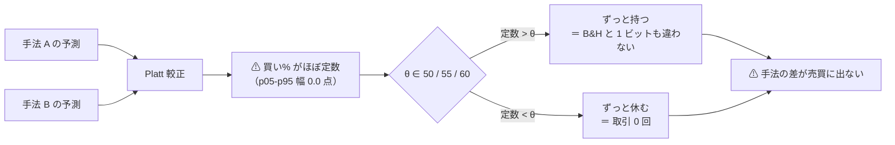
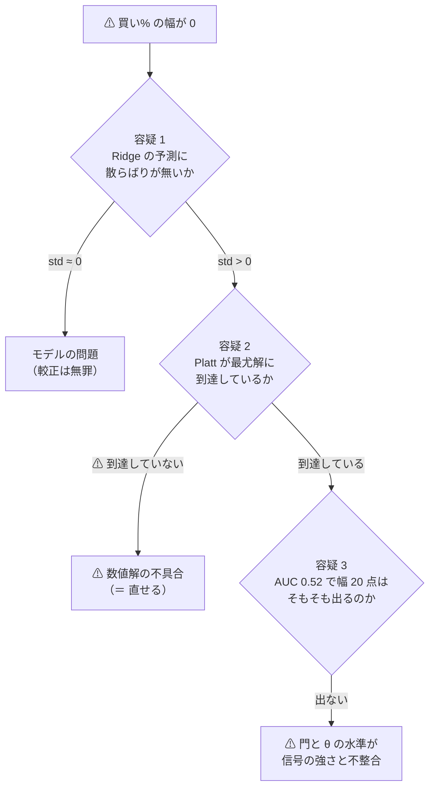
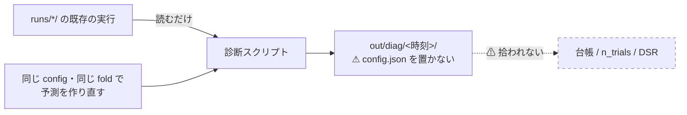

# 買い% の幅が潰れる原因を切り分ける

- 親タスク: `TODO.md`「買い% の幅が潰れる原因を切り分ける」（⚠ **利用者の指示 2026-09-12: この 1 番から着手する**）
- 派生元: [selectors-small-four.md](../../specs/experiments/selectors-small-four.md)（手法が違っても売買が 1 ビットも違わない）／ [entry-timing.md](../../specs/experiments/entry-timing.md)（D 系は保有日率 0.987〜0.998）
- 規約: [rules.md 13-2](../../specs/experiments/feature-discovery/rules.md)（Platt 較正）／ [13-3](../../specs/experiments/feature-discovery/rules.md)（θ ∈ {50,55,60}）／ [14-5](../../specs/experiments/feature-discovery/rules.md)（門）
- 記録（このプランの成果物）: `docs/specs/experiments/buy-pct-width-collapse.md`

## 0. 目的 — ⚠ **これは手法の検証ではない。物差しの故障を切り分ける作業である**

⚠ **直近 2 タスクが独立に同じ壁に当たった。** ⚠ **これを直さないまま他の手法を流すと、全部「乱択と一致」で戻ってくる**（そして `n_trials` だけ増える）。

> この図の主張: ⚠ **手法を替えても売買が変わらないのは、確率に幅が無いせいで θ の 3 水準が全部同じ側に落ちるから**である。

⚠ **成果物は「原因の特定」までとし、処置（コードの変更）は Phase 2 の裁定を待つ。**

## 1. 症状【実測 2026-09-12・本番 18 実行の門の記録を横断】

| 系統 | 測定 | 幅=0.0 点 | 幅≥20 点 | 幅の中央値 |
| --- | ---: | ---: | ---: | ---: |
| 選別 × モデル | 9 | **8** | 0 | **0.00** |
| D 学習ゲート | 18 | 5 | 0 | **4.94** |
| C 古典フィルタ | 15 | 0 | **15** | **100.00** |

- ⚠ **潰れているのは学習を通る経路だけ。** C 古典フィルタは同じシミュレータ・同じ閾値・同じ物差しで幅 100 点を出している
- ⚠ **ただし C は比較の相手として弱い**: `classic_filter` は買い% が **0 か 100 しか取らない規則**（`ail/detectors/scale.py`）なので、⚠ **予測力が無くても幅は必ず 100 点になる**。C が証明するのは「θ より下流（状態機械・コスト・物差し）は動く」ことだけで、⚠ **「較正が壊れている」ことの証拠にはならない**
- ⚠ **AUC は通っている**（0.519〜0.528。門の水準は AUC 0.52 かつ 幅 20 点）＝ ⚠ **順位はわずかに付くが確率に幅が出ない**

### 1-1. ⚠ **着手時に見つけた手がかり**（プランを書く前に読んだ記録から）

`runs/2026-09-12T19-53-59_sel_small4_1995/fitted/calibration_f*.json` の傾き `a`:

| fold | F2-2 RFE | F1-7 IC の安定性 | F1-4 分散しきい値 | 乱択（基準） |
| ---: | ---: | ---: | ---: | ---: |
| 1 | **74.23** | 0.00049 | **54.97** | 0.0000095 |
| 2 | 0.00036 | 0.00027 | 0.00031 | 0.000051 |
| 3 | 0.00044 | 0.00045 | 0.00042 | 0.000060 |

⚠ **`a` は「55〜74」か「0.0003 前後」の 2 つしか無く、中間が無い。** ⚠ **5 桁の断絶は、信号の強弱では説明しにくい**（信号が連続に弱くなるなら `a` も連続に小さくなるはず）。
⚠ **`a` ≈ 0.0003 は、最尤解ではなく「初期値 0 から動かなかった」ように見える。** ⚠ **これが本当なら、[threshold-trading.md §2](../../specs/experiments/threshold-trading.md) の「これは較正の不具合ではない」という 2026-09-10 の結論が誤っていることになる。**

## 2. 容疑者は 3 つ。⚠ **1 つずつ独立に切り分ける**

> この図の主張: ⚠ **「幅が出ない」には 3 つの別々の原因がありえて、処置も代償も全部違う。** ⚠ **まとめて 1 つの原因と呼んではいけない。**

| # | 容疑 | ⚠ 中身 | 切り分け方 | 処置の重さ |
| ---: | --- | --- | --- | --- |
| 1 | **Ridge の予測** | 予測値そのものが定数に近い（std ≈ 0）／ 順位が付かない | holdout 予測の `std`・分位点・IC・AUC を fold ごとに出す | モデルの軸＝ 別の試行 |
| 2 | **Platt の数値解** | ⚠ **`LogisticRegression(C=1e6, lbfgs)` は勾配の絶対値で停止する。** 予測値のスケールが小さいと、傾きが動く前に停止条件を満たす | ⚠ **対数尤度を直接比べる**（下） | ⚠ **不具合なら「定義の変更」ではない** |
| 3 | **水準の不整合** | 正しく較正しても、AUC 0.52 の信号は買い% を 50% 近傍にしか散らせない | AUC → 幅 の対応を実測で引く | ⚠ **規約（13-3・14-5）に触る** |

### 2-1. ⚠ **容疑 2 の決定的な検定 — 尤度を比べる**

⚠ **「予測に情報が無い」と「解けていない」は、`a` の値だけでは区別できない。** 区別できるのは尤度である。

1. 現行の `(a, b)` での対数尤度 `L0` を計算する
2. 同じ予測を **標準化してから** Platt を当て、元のスケールへ戻した `(a', b')` の対数尤度 `L1` を計算する
   （`a' = a_std / σ`・`b' = b_std − a_std·μ / σ`。⚠ **同じモデル・同じ標本・同じ目的関数で、変えたのは解き方だけ**）
3. ⚠ **`L1 > L0` なら、現行の解は最尤解ではない ＝ 「情報が無い」のではなく「解けていない」**

⚠ **leak 対照が跳ねることは容疑 2 の反証にならない。** leak では信号が強く、初期点での勾配が停止条件を大きく超えるので、⚠ **同じ不具合があっても leak だけは正しく解ける。** ⚠ **2026-09-10 の「較正の不具合ではない」はこの反証を根拠にしていた。**

### 2-2. ⚠ **容疑 3 は容疑 2 を直しても残る**

⚠ **AUC 0.52 の信号を正しく較正した結果の買い% は、原理的に 50% 近傍に集まる。** ⚠ **だから容疑 2 を直しても、幅が 20 点に届くとは限らない。**
Phase 1 では ⚠ **「直したときの幅」も測り、θ ∈ {50,55,60} を跨げるかどうかまで出す。** ⚠ **跨げないなら、律速は較正ではなく信号の強さであり、処置は 13-3 か 14-5 の側になる。**

## 3. Phase 0: ⚠ **先に決めること**（コードに手を入れる前に書く）

| # | 決めごと | 本プランでの答え |
| ---: | --- | --- |
| 1 | 診断は `n_trials` を増やすか | ⚠ **増やさない。** 診断の出力は `runs/` ではなく **`experiments/feature-discovery/out/diag/<時刻>/`** に書く。⚠ **`runs/` に `config.json` を持つディレクトリを作らない**ので、`catalog._read_run` が拾わない（[rules.md 10 章](../../specs/experiments/feature-discovery/rules.md)・[13-9](../../specs/experiments/feature-discovery/rules.md)） |
| 2 | 診断で `summary.csv` を作るか | ⚠ **作らない。** 台帳に行が立つのは検証を回したときだけ |
| 3 | 較正を直すのは「定義の変更」か | ⚠ **Phase 1 の結果で決まる。** 容疑 2（尤度が改善する）なら ⚠ **同じ定義の解き直し**であって 13-2 は開かない。容疑 3（水準の不整合）なら ⚠ **13-3 か 14-5 を開く**ことになる |
| 4 | 既存 265 試行をどうするか | ⚠ **Phase 2 で利用者に出す。** ⚠ **[edge-drift-bias](../../specs/experiments/edge-drift-bias.md) で 13-7 を変えなかったのと同じ判断が要る**（変えると全試行が別定義になる） |
| 5 | Claude が独断で決めないこと | ⚠ **規約の変更・θ の水準・門の水準。** ⚠ **結果を見てから水準を動かさない**（[13-3 規約 4](../../specs/experiments/feature-discovery/rules.md)） |

> この図の主張: ⚠ **診断は「読むだけ」の経路に閉じる。** 台帳にも DSR にも触れない。

## 4. Phase 1: 診断（✅ **2026-09-12 完了**。記録: [buy-pct-width-collapse.md](../../specs/experiments/buy-pct-width-collapse.md)）

⚠ **結果: 容疑は 3 つとも当たっていた**（容疑 1 だけ外れ）。

| 容疑 | 結果 |
| --- | --- |
| 1 予測に散らばりが無い | ⚠ **外れ。** `pred_std` は 0.0013〜0.0028 で 0 ではない |
| 2 Platt が最尤解に届いていない | ✅ **当たり。** ⚠ **1 反復で停止**（`tol=1e-4` が予測のスケールに依存）。25 行中 22 行で `dll > 0` |
| 3 直しても幅 20 点に届かない | ✅ **当たり。** 直した幅は中央値 4.43 点。⚠ **幅 20 点は AUC ≈ 0.57 の要求** |
| ＋ 追加で見つかった | ⚠ **D2 中期・D3 長期は正しく解けている。** 潰れているのは中心（買い% の中央値 58.5 / 68.4） |

⚠ **動かす軸はゼロ。** 既存の config・fold・種・特徴量をそのまま使い、⚠ **途中の量を書き出すだけ**にする。

| Step | 中身 | 出力 |
| --- | --- | --- |
| 1-1 | 診断スクリプト `cli/calibdiag.py` を書く。既存 config を読み、`evaluate_gate` と同じ fold・同じ tail holdout で予測を作る | `out/diag/<時刻>/folds.csv` |
| 1-2 | fold × 手法ごとに **予測の分布**（n・std・p05・p95・IC・AUC）を出す | 同上（容疑 1） |
| 1-3 | 現行 Platt の `(a,b)`・対数尤度 `L0`・幅、標準化解の `(a',b')`・`L1`・幅を並べる | 同上（容疑 2） |
| 1-4 | 標準化解での買い% が **θ ∈ {50,55,60} を跨ぐ日があるか**を数える | 同上（容疑 3） |
| 1-5 | AUC → 幅 の対応を実測で引き、⚠ **「幅 20 点に必要な AUC」**を出す | `out/diag/<時刻>/auc_width.csv` |
| 1-6 | ⚠ **C 系（`classic_filter`）を同じ表に並べる** — 学習しない規則の幅 100 点が何を意味しないかを数字で示す | 同上 |

⚠ **対象の実行**（既に本番で回っていて、症状が出ているもの）:

| 実行 | 系統 | ねらい |
| --- | --- | --- |
| `2026-09-12T19-53-59_sel_small4_1995` | 選別 × Ridge | 幅 0.0 の 4 手法。⚠ **fold 1 だけ `a` が正常**な対 |
| `2026-09-12T19-54-41_pca_1995` | 変換（PCA） | 変換を替えても同じか |
| `2026-09-12T15-15-12_trend_scales_1995` | 検知器 D / C | ⚠ **D と C を同じ表で比べられる唯一の実行** |
| `2026-09-12T19-53-09_sel_small4_1995_leak` | leak 対照 | ⚠ **容疑 2 の反証にならないことを数字で示す** |

⚠ **成功の基準は「良い数字が出ること」ではない。** ⚠ **3 つの容疑のどれが効いているかが、尤度と分布で言えるようになれば完了。**

## 5. Phase 2: 処置案と代償（⚠ **利用者の裁定を仰ぐところ**）

⚠ **Phase 1 の結果が出るまで案を書かない**（結果を見てから理由を決めない、の逆をやらないため）。出すのは次の形にする。

| 出すもの | 中身 |
| --- | --- |
| 原因 | 3 つの容疑のどれか（複数可）。⚠ **尤度と分布の数字で示す** |
| 処置の案 | 案ごとに「何を変えるか / 変えないか」 |
| 代償 | ⚠ **既存 265 試行がどうなるか**（別定義になる行の数・台帳の変わる行の数） |
| 規約 | 開く条項と、[rules.md 冒頭の変更規約](../../specs/experiments/feature-discovery/rules.md)（なぜ変えたか・変える前の結果をどう扱うか）の下書き |

## 6. Phase 3: 処置の実装と検算（⚠ **裁定が出てから**）

| # | やること |
| ---: | --- |
| 1 | 処置を実装する（範囲は裁定どおり。⚠ **勝手に広げない**） |
| 2 | ⚠ **回帰テスト**: 既存の実行が再現するか（`tests/` の 238 件 ＋ 新しい単体テスト） |
| 3 | ⚠ **単体テスト**: 予測のスケールを 1e0〜1e-6 まで振っても、較正の傾きが縮まないこと（⚠ **今回の不具合を将来に残さないための検査**） |
| 4 | ⚠ **台帳の検算**: 数字が変わった行・消えた行を数える（[universe-lowcorr-trade](../../specs/experiments/universe-lowcorr-trade.md) と同じ形） |
| 5 | ⚠ **`--leak` 対照を必ず通す** |

## 7. Phase 4: 記録

- `docs/specs/experiments/buy-pct-width-collapse.md` に診断・処置・検算を残す
- ⚠ **[threshold-trading.md §2](../../specs/experiments/threshold-trading.md) の「これは較正の不具合ではない」を訂正するかどうかを明記する**（誤りなら訂正、正しいなら根拠を足す）
- 規約を開いたなら [rules.md](../../specs/experiments/feature-discovery/rules.md) に変更規約の 2 問と一緒に追記する

## 8. 影響範囲

| 触るもの | Phase | ⚠ 注意 |
| --- | --- | --- |
| `cli/calibdiag.py`（新規） | 1 | ⚠ **読むだけ。`runs/` に書かない** |
| `ail/models/calibrate.py` | 3 | ⚠ **裁定が出てから。全試行の共通経路である** |
| `ail/validation/gate.py` | 3 | 水準を動かすなら（⚠ **14-5 に追記してから**） |
| `docs/specs/experiments/feature-discovery/rules.md` | 4 | ⚠ **正本。コードと食い違ったら本書を正とする** |
| ⚠ **触らないもの** | — | `ail/validation/simulate.py`（C 系で健全と確認済み）・`ail/detectors/scale.py` の C 系・台帳の既存行 |

## 9. テスト方針

| # | 検査 | 合格条件 |
| ---: | --- | --- |
| 1 | 既存テスト | `238 件 pass` を割らない |
| 2 | 診断が台帳に触れないこと | 診断の前後で `n_trials` と台帳の行数が変わらない |
| 3 | 尤度の比較 | ⚠ **`L1 ≥ L0` が数値誤差の範囲で成り立つ**（同じ目的関数なので、解き直しは尤度を下げない） |
| 4 | スケール不変性（Phase 3） | 予測を定数倍しても買い% が変わらない |
| 5 | leak 対照 | 跳ねる（上乗せが本番より 2 桁大きい） |

## 10. ⚠ 先に書く失敗モードと限界

| # | 失敗モード | ⚠ 起きたときの扱い |
| ---: | --- | --- |
| 1 | ⚠ **容疑 2 を直しても幅が 20 点に届かない** | ⚠ **想定内。** それは容疑 3 の確認であり、律速が信号の強さだと確定する（軸が 1 つ閉じる） |
| 2 | ⚠ **直したら成績が良くなる** | ⚠ **まず配線を疑う**（[11 章 規約 7](../../specs/experiments/feature-discovery/rules.md)）。leak との差が縮んでいないかを見る |
| 3 | ⚠ **既存の実行が再現しなくなる** | ⚠ **処置を撤回して裁定に戻す。** 再現性は成績より優先する（[rules.md 0 章](../../specs/experiments/feature-discovery/rules.md)） |
| 4 | 診断だけで原因が 1 つに絞れない | ⚠ **絞れないことを書く。** ⚠ **「たぶんこれ」で処置に進まない** |
| 5 | ⚠ **本タスクは収益を 1bp も増やさない** | ⚠ **それでよい。** 物差しが壊れたまま手法を足すと、全部「乱択と一致」で戻ってきて `n_trials` だけ増える |
