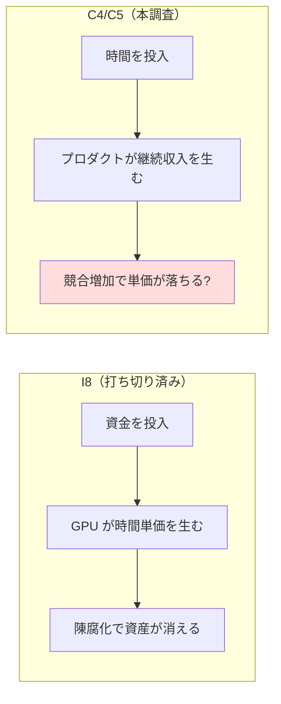
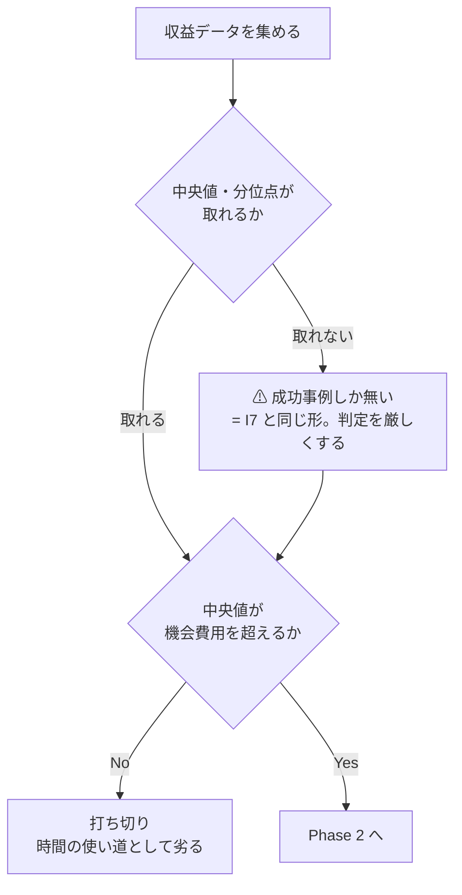
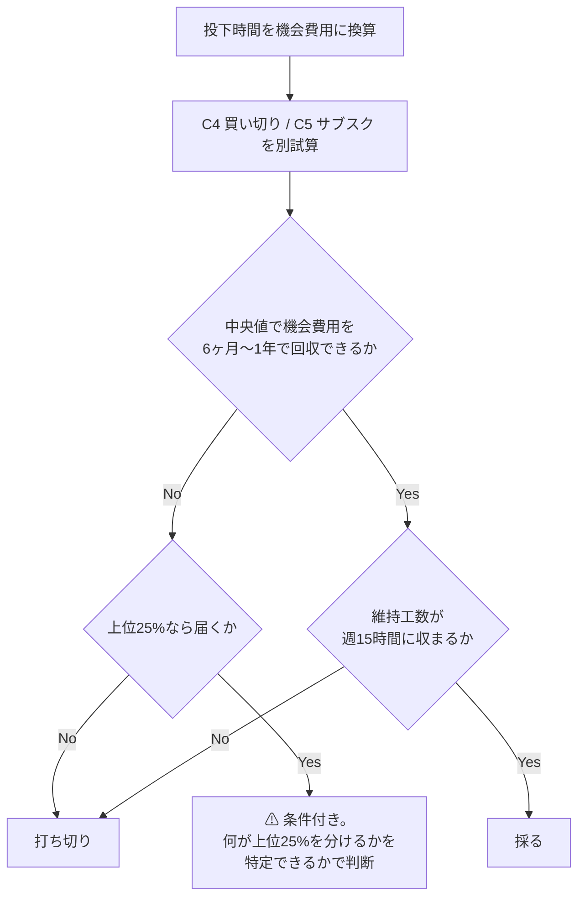

# C4/C5 買い切りアプリ・SaaS を分析する

調査プラン。**実行はしない**（開発・リリース・課金設定を行わず、一次情報と試算で採否を判定する）。

## 目的・背景

I8 の打ち切りにより、確定セグメント（資金 大 × 週 5〜15 時間 × 回収 6 ヶ月〜1 年）で
**時間を使う枠の先頭に繰り上がった**候補。カタログ上は「AI で個人が作れる規模が最も上がった層」。

ただし I8 と違い、この候補には**構造的なねじれ**が 2 つある。そこが調査の主題になる。

| # | ねじれ | なぜ問題か |
| --- | --- | --- |
| 1 | 必要資本が「ゼロ〜小」 | **資金 大という最大の持ち札が使えない**。制約は時間だけになり、セグメントの優位が消える |
| 2 | 参入障壁が下がった＝**競合も増えた** | 体系で C1（文章コンテンツ直販）を「消滅」と判定したのと同じ力学。作れる人が増えれば単価は落ちる |

投入する資源が I8（資金）と入れ替わる。**回収の分母が時間になる**ため、判定式も変える必要がある。

## 判定条件

I8 と同じく、試算の前に条件を固定する。1 つでも外れたら理由を残して打ち切る。

- **投下時間を機会費用として金額換算し**、それを 6 ヶ月〜1 年で回収できる
  - 週 5〜15 時間 × 6 ヶ月 = 130〜390 時間。ここに時間単価を掛けた額が「回収すべき初期投資」
  - 時間単価は B5（受託開発）・B14（RLHF 受託）の実勢を使う。**この 2 つは同じ時間を売る競合**なので、
    C4/C5 がそれを上回らなければ、そもそも時間の使い道として劣る
- 週 5〜15 時間の範囲で**リリース後の維持も収まる**（C5 は維持工数が高い。超えると L2 を維持できない）
- 収益分布の**中央値**で判断する（平均値と成功事例は使わない。生存者バイアスを排除する）
- 資金 大の優位が働く経路（広告費・既存プロダクトの買収）が**あるか無いかを明示する**

## Phase 1: 需要側（個人開発の収益実態）

⚠ この分野は成功事例の露出が極端に多く、**失敗が観測されない**。中央値と分布を取ることを最優先にする。

- [ ] アプリストア（App Store / Google Play）の**収益分布**を集める。平均でなく中央値・分位点
- [ ] 個人開発 SaaS の収益実態（Indie Hackers / MicroConf / Stripe の公開データ）から MRR の分布を取る
- [ ] SaaS の**解約率**ベンチマーク（ChartMogul / Baremetrics 等の公開値）を、価格帯別に集める
- [ ] 顧客獲得コスト（CAC）の相場と、個人が使える無料獲得経路の実効性を確認する
- [ ] ⚠ **競合の増加**を示すデータを探す（アプリ公開数・SaaS 新規登録数の推移）。増えていれば単価崩壊の傍証

## Phase 2: コスト側（作る時間と維持する時間）

- [ ] AI コーディングによる開発速度の変化を**実証データ**で確認する（体感・宣伝でなく測定されたもの）
  - ⚠ 速くなったという主張と、逆に遅くなったという測定の両方を探す。片方だけ採らない
- [ ] LLM API 利用料を、想定ユーザー数別に試算する（C5 は**利用量に比例して原価が乗る**。従来の SaaS と違う点）
- [ ] 維持工数の内訳（サポート・障害対応・OS/API のバージョン追従）を洗い、週何時間かを見積もる
- [ ] ⚠ 個人が課金を扱う際の制約（Stripe / App Store の手数料、インボイス、消費税の扱い）を確認する

## Phase 3: 試算と判定

- [ ] C4（買い切り）と C5（サブスク）を**別々に**試算する。回収の形が違う（一括 × 本数 / 単価 × 継続月数）
- [ ] 収益は中央値・上位 25% の 2 ケースで振り、機会費用を回収できるかを見る
- [ ] 判定条件 4 つに照らして採否を判定する
- [ ] 結果を [docs/specs/experiments/c4c5-app-saas.md](../../specs/experiments/c4c5-app-saas.md) に記録する

## 影響範囲

| 対象 | 変更内容 |
| --- | --- |
| `docs/specs/experiments/c4c5-app-saas.md` | 新規作成。調査結果・試算・判定を記録 |
| `docs/specs/income-taxonomy/catalog.md` | C4・C5 エントリへ調査結果を追記（出典・取得日つき） |
| `docs/specs/income-taxonomy/ai-delta.md` | C4/C5 の「強化」判定が調査と食い違った場合に修正。⚠ **C1 と同じ「消滅」側に動く可能性がある** |
| `docs/specs/income-taxonomy/shortlist.md` | 判定を反映 |
| `TODO.md` / `DONE.md` | 完了時に移動 |

## 検証方針

- 数値はすべて【公表値】（出典 URL + 取得日）か【推測】（計算式と前提）に区分する
- ⚠ **成功事例を数値の根拠に使わない**。個人開発は成功だけが可視化される分野で、平均値も上振れる。
  中央値・分位点が取れない指標は「分布不明」と明記し、試算では保守側に置く
- 開発速度など主張が割れる論点は、**両方の測定を併記**してから採否を決める
- Phase 1 で中央値が機会費用に届かなければ、Phase 2 に進まず打ち切る（I8 と同じ形）
