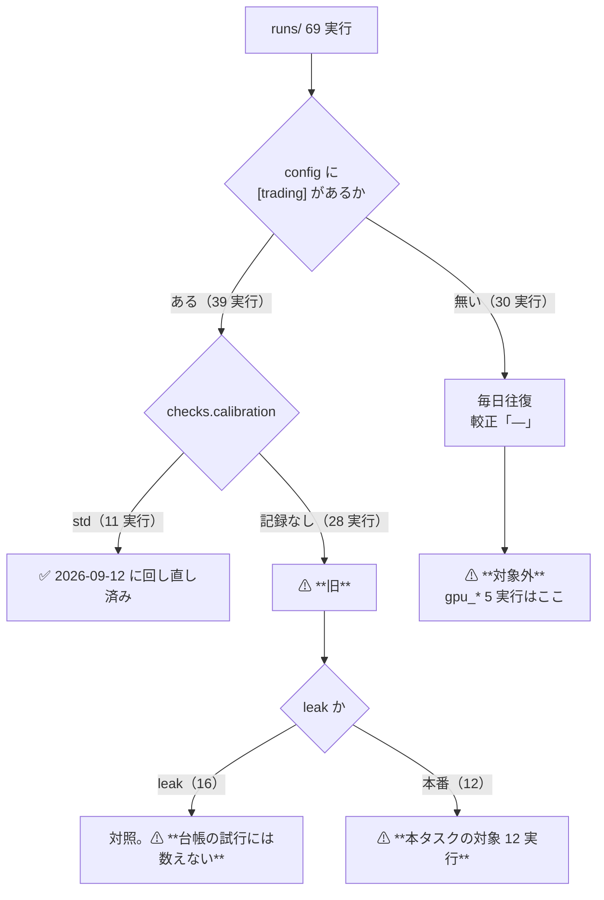

# 直した較正で残りの実行を回し直す

作成日: 2026-09-13 ／ 派生元: [TODO の同名タスク](../../../TODO.md)（派生元は「買い% の幅が潰れる原因を切り分ける」✅ 2026-09-12）。
正本: [rules.md 13-2 の 6](../../specs/experiments/feature-discovery/rules.md) ／ 診断の記録: [buy-pct-width-collapse.md](../../specs/experiments/buy-pct-width-collapse.md) §9 の残件 1。

> ⚠ **これは投資助言ではなく調査資料である。** ⚠ **資金は動かさない**（2026-08-27 の方針）。
> ⚠ **コードは 1 バイトも変えない。** ⚠ **変えるのは「どの実行を回すか」だけ**である。

## 0. 目的と背景

2026-09-12 に `ail/models/calibrate.py` の Platt の数値解が 1 反復で止まる不具合を直した（`VERSION = "std"`）。
⚠ **回し直したのは 1995 表の 5 実行だけ**で、⚠ **残りの閾値売買の実行は台帳に「旧」のまま残っている。**
本タスクはその残りを回し直し、⚠ **台帳の鍵「較正」の空白を埋める。**

| 問い | 答え |
| --- | --- |
| なぜ回すか | ⚠ **「旧」は不具合を踏んだ数字である。** ⚠ **消さないので台帳は嘘をつかないが、std の対がないと「直したら何が変わるか」が読めない** |
| 旧行はどうするか | ⚠ **残す。再計算しない・消さない。判定の列も変えない**（[rules.md 13-2](../../specs/experiments/feature-discovery/rules.md) の 6・2026-09-12 の利用者決定） |
| 良くなることを期待しているか | ⚠ **していない。** 1995 表では ⚠ **取引が 2 桁増えたが「採る」は 0 件のまま**だった（[buy-pct-width-collapse.md §8-2](../../specs/experiments/buy-pct-width-collapse.md)）。⚠ **本タスクも「散るようになる」までが期待値である** |
| 代償 | ⚠ **`n_trials` が 337 → 約 409 に増える**【推測】。⚠ **DSR は √ln N でしか悪化しない**（[rules.md 14-10](../../specs/experiments/feature-discovery/rules.md)）。⚠ **採否の判定式に DSR は入らない**ので、⚠ **試行を増やしても採りにくくならない** |

## 1. ⚠ 着手前に確定させた対象（調査済み・2026-09-13）

⚠ **TODO の「2018 表・LightGBM・GPU 系」は、実際の対象と 1 対 1 で対応していなかった。**
`runs/*/checks.json` の `calibration` と `config.json` の `[trading]` を全 69 実行で突き合わせた結果が下である【実測 2026-09-13】。

> この図の主張: ⚠ **較正を通るのは閾値売買の経路だけである。** ⚠ **毎日往復は `sign(pred)` で張るので、不具合を踏みようがない。**

### 1-1. ⚠ 回し直す 12 実行

| # | 実験 | 表（期間・銘柄） | モデル | 形式 | 手法 | 旧実行 | ⚠ θ 3 水準で増える試行 |
| ---: | --- | --- | --- | :-: | ---: | --- | ---: |
| 1 | `trade_own_ridge_a` | own_2018（2018・63） | Ridge | 共通 | 1 | `2026-09-10T20-04-53` | 3 |
| 2 | `trade_own_ridge_b` | 同上 | Ridge | 銘柄別 | 1 | `2026-09-10T20-05-08` | 3 |
| 3 | `trade_own_lgbm_a` | 同上 | **LightGBM** | 共通 | 1 | `2026-09-10T20-05-14` | 3 |
| 4 | `trade_own_lgbm_b` | 同上 | **LightGBM** | 銘柄別 | 1 | `2026-09-10T20-05-20` | 3 |
| 5 | `trade_ownex_ridge_a` | ownex（2018・48） | Ridge | 共通 | 1 | `2026-09-10T20-05-45` | 3 |
| 6 | `trade_ownex_ridge_b` | 同上 | Ridge | 銘柄別 | 1 | `2026-09-10T20-05-49` | 3 |
| 7 | `trade_ownex_lgbm_a` | 同上 | **LightGBM** | 共通 | 1 | `2026-09-10T20-05-56` | 3 |
| 8 | `trade_ownex_lgbm_b` | 同上 | **LightGBM** | 銘柄別 | 1 | `2026-09-10T20-06-03` | 3 |
| 9 | `trend_scales_1995_us74` | 1995・**74 本** | Ridge | 共通 | 7 | `2026-09-12T17-35-16` | 21 |
| 10 | `trend_scales_1995_us70` | 1995・**70 本** | Ridge | 共通 | 7 | `2026-09-12T17-55-31` | 21 |
| 11 | `midcap_own` | midcap48（2018・48） | Ridge | 共通 | 1 | `2026-09-12T18-15-02` | 3 |
| 12 | `midcap_cs` | 同上 | Ridge | 共通 | 1 | `2026-09-12T18-15-15` | 3 |
| | | | | | | **合計** | **＋72**【推測】 |

⚠ **「手法」は基準線を除いた数**（[`catalog.is_trial`](../../../experiments/feature-discovery/ail/catalog.py)。B&H・直前符号・乱択（基準）は数えない）。
⚠ **1995 表の 5 実行で ＋72 だったのと同じ規模**であり、TODO の「残り全部なら ＋200 前後」【推測】より小さい — ⚠ **その見積りは gpu_* を対象に含めていたためである。**

### 1-2. ⚠ **GPU 系は対象外である**（TODO の読みを 1 つ訂正する）

| 実行 | 検証方式 | ⚠ 較正 | 対象か |
| --- | --- | :-: | --- |
| `gpu_lgbm_2018` / `gpu_mlp_2018` / `gpu_lgbm_cs` | 毎日往復 | **—** | ⚠ **対象外** |
| `gpu_ridge_gan_2018` / `gpu_lgbm_gan_2018` | 毎日往復 | **—** | ⚠ **対象外** |

⚠ **根拠は配線である。** `cli/run.py` で `calibrate.fit` を呼ぶのは `evaluate_trading`（閾値売買）だけで、
⚠ **`evaluate`（毎日往復）は予測の符号でそのまま張る。** ⚠ **gpu_* の 5 実行はどれも `[trading]` を持たない**ので、
⚠ **Platt を 1 度も通っていない。** ⚠ **回し直しても 1 ビットも変わらない**（[buy-pct-width-collapse.md §5](../../specs/experiments/buy-pct-width-collapse.md) の「毎日往復 121 試行は無関係」と同じ事実）。

⚠ **TODO の「GPU 系」で実際に効くのは、GPU で回した LightGBM が閾値売買に入っている 4 本**（表の #3・#4・#7・#8）である。
⚠ **MLP は閾値売買で 1 度も回っていない**ので、こちらは「回し直し」ではなく「新規」になる — ⚠ **本タスクの範囲外**とし、§5 に残件として書く。

## 2. 方針 — ⚠ **動かす軸はゼロ**

⚠ **config・表・fold・種・θ・コスト・手法はすべて旧実行と同じものを使う。** ⚠ **違うのは `calibrate.VERSION` だけ**であり、
⚠ **それは既にコードに入っている**（2026-09-12 の処置）。⚠ **本タスクでコードを変更しない。**

| # | 規律 | ⚠ 理由 |
| ---: | --- | --- |
| 1 | ⚠ **回すと決めるのは結果を見る前。** 12 本を先に列挙した（§1-1）ので、⚠ **後から間引かない** | [rules.md 14-10](../../specs/experiments/feature-discovery/rules.md) 規約 3 |
| 2 | ⚠ **回したものは全部 `n_trials` に数える** | 同 規約 2。⚠ **門前の非計上は使わない** |
| 3 | ⚠ **`--leak` 対照を通す** | 同 規約 6 ／ [rules.md 13-10](../../specs/experiments/feature-discovery/rules.md)。⚠ **跳ねなければ配線が壊れている** |
| 4 | ⚠ **1 実行 1 ディレクトリ** | [rules.md 10 章](../../specs/experiments/feature-discovery/rules.md) |
| 5 | ⚠ **`--ignore-gate` で回す** | 門は 14-10 で診断に降格済み。⚠ **回すかどうかを門で決めない** |
| 6 | ⚠ **旧実行のディレクトリを消さない・上書きしない** | 13-2 の 6。⚠ **旧行が分母として残る** |

### 2-1. leak 対照の手当て

| 表 | leak 表 | 手当て |
| --- | --- | --- |
| `own_2018_leak` | ✅ ある | #1〜#4 の leak をそのまま回せる |
| `trend_scales_1995_us74_leak` / `_us70_leak` | ✅ ある | #9・#10 |
| `midcap_own_leak` / `midcap_cs_leak` | ✅ ある | #11・#12 |
| ⚠ **`trade_ownex_ridge_a_leak`** | ⚠ **無い** | ⚠ **`cli.build --leak` で作る**（外部系列は `data/raw/` にキャッシュ済みなので取得は要らない） |

⚠ **2026-09-10 は ownex の leak を 1 本も回していない**（[threshold-trading.md §5-1](../../specs/experiments/threshold-trading.md) は own × LightGBM の 2 本だけ）。
⚠ **本タスクでは 12 本すべてに leak を付ける** — 14-10 規約 6 の「緩めない」に寄せる。⚠ **leak は台帳の試行には数えない。**

## 3. Phase / Step

> この図の主張: ⚠ **測ってから回す。** ⚠ **診断は `runs/` に書かないので、`n_trials` は Phase 1 まで動かない。**

### Phase 0: ⚠ 回す前に予測のスケールを測る

⚠ **TODO の指示**: 「LightGBM・MLP・GPU 系は予測のスケールを測っていない。回す前に `cli/calibdiag.py` で 1 本測ると、動くかどうかが先に分かる」。

- `python3 -m cli.calibdiag --experiment trade_own_lgbm_a` — ⚠ **LightGBM の `pred_std` と `dll`**
- `python3 -m cli.calibdiag --experiment trade_own_ridge_a` — 2018 表の Ridge（1995 表との対照）
- 読み方: ⚠ **`dll > 0` なら旧の解が最尤でない ＝ 回し直すと動く。** `pred_std` が 1 日リターンの尺度（σ ≈ 0.0017）なら不具合を踏む
- ⚠ **`out/diag/` にしか書かないので `n_trials` は動かない**（337 のまま）
- ⚠ **形式 (B) 銘柄別は診断がプール形式でなぞる**ので、#2・#4・#6・#8 の診断は近似である。⚠ **限界として記録する**

### Phase 1: 2018 表の橋渡し 8 本（＋ leak）

1. `cli.build --experiment trade_ownex_ridge_a --leak` で欠けている leak 表を作る
2. 8 本を `--ignore-gate` で回す（#1〜#8）
3. leak 8 本を回す

### Phase 2: 銘柄集合の変種 4 本（＋ leak）

`trend_scales_1995_us74` / `trend_scales_1995_us70` / `midcap_own` / `midcap_cs` と、その leak 4 本。

### Phase 3: 台帳の再生成と検算

| # | 検査 | 通過条件 |
| ---: | --- | --- |
| 1 | テスト | `pytest -q tests` が全部 pass（⚠ **件数が 276 から減らないこと**） |
| 2 | ⚠ **既存の台帳が変わっていないこと** | ⚠ **回し直す前の行が 1 行も消えず、内容も変わらない**（足されるだけ） |
| 3 | `n_trials` | 337 → ＋72 前後。⚠ **数え落とさない側** |
| 4 | ⚠ **leak 対照** | ⚠ **12 対とも上乗せが跳ねる**（跳ねなければ配線が壊れている） |
| 5 | 較正の列 | ⚠ **12 実行すべてが「std」で台帳に載る**（`checks.calibration`） |

### Phase 4: 記録

- `docs/specs/experiments/calibration-rerun.md` に前後の対比表（旧 vs std の上乗せ・取引回数）と ⚠ **限界**を書く
- `docs/specs/experiments/buy-pct-width-collapse.md` §9 の残件 1 を消し込む
- `TODO.md` → `DONE.md`、プランは `docs/plans/archive/` へ

## 4. 影響範囲

| 触るもの | 中身 |
| --- | --- |
| `experiments/feature-discovery/runs/` | ⚠ **新規ディレクトリ 24 本**（本番 12 ＋ leak 12）。⚠ **既存は消さない** |
| `experiments/feature-discovery/data/features/trade_ownex_ridge_a_leak/` | ⚠ **新規に作る leak 表 1 つ**（約 61MB。git 管理外） |
| `docs/specs/experiments/feature-discovery/ledger.md` | ⚠ **生成物。** 行が増える（手で書かない） |
| `docs/specs/experiments/calibration-rerun.md` | ⚠ **新規**（本タスクの記録） |
| `docs/specs/experiments/buy-pct-width-collapse.md` | §9 の残件 1 の消し込み |
| ⚠ **コード** | ⚠ **変更しない。** 変更が要ると分かったら、そこで手を止めて理由を書く |

## 5. ⚠ 先に書く限界と残件

## 6. ⚠ 実施後の追記（2026-09-13）— プランからずれた 2 点

⚠ **完了。記録は [calibration-rerun.md](../../specs/experiments/calibration-rerun.md)。** ⚠ **プランと違ったところを 2 つ残す。**

| # | ずれ | ⚠ 何をしたか |
| ---: | --- | --- |
| 1 | ⚠ **§4 の「コードは変更しない」を守れなかった** | ⚠ **2 か所だけ変えた。** (a) `cli/calibdiag.py` — ⚠ **処置の後は「直した解 vs 直した解」を比べており、`dll` が 0 に潰れて「元から解けていた」と読めた**ので、旧の解き方を `_platt_legacy` で再現して比較の相手を戻した（記録 §2-1）。(b) `ail/catalog.py` の `_CLOSED_FIELDS` に `calibration` を足した — ⚠ **鍵が 旧 / std に割れて `[[closed]]` の注記が 2 行に当たり、テストが落ちたため**（記録 §4）。⚠ **本番の較正（`ail/models/calibrate.py`）と検証の経路は 1 バイトも変えていない** |
| 2 | Phase 0 の読みが 1 回間違った | ⚠ **診断をそのまま信じると「LightGBM は元から解けていた」になる。** ⚠ **道具を直してから測り直したら 10 / 10 で止まっていた**（記録 §2-2）。⚠ **診断の出力は、その道具がいつ書かれたかとセットで読む** |

## 7. ⚠ 先に書いた限界と残件（実施前に書いたもの）

| # | 限界 |
| ---: | --- |
| 1 | ⚠ **「良くなる」ことを測るタスクではない。** ⚠ **1995 表では取引が 2 桁増えても「採る」は 0 件だった**。同じ結果になる公算が大きい【推測】 |
| 2 | ⚠ **原因 B（門の 2 条件が不整合）と原因 C（θ の置き方）には触らない。** ⚠ **C は 2026-09-13 に 3 案とも落としてある**（[theta-placement.md](../../specs/experiments/theta-placement.md)） |
| 3 | ⚠ **MLP × 閾値売買は 1 度も回っていない。** ⚠ **「回し直し」ではなく新規の試行**なので本タスクの範囲外。残件として TODO に残す |
| 4 | ⚠ **gpu_* の 5 実行（毎日往復）は回し直しても 1 ビットも変わらない**（§1-2）。⚠ **回さないのは「可能性が低いから」ではなく「較正を通らないから」である** — 14-10 規約 1 の例外にあたらない |
| 5 | ⚠ **`trade_ownex_*` の leak 表は今回はじめて作る。** ⚠ **旧実行には leak 対照が無い**ので、⚠ **新旧の leak を比べることはできない**（std 側の配線が健全であることしか言えない） |
