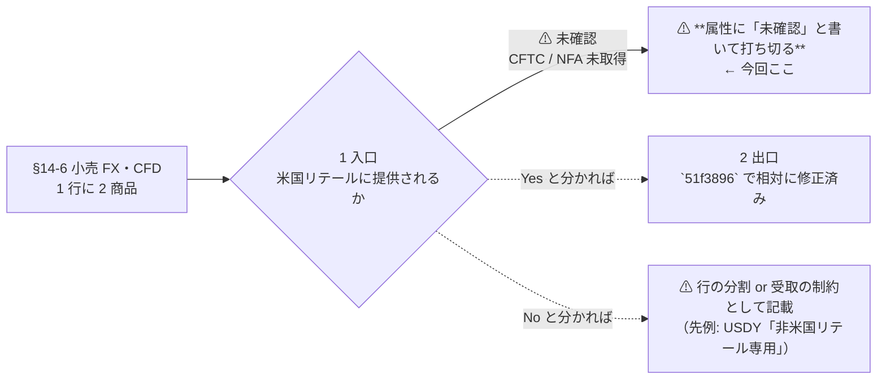

# 小売 CFD の米国リテール向け提供可否を「未確認」として §14-6 に記載し、TODO を打ち切る

作成日: 2026-09-01。対象: [docs/specs/online-tradable-assets.md](../../specs/online-tradable-assets.md) §14-6 の `小売 FX・CFD` 1 行と、[スライド](../../specs/online-tradable-assets-slides.html)の同じ行。

## 1. 目的と背景

`51f3896`（小売 FX・CFD の出口表記を「板」から相対に直す）で、⚠ **この 1 行が「小売 FX」と「CFD」を 1 件にまとめている**ことを積み残した。
米国居住者から見た**入口**（買う場所）の可否が両者で違いうるが、CFTC / NFA の一次情報を当てていない。

⚠ **一次情報の調査は行わない。**「未確認である」と本文に書いて打ち切る。理由は次の 2 つ。

| 理由 | 根拠 |
| --- | --- |
| **結論に効かない** | この行は §15 の最終結論（① 維持型 6 件）に入っておらず、§14-14 では ⚠ **「枠組みが違う」33 件**に分類済みで型判定の対象外。§1 のゲート 3（維持）では ⚠ **`FX・CFD` が落選例として名指し**されている（`online-tradable-assets.md:73`） |
| **打ち切りの先例がある** | `3396bc1`「探した範囲では見つからず」の 7 件を未確認のまま打ち切り（L5 14 → 7 件・未確認 3 → 10 件、合計 96 は不変）。§14 には `⚠ 未取得` のセルが既に複数ある（変額年金の利回り・特許・時計の板の厚み） |

> この図の主張: 4 ゲートは入口 → 出口の順に効くので、入口が未確認なら出口の表記を詰めても先に進まない。今回はゲートを進めず、未確認であることを属性に書いて止める。

## 2. 対応方針

⚠ **行は分割しない。**分割を正当化する根拠（＝提供されないという一次情報）が無い。分割すると 96 → 97 で件数が 5 箇所以上動く。
属性セルに 1 文を足すだけにする。

| ファイル | 行 | 変更 |
| --- | --- | --- |
| `docs/specs/online-tradable-assets.md` | 1439 | 属性 `⚠ 継続的な判断が要る` に 1 文追記 |
| `docs/specs/online-tradable-assets-slides.html` | 611 | 同じ行の属性セルに同じ 1 文を追記 |

文言（両ファイル同一）:

> ⚠ 継続的な判断が要る。⚠ **CFD の米国リテール向け提供可否は未確認**（CFTC / NFA の一次情報を当てていない）

⚠ **`板` という語も出口列も触らない。**`51f3896` で確定した数え方（除外リスト `板が無い` / `板ではない` / `板の厚みは未取得` / `掲示板方式`）に影響させない。

## 3. 影響範囲

⚠ **件数はどれも動かない。**変更するのは属性列だけで、件数を数えているのは行数と出口列だから。

| 数えているもの | 現在値 | 変更後 |
| --- | ---: | ---: |
| 一覧の行数 | 96 | 96 |
| 分類別（18/10/17/4/8/7/4/6/5/7/10） | — | 不変 |
| 出口 = 板 | 55（帯 A 54 / 帯 B 1） | 不変 |
| 板の無いもの | 14 | 不変 |
| `market-data-availability.md` の 板ありとした件数 | 55 | 不変 |

⚠ **`market-data-availability.md:279` は触らない。**あちらは市場データの粒度（L0・D42 Dukascopy）の話で、入口の可否とは別軸。

## 4. テスト方針

| # | 確認 | 期待 |
| --- | --- | --- |
| 1 | `CATS` から機械抽出した出口列の集計 | 17/10/12/0/7/6/2/0/0/0/1 = **55**、帯 A 54 / 帯 B 1（変更前と同じ） |
| 2 | 行数・分類別 | 96 / 18-10-17-4-8-7-4-6-5-7-10（不変） |
| 3 | 元文書とスライドの §14-6 の商品名 | 7/7 一致 |
| 4 | Playwright で `window.__deckCheck` | `{rows:96, domRows:96, descs:96, slides:36, errors:[], ok:true}` |
| 5 | ⚠ **36 枚のはみ出し** | **0 枚**（属性セルが伸びるので要確認。溢れるなら文言を詰める） |
| 6 | `git diff --stat` | `docs/specs` の変更が **2 行**のみ |

⚠ 検証スクリプトは使い捨てとし、リポジトリに残さない（`experiments/` は 2026-08-27 の方針変更以降、新規追加しない）。

## 5. 完了時

- `TODO.md` の該当項目を削除し、`DONE.md` に「⚠ 打ち切り」として記録する（再開条件も書く）
- このプランを `docs/plans/archive/` に移す
