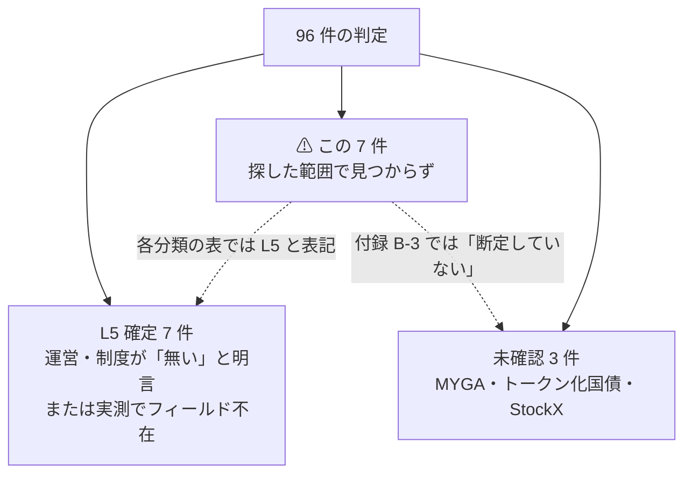
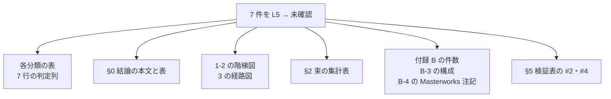

# 「探した範囲では見つからず」の 7 件を未確認のまま打ち切る

> 2026-09-01 完了。7 件すべてを未確認のまま打ち切り、**L5 を 14 → 7 件・未確認を 3 → 10 件**に組み替えた。結果: [docs/specs/market-data-availability.md](../../specs/market-data-availability.md)（付録 B-3）

作成日: 2026-09-01。対象文書: [docs/specs/market-data-availability.md](../../specs/market-data-availability.md)

## 1. 目的・背景

§14 の 96 件について過去データの粒度を判定した調査（2026-09-01 完了）で、**7 件が「探した範囲では公開の時系列が見つからなかった」まま止まっていた。**

その 7 件は各分類の表では **L5（データなし）** と書かれ §0 の「L5 = 14 件」に数え込まれている一方、付録 B-3 では **「⚠ L5 と断定していない」** と書かれている。**表と付録が食い違ったままである。**

> この図の主張: 7 件は「L5 確定」と「未確認」のどちらにも寄せられておらず、集計だけが L5 側に倒れている。

**2026-09-01 に「7 件すべてを追加調査せず、未確認のまま打ち切る」と決めた。**本タスクはその決定を文書に反映し、件数を組み替える。

### 打ち切る理由

| # | 理由 |
| --- | --- |
| 1 | ⚠ **残っている当たり先が方針の外にある。**値段はブローカー・運営のログイン画面か有償データベンダーの向こうにあり、**2026-08-27 の方針変更で登録・契約・課金は行わない**と決めている。追加で当たっても到達できない |
| 2 | **7 件は §14 で既に落選しているか、後続タスク（API 売買・自動売買）の対象にならない。**判定を精緻化しても前提が変わらない |
| 3 | ⚠ **「無い」と断定はできない。**だから L5 確定には倒さず、**理由を残して未確認で打ち切る** |

## 2. 対応方針

⚠ **L5 確定にはしない。**「未確認・調査打ち切り（理由: 方針上到達不能）」という扱いにし、L5（データなし）から外す。

### 対象の 7 件

| # | 対象 | 分類 | 束 | 現状 | 変更後 |
| --- | --- | --- | --- | --- | --- |
| 1 | ブローカード CD | 14-3-15 | S3 | L5 | **未確認（打ち切り）** |
| 2 | 変額・インデックス年金 | 14-4-2 | S4 | L5 | 同上 |
| 3 | 住宅ローン債権 | 14-10-3 | S7 | L5 | 同上 |
| 4 | オルタナ総合（YieldStreet） | 14-10-6 | S7 | L5 | 同上 |
| 5 | 返品在庫のロット・倉庫競売 | 14-11-3 | S6 | L5 | 同上 |
| 6 | 貸株（FPSL） | 14-11-8 | S7 | L5 | 同上 |
| 7 | 貸付・ソーシャルレンディング | 14-11-9 | S7 | L5 | 同上 |

### 件数の組み替え

**L5 は 14 → 7 件、未確認は 3 → 10 件。**合計 96 は変わらない。

| 束 | 件数 | L5（前 → 後） | 未確認（前 → 後） |
| --- | ---: | --- | --- |
| S1 | 45 | 2 → 2 | — |
| S2 | 4 | — | — |
| S3 | 7 | 1 → **0** | 0 → **1** |
| S4 | 6 | 1 → **0** | 1 → **2** |
| S5 | 5 | — | 1 → 1 |
| S6 | 11 | 3 → **2** | 1 → **2** |
| S7 | 18 | 7 → **3** | 0 → **4** |
| **合計** | **96** | **14 → 7** | **3 → 10** |

打ち切り後に L5 に残る 7 件は、**括り 3 行**（BDC 平均・CEF・地方債 CEF）と、**成約が記録・公開されないと確認できた 4 件**（特許・時計・官公庁の払い下げ・協同組合の持分）。

## 3. 影響範囲

⚠ **編集するのは `docs/specs/market-data-availability.md` の 1 ファイルだけ。**§14 の元文書・スライドは判定を持たないので触らない。

> この図の主張: 件数は §0 に集約されているが、同じ数が 5 箇所に散っているので全部直す。

| 箇所 | 行 | 直す内容 |
| --- | --- | --- |
| §0 冒頭 | 10 | 「14 件は時系列にならない」→ L5 7 件・打ち切り 10 件の書き分け |
| §0 粒度表 | 19-20 | L5 14 → 7、未確認 3 → 10。中身の説明も差し替え |
| 1-2 階梯図 | 55 | `L5 データなし 14 件` → 7 件 |
| §2 束の集計表 | 87-95 | S3・S4・S6・S7 の L5 / 未確認を組み替え |
| §3 経路図 | 118 | `そもそもデータ源が無い 14 件` → 7 件 |
| 各分類の表 | 214・223・288・291・300・305・306 | 判定を **L5** → **未確認（打ち切り）** に変更し、備考に理由を追記 |
| 付録 B 冒頭 | 385 | 「L4・L5 に落ちた 22 件と未確認の 3 件」→ 15 件と 10 件 |
| 付録 B-3 | 422-436 | 見出しと構成を「L5 確定」「打ち切り」の 2 段に分ける。打ち切りの理由を明記 |
| 付録 B-4 | 458 | Masterworks の注記「L5 が 14 → 15 件」→「7 → 8 件」 |
| §5 検証表 | 467・469 | 「根拠が無い 3 行」→ 10 行、「確定 7 種・未確認 6 件」→ 確定 7 件・打ち切り 7 件・未確認 3 件 |

## 4. Phase

| Phase | 内容 |
| --- | --- |
| **Phase 1** | 各分類の表 7 行の判定と備考を書き換える |
| **Phase 2** | §0・1-2・§2・§3 の件数と図を組み替える |
| **Phase 3** | 付録 B-3 を「確定」「打ち切り」に再構成し、B・B-4・§5 の件数を直す |
| **Phase 4** | 件数の突き合わせ（下記）と TODO / DONE の更新 |

## 5. テスト方針

⚠ この文書はコードを持たないので、**件数の突き合わせを検証とする。**

| # | 検証 | 方法 |
| --- | --- | --- |
| 1 | 判定の総数が 96 | 各分類の表の判定列を機械的に数え、L0〜L5 ＋ 未確認の合計が 96 になること |
| 2 | 束の集計表と実データが一致 | 束ごとの L5 / 未確認の件数が表の記載と一致すること |
| 3 | **L5 と書かれた行が 7 行だけ** | `grep` で `**L5**` を数え、括り 3 ＋ 確定 4 の 7 行に一致すること |
| 4 | 件数の記述が全箇所で揃う | §0・図・束の表・付録 B・§5 に「14」が残っていないこと |
| 5 | ⚠ **確定と打ち切りが混ざっていない** | 付録 B-3 で、7 件が「L5 確定」の側に入っていないこと |
