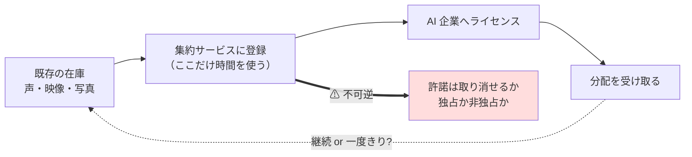
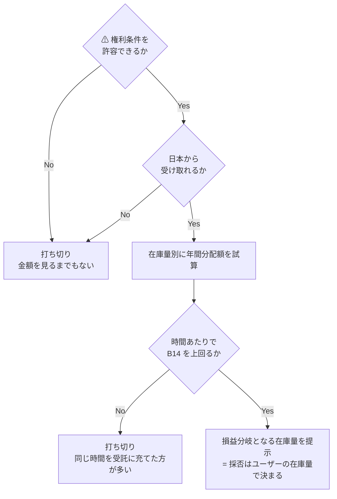

# D7 既存コンテンツの AI 学習許諾 を分析する

調査プラン。**実行はしない**（登録・アップロード・許諾は行わず、一次情報と試算で採否を判定する）。

## 目的・背景

[i7-dataset.md](../../specs/experiments/i7-dataset.md) の調査から 2026-08-27 に新設した手法。
I7（データセットを作って売る）が実例ゼロで打ち切られた際、**個人に実際に金が届いている経路**として分離したもの。

打ち切った I7・I8・C4/C5 の 3 件と違い、**D7 は新しく作らない**。既に持っているものを許諾するだけ。
そのため判定式が根本的に変わる。

| | I8 | C4/C5 | **D7** |
| --- | --- | --- | --- |
| 投入するもの | 資金 | 時間 | **既存の在庫（追加投入なし）** |
| 判定式 | 初期投資の回収期間 | 機会費用の回収期間 | **回収ではなく利回り**（E1 と同型） |
| 失敗の形 | 回収前に陳腐化 | 中央値が届かない | **額が小さすぎて意味がない**／⚠ 権利を失う |

## ⚠ 先に指摘すべきこと（金額以前の論点）

CLAUDE.md の方針に従い、権利・規約の問題を先に置く。**この論点が通らなければ金額を見る意味がない。**

- **学習は取り消せない**。データを引き上げても、既に学習されたモデルからは除去されない
- 声の場合、**自分の声のクローンが第三者に永続的に使われる**。用途の制限が契約で担保されるか
- 独占許諾なら、以後その素材を他所で使えなくなる可能性
- 他人が写り込んだ写真・映像は、**自分だけの権利では許諾できない**（肖像権）

## 判定条件

1. **在庫量あたりの年間分配額**が、登録作業の時間あたりで見て B14（AI 開発者向け受託 $31〜65/時）を上回るか
   - 上回らなければ、同じ時間を受託に充てた方が確実に多い
2. 日本から実際に受け取れるか（i7 調査で Troveo / Wirestock / ElevenLabs は「明記なし・未確認」のまま）
3. ⚠ 許諾の不可逆性・独占性が許容できる条件か
4. 継続収入か一度きりか（一度きりなら L2 ではなく単発の売却に近い）

## Phase 1: 単価と分配の実態

⚠ i7 調査で拾った単価は**累計額と成功例に偏っている**。中央値・分布を優先する。

- [ ] ElevenLabs Voice Library の分配実態を確認する（累計 $22M / 10,400 人超 は【公表値】だが**分布不明**）
- [ ] Troveo の動画単価（第三者情報で $1〜4/分、個人例 1,400 時間で $33,000/年）の**一次情報**を当たる
- [ ] Wirestock / Shutterstock / Adobe の画像分配（中央値 $0.0069/枚、報告例 $4.88）を再確認する
- [ ] 一度きりの買取か、使われるたびの継続分配かを**サービスごとに**判別する
- [ ] ⚠ **一般人が持つ在庫量**でいくらになるかを見る。成功例（1,400 時間の動画）は一般人の在庫ではない

## Phase 2: 権利条件と受取可否

- [ ] 各サービスの利用規約から、**許諾の取り消し可否・独占/非独占・用途制限**を確認する
- [ ] 日本からの支払い受取可否（対応国、支払い方法、税務書類）を確認する
- [ ] ⚠ 声の場合の悪用防止（なりすまし・不適切用途）の契約上の担保を確認する
- [ ] AILAS（日本音声 AI 学習データ認証サービス機構）が国内の窓口として機能しているか確認する

## Phase 3: 試算と判定

- [ ] 在庫量を**変数**として、種類別（声・動画・写真）に年間分配額を試算する
- [ ] 登録作業の所要時間を見積もり、**時間あたり収入**を出して B14 と比較する
- [ ] 「在庫が何時間・何枚を超えれば採れるか」の**損益分岐点**を出す
- [ ] 結果を [docs/specs/experiments/d7-content-licensing.md](../../specs/experiments/d7-content-licensing.md) に記録する

## 影響範囲

| 対象 | 変更内容 |
| --- | --- |
| `docs/specs/experiments/d7-content-licensing.md` | 新規作成 |
| `docs/specs/income-taxonomy/catalog.md` | D7 エントリへ調査結果を追記 |
| `docs/specs/income-taxonomy/shortlist.md` | 判定を反映 |
| `TODO.md` / `DONE.md` | 完了時に移動 |

## 検証方針

- ⚠ **累計額を 1 人あたりに割った値を「期待値」として使わない**。分配は上位に極端に偏る前提で、中央値が取れなければ「分布不明」と明記する
- 在庫量はユーザーに確認せず**変数のまま**扱い、損益分岐点の形で提示する（在庫を数えるのは判定後でよい）
- Phase 2 の権利条件が通らなければ、Phase 3 に進まず打ち切る
