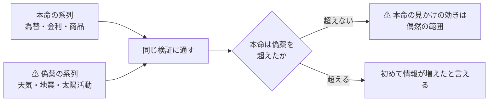
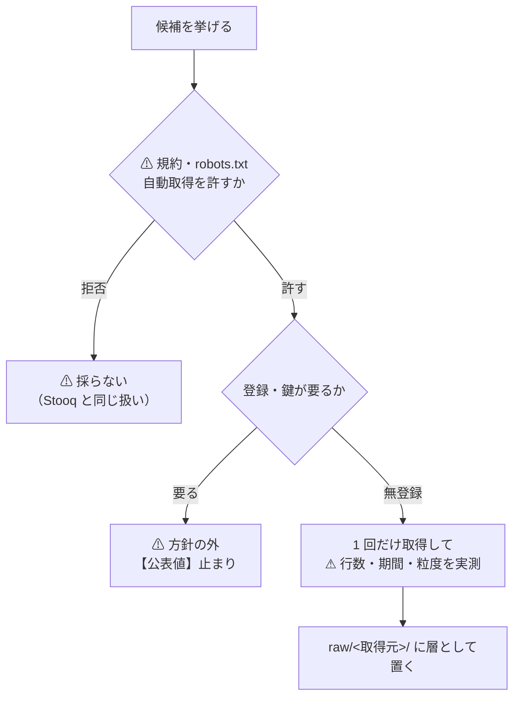

# 日次データの取得元を広げる（為替 ＋ 無関係に見えるものも含めて）

作成: 2026-09-08 ／ 対象: `experiments/feature-discovery/`（データ層）
関連: [market-data-availability.md](../../specs/market-data-availability.md) ／ [feature-discovery.md §9](../../specs/experiments/feature-discovery.md) ／ [rules.md](../../specs/experiments/feature-discovery/rules.md)

## 1. 目的と背景

利用者の指示（2026-09-08）: **データを増やす。為替のデータを入れる。それ以外で日ごとのデータで入れられるものを調査する。天気予報など全く関連がなさそうなものでもいい。**

⚠ **前のタスクの結論がそのまま入口になる。** [§9-2](../../specs/experiments/feature-discovery.md) は
**「次に変えるなら推定器ではなく入力」**で閉じた。⚠ **価格だけからは方向が出なかった**ためである。

### 1-1. ⚠ 「無関係に見えるもの」を入れる意味を先に決める

⚠ **無関係な系列をたくさん足すのは、そのままだと多重検定の温床**である（[rules.md 11 章](../../specs/experiments/feature-discovery/rules.md) 規約 4）。
⚠ **系列を 50 本足せば、どれかは必ず「効いて見える」。**

⚠ **だから「偽薬（プラセボ）」として明示的に使う。** これは足を引っ張るのではなく、**検証を強くする**。

> この図の主張: ⚠ **無関係な系列は「捨てる候補」ではなく「物差し」である。** 本命がそれを超えられないなら、本命も偶然である。

| # | 決めごと | ⚠ 理由 |
| ---: | --- | --- |
| 1 | ⚠ **偽薬の系列は「落とす対象」ではなく「基準線」として残す** | ⚠ **選別手法が偽薬を選んだ回数そのものが、偽発見率の実測になる** |
| 2 | ⚠ **足した系列の数を `n_trials` に必ず数える** | ⚠ **数え落とすと必ず甘くなる**（規約 4） |
| 3 | ⚠ **「無関係」を後から決めない。** 取得の時点で本命 / 偽薬を宣言する | ⚠ **結果を見てから分類すると、ただの後付けになる** |

## 2. 対応方針

### 2-1. 調べる順番

> この図の主張: ⚠ **「取れるか」より先に「取ってよいか」で落ちる。** 順番を逆にすると無駄になる。

### 2-2. 候補の枠（本命 / 偽薬）

⚠ **取得の時点で宣言する**（§1-1 の決めごと 3）。

| 枠 | 何を | 例 |
| --- | --- | --- |
| **為替**（利用者の指名） | 主要通貨ペアの日次 | USD/JPY・EUR/USD・USD/CNY ほか |
| 本命 | 市場の外だが値動きと因果が想定できるもの | 金利・商品・ボラティリティ指数・暗号資産 |
| 本命（弱） | 経済活動の代理変数 | 電力・貨物・ニュースの量 |
| ⚠ **偽薬** | ⚠ **値動きと因果が想定できないもの** | ⚠ **天気・地震・太陽活動・月齢** |

### 2-3. 置き場

⚠ **[rules.md 1 章](../../specs/experiments/feature-discovery/rules.md) の層をそのまま使う。** 新しい取得元も例外にしない。

- `data/raw/<取得元>/d/<系列>.csv` — 取ってきたまま。⚠ **書き換えない**
- 取得のたびに不変条件を検査して manifest を書く（5 章）
- ⚠ **銘柄の足とは時刻の合わせ方が違う**（休日・時差・発表の遅れ）。⚠ **前方埋めをすると未来が入る**ので、`ll_` と同じく**必ず 1 日以上ずらして**使う

### 2-4. ⚠ 発表の遅れ（この層で一番危ないところ）

⚠ **「その日のデータ」が「その日に手に入る」とは限らない。**

| 例 | 実際に手に入る時刻 | ⚠ 誤ると |
| --- | --- | --- |
| FRED の為替（`DEXJPUS`） | ⚠ **翌営業日以降に確定値が載る** | 当日の足に当てると先読み |
| 気温の観測値 | 当日中〜翌日 | 同上 |
| 改定される系列（GDP 等） | ⚠ **後から値が書き換わる** | ⚠ **過去の検証が「その時は知り得なかった値」で回る** |

⚠ **既定は「1 日ずらす」。** ⚠ **ずらさない系列は、その理由を manifest に書く。**

## 3. 影響範囲

| ファイル | 変更 |
| --- | --- |
| `docs/specs/experiments/daily-data-sources.md` | **新規**。⚠ **調査の成果物**（経路・規約・実測の行数と期間・本命 / 偽薬の別） |
| `ail/data/sources/fred.py` ほか | **新規**。取得元ごとに 1 ファイル（`@register("source", ...)`） |
| `ail/bootstrap.py` | 取得元を足したら 1 行 |
| `config/dataset/*.toml` | 日次の外部系列をまとめた dataset |
| `ail/features/exog.py` | **新規**。⚠ **外部系列の層（`ex_`）**。⚠ **必ず 1 日以上ずらす** |
| `tests/` | 規約の記録・ずらしの検査・偽薬が基準線として残ること |

## 4. Phase

| Phase | 中身 | 完了の判定 |
| ---: | --- | --- |
| 1 | ⚠ **規約の確認と候補の洗い出し** | 候補ごとに「取ってよいか」が ✅ / ❌ で埋まる |
| 2 | ⚠ **無登録で取れるものを 1 回ずつ実測**（行数・期間・粒度） | 成果物の表が埋まる |
| 3 | 為替を層に載せる（利用者の指名ぶん） | `raw/` に入り、検査と manifest が通る |
| 4 | ⚠ **`ex_` 層と偽薬の枠**（1 日ずらす／`n_trials` に数える） | 先読みの自動検査が通る |
| 5 | 検証に載せて、⚠ **本命が偽薬を超えるかを見る** | 台帳に行が増える |

## 5. テスト方針

| # | 何を確かめるか | ⚠ 落ちなければ意味が無い検査 |
| ---: | --- | --- |
| 1 | ⚠ **外部系列が必ず 1 日以上ずれている** | ⚠ **同じ日の値を使うと、発表前の値を使うことになる** |
| 2 | ⚠ **前方埋めをしていない** | ⚠ **休日の穴を埋めると、未来の値が過去に入る** |
| 3 | 偽薬の系列が**基準線として残る**（黙って落とされない） | ⚠ **偽薬が消えると偽発見率が測れない** |
| 4 | ⚠ **`n_trials` が足した系列ぶん増える** | 多重検定の補正が甘くなる |
| 5 | 取得元ごとに**規約の判定が記録に残っている** | ⚠ **後から「なぜ採ったか」が追えない** |

## 6. ⚠ この調査で埋まらないもの

| # | 限界 | ⚠ 効き方 |
| ---: | --- | --- |
| 1 | ⚠ **改定される系列は「その時に知り得た値」ではない** | ⚠ **vintage（改定履歴）を持たない限り、過去の検証は楽観的になる** |
| 2 | ⚠ **無登録で取れるものに偏る**（方針上、有償は試算まで） | ⚠ **「効くデータが無い」ではなく「方針の内側では取れない」** |
| 3 | 日次より細かい情報は落ちる | 日中の反応は見えない |
| 4 | ⚠ **系列を足すほど多重検定が厳しくなる** | ⚠ **偽薬を置いても、補正そのものは免除されない** |
