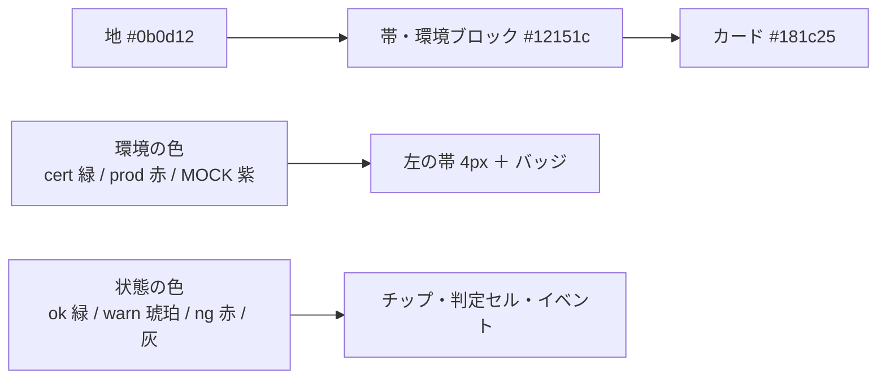
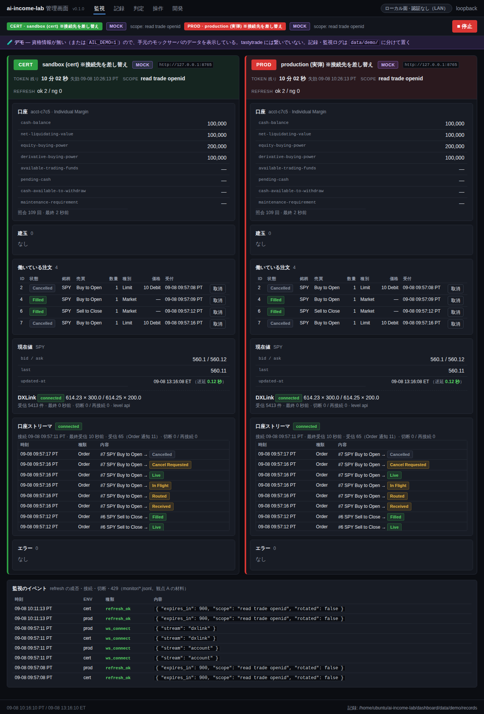
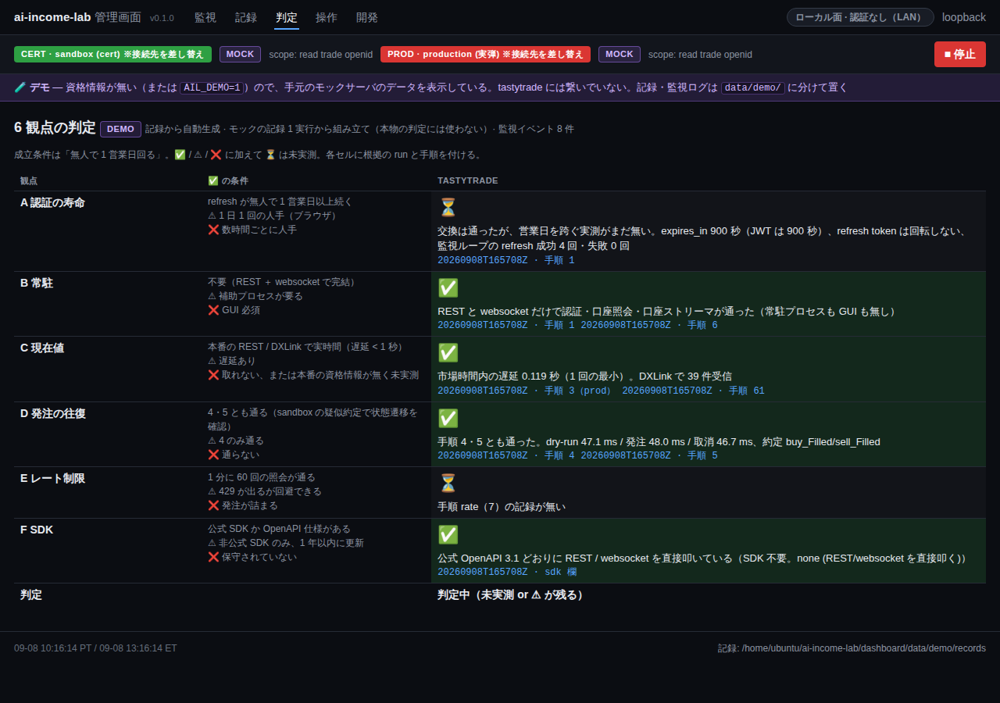
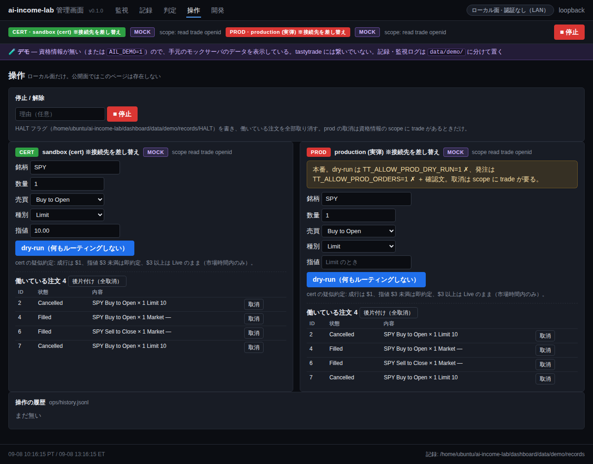
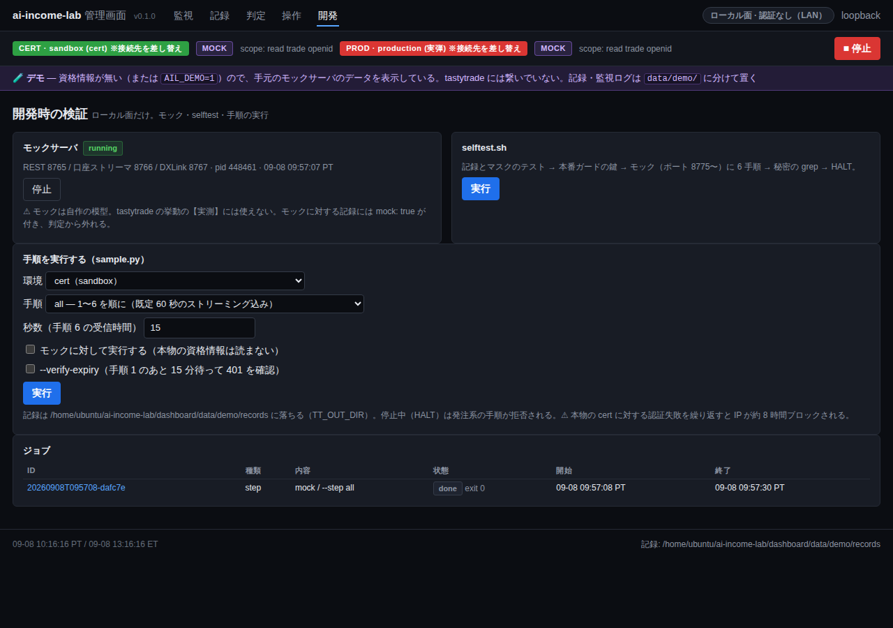
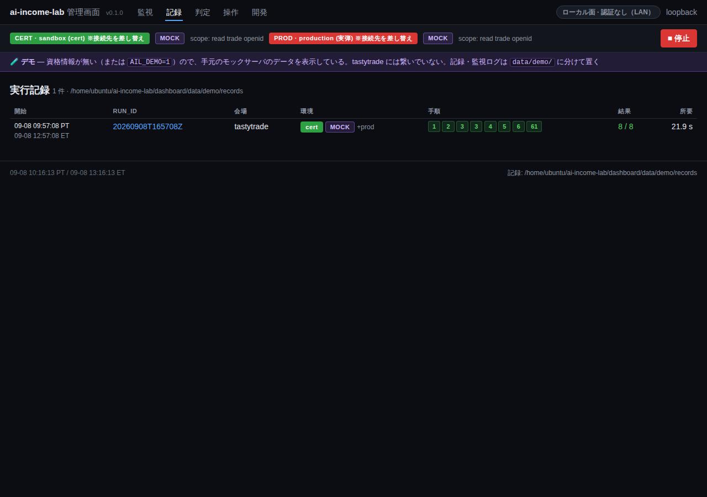

# 管理画面を黒ベースで作り直す

作成: 2026-09-08

## 目的・背景

デモ（鍵なし）で 5 画面にデータが入るようになり、デザインの見直しに入れる。利用者の指示は「黒ベースでデザインを作り直して」。
あわせて、デモの画面で見つかった 3 点（cert / prod が縦に長い、注文表の列が折れる、口座ストリーマの通知がカードを伸ばす）も直す。

## 対応方針

色は 2 系統だけにする。この図の主張: **環境の色（左の帯・バッジ）と状態の色（チップ・セル）を分け、それ以外は明るさの段で層を作る**。

| 項目 | 決め |
| --- | --- |
| 配色 | 地は青みの黒。文字 `#e6e9ef`、薄い文字 `#8b93a1`。アクセントは青 `#58a6ff`（リンク・主ボタン）。停止ボタンは prod と同じ赤 |
| 環境の見分け | 環境ブロックは左に 4px の帯（cert 緑 / prod 赤）、見出しの地を薄く同色に。バッジは塗り、MOCK は紫の枠 |
| 状態 | チップは半透明の地 ＋ 明るい文字（ok / warn / ng / 灰）。判定セルも同じ 4 色 |
| 数字 | 等幅数字（`tabular-nums`）。口座の項目名は等幅 |
| 監視の並び | 幅 1,300px 以上なら cert と prod を横に並べる（`#monitor` を grid に）。イベントの表は全幅 |
| 注文表 | 折り返さない（`nowrap`）。数量・価格は右寄せ |
| 口座ストリーマの通知 | 高さ 240px の枠の中でスクロール（見出し固定） |
| 触らないもの | テンプレートの構造・文言・面の規則。CSS の差し替えと、表に class を足す 3 箇所だけ |

## 画面（2026-09-08、幅 1280px）

## 影響範囲

`dashboard/app/static/app.css`（全面書き換え）、`app/templates/monitor_panel.html`（class を 3 箇所）。サーバ側は無変更。

## テスト方針

- pytest 24 件（テンプレートの構造を変えないので落ちない想定）
- デモ起動中の実物に playwright で入り、5 画面のスクリーンショットを取って見る（1 回見て直す）
