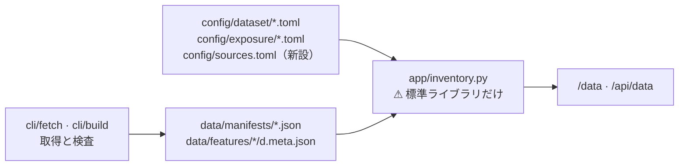

# 管理画面に「どのようなデータを保持しているか」が分かるページを追加する

作成: 2026-09-09 / 仕様: [dashboard.md §11](../../specs/dashboard.md)（本プランの Phase 4 で追記）

## 目的・背景

利用者の指示（2026-09-09）: **どのようなデータを保持しているのかが分かるページを管理画面に追加**。

`experiments/feature-discovery/` は価格の足（86 銘柄）・外部系列（本命 ／ 偽薬 73 本）・特徴量の表を
`data/` に持つが、何をどれだけ持っているかは manifest と config を直接開かないと分からない。
管理画面に「データ」のページを 1 枚足し、**層・取得元・枠・系列数・行数・期間・公表の遅れ（ずらし幅）・
規約の判定・割り当て**を 1 画面で読めるようにする。

## 対応方針

⚠ **検証の画面（[dashboard.md §10](../../specs/dashboard.md)）と同じ立て方にする。**
**実験側が書いたものを読むだけ**で、画面は 1 バイトも計算し直さない・書かない。

> この図の主張: ⚠ **数字は実験側が書き、画面は読むだけ。** だから manifest と画面の数字がずれない。

| # | 決めごと | ⚠ 理由 |
| ---: | --- | --- |
| 1 | ⚠ **読む正本は manifest**（`data/manifests/*.json`）。特徴量の表だけは sidecar（`data/features/*/d.meta.json`）を読む | ⚠ **画面が CSV / parquet を開いて数え直さない**（§10 と同じ）。sidecar は rules.md 1 章の「層を書いたら manifest を書く」の特徴量版 |
| 2 | ⚠ **枠（本命 ／ 偽薬）と仮説は config（`dataset/*.toml` の `role` `hypothesis`）を写すだけ** | 結果を見て分類し直すと後付けになる（manifest の `role` も取得時に config から写されたもの） |
| 3 | ⚠ **ずらし幅と規約の判定は `config/sources.toml`（新設）に宣言し、画面はそれを写す** | 現状の正本は `ail/features/exog.py` / `impact.py` の `DEFAULT_SOURCE_LAG_DAYS`（pandas 依存で管理画面から import できない）と仕様書の表。⚠ **宣言を 1 ファイルに集め、コードとの一致は実験側のテストで固定する**（2 か所に同じ数字を手で持たない） |
| 4 | 割り当て（`config/exposure/*.toml`）は経路（channel）と重みの表をそのまま出す | ⚠ **全部【推測】である旨と後知恵（`hindsight`）を画面に明示する**（config が既に宣言している） |
| 5 | 面は両方（公開面にも出す）。デモの対象外 | 読むだけで秘密は無い（外部系列と足は公開データ）。応答は他の画面と同じく `Redactor` を通す。⚠ 検証の画面と同じく、デモ中でも本物の manifest を読むので帯にその旨を足す |
| 6 | 置き場は環境変数 `AIL_EXP_DIR`（既定 `experiments/feature-discovery/`）で 1 つだけ指す | g3plus には COPY されないので**無くても 200 を返す**（`AIL_RUNS_DIR` と同じ扱い。見せたいときだけ volume で差す） |

### 画面の構成（`/data`）

| 節 | 中身 | 出どころ |
| --- | --- | --- |
| 足（価格） | 層（raw ／ adjusted）× 粒度ごとに: 取得元・銘柄数・行数・最古と最新の日・検査の引っかかり・調整の内訳（修復 ／ 実際の変動） | `manifests/raw_d.json` など 4 枚 |
| 外部系列 | 取得元ごとに: **枠（本命 ／ 偽薬）**・系列数・行数・最古と最新の日・**ずらし幅**・**規約の判定**・仮説。系列の一覧は折りたたみ | `manifests/raw_*_series.json` ＋ `dataset/*.toml` ＋ `sources.toml` |
| 特徴量 | 実験ごとに: 元の層・行数・列数・作成日時・⚠ 先読み用の別枠 | `features/*/d.meta.json` |
| 取得元と規約 | 取得元ごとに: 規約の判定（robots.txt ／ 公有 ／ 契約）と根拠・公表の遅れ・ずらし幅 | `sources.toml` |
| 割り当て | 経路（どの災害の系列を・どの重みで）と、重みの表（銘柄 × 地域 ほか）。⚠ **全部【推測】・後知恵ありの帯** | `exposure/us63.toml` |

## 影響範囲

- `experiments/feature-discovery/config/sources.toml` — **新設**（取得元ごとの宣言: ずらし幅・公表の遅れ・規約の判定）
- `experiments/feature-discovery/tests/test_sources_decl.py` — **新設**（宣言とコードの一致を固定）
- `dashboard/app/inventory.py` — **新設**（manifest / meta / TOML を読む。標準ライブラリだけ。`tomllib` は 3.11+）
- `dashboard/app/config.py` — `AIL_EXP_DIR`（既定 `experiments/feature-discovery/`）と派生パス
- `dashboard/app/main.py` — `/data`・`/api/data` のルート
- `dashboard/app/templates/data.html` — **新設**。`base.html` — ナビ・フッタ・デモ帯に「データ」を足す
- `dashboard/tests/test_inventory.py` — **新設**。`conftest.py` の `Settings` に `exp_dir`、`test_app.py` の秘密 grep に `/data` を追加
- `docs/specs/dashboard.md` — §1 の画面表・§6 の置き場・**§11（新設）**・更新履歴

⚠ **実験側の挙動は変えない**（`exog.py` / `impact.py` のずらし幅はそのまま。足すのは宣言ファイルと一致テストだけ）。

## テスト方針

| # | 検証 | どうやって |
| ---: | --- | --- |
| 1 | 宣言とコードの一致 | 実験側: `sources.toml` の `lag_days` が `exog.py` / `impact.py` の `DEFAULT_SOURCE_LAG_DAYS`・`DEFAULT_LAG_DAYS` と一致し、`DEFAULT_SOURCES` ＋ im_ の経路の取得元が全部宣言されている |
| 2 | 集計が manifest の写しであること | dashboard 側: 偽の manifest / meta / TOML を tmp に書き、行数・系列数・最古と最新の日（ms → 日付）・枠・ずらし幅・規約が期待どおり出る |
| 3 | 無くても落ちない | `AIL_EXP_DIR` が空・存在しない・壊れた JSON でも `/data` と `/api/data` が 200 |
| 4 | 秘密が出ない | `test_app.py` の grep 対象に `/data` `/api/data` を足し、偽の秘密が 0 件のまま |
| 5 | 割り当ての表示 | 経路・重み・【推測】の帯・後知恵の印が出る |

## Phase / Step

- Phase 1: 実験側の宣言 — `config/sources.toml` と一致テスト
- Phase 2: 画面 — `inventory.py`・`/data` ルート・テンプレート・`AIL_EXP_DIR`
- Phase 3: テスト — dashboard 側のテストと秘密 grep の拡張、全テストの実行
- Phase 4: 仕様と後片付け — dashboard.md §11、TODO → DONE、プランを archive へ
