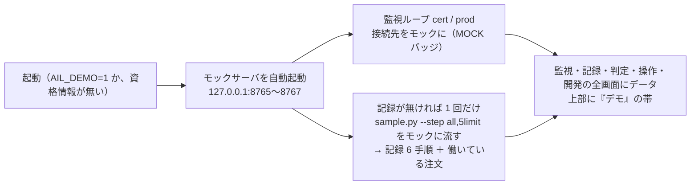
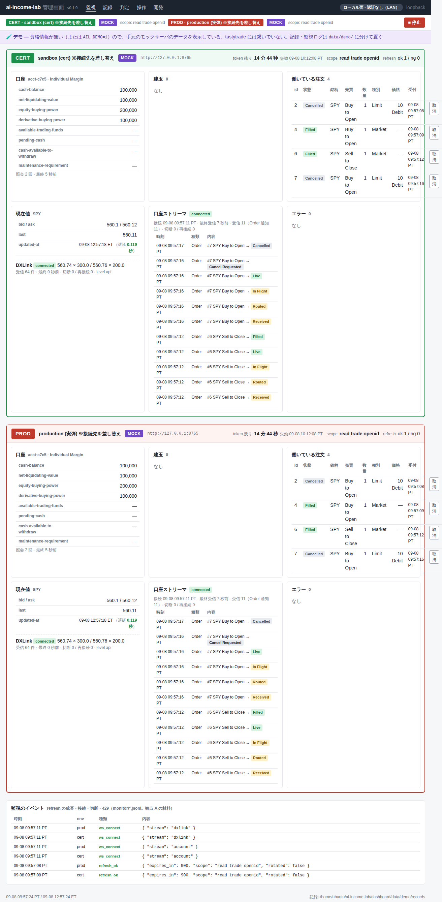
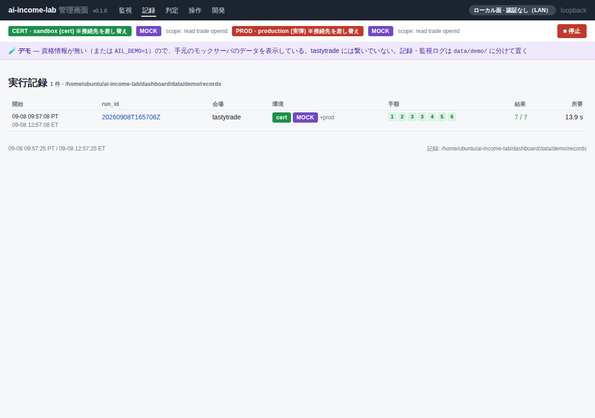
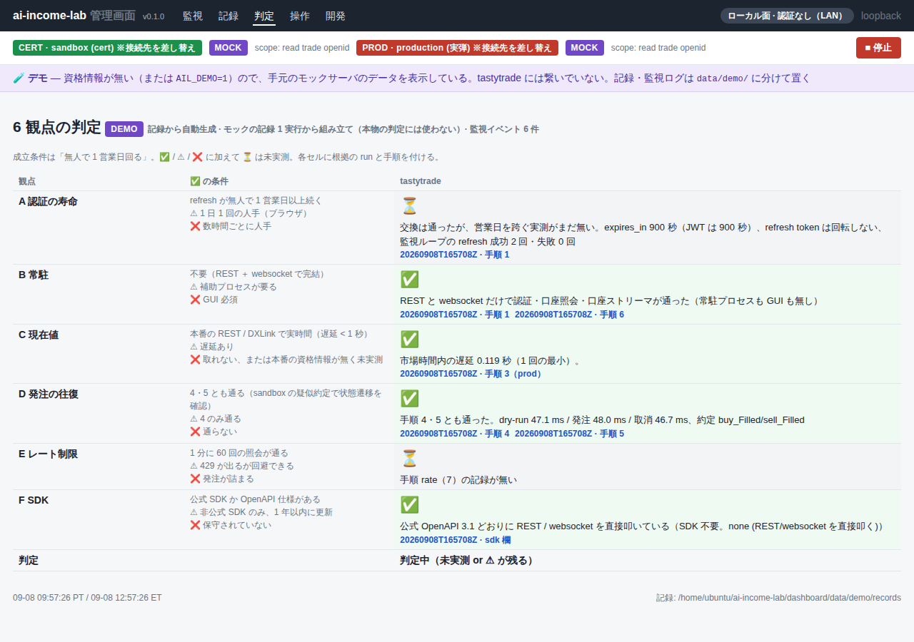
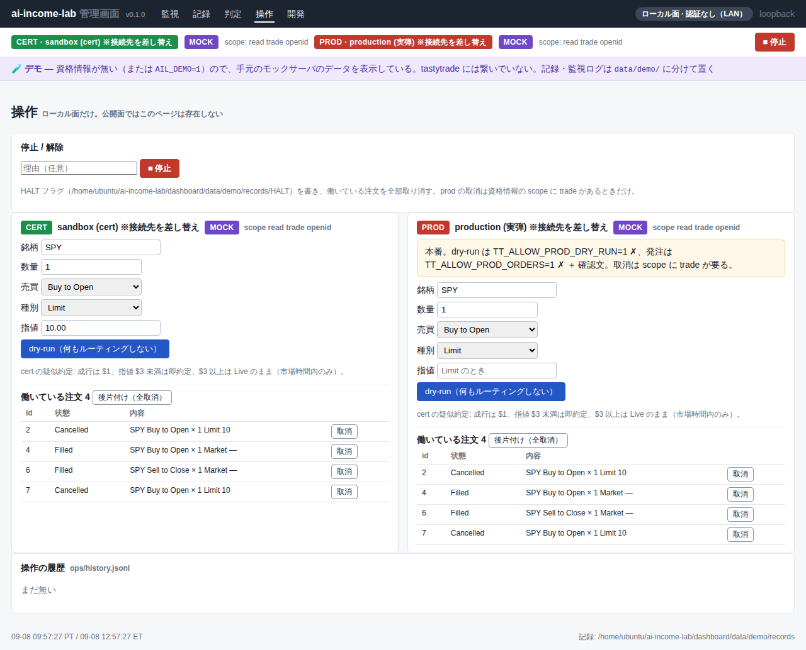
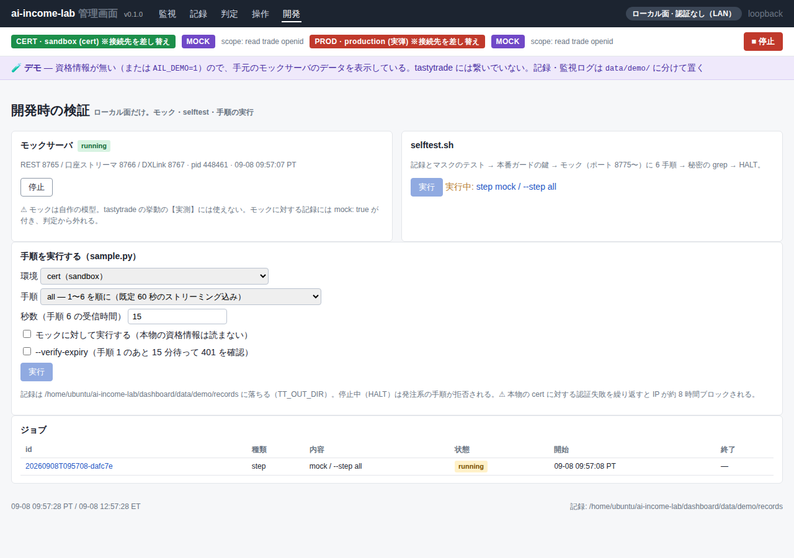

# 管理画面を鍵なしで動かす（デモ: モックのデータで全画面を出す）

作成: 2026-09-07

## 目的・背景

管理画面（`dashboard/`）は tastytrade の API から取った情報を出す画面なので、資格情報が無いと監視画面が空になり、
記録も判定も無い状態ではデザインを見られない。利用者の指示（2026-09-07）は「まずはデザインの実装重視なので、鍵なしで動くように」。
既にある**モックサーバ**（`experiments/tastytrade-api-sample/mock_server.py`。REST・口座 websocket・DXLink を模す）を
起動時に自動で立て、監視ループをそこへ繋げば、鍵なしで全画面にデータが入る。

## 対応方針

この図の主張: **デモは「資格情報の代わりにモックを差す」だけで、画面・監視ループ・記録の経路は本物と同じものを通す**。

- 判定: 通常はモックの記録を除外するが、デモでは含めて表を組み立てる（帯に「デモ。モックの記録から」と出す）
- データの置き場: デモは `data/demo/` 配下（記録・監視ログ・ジョブ・操作履歴）。本物の記録（`out/`・`data/records`）を汚さない
- 面の規則は変えない。デモでも公開面（cloudflare）では操作・開発は出さない
- 本物の資格情報があっても `AIL_DEMO=1` ならデモ（本物には繋がない）。`AIL_DEMO=0` で強制オフ（資格情報が無ければ今までどおり空）

## 影響範囲

`dashboard/app/config.py`（`demo` と置き場）、`monitor.py`（デモの監視 2 本）、`devtools.py`（モックのポートを設定に寄せる）、
`main.py`（起動時のモック起動と記録の種まき、帯）、`judge.py`（`include_mock`）、`templates/base.html` / `judge.html`、`static/app.css`、
`tests/test_demo.py`、`.env.example`、`docs/specs/dashboard.md`、`CLAUDE.md` の管理画面の節。g3plus 側は資格情報が空のままなら自動でデモになる。

## テスト方針

- pytest: 設定の判定（資格情報なし → デモ、`AIL_DEMO=0` → オフ、資格情報あり → オフ、`AIL_DEMO=1` → 資格情報があってもデモ）、
  デモの監視が cert / prod とも MOCK で組み立つ、`/` と `/judge` に帯が出る
- 実機: 開発機で `AIL_DEMO=1` で起動し、5 画面にデータが入ることを playwright で確かめてスクリーンショットを残す

## 画面（2026-09-08、デモで起動した実物のスクリーンショット）

監視（cert / prod の 2 ブロックが縦に並ぶ。1280 幅で約 2,700px）:

記録:

判定（モックの記録から組み立て。DEMO バッジ）:

操作（ローカル面だけ）:

開発（ローカル面だけ。モックの起動状態と種まきのジョブ）:

