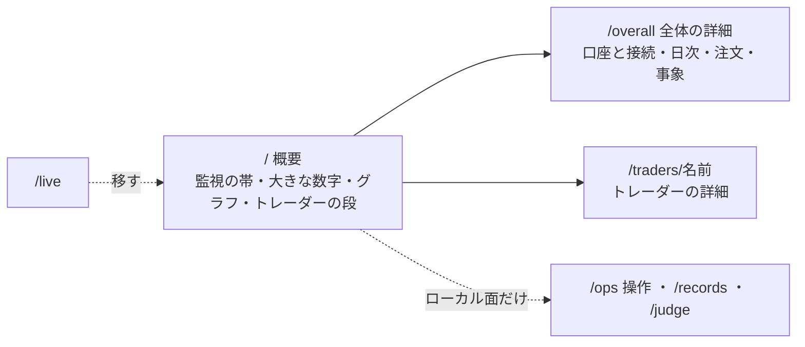

# 決めた構成とデザインを管理画面に実装する

作成: 2026-09-18

## 目的・背景

[管理画面に必要な機能を決める](dashboard-required-features.md) で、構成・並べ方・デザインを決めた（2026-09-18）。
利用者の指示（2026-09-18）: **デザインを反映する。データが無いものは仮データを入れ、後で実装するためのタスクを管理画面のタスクに残す**。

| 決めたこと | 中身 |
| --- | --- |
| 構成 | 上に全体の概要、その下にトレーダー、各トレーダーの詳細はクリック |
| トレーダーの一覧 | 1 人 1 段（損益と行動を同じ時間の軸で揃える） |
| 日次 | 概要から外し「全体の詳細」へ |
| ナビ | 左ペイン（停止ボタンは右の上） |
| 見た目 | デザイン 3「数字とグラフが主役」（監視は細い帯 1 本、大きな数字は全トレーダーの損益 1 つ・色なし） |
| 見本 | [design-3-numbers](../assets/dashboard-patterns/design-3-numbers/README.md)（`docs/plans/assets/dashboard-patterns/`） |

## 対応方針

> この図の主張: ⚠ **入口は概要 1 画面で、全体の詳細とトレーダーの詳細は押したときだけ開く。操作と記録・判定はローカル面の左ペインにだけ出る。**

| 経路 | 中身 | 面 | いま |
| --- | --- | --- | --- |
| `/` | 概要（監視の帯 ・ 大きな数字 ・ 損益の推移 ・ 執行の差 ・ トレーダーの段） | 両面 | 監視のページ → 概要に置き換える |
| `/overall`（新） | 全体の詳細（口座と接続の監視 5 秒更新 ・ 日次 ・ 注文の履歴 ・ 監視の事象） | 両面 | 監視の中身はここへ移す |
| `/traders/{name}`（新） | トレーダーの詳細（損益 ・ 差 1 の推移 ・ 行動のマス目 ・ 注文の履歴 ・ 設定） | 両面 | — |
| `/live` | ⚠ `/` へ転送（プランや手順書が名指ししているので経路は残す） | 両面 | 実売買のページ |
| `/api/live` | そのまま | 両面 | — |
| `/ops`・`/records`・`/judge` | そのまま（左ペインの「ローカル面だけ」「API 検証」に置く） | 今のまま | — |
| `/experiments`・`/data`・`/dev` | ⚠ **左ペインに出さない**（外すと決めた。経路とコードの削除は別の子タスク） | 今のまま | — |

- **図**: 見本の `build.py` の SVG を `app/charts.py` に移す（サーバで組む SVG。スクリプトなし）。テンプレートからは Jinja の関数として呼ぶ（⚠ `Redactor` を通した後のデータから描く）
- **データ**: `app/live.py` にトレーダー別の推移（損益・行動のマス目・差 1）と起動しなかった日を足す
- **色と部品**: 見本の `patterns.css`・`design-numbers.css` のうち使うものを `app.css` に足す（系列の色 3 色・監視の帯・大きな数字・段・左ペイン）。§15 に書く
- **CSP**: ⚠ **足す画面にインラインの style とスクリプトを入れない**（既存の確認ダイアログのインラインは別タスク「管理画面の確認ダイアログ…を直す」で直す）

### 仮データ（利用者の指示: データが無いものは仮データを入れ、後で実装するタスクを残す）

| 項目 | なぜ無いか | 仮データ | 画面での印 | 後で実装するタスク |
| --- | --- | --- | --- | --- |
| 紙上の損益（N3） | 実売買の Phase 3（紙上の対照）が未着手 | 実物の損益から作った仮の線（点線） | ⚠ **「仮データ」のバッジと凡例** | 「紙上の損益を本物にする」 |
| 差 3（紙上 − 実物） | 同上 | 上の仮の線との差 | 同上 | 同上 |
| 営業日の暦（起動しなかった日 N7） | 休場日の暦が無い | 平日をすべて営業日とみなす | 「仮: 休場日の暦なし」の注記 | 「休場日の暦を入れる」 |

⚠ **仮データは本物の数字と取り違えないようにする**（CLAUDE.md: 根拠の無い数字を断定しない）。バッジ・凡例・点線で必ず区別し、`/api/live` には出さない。

### デモ

執行器の記録が無い手元でも画面が見えるように、⚠ **デモ（`AIL_DEMO=1` か鍵なし）では執行器のモックの記録を読む**（見本と同じ 3 人 × 20 営業日。`dashboard/demo/live/` に置く。数字は `mock: true`）。
⚠ これは §13-3「実売買はデモの対象外」を変える。`AIL_LIVE_DIR` を指定したときは今までどおりそれを読む。

## Phase

| Phase | やること | 図 |
| --- | --- | --- |
| ✅ 1 | 土台: 左ペインの `base.html`、`app.css` に部品を足す | — |
| ✅ 2 | データと図: `app/live.py` の推移、`app/charts.py` の SVG | — |
| ✅ 3 | 画面: `/`・`/overall`・`/traders/{name}`・`/live` の転送・監視の帯の部分更新 | 上の図 |
| ✅ 4 | 仮データ: 紙上の損益・差 3・休場日の暦（印を付ける）＋ TODO に本実装のタスク | 上の表 |
| ✅ 5 | デモ: 執行器のモックの記録を `dashboard/demo/live/` に置き、デモで読む | — |
| ✅ 6 | 確認と文書: pytest・CSP 違反 0 件・撮影・`dashboard.md`（§1・§6-2・§13・§15）・CLAUDE.md の管理画面の節 | — |

## 影響範囲

- `dashboard/app/`（`main.py`・`live.py`・新 `charts.py`・`templates/`（`base.html` ほか新 3 枚）・`static/app.css`・`app.js`）
- `dashboard/tests/`（`/` と `/live` を名指しするテストを直し、新しい画面のテストを足す）
- `dashboard/demo/live/`（新。モックの記録）
- `docs/specs/dashboard.md`・CLAUDE.md の管理画面の節
- ⚠ **g3plus に載る**（`dashboard/app/`）。デプロイ契約（§7）の COPY の対象は変えない（`dashboard/demo/` は COPY しないので g3plus のデモでは実売買は空のまま）

## テスト方針

- pytest（既存 ＋ 追加）: 新しい 3 画面が 200・秘密が出ない・公開面で読める（POST は無い）・`/live` が転送・仮データに印がある・`/api/live` に仮データが出ない・起動しなかった日が出る
- 画面: デモで起動し、playwright で CSP 違反 0 件・コンソールのエラー 0 件・撮影（1280px）
- ⚠ **本番の鍵・発注には触らない**（読むだけの画面）

## このプランでやらないこと（TODO に残す）

- 外すと決めた 11 行（検証・データ・手動の注文・開発）の経路とコードの削除
- 公開面への記録の届け方（F21）・4 役の動き（F23）・4 役の名前（A1）
- 確認ダイアログの不具合（別タスク）

## 結果（2026-09-18）

- ✅ Phase 1〜6。`/`（概要）・`/overall`（全体の詳細）・`/traders/<name>`（トレーダーの詳細）・`/live` は `/` へ転送・左ペイン・監視の帯の部分更新
- pytest **144 件 pass**（新しい画面・転送・存在しないトレーダーは 404・仮データの印と `/api/live` に出ないこと・起動しなかった日・公開面で読めて POST は 405・デモの記録）
- デモで 3 画面を撮って **CSP 違反 0 件・コンソールのエラー 0 件**【実測】（`docs/plans/assets/dashboard-{overview,overall,trader}.png`。dashboard.md §13-5）
- ⚠ **見つけたこと**: 操作（`/ops`）にインラインの style が 4 か所あり CSP 違反が出る（前から。`diff.html`・`record.html`・`dev.html` にもある）→ 確認ダイアログの不具合のタスクにメモした
- 見本と変えたところ: 全体の詳細の並びは見本どおり「日次 → 注文の履歴 → 口座と接続」（口座と接続には監視のイベントも入る）／ 監視の 1 件取消のボタンを外した（Phase 4 の決定）
- 残したタスク（TODO）: 紙上の損益と差 3 を本物にする ／ 休場日の暦を入れる ／ 外すと決めた 11 行の経路とコードを消す
