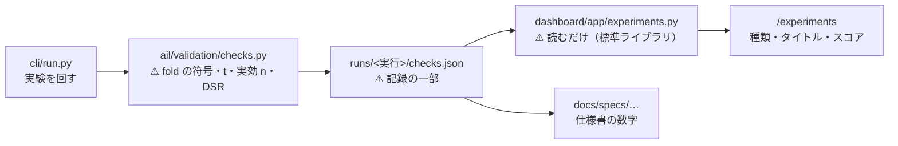

# 管理画面に「検証」の画面を足す（種類ごとのタイトル ＋ 比較できるスコア）

作成: 2026-09-08 ／ 対象: [dashboard/](../../../dashboard/) ＋ `experiments/feature-discovery/`
関連: [dashboard.md](../../specs/dashboard.md) ／ [feature-discovery.md](../../specs/experiments/feature-discovery.md) ／ [ledger.md](../../specs/experiments/feature-discovery/ledger.md)

## 1. 目的と背景

利用者の指示（2026-09-08）: **検証したものを管理画面に、検証の種類にタイトルを付けて、それぞれを比較できるスコアで表示する。**

⚠ **いま検証の結果は 3 か所に散っている。**

| 置き場 | 何が読めるか | ⚠ 何が読めないか |
| --- | --- | --- |
| `runs/<実行>/summary.csv` | 1 実行の手法ごとの成績 | ⚠ **実行の名前が時刻と実験名だけで、何を試したのか読めない** |
| [ledger.md](../../specs/experiments/feature-discovery/ledger.md) | 手法 1 行ずつの台帳 | ⚠ **手法の一覧であって、検証どうしの比較ではない** |
| [feature-discovery.md](../../specs/experiments/feature-discovery.md) §7・§8 | 1 検証ぶんの詳しい読み方 | ⚠ **並べて比べられない**（節が別々） |

⚠ **足りないのは「検証の一覧」である。** 台帳は**手法**が主語、ここで作るのは**検証**が主語の画面。

### 1-1. 利用者が決めたこと

| 決めごと | 選ばれたもの | ⚠ 注意 |
| --- | --- | --- |
| **スコア** | ⚠ **最良手法の純利 bp** | ⚠ **1 つの数字なので、fold の偏りも多重検定も数字自体には出ない** |
| **検査の置き場** | ⚠ **実験側で計算して記録に残す** | 管理画面は読むだけ。⚠ **pandas / scipy を管理画面に持ち込まない** |

⚠ **スコアが 1 つの数字だという弱点は、検査の列を横に並べて補う**（隠さない）。
⚠ **検査を計算するのは実験側なので、仕様書に載る数字と画面の数字は同じものになる。**

## 2. 対応方針

> この図の主張: ⚠ **重い計算は実行のときに 1 度だけ。管理画面は読むだけにする。** 同じ数字が 2 か所で計算されない。

### 2-1. 検証の種類とタイトル

⚠ **タイトルは付けるのではなく、設定から組み立てる。** 手で名前を書くと実行のたびにずれる。

| 部品 | どこから | 例 |
| --- | --- | --- |
| 種類 | `feature_layers` に `cs` `rel` `ll` があるか | **プーリング** ／ **断面** |
| 粒度 | `bar_minutes` | 日足 ／ 1 分足 |
| 地平 | `horizon` × `bar_minutes` | 1 日先 ／ 390 本先 |
| データの層 | 記録の `layer`（sidecar が正） | 調整後 ／ ⚠ **調整前** |
| 対照実験か | 実行名の `_leak` | ⚠ **（先読みの検査）** |

⚠ **例**: `2026-09-08T19-42-54_cross_section_h1` → **「断面・日足・1 日先・調整後」**

### 2-2. スコアと、その横に必ず出すもの

⚠ **スコア = 最良手法（基準線を除く）の純利 bp。** 大きいほど上。

| 列 | 中身 | ⚠ なぜ横に置くか |
| --- | --- | --- |
| **スコア** | ⚠ **最良手法の純利 bp** | 利用者が決めた比較の軸 |
| 手法 | その最良手法の名前 | スコアが誰のものか |
| fold の符号 | 正の fold / 全 fold と並び | ⚠ **平均が正でも 2/5 なら実力ではない** |
| 上乗せ t | 「常に上」に対する上乗せの t 値 | ⚠ **スコアの大半がドリフトのことがある** |
| DSR | ⚠ **実効標本数で割り引いたデフレーテッド SR** | ⚠ **行数を標本数と読むと 1.0000 になって何も分からない** |
| 配線 | 先読みの対照実験を通したか | ⚠ **通していない検証のスコアは信用できない** |
| 層 | 調整前 / 調整後 | ⚠ **調整前の日足は無効** |

⚠ **スコアだけを見て順位を決めない。** 画面の注記にもそう書く。

### 2-3. 実験側で計算するもの（`checks.json`）

⚠ **すべて `result.csv` と設定から出る。** ただし ⚠ **実効標本数と DSR はパネル（特徴量の表）が要る**ので、
⚠ **実行のときにしか計算できない**。後から埋めるときは「パネルが同じだと確かめられた実行」だけに限る。

| 鍵 | 中身 | 後から埋められるか |
| --- | --- | --- |
| `best` | 最良手法（基準線を除く）と純利・粗利 | ✅ |
| `folds` | fold ごとの純利と符号の並び | ✅ |
| `edge_vs_drift` | 「常に上」への上乗せ（fold ごと・平均・t） | ✅ |
| `breadth` | 系列数・実効系列数・実効観測数 | ⚠ **パネルが要る** |
| `dsr` | デフレーテッド SR ＋ ⚠ **使った `n_trials`** | ⚠ **パネルが要る** |
| `leak` | 対になる先読みの実行の有無と的中率 | ✅（他の実行を見る） |

⚠ **`n_trials` は増えていく。** ⚠ **`checks.json` には「その実行の時点で何試行だったか」を書き、正本は台帳のままにする。**

## 3. 影響範囲

| ファイル | 変更 |
| --- | --- |
| `experiments/feature-discovery/ail/validation/checks.py` | **新規**。検査をまとめて計算する |
| `experiments/feature-discovery/cli/run.py` | 実行のたびに `checks.json` を書く |
| `experiments/feature-discovery/cli/report.py` | `--recheck` で既存の実行に後から書く（⚠ **パネルが一致する実行だけ**） |
| `experiments/feature-discovery/tests/test_checks.py` | **新規** |
| `dashboard/app/config.py` | `runs_dir`（`AIL_RUNS_DIR`）を足す |
| `dashboard/app/experiments.py` | **新規**。⚠ **標準ライブラリだけ**で `runs/` を読む |
| `dashboard/app/templates/experiments.html` ／ `experiment.html` | **新規** |
| `dashboard/app/main.py` ／ `base.html` | 画面と API を足す（⚠ **読むだけなので公開面にも出す**） |
| `dashboard/tests/test_experiments.py` | **新規** |
| `docs/specs/dashboard.md` | §1 の画面の表 ＋ 新しい節 |

⚠ **管理画面に pandas / scipy を入れない**（`requirements.txt` は変えない）。

## 4. Phase

| Phase | 中身 | 完了の判定 | 結果 |
| ---: | --- | --- | --- |
| 1 | `checks.py` ＋ `cli/run.py` が `checks.json` を書く | 新しい実行に checks.json が出る | ✅ |
| 2 | `--recheck` で既存の実行に後から書く | ⚠ **パネルが違う実行は「パネル無し」と記録して止まらない** | ✅ 8 実行。⚠ **調整前の日足 3 実行は正しく「パネル無し」になった** |
| 3 | 管理画面の一覧と詳細 | 種類・タイトル・スコア・検査の列が出る | ✅ `/experiments`・`/experiments/<run_id>`・`/api/experiments` |
| 4 | 仕様書と検査 | `pytest` が両側で通る | ✅ 実験側 71 件 ／ 管理画面 42 件 |

### 4-1. ⚠ 作りながら見つけた 2 つ

| # | 何が起きたか | どう直したか |
| ---: | --- | --- |
| 1 | ⚠ **間引いたパネルでは実効系列数が出せなかった。** 1/7 に間引くと同じ時刻に全銘柄が揃わず、相関行列が作れない | ⚠ **相関は「間引く前」の表で測り、検証に回った行数は「間引いた後」から数える**ように分けた |
| 2 | ⚠ **実効標本数にパネル全体を使うと DSR が甘くなった**（0.9276 → 0.9543 で、0.95 の線をまたぐ） | ⚠ **分割を実際に回して検証行だけを数える**ようにした（割り算で出さない。fold を飛ばすことがあるため） |

⚠ **2 は結論を変えうる誤りだった。** 断面の DSR が 0.95 を超えるか超えないかが入れ替わる。

## 5. テスト方針

| # | 何を確かめるか | ⚠ 落ちなければ意味が無い検査 |
| ---: | --- | --- |
| 1 | タイトルが設定から正しく組み立つ | ⚠ **断面とプーリングを取り違えない**（`feature_layers` の判定） |
| 2 | スコアが**基準線を除いた**最良の純利になる | ⚠ **「常に上」がスコアになってはいけない** |
| 3 | fold の符号と t 値が手計算と一致する | 検査そのものの検算 |
| 4 | ⚠ **パネルが違う実行では DSR を書かない** | ⚠ **埋められない値を 0 や null で埋めると嘘になる** |
| 5 | 先読みの実行が**一覧の上位に来ない** | ⚠ **的中率 99% の検証がスコア 1 位に出ると全部が嘘になる** |
| 6 | 管理画面が `runs/` 無しでも 200 を返す | デモ・別環境で落とさない |
| 7 | 応答に秘密が出ない | 既存の Redactor の検査に載せる |

## 6. ⚠ この画面で埋まらないもの

| # | 限界 | ⚠ 効き方 |
| ---: | --- | --- |
| 1 | ⚠ **スコアは 1 つの数字なので、fold 1 だけで作られた数字も高く出る** | ⚠ **検査の列を必ず併記する。** 画面の注記にも書く |
| 2 | ⚠ **`n_trials` は増える。** 古い `checks.json` の DSR は当時の試行数のもの | ⚠ **正本は台帳。** 画面には「いつの試行数か」を出す |
| 3 | `runs/` は git 管理外 | ⚠ **別環境では空になる。** 空でも落ちないようにする |
| 4 | ⚠ **検証どうしは条件が違う**（粒度・地平・層・列の数） | ⚠ **スコアの差が手法の差とは限らない。** 条件を同じ行に出す |
