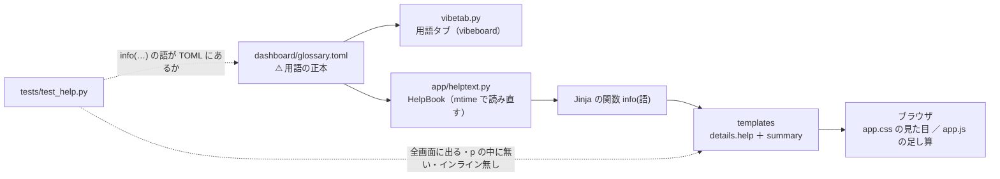
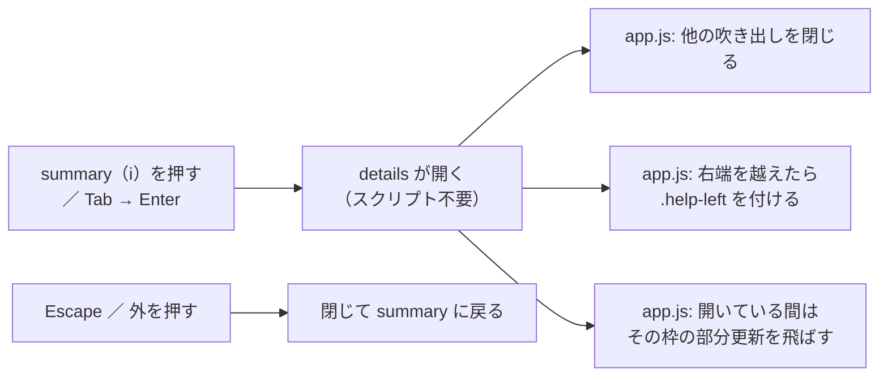

# 管理画面に i マークを付けて、ヘルプを表示する

作成日: 2026-09-18。派生元: [DONE](../../../DONE.md) の「管理画面に i マークを付けて、ヘルプを表示する」（利用者の指示 2026-09-18）。
関連: [dashboard.md](../../specs/dashboard.md) §12（用語の正本）・§15（デザイン規約）・§15-9（インラインを書かない）。

## 0. 目的・背景

管理画面（`dashboard/`。3012）は 2026-09-18 に「数字とグラフが主役」に作り直したが、⚠ **数字の見出しが内輪の言葉**（差 1〜4・内部移転・見送り・起動しなかった日・働いている注文…）で、初めて見る人は意味を引けない。利用者の方針は **分かりやすさ重視**。
見出しの横に **i マーク**を置き、押すと 1〜2 行の説明と「詳しく書いてある文書」が出るようにする。

⚠ 制約（CLAUDE.md・dashboard.md）:

- CSP は `script-src 'self'; style-src 'self'`。⚠ **インラインの script ／ `style=` ／ `on*=` は使えない**（§15-9）
- 公開面（cloudflare）でも見える画面に出る ＝ ⚠ **文面に秘密・口座の情報を入れない**。応答は今までどおり `Redactor` を通す
- 管理画面に発注の経路・重い依存を足さない

## 1. 決めごと

| # | 決めること | 決定 | ⚠ 理由 |
| ---: | --- | --- | --- |
| 1 | 文面の置き場 | ⚠ **`dashboard/glossary.toml` を正本にする**（vibeboard の用語タブと同じ 1 本）。画面は `name` で語を指すだけ。無い語は TOML に足す（節を 2 つ足す: 「実売買」「管理画面（監視と記録）」） | ⚠ **二重管理にしない**（§12-1 の規約 1「説明を Python に埋めない」）。1 語 1〜2 行・動く数字を書かない、の規約とテスト（90 字）がそのまま効く |
| 2 | 出し方 | ⚠ **`
` ＋ `
`**。中身はサーバが組む（Jinja の関数 `info("語")`）。`app.js` は足し算だけ（Escape ／ 外を押すと閉じる・1 つだけ開く・右端で左に倒す・開いている間は部分更新を止める） | スクリプト無しでも開く・Tab で届き Enter ／ Space で開く（`summary` の素の動き）・CSP の内。⚠ `title=` は触れない端末とキーボードで読めないので採らない |
| 3 | どこに付けるか | **数字や用語の見出し**（大きな数字・タイル・パネルの見出し・節の見出し）。表の列は、表の上の「この表の言葉」の行にまとめる | ⚠ 横スクロールの枠（`.scroll-x`）の中に置くと吹き出しが切れる。⚠ **`
` の中には置けない**（`
` の開始タグは `
` を閉じる ＝ 画面が崩れる。テストで固定） |
| 4 | 語が無いとき | ⚠ **静かに欠けない**: テストが templates の `info("…")` を全部拾い、実物の `glossary.toml` に無い語があれば落ちる。実行時は 500 にせず「i?」の印 ＋ 警告ログ（⚠ 停止ボタンのある画面をヘルプの不備で落とさない） | 「欠けたら気づく」をテストに、「運用を止めない」を実行時に分ける |
| 5 | TOML が読めないとき（g3plus で COPY されていない等） | i マークを出さず、フッタに「⚠ 用語の正本が読めない」を出す | 空の吹き出しを出さない。黙って消さない |
| 6 | 「詳しく」 | 文書のパスと節を**文字で**出す（リンクにしない） | 管理画面（3012）から vibeboard（3010）の hash URL へは飛べない（面が別。公開面からは届かない） |
| 7 | デプロイ契約（§7） | ⚠ **COPY に `dashboard/glossary.toml` を足す**（g3plus-ops 側の追従が要る。追従までは決定 5 の表示） | TOML を `app/` の中へ動かす案は、動いている vibeboard の sidecar（3015）が古いパスを読み続けて用語タブが空になるので採らない |

## 2. 対応方針

> この図の主張: ⚠ **説明の正本は TOML 1 本のまま。** 管理画面は語の名前で引いて写すだけで、用語タブと同じ文面が出る。

> この図の主張: 開く・閉じるは `
` の素の動きで、`app.js` は「閉じ方」と「置き場所」だけを足す。

## 3. 影響範囲

| 場所 | 変更 |
| --- | --- |
| `dashboard/glossary.toml` | 節「実売買」「管理画面（監視と記録）」と語を足す（既存の語は変えない） |
| `dashboard/app/helptext.py`（新） | `HelpBook`: TOML を読む（mtime でキャッシュ）・`mark(name)` が `Markup` を返す。標準ライブラリ ＋ `markupsafe`（Jinja の依存。新しい依存なし） |
| `dashboard/app/main.py` | Jinja の関数 `info` と `help_ok` を足す（文面は `redactor.text` を通す） |
| `dashboard/app/templates/*.html` | 見出しに `{{ info("語") }}`。`trader.html` の含み損の `
` は `
` に |
| `dashboard/app/static/app.css` ／ `app.js` | `.help*` の見た目 ／ 閉じ方・置き場所・部分更新の飛ばし |
| `dashboard/tests/test_help.py`（新） | §4 |
| `docs/specs/dashboard.md` | §15-10（i マーク）・§7（COPY）・§12（節の数・読み手が 2 つ）・更新履歴 |
| `CLAUDE.md` | 管理画面の節に 1 行 |

⚠ 触らないもの: 発注・停止の経路、`Redactor`、CSP、vibeboard 本体と sidecar（`vibetab.py` のコードは変えない ＝ 入れ直し不要。TOML は mtime の見張りで追従する）。

## 4. テスト方針

| # | 何を固定するか | どこで |
| ---: | --- | --- |
| 1 | templates の `info("…")` の語が全部、実物の `glossary.toml` にある | `test_help.py`（静的） |
| 2 | 各画面（概要・全体の詳細・トレーダーの詳細・記録・記録の詳細・差分・判定・操作）に i マークが出て、「i?」（語なし）が 0 件 | 同（描画） |
| 3 | ⚠ `
` の中に `details.help` が無い・インラインの style ／ handler が無い・CSP ヘッダが変わっていない | 同 |
| 4 | 公開面でも出る・秘密が出ない | 同（既存の `assert_clean`） |
| 5 | `HelpBook`: 語なし → 印と記録・ファイルなし → 出さない ＋ `help_ok` 偽・HTML を escape・mtime で読み直す | 同（単体） |
| 6 | 用語は 90 字以内・重複なし・リンク先が実在（既存） | `test_vibetab.py`（そのまま） |
| 7 | ブラウザ: 押すと開く・Escape で閉じる・CSP 違反 0 件 | デモを別ポートで立てて playwright（あれば）。pytest には入れない（§15-9 と同じ） |

## 5. Phase

| Phase | 中身 | 状態 |
| --- | --- | --- |
| 1 | プラン（本書）・語の洗い出し・`glossary.toml` に足す | ✅ 2026-09-18 |
| 2 | `helptext.py`・`info`・templates・css・js | ✅ 2026-09-18 |
| 3 | テスト・デモで確認・スクリーンショット | ✅ 2026-09-18 |
| 4 | 仕様（dashboard.md §15-10 ほか）・CLAUDE.md | ✅ 2026-09-18 |
| 5 | ⚠ **利用者**: 見た目と文面の確認（✅ 2026-09-19）／ g3plus-ops の Dockerfile に `COPY dashboard/glossary.toml` を足す（⚠ g3plus-ops 側の作業。このリポジトリでは追わない） | ✅ 2026-09-19 |
