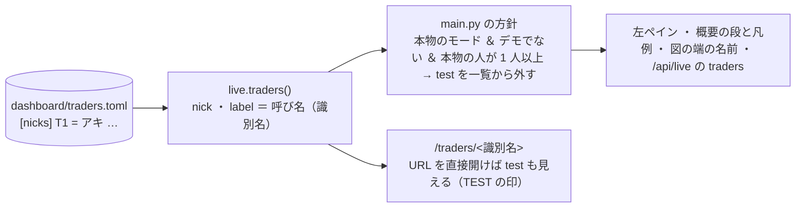

# 管理画面にトレーダーの呼び名を出し、試験用トレーダーを一覧から外す（2026-09-23）

## 目的・背景

利用者の指示（2026-09-23）: **「呼び名を表示する。T1, T2 なども併記。テストトレーダーは削除」**。
きっかけ ＝ 管理画面（`dashboard/`）は識別名 `T1〜T3` だけを出し、呼び名（アキ ／ アリス ／ カエデ ＝ `dashboard/traders.toml` の `[nicks]`。vibeboard のトレーダーのタブ専用だった）を読んでいなかった。また概要・全体の詳細・左ペインに `config/traders/*.toml` の 15 人全部（本物 3 ＋ `test = true` の 12 人）が並んでいた。

## 対応方針

> この図の主張: 呼び名の正本は 1 本（`traders.toml` の `[nicks]`）のままで、管理画面は読むだけ。試験用を隠すかは main.py の 1 か所で決める。

- **呼び名**: `label` ＝ `呼び名（識別名）`（例 `アキ（T1）`）。呼び名が無い人（`sim_*`・`test_a`）は識別名だけ。見出し・段・凡例・左ペイン・図の端の名前・注文の履歴の「同じ注文」「内部移転の相手」に使う。URL・記録・`name` は識別名のまま
- **試験用を外す**: `test = true` の人は、**本物のモード（sim でない）・デモでない・本物の人が 1 人以上いる**ときだけ一覧から外す。⚠ シミュレーションモードは `sim_*`（test）しか居ない・デモは `mock_*` しか居ない・本物の人が 0 人だったころの「試験用だけを出す」画面は今までどおり ＝ どれも隠さない。`/traders/<名前>` を直接開けば今までどおり見える（多くのテストと記録のリンクが `test_a` を開く）
- ライブラリ（`live.py` の `index`・`board`）の返す `traders` は変えず、隠すのは `main.py`（描画と `/api/live`）だけ。`test_traders` はそのまま返す（居ることは分かる）
- ⚠ 設定ファイル（`config/traders/mock_*.toml`・`sim_*.toml`・`test_a.toml`）は消さない（mockrun・シミュレーション・`test_a` の往復テストが使う）

## 影響範囲

`dashboard/app/live.py`（`nicks()`・`label`・`labels`）／ `dashboard/app/main.py`（方針 1 か所・`nav_traders`・`board_now`・`/api/live`）／ `dashboard/app/charts.py`（端の名前と aria）／ templates（`base`・`overview`・`trader`・`orders_history`）／ `dashboard/tests/test_live.py`（呼び名と隠す規則のテスト）／ `docs/specs/dashboard.md` §13 ・ §15-6 ／ CLAUDE.md の管理画面の項。vibeboard のタブ・執行器・g3plus-ops は変えない。

## テスト方針

`cd dashboard && .venv/bin/python -m pytest -q tests`（全部）。足すもの: 呼び名が `label` に入る（無ければ識別名）／ 本物の人が居るとき home と左ペインと `/api/live` の `traders` に test が出ず、`/traders/test_a` は 200 ／ 本物の人が 0 人なら今までどおり出る ／ デモと sim では隠さない（既存の `test_demo`・`test_mode_banner` が見る）。最後に titan と 13500t の画面をループバックで確かめる（13500t は auto-update が pull した後）。
