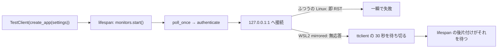
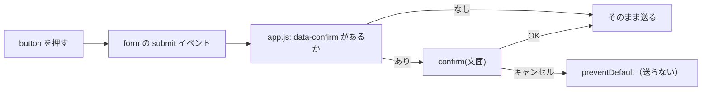

# 管理画面: pytest の 487 秒と、CSP で止まっている確認ダイアログを直す

2026-09-18。利用者の指示「2 → 1 の順で進めて」（GAN のキューが回っている間に進められるタスクの 2 番と 1 番）。

## 1. 目的・背景

`TODO.md` の 2 タスクを、この順で直す。どちらも `dashboard/` の中で完結し、回っているキュー（worktree `ail-exim-wt`）には触れない。

| Phase | タスク | 何が起きているか【実測 2026-09-18】 |
|---|---|---|
| 1 | pytest が titan で 487 秒かかる | `TestClient` を開くテストが 1 本ずつ 30 秒待つ（`test_inventory.py` は 10 件で 60.3 秒・遅い 2 本が 30.04 / 30.08 秒） |
| 2 | 確認ダイアログが CSP で止まっている | `onsubmit="return confirm(...)"` 5 か所が `script-src 'self'` に止められ、**停止・解除・発注・後片付けが確かめずに送られる**。インラインの `style=` 9 か所も `style-src 'self'` に止められている |

先に 1 を直すのは、2 のテストを速く回すため。

## 2. Phase 1: pytest を速くする

**主張: 遅いのは「監視を要らないテストが監視を起こしている」から。起こさなければ待たない。**

### 数えた結果（着手前）

| ファイル | `TestClient` を開く箇所 | `start_monitors=False` | 監視を要るか |
|---|---|---|---|
| `test_app.py` | 4 | 全部あり | 監視は `app.state.monitors.get("cert")` に状態を手で入れて見る（起こさない） |
| `test_demo.py` | 4 | 全部あり | 同上（モックは `MockServer` を直に立てる） |
| `test_experiments.py` | 8 | **なし** | 要らない（`runs/` を読む画面） |
| `test_inventory.py` | 2 | **なし** | 要らない（在庫を読む画面） |
| `test_live.py` | 6 | **なし** | 要らない（執行器の記録を読む画面） |

16 箇所 × 30 秒 ≒ 480 秒で、487 秒と合う。⚠ **監視を実際に起こして通すテストは 1 本も無い**（TODO の「監視を通すテスト（デモ・停止）は残す」は、すでに `start_monitors=False` のまま監視の状態を直に見る形で残っている）。

### 対応

- 16 箇所を `create_app(settings, start_monitors=False)` にする（アプリ側は変えない）
- ⚠ **`ttclient` のタイムアウトは触らない**（実運用の値。テストのために本番の待ち時間を変えない）
- 再発を防ぐ: `conftest.py` に「`start_monitors` を省いた `create_app` がテストから呼ばれたら落とす」番人を置く（次に画面のテストを足す人が同じ穴に落ちないように）

### 確認

`pytest -q tests` の件数が 144 のまま・合計時間が 1 分未満になること。

## 3. Phase 2: 確認ダイアログとインラインの style

**主張: 文面を属性に移し、`'self'` の `app.js` が submit を捕まえて確かめる。CSP は緩めない。**

### 対応

- templates の `onsubmit="return confirm('…')"` 5 か所（`base.html` 停止 ／ `ops.html` 解除・停止・発注・後片付け）を `data-confirm="…"` にする
- `app/static/app.js` に、`document` で `submit` を捕まえる処理を足す（⚠ **部分更新で差し替わる要素の中の form にも効くよう、form 個別ではなく document に付ける**）
- インラインの `style=` 9 か所（`ops.html` 4・`diff.html` 2・`record.html` 1・`dev.html` 2）を `app.css` のクラスへ移す
- ⚠ **CSP（`script-src 'self'; style-src 'self'`）は緩めない**（`'unsafe-inline'` を足さない）
- ⚠ **サーバ側の歯止めは変えない**: 本番の発注の確認文（`CONFIRM_PHRASE`）・CSRF・面の規則はそのまま。確認ダイアログは押し間違いを防ぐ 2 つ目の歯止めで、1 つ目ではない

### テスト

| 何を固定するか | 手段 |
|---|---|
| templates にインラインのハンドラ（`on*=`）と `style=` が 1 つも無い | pytest（テンプレートの全ファイルを走査。描画した `/`・`/ops` も見る） |
| 5 つの form に `data-confirm` がある・`app.js` が `data-confirm` を読む | pytest |
| ブラウザで「ダイアログが出る ／ 断ると送られない ／ 受けると送られる ／ CSP 違反 0 件」 | playwright（node。`dashboard/tests/browser/confirm.mjs` に残す。⚠ **pytest には入れない**（dashboard の依存に playwright を足さない）。デモで起動して流す） |

⚠ playwright の確認では **`/ops/halt` への POST をブラウザ側で止める**か、デモ（`AIL_DEMO=1`・`data/demo/`）で流す。本物の記録ディレクトリに `HALT` を書かない。

## 4. 影響範囲

- `dashboard/tests/*.py`・`dashboard/tests/conftest.py`（Phase 1）
- `dashboard/app/templates/{base,ops,diff,record,dev}.html`・`app/static/app.js`・`app/static/app.css`（Phase 2）
- `docs/specs/dashboard.md`（§13-5 の「pytest が極端に遅い」の行・§15 のデザイン規約に「インラインを書かない」・変更履歴）
- g3plus: ⚠ **停止ボタンは公開面にもある**ので、直したら再デプロイが要る（デプロイは利用者の指示を待つ）

## 5. 後片付け

2 タスクを `DONE.md` へ移し、このプランを `docs/plans/archive/` へ移す。
