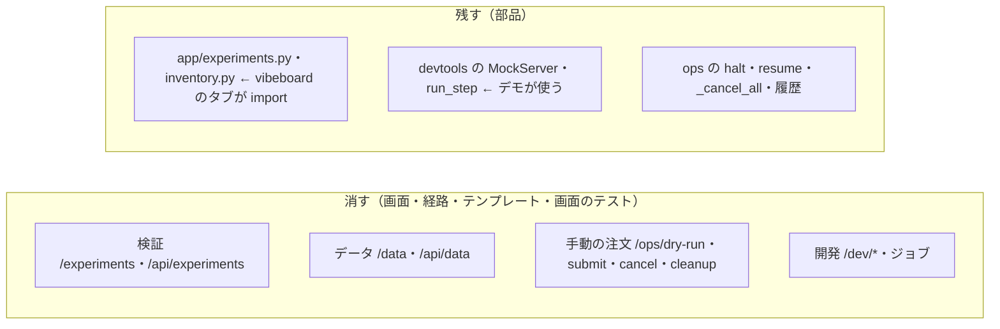

# 管理画面: 外すと決めた 11 行（検証・データ・手動の注文・開発）と 1 件取消の経路を消す

2026-09-18。利用者の指示「おススメ順でやって」。決定は [dashboard-required-features.md](archive/dashboard-required-features.md) 3-1・4-1・4-2（利用者が 2026-09-18 に確定）。2026-09-18 の作り直しでは左ペインから外しただけで、経路とコードは残っていた。

## 1. 消すもの・残すもの

**主張: 画面と経路は消すが、vibeboard とデモが使う部品は残す。安全の面（停止・解除・CSRF・面の規則・秘密）は 1 行も変えない。**

| # | 行 | 消すもの |
| ---: | --- | --- |
| 14・15 | 検証 | `GET /experiments`・`/experiments/{run_id}`・`/api/experiments`・`experiments.html`・`experiment.html`・画面のテスト |
| 16 | データ | `GET /data`・`/api/data`・`data.html`・画面のテスト |
| 23・24 | 手動の dry-run・発注 | `POST /ops/dry-run`・`/ops/submit`・`ops.html` のフォームと結果・`Ops.build_order`・`dry_run`・`submit`・`CONFIRM_PHRASE`・`ACTIONS`・`ORDER_TYPES` |
| 25・4 | 手動の取消・1 件取消 | `POST /ops/cancel`・`Ops.cancel`（4-2 で 1 件取消のボタンを削ったので使う画面が無い） |
| 26 | 後片付け | `POST /ops/cleanup`・`Ops.cleanup`（停止が全部取り消すので重なる） |
| 28〜31 | 開発 | `GET /dev`・`POST /dev/mock/*`・`/dev/selftest`・`/dev/run`・`/dev/jobs/*`・`dev.html`・`job.html`・`job_panel.html`・`app.js` の `data-stop-when` |

| 残すもの | 理由 |
| --- | --- |
| `app/experiments.py`・`app/inventory.py` とその単体テスト | `dashboard/vibetab.py` が import する（vibeboard の検証・データのタブ） |
| `devtools.MockServer`・`DevTools.run_step`・`test_devtools.py` | デモ（資格情報なし ／ `AIL_DEMO=1`）が起動時に使う |
| `POST /ops/halt`・`/ops/resume`・`/ops/retry-auth`・`GET /ops`（停止 ／ 解除 ／ 履歴）・`Ops._cancel_all` | 残す（固定）の 21・22・27・7 |
| 記録と判定（`/records`・`/judge`） | 期限つき（観点 A を見届けるまで） |
| 本番の鍵の 3 段（`ttclient`） | サンプルと執行器が使う。管理画面に残るのは取消の鍵（停止）だけになる |

⚠ **本番の手動発注ができる唯一の画面が消える**（決定 24）。実売買の 1 発注（Phase 5-1）は執行器 `run_day.py` で行うので、手順書に影響は無い。

## 2. 設定の扱い

`Settings.allow_prod_orders`（`TT_ALLOW_PROD_ORDERS`）は手動の発注だけが使っていた → 管理画面の設定から外す（執行器とサンプルは自分で環境変数を読むので影響なし）。`allow_prod_dry_run` は `devtools.run_step`（デモの部品）が読むので残す。

## 3. テスト方針

| 何を固定するか |
| --- |
| 消した経路が 404 ／ 405 を返す（ローカル面でも）。`/ops` に注文のフォームが無い |
| 残したものが動く: 停止 ／ 解除 ／ 履歴 ／ CSRF ／ 公開面で `/ops` が 404 ／ デモ ／ 秘密が応答に出ない |
| `experiments.py`・`inventory.py` の単体テストと `test_vibetab.py` は通ったまま |
| ブラウザ（`tests/browser/confirm.mjs`）: 後片付けのフォームの確認を外し、停止 2 か所 ＋ CSP 違反 0 件 |

## 4. 影響範囲

`dashboard/app/{main,ops,config}.py`・`templates/`（6 枚削除・`ops.html` を縮める）・`static/app.js`・`tests/`・`tests/browser/confirm.mjs`・`dashboard/README.md`・`.env.example`・`CLAUDE.md`（管理画面の節）・`docs/specs/dashboard.md`（§1・§7・§10・§11 と更新履歴）。⚠ g3plus は再デプロイが要る（利用者の指示を待つ）。
