# 管理画面に必要な機能を決める

作成: 2026-09-18

## 目的・背景

利用者の指示（2026-09-18）: 管理画面（`dashboard/`）全体を設計しなおす。その最初の一歩として、**管理画面に必要な機能を決める**。

管理画面は 2026-09-05 に **tastytrade の API 検証**（`experiments/tastytrade-api-sample/`）の監視と操作のために作り、その後に画面を足してきた。

| 時期 | 足したもの | 目的 |
| --- | --- | --- |
| 2026-09-05 | 監視 `/`・記録 `/records`・判定 `/judge`・操作 `/ops`・開発 `/dev` | API 検証（6 観点） |
| 2026-09-08〜09 | 検証 `/experiments`・データ `/data` | 分析手法の検証の閲覧 |
| 2026-09-18 | 実売買 `/live` | トレーダー 3 人の実売買（2 つ目の例外） |

⚠ **目的が「API 検証」から「実売買の運用」へ移ったのに、画面の構成は足し算のままである。**
さらに、検証とデータは vibeboard のタブ（`dashboard/vibetab.py`。2026-09-10）にも同じ材料で出ている。
このため、「どの場面で何を見るか」から逆算して、残す・外す・移す・足すを決め直す。

⚠ **決めるのは利用者**。Claude は場面の書き出し・棚卸し・突き合わせと見立て（理由つき）を用意するところまでで、画面の実装や削除はしない（親タスクの別の子でやる）。

## 統合したタスク

同じ親の下にあった「現在の機能を列挙して、必要・不要を決める」は、中身が重なるので**本タスクの Phase 2 に統合し、TODO から削除した**（利用者の決定 2026-09-18）。
列挙は Phase 2、必要・不要の決定は Phase 4 で行う。

> この図の主張: ⚠ **「いまある機能」と「場面が求める機能」を突き合わせ、その差分を利用者が決める。**

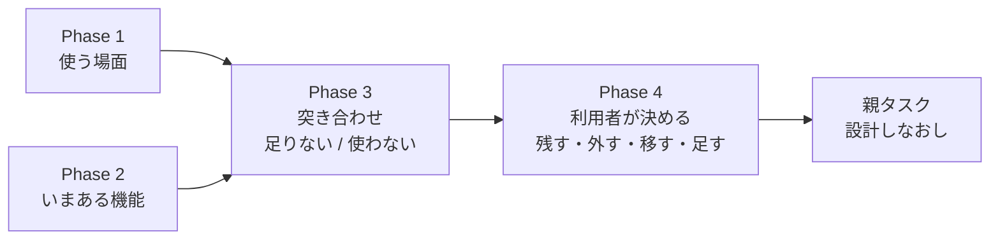

## 対応方針

### 変えないもの（決め直しの対象外）

CLAUDE.md の決まりなので、機能の要不要を決めるときに**前提として固定する**。

| 項目 | 内容 | 正本 |
| --- | --- | --- |
| 面の規則 | 公開面は監視と停止だけ。操作と開発はローカル面だけ | [dashboard.md §2](../../specs/dashboard.md) |
| 秘密 | client secret・トークン・口座番号をブラウザに送らない（全応答が `Redactor` を通る） | [dashboard.md §3](../../specs/dashboard.md) |
| 停止 | 停止ボタン ＝ `HALT` を書き、働いている注文を全部取り消す。執行器も `HALT` を見る | CLAUDE.md・[live-trading.md §0-5](../../specs/experiments/live-trading.md) |
| 本番の鍵 | 3 段（dry-run ／ 取消 ／ 発注 ＋ 確認文）。取消の鍵で発注は開かない | CLAUDE.md |
| 金銭の行動 | 本番の発注・執行器の起動は利用者が行う。画面から執行器は動かさない | CLAUDE.md・[dashboard.md §13-4](../../specs/dashboard.md) |

⚠ **「外す」を選べるのはこの 5 つに触れない機能だけ。** 停止ボタンや面の検査は、要不要の決定表に載せても「残す（固定）」とだけ書く。

### Phase 1: 使う場面を書き出す

誰が・どこから・いつ・何のために管理画面を開くかを表にする。Claude が下書きし、利用者が足し引きする。

#### 1-1. 前提（【コードと文書から読んだ 2026-09-18】）

| 事柄 | 中身 | 出典 |
| --- | --- | --- |
| 執行器が動く機械 | **titan**（15:45 ET に timer ／ cron で起動）。g3plus は監視だけ | [プラン Phase 0 の 6](../live-trading-three-models.md) |
| 執行の窓 | 15:45〜16:05 ET ＝ ⚠ **JST 04:45〜05:05**（EDT の間） | [live-trading.md §0-2](../../specs/experiments/live-trading.md) |
| 執行器が見る `HALT` | titan の `experiments/tastytrade-api-sample/out/HALT`（`TT_HALT_FILE` で変更可） | `experiments/live-trading/run_day.py:126` |
| 停止ボタンが書く `HALT` | 記録の置き場 `records_dir` の `HALT`。⚠ **置き場は起動のしかたで変わる**: 開発機で `AIL_DATA_DIR` なし → サンプルの `out/`（⚠ **執行器と同じ**）／ Docker（g3plus）→ `/app/data/records/`／ デモ → `data/demo/records/` | `dashboard/app/config.py:129・194〜197・227〜228` |
| g3plus の `/live` | ⚠ **空**（g3plus には執行器の記録を置かない） | [dashboard.md §13-3](../../specs/dashboard.md) |
| g3plus の資格情報 | 2026-09-08 時点では空で、デモで稼働（⚠ **いまの状態は未確認**。デプロイ設定は g3plus-ops 側） | DONE.md 2026-09-08 |

⚠ **ここから分かること**: 停止ボタンが**執行器の翌日以降の発注まで止める**（＝ titan の `HALT` を書く）のは、**titan で `AIL_DATA_DIR` なし・デモでなく起動した管理画面から押したときだけ**である。
g3plus（公開面）から押すと、働いている注文の取消（API 経由。prod は scope に trade があり、取消の鍵があるとき）は届くが、⚠ **titan の `HALT` は書かれず、次の営業日に執行器はまた発注する**【コードから読んだ。未実測】。

#### 1-2. 場面の下書き（⚠ **Claude の見立て。利用者が直す**）

> この図の主張: ⚠ **公開面から開きたい場面は 3 つあるが、いまの g3plus で満たせるのは監視だけで、実売買の確認と停止は titan のローカル面でしか満たせない。**

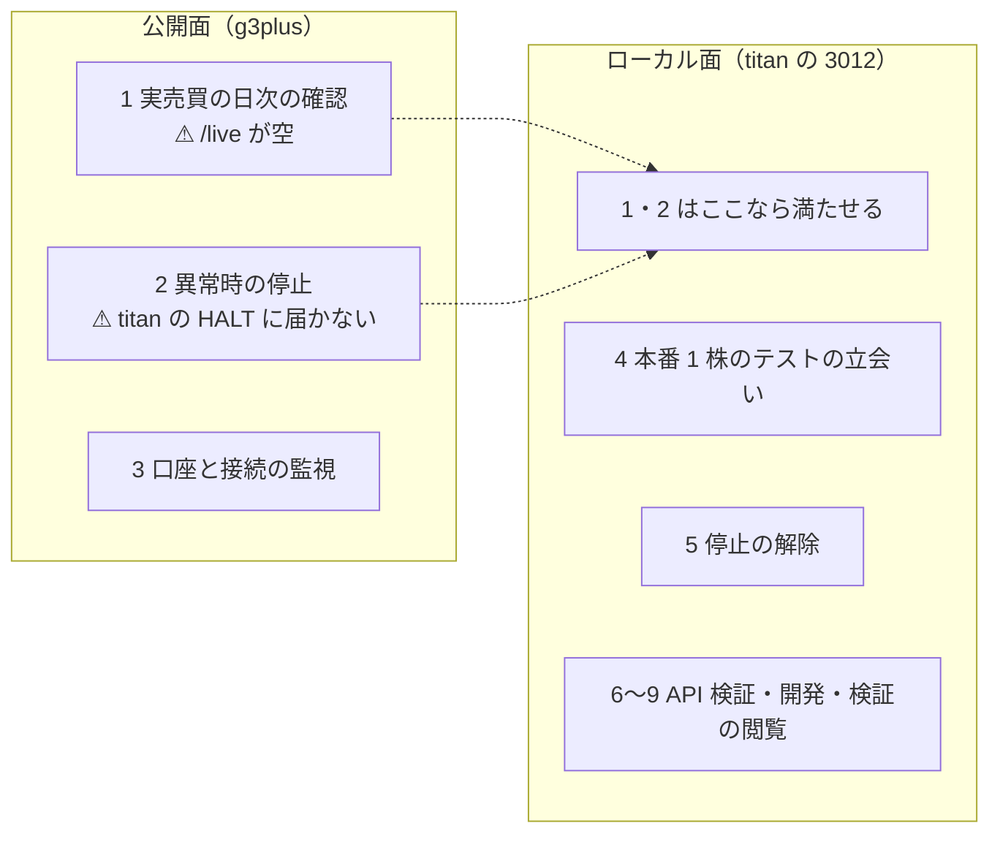

| # | 場面 | 開きたい面 | いつ | 見る ／ する | いまの画面 | いまの状態 |
| ---: | --- | --- | --- | --- | --- | --- |
| 1 | 実売買の日次の確認（⚠ **主な使い方**。1-4） | 公開 ／ ローカル | 窓の後（16:05 ET ＝ JST 05:05 以降） | ⚠ **トレーダーごとの行動と実績、トレーダー同士の比較**。その日の注文と事象、執行器が起動したか | `/live` | ⚠ **ローカル面だけ**（g3plus では空） |
| 2 | 異常時の停止 | 公開 ／ ローカル | いつでも（特に窓の中） | 停止ボタン → 翌日以降も発注しない ＋ 働いている注文の取消 | ヘッダの停止ボタン（`/ops/halt`） | ⚠ **titan のローカル面だけ完全**（g3plus からは取消だけ。1-1） |
| 3 | 口座と接続の監視 | 公開 ／ ローカル | いつでも | 認証の残り・残高・買付余力・建玉・働いている注文・ストリーマの接続・エラー | 監視 `/`（5 秒更新） | g3plus は資格情報が入っていればそのまま使える（⚠ いまの状態は未確認） |
| 4 | 本番 1 株のテストの立会い（Phase 5-1） | ローカル | 買う日・手仕舞う日の窓の中（JST 04:45〜05:05） | 3 の中身 ＋ 停止ボタン | 監視 `/` ＋ 停止ボタン | 満たせる（[live-trading.md §0-5](../../specs/experiments/live-trading.md) の手順 4） |
| 5 | 停止の解除（再開） | ローカル | 停止の後 | `HALT` を消す | `/ops`（再開） | 満たせる（⚠ 解除はローカル面だけ。§2 の面の規則） |
| 6 | API 検証の記録と判定 | 両方 | 観点 A（営業日を 2 日跨ぐ交換）が埋まるまで | 実行記録・差分・6 観点の表 | `/records`・`/judge` | 満たせる。⚠ **観点 A が埋まった後も続く場面か**が未定 |
| 7 | cert での手動操作 | ローカル | 開発時 | dry-run → 発注 → 取消 → 後片付け | `/ops` | 満たせる。⚠ 執行器は自前で cert の dry-run を回す（`run_day.py --mode dry-run`）ので、**この画面を今後も使うか**が未定 |
| 8 | API サンプルの開発（モック・selftest・手順の実行） | ローカル | 開発時 | モックの起動・停止、`selftest.sh`、`sample.py` の手順 | `/dev` | 満たせる。⚠ 執行器の `mockrun.sh`・pytest は画面に無い |
| 9 | 分析手法の検証・データの閲覧 | ローカル | 実験の後 | 順位表・検査・データの在庫 | `/experiments`・`/data` | 満たせる。⚠ **vibeboard のタブ（`http://titan-income-vibeboard`）にも同じものがある**。g3plus では空 |

**場面から出た「いまの画面に無いもの」の候補**（⚠ Phase 3 で「足す」の見立てに使う。ここでは候補を並べるだけ）:

- 1 と 2 を公開面で満たすには、g3plus が titan の記録と `HALT` に届く経路が要る（または公開面では満たさないと決める）
- 1 の「執行器が起動したか」は、いまは `/live` の「起動 N 回」（事象 `start` の数）でしか分からない。起動しなかった日は行が出ない
- 20 営業日の判定（Phase 6）を画面で見る場面があるか（いまは `live-trading.md` に Claude が書く）

#### 1-3. 利用者に聞くこと

1. ⚠ **実売買の日次の確認（場面 1）は、どこから見るか**（外から公開面 ／ tailnet で titan ／ 家で titan の画面）
2. ⚠ **公開面から停止したい場面（場面 2）はあるか**（あるなら、g3plus の停止が titan の `HALT` に届かない件を設計しなおしの前提に入れる）
3. 場面 6〜8（API 検証・cert の手動操作・API サンプルの開発）は、この先も起こるか
4. 場面 9（検証・データ）は、管理画面と vibeboard のどちらで見ているか
5. 足りない場面はあるか

#### 1-4. 利用者の答え（2026-09-18）

| 問い | 答え | 設計しなおしへの意味 |
| --- | --- | --- |
| 場面 1 実売買の日次の確認はどこから見るか | ⚠ **外から公開面で** | ⚠ **g3plus の `/live` に執行器の記録を届ける経路が要る**（いまは空。§13-3） |
| 場面 2 公開面から停止したい場面はあるか | **ない（titan で止める）** | 公開面の停止は取消だけのままでよい。⚠ **止めるときは titan のローカル面から**（1-1 のとおり、そこだけが執行器の `HALT` を書く） |
| 場面 6 記録と判定（`/records`・`/judge`）は検証が終わっても使うか | ⚠ **観点 A が埋まるまで使い、その後は不要**（初めの答えは「使う」。説明を聞いて 2026-09-18 に変えた） | ⚠ **期限つきで残し、A が ✅ になったら外す候補**。A を見届けて `live-trading.md` §1 に写す手順（[プラン Phase 0 の 1](../live-trading-three-models.md)）が済むまでは外さない。判定の結論は [tastytrade-api-sample.md §1](../../specs/experiments/tastytrade-api-sample.md) に残るので、画面を外しても消えない |
| 場面 7 `/ops` の sandbox の手動の注文ボタンはこの先も使うか | **使わない** | ⚠ **外す候補**（停止の解除・本番の鍵は別で、固定） |
| 場面 8 開発 `/dev` はこの先も使うか | **使わない** | ⚠ **外す候補** |
| 場面 9 検証・データはどちらで見ているか | **vibeboard のタブ** | ⚠ **管理画面の `/experiments`・`/data` は外す候補**（vibeboard に任せる） |
| 足りない場面 | 挙がらなかった | Phase 3 で「足す」を出すときは、場面 1〜6 から出たものだけにする |
| ⚠ **主な使い方**（利用者が足した） | ⚠ **各トレーダーの行動と実績と、その比較** | 場面 1 の中身をこれに置き換える（1-6）。⚠ **管理画面の中心はこの場面** |
| ⚠ **見せ方の方針**（利用者が足した） | ⚠ **分かりやすさ重視・グラフも使う** | 設計しなおし全体の方針（1-7）。CSP と §15 の色の規約に触れる |

#### 1-5. Phase 1 の結果 — 残る場面

> この図の主張: ⚠ **ずっと残る場面は 5 つで、公開面で満たすのは「確認と監視」、止める・解除する・立ち会うは titan のローカル面で満たす。記録と判定は観点 A が埋まるまでの期限つき。**

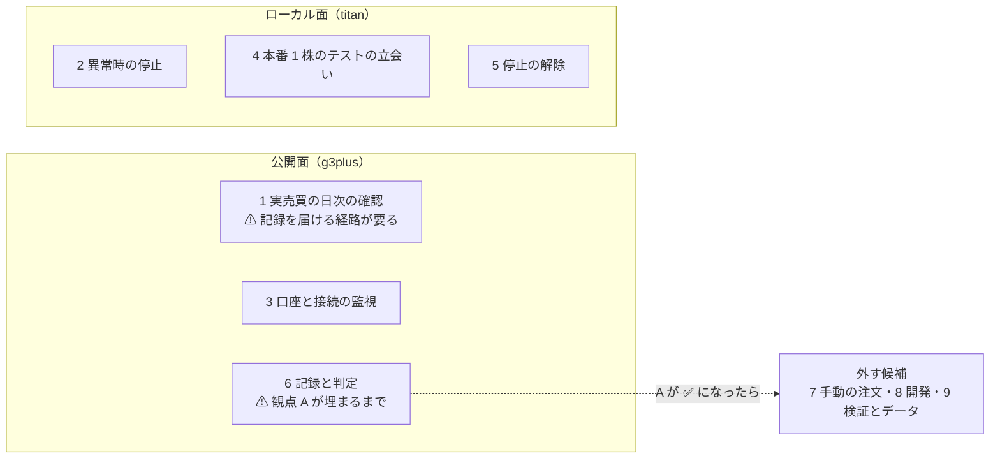

| 区分 | 場面 | Phase 3 への引継ぎ |
| --- | --- | --- |
| 残る（公開面で満たす） | 1・3 | ⚠ **1 は「足す」の候補を持つ**: g3plus が執行器の記録（titan の `experiments/live-trading/`）を読める経路。⚠ **記録の置き場を変えると §7 のデプロイ契約と §13-3 に触れる** |
| 残る（titan のローカル面で満たす） | 2・4・5 | 停止ボタン・`/ops` の再開・監視 `/` は固定（「変えないもの」） |
| 期限つき（観点 A が埋まるまで） | 6 | ⚠ **外す時期は「A が ✅ ＋ `live-trading.md` §1 に写した後」**。参照元は 7・8・9 と同じく洗う（例: `/judge` は実売買のプラン Phase 0 の 1・CLAUDE.md が名指ししている） |
| 外す候補 | 7・8・9 | ⚠ **参照元を grep で洗ってから見立てる**（例: `/dev` は CLAUDE.md の管理画面の節・§1・pytest が名指ししている。`/experiments` は CLAUDE.md・§10・vibeboard の説明が名指ししている） |

#### 1-6. 主な使い方 — 各トレーダーの行動と実績と、その比較（利用者 2026-09-18）

⚠ **管理画面の中心は場面 1 で、中身は「トレーダーごとに何をしたか（行動）・どうだったか（実績）・トレーダー同士でどう違うか（比較）」である。**
いまの `/live` と突き合わせると、トレーダー別に出ているのは**最新の状態と今日の分だけ**で、⚠ **推移と比較が無い**【`dashboard/app/live.py`・`templates/live.html` を読んだ】。

| 見たいもの | 中身の例 | いまの `/live` | 正本・依存 |
| --- | --- | --- | --- |
| 行動（今日） | 合図（買い% ／ 出口%）・注文・約定・見送り | ✅ 出ている（合図の表・注文の表の「誰の分」） | `signals.jsonl`・`orders.jsonl` |
| 行動（推移） | 日ごとの合図・売買・保有の変化 | ⚠ **無い**（日次の表は全トレーダーをまとめた 1 行） | 同上（記録はある） |
| 実績（いま） | 建玉・原価・実現 ／ 含み損益 | ✅ 出ている（トレーダーの表。最新の 1 点） | `state/<env>/*.json`・`ledger.jsonl` |
| 実績（推移） | 損益の曲線（⚠ **実物と紙上の 2 本**。[プラン Phase 4 の 1](../live-trading-three-models.md)） | ⚠ **無い** | 実物は `ledger.jsonl`（記録はある）。⚠ **紙上は Phase 3（紙上の対照）の後** |
| 執行の差（トレーダー別） | 差 1〜4 | ⚠ **全体の値だけ**（カード 5 枚・日次の表） | 差 1 は注文の `parts` で割れる。⚠ **差 3 は Phase 3 の後**（プラン §2-4 は「日次・トレーダー別」を求めている） |
| 比較 | 上のものをトレーダー横並びで | ⚠ **無い** | 上の全部 |

⚠ **比較の出し方には規則がある**（CLAUDE.md の 2 つ目の例外・[dashboard.md §13-4・§15-2](../../specs/dashboard.md)）:

- ⚠ **損益の大小でトレーダー（手法）を採らない**（20 営業日では統計的に判定できない）。判定するのは執行の差と無人運転
- そのため、いまの画面は**損益に色を付けていない**。比較を足すときも、⚠ **損益の順位で並べる・勝ち負けの色を付ける、は規則に触れる**ので、Phase 3 で出し方の候補を示し、Phase 4 で利用者が決める
- 損益を**記録として並べて見せる**こと自体は規則の内（トレーダー別の損益は【実測】を取ってよい）

⚠ **Phase 3 への引継ぎ**: 「足す」の候補の中心は、⚠ **トレーダー別の推移（行動・損益曲線・執行の差）と横並びの比較**。紙上の損益曲線と差 3 は Phase 3（紙上の対照）に依存する。

#### 1-7. 見せ方の方針 — 分かりやすさ重視・グラフも使う（利用者 2026-09-18）

⚠ **設計しなおし全体の方針**として、⚠ **分かりやすさを重視し、表だけでなくグラフも使う**。1-6 の「推移」と「比較」は、表よりグラフのほうが読み取りやすい。

グラフを入れるときに触れる、いまの決まりと仕組み【コードと仕様から読んだ 2026-09-18】:

| 事柄 | いまの状態 | グラフへの効き方 |
| --- | --- | --- |
| CSP | `default-src 'self'; img-src 'self' data:; style-src 'self'; script-src 'self'`（`dashboard/app/main.py:132`） | ⚠ **CDN のグラフライブラリは読めない**。⚠ **インラインの `style` も使えない**。→ サーバで SVG を組むか、ライブラリを `app/static/` に同梱する（g3plus に載る。§7 のデプロイ契約に触れる） |
| 前例 | ハードのタブ（`dashboard/hwview.py`）は**ライブラリなしの SVG の折れ線**を自前で描いている（vibeboard の sidecar 側で、管理画面の CSP の外） | 描き方を流用できる候補 |
| 色の規約（§15-2） | ⚠ **色は環境（cert ／ prod ／ MOCK）と状態（ok ／ warn ／ ng）の 2 系統だけ** | ⚠ **トレーダーごとに系列の色を付けると 3 つ目の系統になる**。⚠ **ok の緑・ng の赤をトレーダーの色に使うと「良い ／ 悪い」に読める**ので使えない → §15 に「系列の色」を足す必要がある |
| 損益の色（§15-2 の 4・§13-4） | 損益には色を付けない（損益で手法を採らない） | ⚠ **損益の曲線に勝ち負けの色（0 より上は緑など）を付けない**。0 の基準線を引くのは可 |

⚠ **ここでは方針を記録するだけ**。グラフの種類・描き方・系列の色は、Phase 3 で候補を示し、Phase 4 で利用者が決める。

### Phase 2: いまある機能を棚卸しする

旧タスク「現在の機能を列挙して、必要・不要を決める」の列挙の部分（必要・不要の決定は Phase 4）。

画面・経路・部品の単位で、いまある機能を 1 行ずつ表にする。

| 列 | 中身 |
| --- | --- |
| 機能 | 例: 監視の「認証の残り秒数」、`/records/diff` の「実行間の差分」 |
| 画面 ／ 経路 | `main.py` の経路（⚠ **31 本 ＝ GET 19・POST 12**【実測 2026-09-18、`@app.get` ／ `@app.post` を数えた】） |
| 面 | 両方 ／ ローカルのみ |
| 材料 | どの記録・API を読むか（`experiments/tastytrade-api-sample/out/`・`experiments/live-trading/`・`experiments/feature-discovery/runs/`・tastytrade の API） |
| 参照元 | その機能を名指しする文書・テスト・契約（手順書・§7 のデプロイ契約・pytest） |
| 使う場面 | Phase 1 の番号 |

- ⚠ **使った頻度は測れない**（アクセスの記録を残していない）。「使っているか」は利用者に聞き、測った値のように書かない
- 同じ材料を vibeboard のタブ（検証・データ・用語・ハード）も出しているので、⚠ **重複は列で示す**

> この図の主張: ⚠ **画面が読む材料は 3 系統あり、系統ごとに「誰の場面か」が違う。**

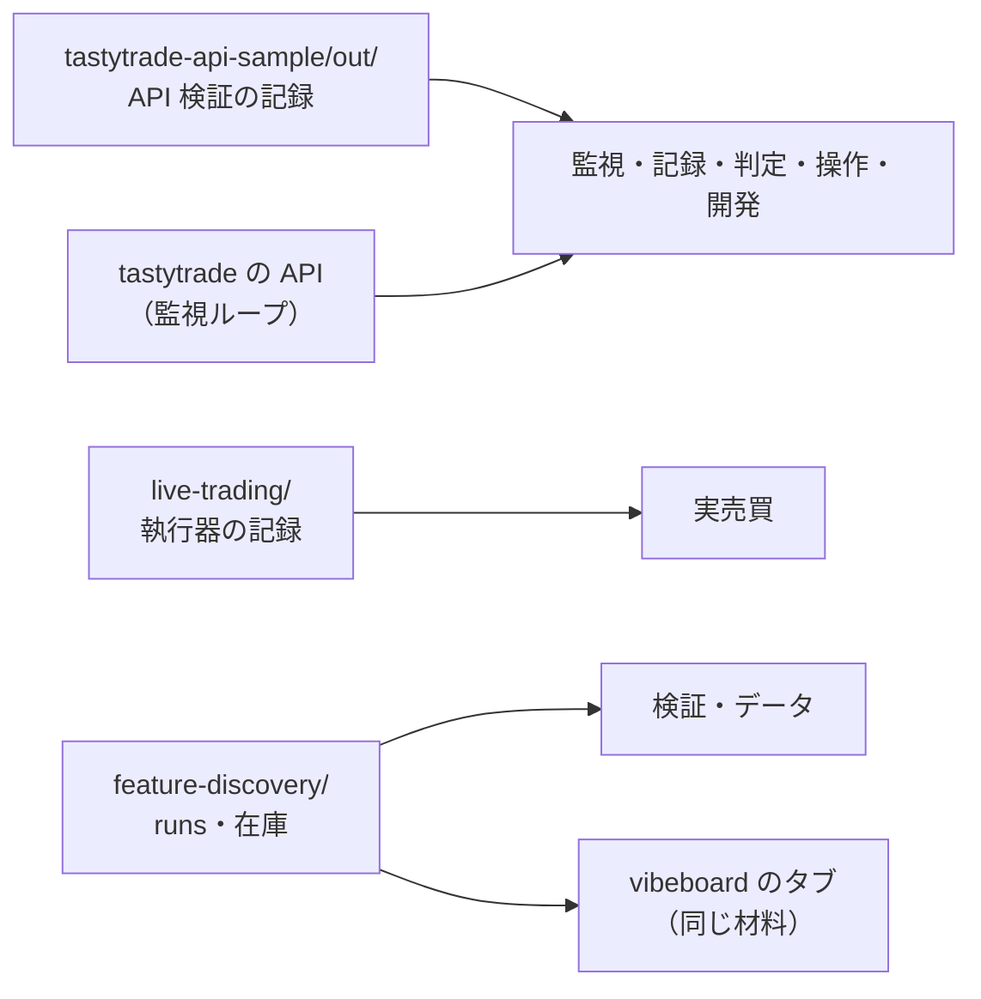

#### 2-1. 棚卸しの結果 — 機能 31 行【コードから読んだ 2026-09-18、`main.py`・`templates/`・`access.py`】

⚠ **面**は `require_local()` の有無で決まる（`/ops` と `/dev` の系統だけがローカル面。`/ops/halt` は両面）。
⚠ **場面**は Phase 1 の番号（1 日次の確認・2 停止・3 口座と接続の監視・4 本番 1 株の立会い・5 停止の解除・6 記録と判定・7 手動の注文・8 開発・9 検証とデータ）。
⚠ **参照元**はいま生きている文書・テスト・コードだけ（アーカイブのプランは経緯なので数えない）。記号: C ＝ CLAUDE.md ／ R ＝ `dashboard/README.md` ／ S ＝ `docs/specs/dashboard.md` ／ P ＝ 実売買のプラン ／ A ＝ `tastytrade-api-sample.md` ／ L ＝ `live-trading.md` ／ V ＝ `dashboard/vibetab.py` の import ／ T ＝ `dashboard/tests/`

| # | 画面 | 機能 | 経路 | 面 | 材料 | 参照元 | 場面 |
| ---: | --- | --- | --- | --- | --- | --- | --- |
| 1 | 監視 | 環境ごとの認証（残り秒数・scope・refresh の成否） | `GET /`・`GET /api/state` | 両面 | API（監視ループ） | C・R・S §1・T `test_app` | 3・4 |
| 2 | 監視 | 口座・残高・買付余力・建玉 | 同上 | 両面 | 同上 | 同上 | 3・4 |
| 3 | 監視 | 働いている注文の一覧 | 同上 | 両面 | 同上 | 同上 | 3・4 |
| 4 | 監視 | 働いている注文を 1 件取り消すボタン | `POST /ops/cancel`（監視パネルから） | ⚠ ローカル（ボタンもローカル面にだけ出る） | API | S §1（⚠ 経路を名指しするテストは無い） | 2・4 |
| 5 | 監視 | 現在値と遅延（prod の気配・DXLink） | `GET /` | 両面 | API | S §1 | 3 |
| 6 | 監視 | 口座ストリーマ・DXLink の接続・切断と再接続 | `GET /` | 両面 | API | S §1 | 3 |
| 7 | 監視 | 認証の再試行（3 回続けて失敗して止めた後） | `POST /ops/retry-auth` | ローカル | API | ⚠ 名指しする文書・テストは無い | 3 |
| 8 | 監視 | 監視の事象（refresh・切断・429 など直近 30 件） | `GET /`・`GET /api/events` | 両面 | 事象（`data/monitor/*.jsonl`） | S §1・§4・T `test_app` | 3・6（観点 A の材料） |
| 9 | 監視 | 5 秒ごとの部分更新 | `GET /?partial=1`（`app.js`） | 両面 | — | S §1 | 3 |
| 10 | 記録 | 実行記録の一覧 | `GET /records`・`GET /api/records` | 両面 | サンプルの記録（`tastytrade-api-sample/out/`） | C・R・S §1・T `test_app` | 6 |
| 11 | 記録 | 1 実行の詳細（手順ごと・同じ環境の他の実行） | `GET /records/{run_id}` | 両面 | 同上 | 同上 | 6 |
| 12 | 記録 | 実行間の差分（所要 ms・状態遷移の時刻の B − A） | `GET /records/diff` | 両面 | 同上 | S §1・T `test_app` | 6 |
| 13 | 判定 | 6 観点 × 会場の自動判定 | `GET /judge`・`GET /api/judge` | 両面 | サンプルの記録 ＋ 監視の事象 | C・R・S §1・§5・⚠ P Phase 0 の 1・A §1・T `test_app`・`test_demo` | 6 |
| 14 | 検証 | 検証の順位表（最良手法の純利 bp と検査） | `GET /experiments`・`GET /api/experiments` | 両面 | `AIL_RUNS_DIR` | C・S §10・⚠ V・T `test_experiments` | 9 |
| 15 | 検証 | 1 検証の詳細 | `GET /experiments/{run_id}` | 両面 | 同上 | 同上 | 9 |
| 16 | データ | データの在庫 | `GET /data`・`GET /api/data` | 両面 | `AIL_EXP_DIR` | S §11・⚠ V・T `test_inventory`・`test_app` | 9 |
| 17 | 実売買 | トレーダーの表（予算・銘柄・モデル・合成・θ・株数・建玉・損益・最終日） | `GET /live`・`GET /api/live` | 両面 | `AIL_LIVE_DIR`（執行器の記録） | P Phase 4・S §13・T `test_live` | 1 |
| 18 | 実売買 | 執行の差（差 1〜4 のカード 5 枚。⚠ 全トレーダーまとめた値） | `GET /live` | 両面 | 同上 | 同上 | 1 |
| 19 | 実売買 | 最新の日（合図・注文・内部移転・残高） | `GET /live` | 両面 | 同上 | 同上 | 1 |
| 20 | 実売買 | 日次（直近 20 日。⚠ 全トレーダーまとめた 1 日 1 行） | `GET /live` | 両面 | 同上 | 同上 | 1 |
| 21 | 操作 | 停止ボタン（`HALT` ＋ 働いている注文を全部取消） | `POST /ops/halt`（ヘッダと `/ops`） | 両面 | `HALT`・API | C・P・S §1・L §0-5・T `test_app` | 2（固定） |
| 22 | 操作 | 停止の解除 | `POST /ops/resume` | ローカル | `HALT` | R・T `test_app` | 5（固定） |
| 23 | 操作 | 手動の dry-run（cert ／ prod。prod は鍵つき） | `POST /ops/dry-run` | ローカル | API | C・R・S §1・T `test_app` | 7 |
| 24 | 操作 | 手動の発注（cert ／ prod。prod は鍵 ＋ 確認文） | `POST /ops/submit` | ローカル | API | 同上 | 7 |
| 25 | 操作 | 手動の取消（id 指定） | `POST /ops/cancel` | ローカル | API | S §1 | 7 |
| 26 | 操作 | 後片付け（その環境の働いている注文を全部取消） | `POST /ops/cleanup` | ローカル | API | S §1 | 7 |
| 27 | 操作 | 操作の画面と履歴（直近 30 件） | `GET /ops` | ローカル | 操作の履歴（`data/ops/history.jsonl`） | C・R・S §1・T `test_app` | 5・7 |
| 28 | 開発 | 開発の画面・モックの起動と停止 | `GET /dev`・`POST /dev/mock/start`・`POST /dev/mock/stop` | ローカル | `mock_server.py` | C・R・S §1・T `test_app` | 8 |
| 29 | 開発 | `selftest.sh` の実行 | `POST /dev/selftest` | ローカル | `selftest.sh` | 同上 | 8 |
| 30 | 開発 | `sample.py` の手順の実行 | `POST /dev/run` | ローカル | `sample.py` | 同上 | 8 |
| 31 | 開発 | ジョブの出力の逐次表示・停止 | `GET /dev/jobs/{job_id}`・`POST /dev/jobs/{job_id}/stop` | ローカル | ジョブ（`data/jobs/`） | S §1 | 8 |

#### 2-2. 経路を持たない共通の部品

| 部品 | 置き場 | 何のため | 場面 |
| --- | --- | --- | --- |
| ヘッダ（ナビ・環境バッジと scope・面の表示・停止ボタン） | `base.html` | 全画面 | 2（固定） |
| 停止中の赤い帯・デモの帯・通知の帯 | `base.html` | 全画面 | 2（固定） |
| 監視ループ（環境ごとに REST の認証 refresh・口座・建玉・注文・気配、口座ストリーマ、DXLink） | `app/monitor.py` | 1〜9・`/ops`・判定の観点 A | 3・6 |
| 監視の事象の記録 | `data/monitor/*.jsonl` | 8・13（⚠ 観点 A は g3plus の監視ループが埋める） | 3・6 |
| 面の検査（loopback ／ LAN ／ Cloudflare Access の JWT） | `app/access.py` | 全経路 | 固定 |
| 秘密のマスク（`Redactor`） | `app/masking.py` | 全応答 | 固定 |
| セキュリティヘッダ（CSP・`no-store`） | `app/main.py:132` | 全応答。⚠ **グラフの作り方に効く**（1-7） | 固定 |
| デモ（モックの自動起動・`data/demo/`） | `app/main.py`・`app/config.py` | 鍵なしで全画面を動かす（S §6-2・T `test_demo`） | — |
| 部分更新の JS | `app/static/app.js` | 監視 5 秒・ジョブの出力 | 3・8 |
| ⚠ **vibeboard のタブが使う部品** | `app/experiments.py`・`app/inventory.py` | ⚠ **`dashboard/vibetab.py` が import している** | 9 |

#### 2-3. 照合（テスト方針のとおり）

| 照合 | 結果 |
| --- | --- |
| 経路（`@app.get` ／ `@app.post`） | ⚠ **31 本すべてが 2-1 のどこかの行に出る**（機械で照合。下の注） |
| テンプレート 15 本 | `base`（2-2）・`index` ／ `monitor_panel`（1〜9）・`records`（10）・`record`（11）・`diff`（12）・`judge`（13）・`experiments`（14）・`experiment`（15）・`data`（16）・`live`（17〜20）・`ops`（21〜27）・`dev`（28〜30）・`job` ／ `job_panel`（31）＝ 15 本 |
| JSON（`/api/*`） | 7 本（`state`・`events`・`records`・`judge`・`experiments`・`data`・`live`）＝ 1・8・10・13・14・16・17 の行 |

注: 2-1 の表から `` `GET …` `` ／ `` `POST …` `` を抜き出し、`main.py` の `@app.get(…)` ／ `@app.post(…)` の一覧と突き合わせた（`/?partial=1` は `GET /` と同じ経路）。

#### 2-4. Phase 3 への引継ぎ — 棚卸しで見えたこと

- ⚠ **場面が混ざっている経路がある**: `POST /ops/cancel` は監視パネルの「1 件取消」（場面 2・4）と `/ops` の手動の取消（場面 7）の両方が使う。`GET /ops` は停止の解除（場面 5・固定）と手動の注文（場面 7）を同じ画面に載せている。⚠ **場面 7 を外すときも、この 2 つは丸ごと消せない**
- ⚠ **`/ops/dry-run`・`/ops/submit` は prod も通る**（鍵 ＋ 確認文があるとき）。⚠ **本番の手動発注ができる画面はここだけ**。鍵の 3 段そのものは `ttclient` にあり、画面を外しても消えない
- ⚠ **検証・データの画面を外しても、`app/experiments.py`・`app/inventory.py` は残す**（vibeboard のタブが import している）
- ⚠ **判定（13）を外すのは観点 A を見届けた後**（P Phase 0 の 1 が名指ししている。1-4 の期限つき）
- 主な使い方（1-6）に対して、いまある実売買の機能は 17〜20 の 4 行だけで、⚠ **そのうち 18・20 は全トレーダーをまとめた値**
- 名指しする文書もテストも無い経路がある（7 認証の再試行・26 後片付け・28〜29 のモックと selftest）。⚠ **外すときに直す参照元が少ない＝外しやすいが、テストが経路を固定していない**

### Phase 3: 突き合わせて、決定表の下書きを作る

Phase 1 の場面 × Phase 2 の機能を突き合わせ、1 機能 1 行の決定表にする。

| 列 | 中身 |
| --- | --- |
| 機能 | Phase 2 の行（⚠ **いま無い機能**は「新」と印を付けて足す） |
| 場面 | Phase 1 の番号（どの場面からも使われない機能は空欄） |
| Claude の見立て | **残す ／ 外す ／ 移す（vibeboard へ）／ 足す ／ 残す（固定）** のどれか |
| 理由 | 見立ての根拠（場面・重複・参照元） |
| 外したときに直すもの | 参照元（文書・テスト・§7 の契約・手順書）の一覧 |
| 利用者の決定 | Phase 4 で埋める |

- ⚠ **「外す」「移す」の見立てには、参照元を grep で洗った結果を必ず付ける**（例: `/judge` は実売買のプランの手順が参照している。停止ボタンは live-trading.md の手順書が参照している）
- ⚠ **「足す」は場面から出たものだけ**（思いつきの機能は足さない）。候補の例: 執行器が今日動いたか（timer ／ cron の最終起動）、トレーダー別の停止条件の近さ、差 3 と B&H（Phase 4 の残り。依存は Phase 3 の紙上の対照）

#### 3-1. 決定表の下書き — いまある機能 31 行（⚠ **見立ては Claude。決めるのは利用者**）

見立ての語: **残す** ／ **残す（固定）**（「変えないもの」の 5 つ）／ **期限つき**（観点 A を見届けた後に外す）／ **外す** ／ **足す**（3-2）。
直すものの記号は 2-1 と同じ（C ＝ CLAUDE.md ／ R ＝ `dashboard/README.md` ／ S ＝ `dashboard.md` ／ P ＝ 実売買のプラン ／ A ＝ `tastytrade-api-sample.md` ／ T ＝ テスト）。

| # | 機能 | 場面 | 見立て | 理由 | 外したときに直すもの | 利用者の決定 |
| ---: | --- | --- | --- | --- | --- | --- |
| 1 | 認証（残り秒数・scope・refresh） | 3・4 | 残す | 公開面の監視（場面 3）の中心 | — | |
| 2 | 口座・残高・買付余力・建玉 | 3・4 | 残す | 同上。口座の建玉と執行器の台帳を見比べられる | — | |
| 3 | 働いている注文の一覧 | 3・4 | 残す | 同上 | — | |
| 4 | 働いている注文を 1 件取り消すボタン | 2・4 | 残す | 立会い中に 1 件だけ取り消す手段（停止は全部を取り消す） | — | |
| 5 | 現在値と遅延 | 3 | 残す（遅延の数値は外してもよい） | DXLink の接続の健全性として場面 3 に入る。遅延の数値は観点 C（✅ 済み）のためのもの | 外すなら S §1 の一文 | |
| 6 | ストリーマ・DXLink の接続 | 3 | 残す | 場面 3 | — | |
| 7 | 認証の再試行 | 3 | 残す | 3 回失敗で認証を止めた後、起動し直さずに戻す手段。⚠ 名指しする文書が無いので、S §1 に 1 行足したい | — | |
| 8 | 監視の事象 | 3・6 | 残す | 場面 3 の履歴。観点 A の材料 | — | |
| 9 | 5 秒ごとの部分更新 | 3 | 残す | 監視を開いたままにするため | — | |
| 10 | 記録の一覧 | 6 | 期限つき | 利用者の決定（1-4）。A を見届けて `live-trading.md` §1 に写した後に外す | C（画面の列挙）・R・S §1・T `test_app`・`test_experiments`・`records.html`・`app/records.py` | |
| 11 | 記録の詳細 | 6 | 期限つき | 同上 | 同上・`record.html` | |
| 12 | 実行間の差分 | 6 | 期限つき | 同上 | S §1・T `test_app`・`diff.html` | |
| 13 | 6 観点の自動判定 | 6 | 期限つき | 同上。⚠ **結論は A §1 に残る**ので画面を外しても消えない | C（画面の列挙・API サンプルの節）・R・S §1・§5・A（「判定は管理画面が組み立てる」の一文）・P Phase 0 の 1・T `test_app`・`test_demo`・`judge.html`・`app/judge.py` | |
| 14 | 検証の順位表 | 9 | 外す | 利用者は vibeboard のタブで見ている（1-4）。g3plus では空 | C（画面の列挙・「検証の画面」の項）・S §1・§7（検証の画面の行）・§10・T `test_experiments`・`experiments.html`。⚠ **`app/experiments.py` は残す**（vibeboard が import） | |
| 15 | 検証の詳細 | 9 | 外す | 同上 | 同上・`experiment.html` | |
| 16 | データの在庫 | 9 | 外す | 同上 | S §1・§7（データの画面の行）・§11・T `test_inventory`・`test_app`・`data.html`。⚠ **`app/inventory.py` は残す**（vibeboard が import） | |
| 17 | トレーダーの表 | 1 | 残す（作り直す） | 主な使い方（1-6）の中心。いまは最新の 1 点だけ | — | |
| 18 | 執行の差（全体） | 1 | 残す（トレーダー別に割る） | 比較の材料。差 1 は注文の `parts` で割れる | — | |
| 19 | 最新の日（合図・注文・内部移転・残高） | 1 | 残す | 今日の行動 | — | |
| 20 | 日次（全体の 1 日 1 行） | 1 | 残す（トレーダー別に割る） | 行動の推移の材料 | — | |
| 21 | 停止ボタン | 2 | 残す（固定） | 変えないもの | — | |
| 22 | 停止の解除 | 5 | 残す（固定） | 変えないもの | — | |
| 23 | 手動の dry-run | 7 | 外す | 利用者は使わない（1-4）。⚠ prod の手動 dry-run も一緒に消える | C（本番の鍵の説明）・R・S §1・T `test_app`・`app/ops.py` の該当・`ops.html` のフォーム。鍵の 3 段（`ttclient`）は残る | |
| 24 | 手動の発注 | 7 | 外す | 同上。⚠ **本番の手動発注ができる唯一の画面**（Phase 4 で確かめる） | 同上 | |
| 25 | 手動の取消（id 指定） | 7 | 外す（経路は残す） | 手動の取消のフォームは外すが、`POST /ops/cancel` は 4 が使う | S §1・`ops.html` のフォーム | |
| 26 | 後片付け（環境の働いている注文を全部取消） | 7 | 外す | 停止（21）が働いている注文を全部取り消すので重なる | S §1・`app/ops.py` の該当 | |
| 27 | 操作の画面と履歴 | 5・7 | 残す（縮める） | 解除（22）と履歴は残し、手動の注文のフォームを外す | R・S §1 | |
| 28 | 開発の画面・モックの起動と停止 | 8 | 外す（部品は残す） | 利用者は使わない（1-4）。⚠ **デモがモックの起動（`devtools.MockServer`）と手順の実行（`dev.run_step`）を使っている**（`main.py:168〜185`）ので、画面を外しても部品は残す | C（画面の列挙）・R・S §1・T `test_app`・`test_devtools`・`dev.html` | |
| 29 | `selftest.sh` の実行 | 8 | 外す | ターミナルで回せる（`./selftest.sh`） | 同上 | |
| 30 | `sample.py` の手順の実行 | 8 | 外す（部品は残す） | 同上。部品はデモが使う | 同上 | |
| 31 | ジョブの出力の表示・停止 | 8 | 外す | 28〜30 が無ければ要らない。`app.js` のジョブの部分更新も外す | S §1・`job.html`・`job_panel.html` | |

経路を持たない共通の部品（2-2）はすべて**残す**（面の検査・秘密のマスク・停止中の帯は固定、CSP は残してグラフをその内で作る、vibeboard が使う部品は残す）。⚠ **`app.js` のジョブの部分更新だけは 31 と一緒に外す**。

#### 3-2. 足す — 場面から出たものだけ

| # | 機能（新） | 場面 | 見立て | 理由 | 触れるもの ／ 依存 | 利用者の決定 |
| ---: | --- | --- | --- | --- | --- | --- |
| N1 | g3plus で `/live` を見る経路 | 1 | 足す | 利用者は外から公開面で見る（1-4）。いまの g3plus の `/live` は空 | S §7（デプロイ契約）・§13-3。g3plus-ops（private）。やり方は 3-3 の (a) | |
| N2 | トレーダー別の損益の推移（実物）のグラフ | 1 | 足す | 主な使い方の「実績の推移」。材料（`ledger.jsonl`）はもうある | §15（系列の色。3-3 の (d)） | |
| N3 | N2 に紙上の損益を重ねる | 1 | 足す（後で） | 実売買のプラン Phase 4 の 1 が「実物と紙上の損益曲線」を求めている | ⚠ 依存: 実売買の Phase 3（紙上の対照） | |
| N4 | トレーダー別の執行の差（差 1・2・4。差 3 は後で） | 1 | 足す | 比較の材料。⚠ **判定の対象は執行の差**（CLAUDE.md の 2 つ目の例外） | 差 3 は実売買の Phase 3 に依存 | |
| N5 | トレーダー別の行動の推移（日ごとの合図・売買・保有） | 1 | 足す | 主な使い方の「行動の推移」。材料（`signals.jsonl`・`orders.jsonl`・`state`）はもうある | — | |
| N6 | トレーダーの横並びの比較 | 1 | 足す | 主な使い方の「比較」 | ⚠ 出し方に規則がある（3-3 の (b)） | |
| N7 | 執行器が起動しなかった日を出す | 1 | 足す | 場面 1 の「執行器が起動したか」。いまは起動した日しか行が出ない | 営業日の暦（休場日）が要る | |

⚠ **見送ったもの**: 20 営業日の判定を画面で見る（Phase 1 で候補に挙げたが、場面として挙がらなかった。判定は `live-trading.md` に書く）。

#### 3-3. 出し方の候補（Phase 4 で決めてもらう）

**(a) g3plus に執行器の記録を届ける（N1）**

| 候補 | 中身 | 良い点 | 気になる点 |
| --- | --- | --- | --- |
| **A 写す（見立て）** | 窓の後（16:10 ET など）に titan の timer が `config/traders`・`state/`・`out/` を g3plus の volume へ写し、g3plus は `AIL_LIVE_DIR` をそこへ向ける | 画面のコードは変えない。g3plus から titan へ入る経路が要らない | titan に写す仕組みを 1 本足す。§7 の契約に volume を 1 つ足す（記録はマスク済み） |
| B 引く | g3plus の管理画面が tailnet 越しに titan の記録を読む（titan に読むだけの口を立てる） | いつも最新 | titan に口を開ける。g3plus が tailnet に入っているかは【未確認】 |
| C titan を公開面にする | titan で Cloudflare Tunnel ＋ `AIL_AUTH_MODE=cloudflare` | 記録を動かさない | ⚠ **発注の資格情報がある機械（titan）を外に出す**。避けたい |

見立ての理由: 1 日 1 回しか増えない記録なので、写す遅れ（数分）は困らない【推測】。

**(b) 比較の出し方（N6）— CLAUDE.md の「損益で手法を採らない」の内に収める**

| 決め | 候補 | 見立て |
| --- | --- | --- |
| 並び順 | 設定の順（T1・T2・T3）で固定 ／ 損益の順 | ⚠ **固定**（損益の順は「勝ち順」に読める） |
| 損益の単位 | $ ／ 予算に対する % ／ 両方 | **予算に対する % を主に、$ を併記**（予算が違っても比べられる） |
| 損益の色 | 系列の色だけ ／ 0 より上を緑・下を赤 | ⚠ **系列の色だけ**（勝ち負けの色は §15-2 の 4 に触れる）。0 の基準線は引く |
| 執行の差の色 | 状態の色（差 1 の閾値の帯） | **付けてよい**（判定の対象は執行の差。§15-4） |
| 重ね方 | 1 枚に重ねる ／ 1 人 1 枚を同じ軸で並べる | **損益は重ねる**（3 本なら読める）、**行動は 1 人 1 枚** |
| 言葉 | 「勝ち」「良い」を出さない ／ 出す | ⚠ **出さない**。比較の上に「損益で手法を採らない（20 営業日では判定できない）」を 1 行 |

**(c) グラフの描き方（1-7）**

| 候補 | 中身 | 良い点 | 気になる点 |
| --- | --- | --- | --- |
| **A サーバで SVG を組む（見立て）** | Python ／ Jinja で `<svg>` を出す（`hwview.py` の書き方を流用） | JS も新しい依存も要らない。CSP の内。§7 の契約（依存 7 つ）を変えない | ホバーなどの操作は薄い（`<title>` で値を出す程度） |
| B JS のライブラリを `app/static/` に同梱 | uPlot・Chart.js など | 操作（ホバー・拡大）が豊か | 同梱物が g3plus に載る。CSP の `style-src 'self'` と合うかは【未確認】 |

**(d) 系列の色（§15 に足す）**

| 決め | 見立て |
| --- | --- |
| 色の数 | 4〜5 色を先に決める（いまは 3 人。複数モデルのトレーダーを足すと増える） |
| 避ける色 | ⚠ **状態（緑・琥珀・赤）・環境（cert 緑・prod 赤・MOCK 紫）・アクセントの青**と取り違えない色相から選ぶ。具体の値は設計しなおしの段で、暗い地で見分けられるかを検算して決める |

#### 3-4. 見立てどおりにした場合の形

> この図の主張: ⚠ **見立てどおりなら、管理画面は「監視」「実売買（作り直し）」「停止と解除」の 3 つに縮み、検証とデータは vibeboard に任せ、記録と判定は観点 A までの期限つきになる。**

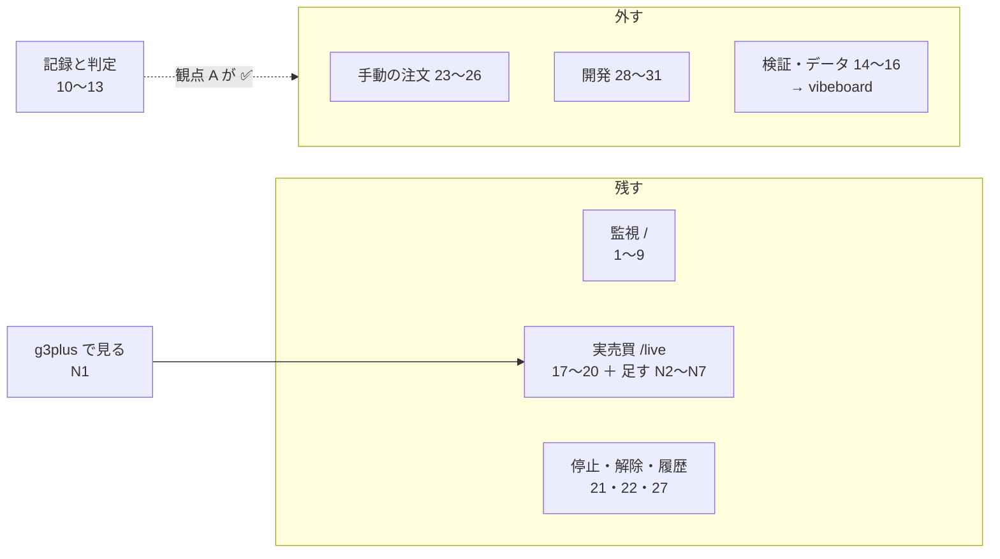

| 見立て | 行数 | 行 |
| --- | ---: | --- |
| 残す | 14 | 1〜9・17〜20・27 |
| 残す（固定） | 2 | 21・22 |
| 期限つき | 4 | 10〜13 |
| 外す | 11 | 14〜16・23〜26・28〜31 |
| 足す | 7 | N1〜N7 |

⚠ **Phase 4 で特に確かめたいこと**: (1) 24 手動の発注を外すと**本番の手動発注ができる画面が無くなる**が、それでよいか ／ (2) N1 のやり方（3-3 の (a)）／ (3) 比較の出し方（(b)）／ (4) グラフの描き方（(c)）。

### Phase 4: 利用者が決め、記録する

- 決定表を利用者に見せ、1 行ずつ決めてもらう（⚠ **Claude は決めない**。見立てと理由を示すだけ）
- 決まった表を本プランの「決定」節に写し、親タスク（設計しなおし）の入力にする
- ⚠ **この段では画面を変えない**（削除・移設・追加の実装は親タスクの別の子で行う）
- `dashboard.md` §1 の画面の表の下に、要不要を決めた日と本プランへのリンクを 1 行だけ足す

> この図の主張: ⚠ **決定は表に残し、実装は別のタスクに渡す。この段で画面は 1 行も変わらない。**

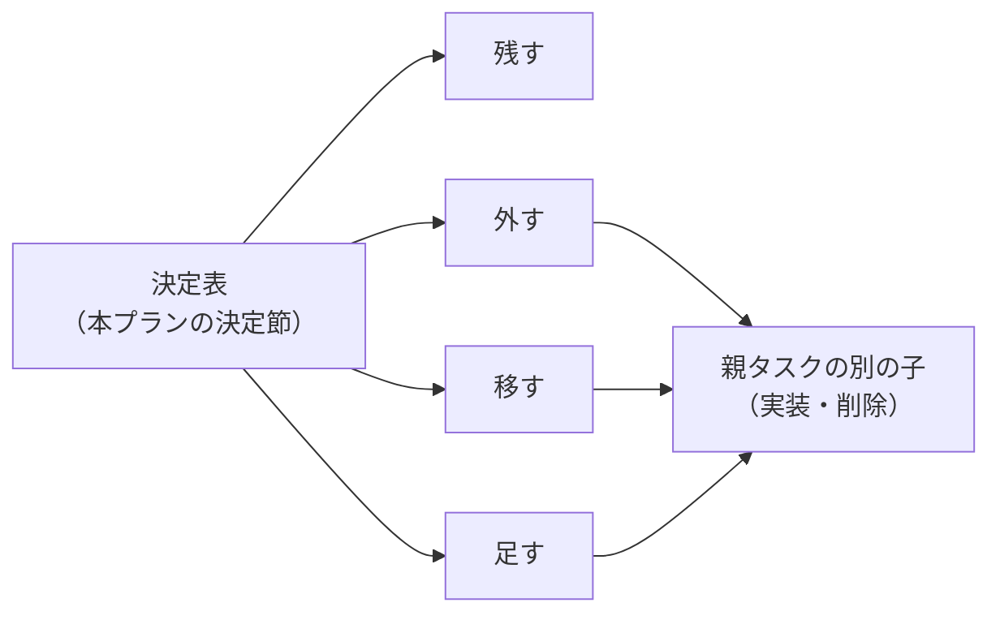

#### 4-1. 叩き台 — Phase 3 で残すとしたもの（2026-09-18。⚠ **利用者がここから削る・足す**）

Phase 3 の見立てが「残す」「残す（固定）」の 16 行を写した。# は 2-1 ／ 3-1 の行番号。

| # | 画面 | 機能 | Phase 3 の見立て |
| ---: | --- | --- | --- |
| 1 | 監視 `/` | 認証（残り秒数・scope・refresh の成否） | 残す |
| 2 | 監視 `/` | 口座・残高・買付余力・建玉 | 残す |
| 3 | 監視 `/` | 働いている注文の一覧 | 残す |
| 5 | 監視 `/` | 現在値と遅延（prod の気配・DXLink） | 残す（遅延の数値は外してもよい） |
| 6 | 監視 `/` | 口座ストリーマ・DXLink の接続・切断と再接続 | 残す |
| 7 | 監視 `/` | 認証の再試行（3 回続けて失敗して止めた後。ローカル面） | 残す |
| 8 | 監視 `/` | 監視の事象（refresh・切断・429 など直近 30 件） | 残す |
| 9 | 監視 `/` | 5 秒ごとの部分更新 | 残す |
| 17 | 実売買 `/live` | トレーダーの表（予算・銘柄・モデル・合成・θ・株数・建玉・損益・最終日） | 残す（作り直す） |
| 18 | 実売買 `/live` | 執行の差（差 1〜4） | 残す（トレーダー別に割る） |
| 19 | 実売買 `/live` | 最新の日（合図・注文・内部移転・残高） | 残す |
| 20 | 実売買 `/live` | 日次（直近 20 日） | 残す（トレーダー別に割る） |
| 21 | 操作 | 停止ボタン（`HALT` ＋ 働いている注文を全部取消） | 残す（固定） |
| 22 | 操作 `/ops` | 停止の解除 | 残す（固定） |
| 27 | 操作 `/ops` | 操作の画面と履歴（手動の注文のフォームは外す） | 残す（縮める） |

⚠ **ここに無いもの**: 期限つき 4 行（10〜13 記録と判定）・外す 11 行・足す 7 行（N1〜N7）は Phase 3 の表（3-1・3-2）にある。足すときはこの表に行を足す。

#### 4-2. 利用者の決定 — 叩き台から削ったもの・足したもの

| # | 決定 | 理由（利用者 2026-09-18） | 波及 |
| ---: | --- | --- | --- |
| 4 | ⚠ **削る**（働いている注文を 1 件取り消すボタン） | 実売買はトレーダーの性能を確かめる場面でもあるので、**個別の注文を取り消すことはない**。止めるとすれば**全トレーダーを止める**ときで、それは**トレーダーの入れ替えや編集をするとき** | ⚠ `POST /ops/cancel` を使う画面が無くなる（25 手動の取消も外す）→ **経路ごと外せる**。停止（21）は「全トレーダーを止めて入れ替え・編集する」ための機能として残る |
| 6 | **残す**（口座ストリーマ・DXLink の接続・切断と再接続） | 説明（4-3）を聞いたうえで残す | なし（叩き台のまま） |

#### 4-3. 説明のメモ（利用者に聞かれたもの）

**6 口座ストリーマ・DXLink の接続・切断と再接続**【コードから読んだ 2026-09-18。`dashboard/app/monitor.py`・`experiments/live-trading/run_day.py`】

管理画面は tastytrade と常時接続（websocket）を 2 本張っていて、その接続が生きているかを出しているのがこの行である。

| | 口座ストリーマ | DXLink |
| --- | --- | --- |
| 何が届くか | 口座の出来事（注文の状態の変化・約定・残高の変化）を tastytrade 側から随時 | 株価（買い気配・売り気配・約定値）を随時（配信元は dxFeed） |
| 画面に出るもの | 接続中か・最後に受け取った時刻・受け取った件数・注文の通知の件数・切断と再接続の回数・直近の通知 | 接続中か・最後の受信・件数・切断と再接続の回数・直近の気配と約定値 |
| 作った理由 | API 検証の観点 B（裏で動かし続けられるか） | 観点 C（株価がどれくらい遅れて届くか） |
| 実売買の執行器は使うか | ⚠ **使わない** | ⚠ **使わない** |

- ⚠ **この接続は管理画面が自分のために張っているもの**。執行器（`run_day.py`）は 1 日 1 回起動し、15:50 ET の気配を REST（`get_quote`）で取り、REST で発注する。常時接続は使わない。⚠ **ここで「切断」と出ても執行器には効かないし、「接続中」でも執行器が健全という意味にはならない**
- 口座ストリーマの「直近の通知」は口座単位なので、⚠ **執行の窓の中なら執行器の注文が受け付けられて約定するまでがその場で見える**（働いている注文の一覧 3 でも見える）
- 観点 B・C は 2026-09-08 に ✅ 済みで、作った目的は果たしている
- 5（現在値と遅延）は DXLink が届けた気配を出している行

⚠ **利用者の判断（2026-09-18）: 残す。**

### Phase 5: 画面構成とデザインを 3 パターン作り、利用者が選ぶ

利用者の指示（2026-09-18）: Phase 4 の決定で進め、**画面構成とデザインは Phase 5 で行う。3 パターン作り、そこから選ぶ**。

> この図の主張: ⚠ **3 パターンは同じ入力から作り、同じ記録で撮って並べる。選ぶのは利用者で、実装は親タスクの別の子に渡す。**

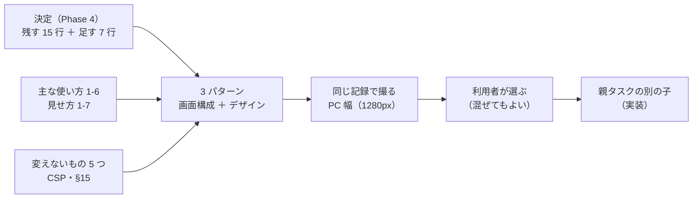

#### 5-0. 入力に足すもの — 足す 7 行（利用者の決定 2026-09-18: 3 パターンすべての中身に入れる）

| # | 入れ方 |
| --- | --- |
| N2 損益の推移 ・ N4 トレーダー別の執行の差 ・ N5 行動の推移 ・ N6 横並びの比較 | 3 パターンとも中身として描く（主な使い方そのもの） |
| N3 紙上の損益 | ⚠ **材料がまだ無いので作り物の数字は入れない**。「実売買の Phase 3（紙上の対照）の後で埋まる」と書いた枠で入れる |
| N7 起動しなかった日 | 日次の表に「起動しなかった日」の行として入れる（モックの記録に 1 日欠けた日を作る） |
| N1 公開面で見る経路 | 画面の部品ではない（記録の届け方）。3 パターンに共通で、モックには描かない |

| Step | やること | 成果物 |
| --- | --- | --- |
| 5-1 | ✅ 3 パターンの**軸**を決める（何を変えて比べるか）。Claude が案を出し、利用者が決める | 本プランの 5-1 節 |
| 5-2 | ✅ 各パターンのモックを作る。⚠ **本番のコード（`dashboard/app/`）には入れない**。モックは `docs/plans/assets/dashboard-patterns/` に置く | HTML のモック 3 つ ＋ 詳細 3 つ（5-2 節） |
| 5-3 | ✅ 同じ記録（執行器のモック 20 営業日。3 人・10-19 は起動しない）で撮る。⚠ **PC 幅（1280px）だけ**（⚠ **スマホは使わないので撮らない**。利用者 2026-09-18） | スクリーンショット 3 枚 ＋ 詳細 1 枚（5-3 節） |
| 5-4 | ✅ 利用者が選ぶ（混ぜるのも可）。決定を本プランに記録する → ⚠ **並べ方は「3 段」**。デザインは 3 通り作って選ぶことにした（5-4 節） | 本プランの 5-4 節 |
| 5-5 | ✅ 「3 段」のまま見た目のデザインを 3 通り作る（日次は概要から「全体の詳細」へ移す） | `design-*/`（5-5 節） |
| 5-6 | ✅ 利用者がデザインを選ぶ（混ぜるのも可）→ ⚠ **デザイン 3「数字とグラフが主役」**（2026-09-18） | 本プランの「決定」節 |

軸の案（⚠ **Claude の案。5-1 で利用者が決める**）:

| 案 | 画面構成 | 向いていること |
| --- | --- | --- |
| A 1 枚の概観 | 監視と実売買を 1 画面にまとめる（PC の横幅を使い、口座と接続の状態・比較のグラフ・トレーダーごとの行動を段と列に並べる） | 開いて 1 画面で全体が分かる |
| B 役割で分ける | 監視 ／ 実売買 ／ 操作（停止・解除・履歴）の 3 画面（いまの延長） | 画面ごとの役割がはっきりする |
| C トレーダー中心 | 概観（全トレーダーの比較）＋ トレーダーごとの詳細（行動と実績の推移）＋ 監視 | 1 人を深く見る・入れ替えや編集の前に見比べる |

守ること（3 パターン共通）:

- 「変えないもの」の 5 つ（面の規則・秘密・停止・本番の鍵・金銭の行動）
- ⚠ **CSP の内で作れること**（`script-src 'self'; style-src 'self'`。グラフはサーバで組む SVG を見立てにしている。3-3 の (c)）
- ⚠ **比較の出し方の規則**（並び順は固定・損益に勝ち負けの色と言葉を付けない。3-3 の (b)）
- §15 のデザイン規約（色は環境と状態の 2 系統。⚠ **系列の色は §15 に足す**。3-3 の (d)）
- ⚠ **写す数字はモックの値**（【実測】ではない）と画像にも書く

#### 5-1. 画面構成の決定（利用者 2026-09-18）— A と C の組み合わせ

⚠ **上に全体の概要、その下にトレーダーを並べる。各トレーダーの詳細はクリックで進む。**（B の「役割で分ける」は採らない）

> この図の主張: ⚠ **入口は 1 画面で、全体の概要とトレーダーの一覧が上下に並ぶ。詳細はトレーダーを押したときだけ開く。**

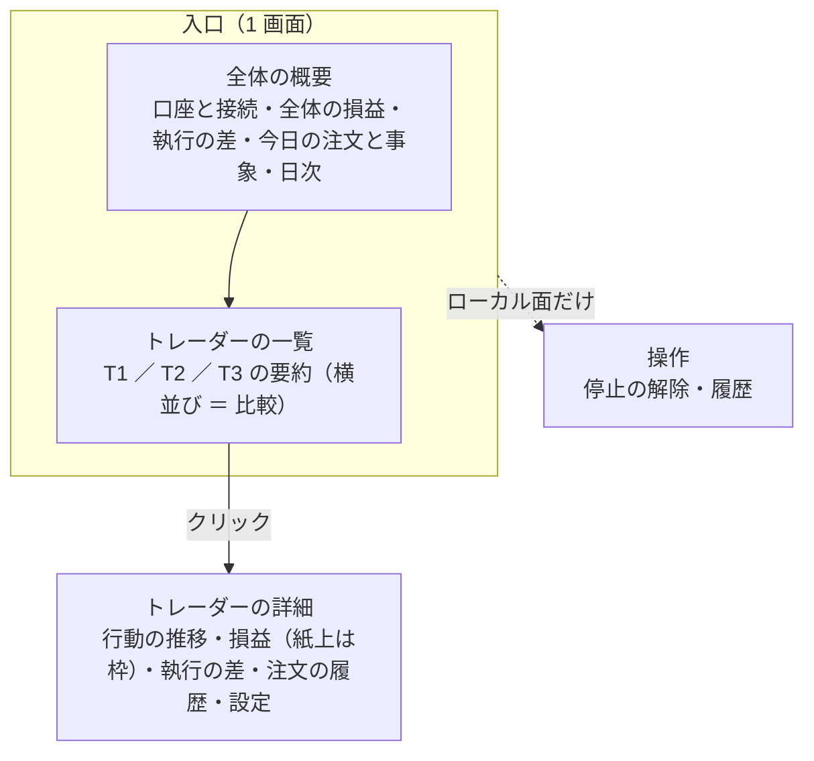

| 置き場 | 中身（Phase 4 の残す 15 行 ＋ 足す 7 行） |
| --- | --- |
| 全体の概要 | 監視（1〜3・5〜9: 認証・口座と建玉・働いている注文・現在値・接続・認証の再試行・事象・部分更新）・全トレーダーの損益の推移（N2・N6）・執行の差（18 ／ N4）・今日の注文と事象（19）・日次（20 ／ N7） |
| トレーダーの一覧 | 1 人 1 枠の要約（17 トレーダーの表 ＋ N2 ／ N4 の小さな値）。⚠ **並び順は設定の順で固定**（3-3 の (b)） |
| トレーダーの詳細 | 行動の推移（N5）・損益の推移（N2。紙上 N3 は枠だけ）・執行の差（N4）・注文の履歴・設定（予算・銘柄・モデル・合成・θ・株数） |
| 操作（ローカル面） | 停止の解除（22）・操作の履歴（27）。停止（21）はヘッダ |
| 期限つき | 記録と判定（10〜13）は観点 A まで今のページのまま |

⚠ **3 パターンで変えるのはトレーダーの一覧の見せ方だけ**（利用者 2026-09-18「作って」）。全体の概要と詳細ページは 3 つとも同じ。

| パターン | トレーダーの見せ方 |
| --- | --- |
| 1 表 | 1 人 1 行。数字の列に小さな折れ線 |
| 2 カード | 1 人 1 枚のカードを横に並べる（損益の小さなグラフ・執行の差・今日の行動） |
| 3 段 | 1 人 1 段の横長。損益の推移と行動の推移（銘柄 × 日のマス目）を同じ時間の軸で揃える |

#### 5-2. モック（2026-09-18）

置き場: `docs/plans/assets/dashboard-patterns/`（⚠ `dashboard/app/` は 1 行も変えていない。`app/live.py` は記録を読むのに使うだけ）

```bash
cd docs/plans/assets/dashboard-patterns
fixtures/run.sh /tmp/lt3                        # 3 人 × 20 営業日のモックの記録（10-19 は起動しない）
python3 build.py --live-dir /tmp/lt3            # pattern-1-table.html ほか 6 ページ
```

| 事柄 | 中身 |
| --- | --- |
| 見る場所 | ⚠ **vibeboard の Plans タブ**（`assets › dashboard-patterns`。フォルダの見出しは `README.md`）。`.html` は iframe（`/api/design/plans/…`）で開くので、⚠ **CSS は vibeboard の `/files/` から読む**（`file://` で直接開くと飾りが当たらない）。Sx360 の vibeboard（3020）で表示を確かめた【実測 2026-09-18】 |
| 材料 | 執行器のモック（`mockrun.sh` と同じ手順）を **3 人**で回した記録。`mock_a`・`mock_b` はリポジトリの試験用、`mock_c`（IWM ／ QQQ を数日ずつ持つ）は `fixtures/` にだけ置いた。⚠ **10-19 はわざと起動しない**（N7「起動しなかった日」の見え方） |
| 監視の値 | 管理画面のデモ（`AIL_DEMO=1`）の `/api/state` を写した `fixtures/monitor-demo.json`（秘密は `Redactor` を通った後の値。項目名で grep して 0 件） |
| 系列の色 | 水色 `#21a3bc` ／ 藍 `#6b6cd0` ／ くすんだ薔薇 `#b15d6b`（`patterns.css`）。⚠ **状態・環境・アクセントの色と取り違えない色相**を総当たりで探し、dataviz の `validate_palette.js --pairs all`（面 `#181c25`）で**全項目 PASS**【実測 2026-09-18: CVD 11.9 ／ 正常視 16.6 ／ 対比 3:1 以上】。⚠ 予約色（緑・琥珀・赤・紫・青）との差は正常視で 10 前後しか取れない ＝ **名前を必ず添える**（凡例 ＋ 端のラベル ＋ 行の見出し）。⚠ **この条件で見分けられるのは 3 色まで**（4 色目は琥珀と取り違える）→ 4 人目からは線の形（破線）を足す |
| CSP | 管理画面と同じ CSP ヘッダを付けて配信し、ブラウザで開いて ⚠ **CSP 違反 0 件・コンソールのエラー 0 件**（6 ページとも）【実測 2026-09-18】。インラインの `style` とスクリプトは 0 件。hover は SVG の `<title>` だけ（スクリプトを使わないので十字線は無い） |
| 共通の部品 | 全体の概要（状態のタイル 6 枚・損益の推移・執行の差・最新の日）・日次（起動しなかった日は赤い行）・詳細ページ（損益・差 1 の推移・行動のマス目・注文の履歴・紙上の損益の枠） |
| 比較の規則 | 並びは設定の順で固定 ／ 損益は予算に対する %（$ を併記）／ 勝ち負けの色を付けない ／ 「損益で手法を採らない」を図の下に 1 行 ／ ⚠ **トレーダーを並べる小さな図は縦軸を揃える**（最初はばらばらで、見比べを誤るので直した） |

⚠ **写っている数字はモックの値**。とくに ⚠ **差 1 が 10bp を超えて ❌ ばかりなのはモックの約定の散らし（`--fill-noise 0.003` ＝ ±30bp）のせい**で、実際の執行の差ではない。

#### 5-3. 画面（2026-09-18、幅 1280px）— 1 回目: 並べ方 3 パターン（`layouts/` に移した）

⚠ **vibeboard の Plans タブで開ける**（`assets › dashboard-patterns`。グラフの点やマスに触れると値が出る）: [パターン 1 表](../assets/dashboard-patterns/layouts/pattern-1-table.html) ・ [パターン 2 カード](../assets/dashboard-patterns/layouts/pattern-2-cards.html) ・ [パターン 3 段](../assets/dashboard-patterns/layouts/pattern-3-lanes.html) ・ [トレーダーの詳細](../assets/dashboard-patterns/layouts/trader-mock_a.html) ・ [モックの説明](../assets/dashboard-patterns/README.md)

**パターン 1 表**

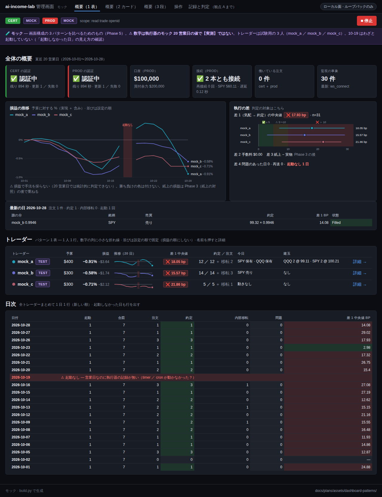

**パターン 2 カード**

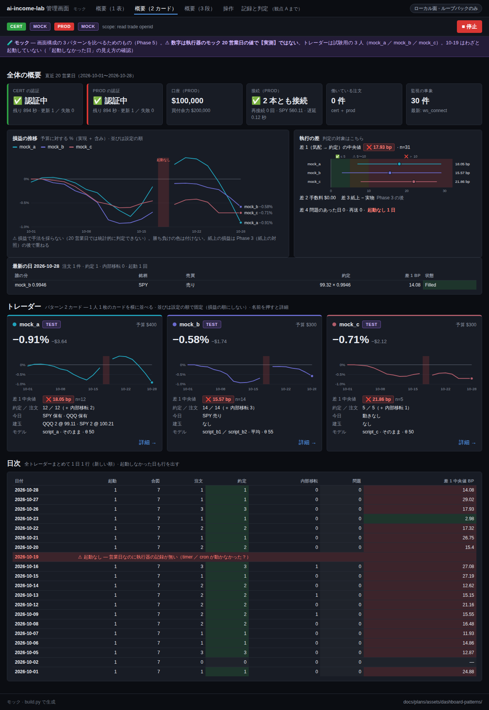

**パターン 3 段**

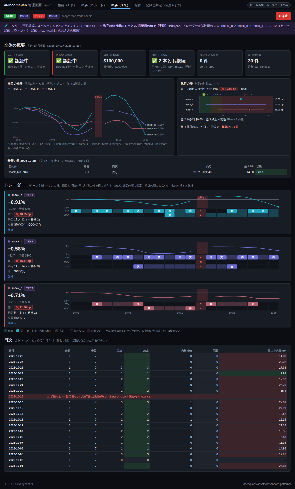

**トレーダーの詳細**（3 パターン共通。一覧の名前か「詳細 →」から進む）

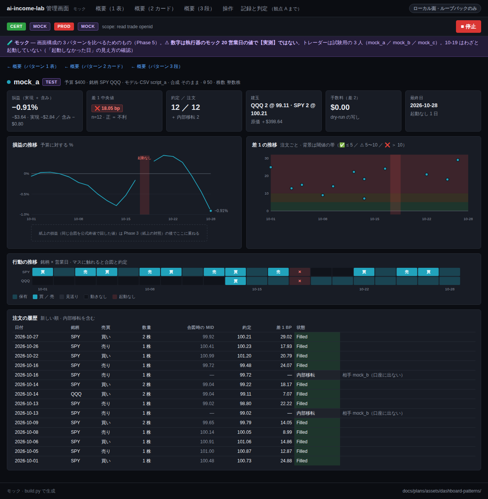

撮って分かったこと（Claude の見立て。⚠ 選ぶのは利用者）:

| パターン | 良い点 | 気になる点 |
| --- | --- | --- |
| 1 表 | いちばん短い（ページの高さ 1,663px）。数字を縦に見比べやすい。人数が増えても 1 行ずつ伸びるだけ | 推移は小さな折れ線だけで、形は分かるが値は読めない（hover で読む） |
| 2 カード | 損益の推移がはっきり見える。1 人ぶんの情報がまとまっている | 横に 3 枚で幅を使い切る（4 人目から 2 段になる）。数字の見比べは目が左右に動く |
| 3 段 | ⚠ **損益と行動（いつ何を売り買いしたか）を同じ時間の軸で見られるのはこれだけ**。段どうしの縦の揃いで「同じ日に誰が動いたか」が分かる | いちばん長い（2,116px）。銘柄が多いトレーダーは段が高くなる |


#### 5-4. 並べ方の決定（利用者 2026-09-18）

- ⚠ **トレーダーの一覧は「3 段」**（1 人 1 段。損益と行動を同じ時間の軸で揃える）
- ⚠ **日次は概要から外し、「全体の詳細」へ移す**（概要の「全体の詳細 →」から進む。トレーダーの詳細と同じく、押したときだけ開く）
- 1 回目は並べ方だけを変え、見た目は 3 つとも同じだった（利用者の指摘「3 種類のデザインを作った？」）→ ⚠ **2 回目で見た目のデザインを 3 通り作る**（5-5）
- ⚠ **ナビは左ペイン**（利用者「見づらいので左ペインにして」）。上のヘッダに詰めていたページ・操作・デザインの切り替えを左に縦に並べ、⚠ **トレーダーも左ペインに並べて押せば詳細へ**。停止ボタンは右の上（環境の帯）に残す

#### 5-5. 2 回目: 見た目のデザイン 3 通り（2026-09-18）

⚠ **vibeboard の Plans タブで開ける**（`assets › dashboard-patterns › design-*`）。左ペインの「デザイン（比べる用）」で、同じページのまま見た目を切り替えられる。[モックの説明](../assets/dashboard-patterns/README.md)

| デザイン | 方向 | 変えたところ |
| --- | --- | --- |
| [1 いまの延長](../assets/dashboard-patterns/design-1-dark/overview.html) | 黒ベース・情報を詰める | §15 のまま。1 回目の「3 段」から日次を外しただけ |
| [2 明るい地](../assets/dashboard-patterns/design-2-light/overview.html) | 白い地・余白を多めに・グラフを大きく | 色を明るい地に差し替え（`theme-light.css`）、余白と文字を大きく、段のグラフを 70 → 110 の高さに。⚠ **系列の色は明るい地で選び直した 3 色**（同じ人は同じ系統の色。dataviz の検算で全項目 PASS【実測】） |
| [3 数字とグラフが主役](../assets/dashboard-patterns/design-3-numbers/overview.html) | 大きな数字 1 つとグラフが主役 | 監視のタイル 6 枚を細い帯 1 本に畳む ／ 大きな数字は「全トレーダーの損益」1 つ（⚠ 色は付けない）＋ 差 1・約定・起動しなかった日 ／ 最新の日の表は「全体の詳細」へ（`design-numbers.css`） |

3 つとも共通: 構成（上に全体の概要、下にトレーダー 1 人 1 段、詳細はクリック）・⚠ **左ペインのナビ**・中身・比較の規則・CSP の内（違反 0 件【実測】）・日次は「全体の詳細」。

**デザイン 1 いまの延長**

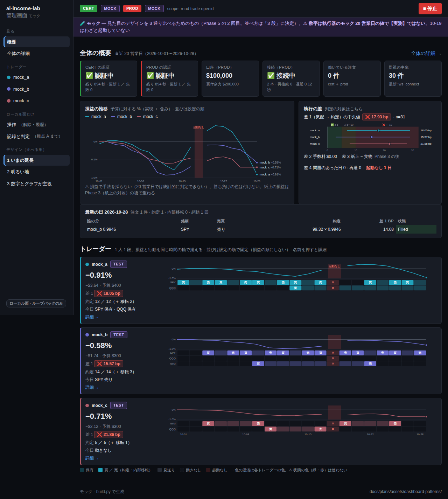

**デザイン 2 明るい地**

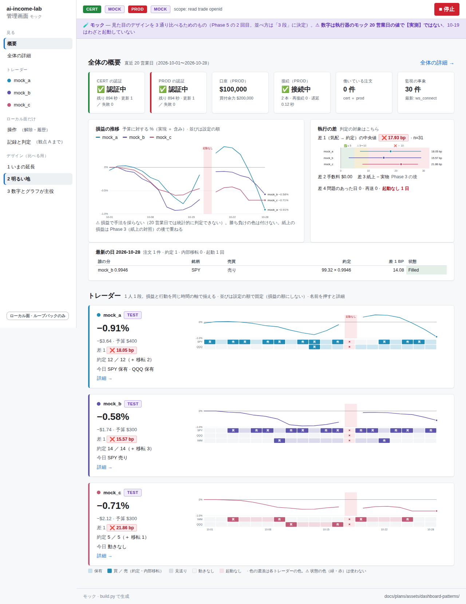

**デザイン 3 数字とグラフが主役**


比べ方の見立て（⚠ 選ぶのは利用者）:

| 見るところ | 1 いまの延長 | 2 明るい地 | 3 数字とグラフが主役 |
| --- | --- | --- | --- |
| 開いて最初に目に入るもの | 監視のタイル 6 枚 | 監視のタイル 6 枚（余白が多い） | ⚠ 全体の損益の大きな数字と、差 1・起動しなかった日 |
| 1 画面に入る量（ページの高さ） | 多い（1,425px） | 少ない（1,657px） | 中（1,488px） |
| 長く開いておく疲れにくさ | 暗い地 | 明るい地は日中の部屋で読みやすいが、夜はまぶしい【推測】 | 暗い地 |
| 監視の見やすさ | タイルで詳しい | タイルで詳しい | 帯 1 本に畳んだので、異常のときに目立ちにくい |
| 仕様（§15）への影響 | なし | ⚠ 色の値を明るい地の分も持つ（2 組） | 部品を足すだけ |

## 影響範囲

| ファイル | 変更 |
| --- | --- |
| `docs/plans/archive/dashboard-required-features.md`（本プラン。完了後に archive へ移した） | 場面の表・棚卸しの表・決定表・決定・Phase 5 の軸と選んだパターン |
| `docs/plans/assets/dashboard-patterns/`（新） | Phase 5 のモック（HTML）とスクリーンショット |
| `docs/specs/dashboard.md` | §1 に 1 行（決定へのリンク）だけ |
| `TODO.md` | 本タスクの子（Phase 1〜4）のチェック |
| `dashboard/` のコード・テンプレート・テスト | ⚠ **触らない** |
| vibeboard（`vibeboard.config.json`・`dashboard/vibetab.py`） | ⚠ **触らない**（「移す」の決定が出ても、実装は別タスク） |

## テスト方針

コードを変えないので、pytest は流さない（変わらない）。代わりに表を検算する。

- ⚠ **棚卸しの漏れがない**: 表の経路が `main.py` の `@app.get` ／ `@app.post`（31 本）と 1 対 1 で対応する。テンプレート（15 本）と JSON（`/api/*`）も同じく照合する
- ⚠ **「外す」「移す」の行は参照元が埋まっている**: 文書（`docs/`・`CLAUDE.md`・`README`）とテスト（`dashboard/tests/`）と §7 のデプロイ契約を grep した結果を付ける
- ⚠ **「変えないもの」の 5 つに触れる行が「外す」になっていない**
- 図はノード 12 個以内、1 図 1 主張（CLAUDE.md の図の原則）
- Phase 5: 3 パターンを**同じ記録・同じ幅**で撮る（PC 1280px。⚠ スマホは使わないので撮らない）。モックは CSP と同じ制約（外部スクリプトなし・インラインの `style` なし）で書き、ブラウザの開発者ツールで CSP 違反が 0 件であることを見る

## Phase / Step

1. ✅ Phase 1: 使う場面を書き出す（2026-09-18。残る場面 5 つ・期限つき 1 つ・外す候補 3 つ。⚠ 主な使い方は各トレーダーの行動と実績と比較。⚠ 見せ方は分かりやすさ重視・グラフも使う。1-4〜1-7）
2. ✅ Phase 2: いまある機能を棚卸しする（2026-09-18。機能 31 行 ＋ 共通の部品 10。経路 31 本・テンプレート 15 本・JSON 7 本と照合。2-1〜2-4）
3. ✅ Phase 3: 突き合わせて、決定表の下書きを作った（2026-09-18。31 行 ＋ 足す 7 行・出し方の候補 4 つ。3-1〜3-4）
4. ✅ Phase 4: 利用者が決め、本プランと `dashboard.md` §1 に記録した（2026-09-18。残す 15 行。4-1〜4-3・決定）
5. ✅ Phase 5: 画面構成とデザインを 3 パターン作り、利用者が選ぶ（✅ 5-1 軸 → ✅ 5-2 モック → ✅ 5-3 撮影 → ✅ 5-4 並べ方は「3 段」→ ✅ 5-5 デザイン 3 通り → ✅ 5-6 デザイン 3「数字とグラフが主役」）

## 決定

### Phase 4（2026-09-18。利用者が確定）

⚠ **管理画面に残す機能は 4-1 の 15 行**（1・2・3・5・6・7・8・9・17・18・19・20・21・22・27）。

| 区分 | 行 | 中身 |
| --- | --- | --- |
| 残す | 1・2・3・5・6・7・8・9 | 監視（認証・口座と建玉・働いている注文・現在値と遅延・接続・認証の再試行・事象・部分更新） |
| 残す（作り直す ／ トレーダー別に割る） | 17・18・19・20 | 実売買（トレーダーの表・執行の差・最新の日・日次） |
| 残す（固定） | 21・22 | 停止・停止の解除 |
| 残す（縮める） | 27 | 操作の画面と履歴（手動の注文のフォームは外す） |
| 削った | 4 | 働いている注文を 1 件取り消すボタン（理由は 4-2）。⚠ これで `POST /ops/cancel` は経路ごと外せる |

4-1 に入れなかったもの（Phase 3 の見立てのまま）:

- 期限つき 10〜13（記録と判定）: ⚠ **観点 A を見届けて `live-trading.md` §1 に写すまでは使う**（1-4 の利用者の答え）
- 外す 14〜16（検証・データ。vibeboard にある）・23〜26（手動の注文）・28〜31（開発）
- 足す N1〜N7（3-2）: 4-1 には足していない。⚠ **2026-09-18 に利用者が「3 パターンすべての中身に入れる」と決めた**（Phase 5 の入力。5-0）

⚠ **この段では画面を変えていない**（実装は親タスクの別の子）。

### Phase 5

- ✅ **画面構成**: 上に全体の概要、その下にトレーダー、各トレーダーの詳細はクリック（2026-09-18。5-1）
- ✅ **トレーダーの一覧の並べ方**: 3 段（2026-09-18。5-4）
- ✅ **日次**: 概要から外し、「全体の詳細」へ（2026-09-18。5-4）
- ✅ **ナビ**: 左ペイン（ページ・トレーダー・操作。停止ボタンは右の上）（2026-09-18。5-4）
- ✅ **見た目のデザイン**: ⚠ **デザイン 3「数字とグラフが主役」**（2026-09-18。5-6）— 黒ベース（§15 の色）のまま、監視は細い帯 1 本、大きな数字は「全トレーダーの損益」1 つ（色は付けない）＋ 差 1・約定・起動しなかった日、最新の日の表は「全体の詳細」へ
  - 見本: [design-3-numbers/overview.html](../assets/dashboard-patterns/design-3-numbers/overview.html)（CSS は `patterns.css` ＋ `design-numbers.css`）
  - ⚠ **比較の出し方・グラフの描き方・系列の色も、この見本に入っている形で決めた**: 並び順は設定の順で固定 ／ 損益は予算に対する %（$ 併記）／ 勝ち負けの色と言葉を出さない ／ 小さな図は縦軸を揃える ／ グラフはサーバで組む SVG（CSP の内）／ 系列の色は水色 `#21a3bc`・藍 `#6b6cd0`・くすんだ薔薇 `#b15d6b`（黒い地。予約色と取り違えない条件では 3 色まで）
  - 実装は親タスク「管理画面（`dashboard/`）全体を設計しなおす」の別の子（⚠ この段では画面を変えていない）。§15 には、系列の色・監視の帯・大きな数字の部品を足すことになる
