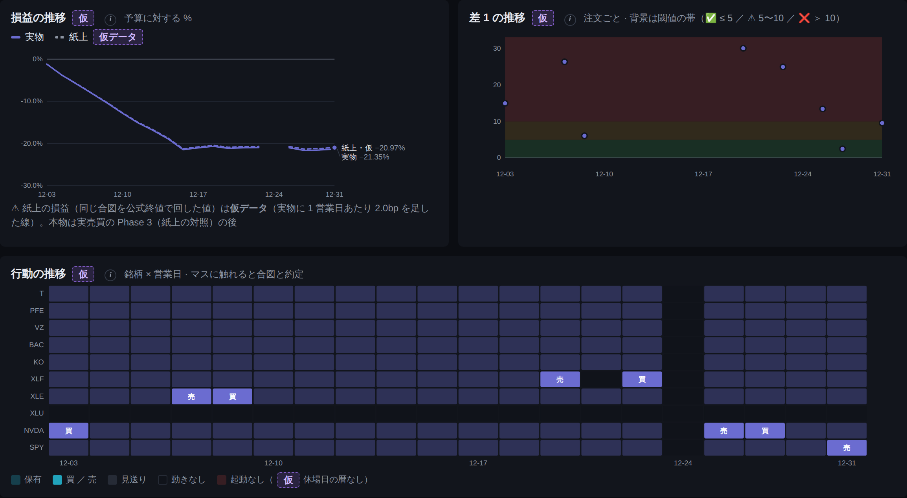
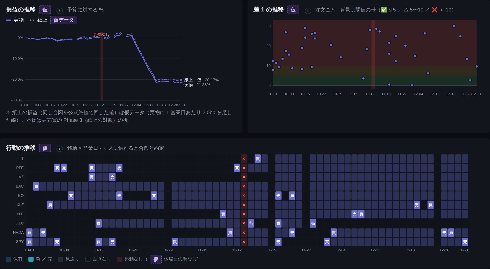
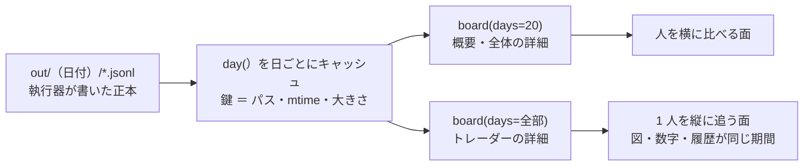
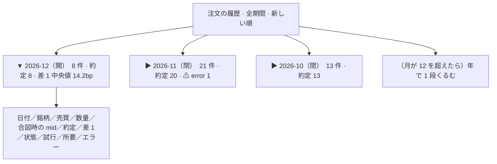
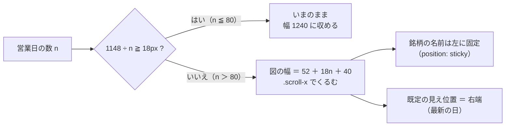
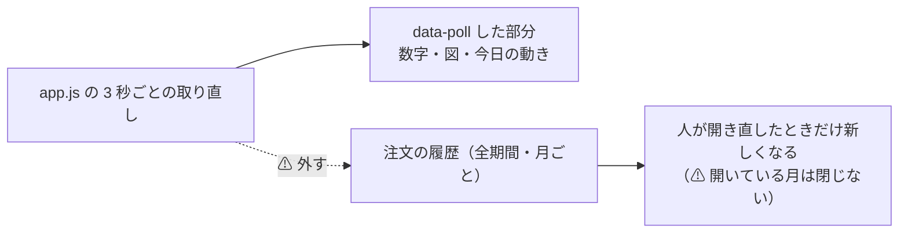

# トレーダーの詳細を全期間にする — 長い履歴と長い図の見せ方

作成日: 2026-09-20。利用者の指示（2026-09-20）: **「管理画面のトレーダーの詳細に履歴は全て出すようにしてください。長すぎると見づらいので手法を考えます」**。
親: [実売買のプラン](../live-trading-three-models.md) の Phase 4（管理画面 `/live`）。関連: [dashboard.md §13・§15](../../specs/dashboard.md)（画面の仕様とデザイン規約）・[live-trading.md §0-7](../../specs/experiments/live-trading.md)（記録の置き場）。

✅ **2026-09-20 に Phase 0〜4・6 を実装して閉じた**（利用者の指示「進めて」）。⚠ **Phase 5（絞り込み）は見送り**（任意。要るようになったら新しいタスクにする）。
決まったこと 3 つ: **履歴は月ごとに折りたたむ** ／ **全体の詳細は変えない** ／ **トレーダーの詳細は図と数字も全期間にし、1 日 18px を割ったらマス目は横スクロール**（§1）。
仕様の正本は [dashboard.md §13-7・§15-12](../../specs/dashboard.md)。pytest **174 件**（新規 8 件）。

**プランとの違い（実装して分かったこと）**:

| # | 違い | なぜ |
| ---: | --- | --- |
| 1 | `action_grid` に **`no_shrink`（大きさを属性で持つ）** を足した | ⚠ **横スクロールにしただけでは図が枠に合わせて縮み、左に固定した銘柄名と行の高さがずれた**（1 マス 19.25px ＞ 18px で「広い」と判定されず、CSS の `width:100%` で 1240 → 1074 に縮んだ）。ブラウザで実寸を測って気づいた |
| 2 | 右の余白 `GRID_PAD_R = 24` を足した | 横に伸ばしたとき、最後の日付（12-31）が切れるため |
| 3 | 読み手を分けるのをやめ、**`board(days=None)` 1 本 ＋ `day()` の日ごとキャッシュ**にした | 図も全期間にする決定（§1 の 3）で `orders.jsonl` だけでは足りなくなったため（プラン §2 の想定どおり） |
| 4 | `tests/test_demo.py` の `AIL_MODE_DIR` を tmp に向けた | ⚠ **この機械が sim モードだと、デモのテストがデモではなく `sim/<名前>/` を読んで落ちていた**（⚠ 私の変更の前から落ちていた。テストの隔離漏れ） |
| 5 | x 軸のラベルの間引きは `every=5` を下限にした | 20 営業日のときの見た目を変えないため（回帰） |

⚠ **実測（`sim2`・64 営業日・`sim_b`）**: 注文の履歴は 42 件が 3 か月（12 月 9 件 ／ 11 月 13 件 ／ 10 月 20 件）にたたまれ、月の小計に筋書きの故障がそのまま出た（11 月 error 1・取消 1 ／ 10 月 error 1）。マス目は 1,176px（1 日 18px）で右端から表示。3 秒ごとの部分更新をまたいでも**開いた月は閉じず、スクロール位置も保つ**【実測・ブラウザ】。CSP 違反 0 件。


## 0. 目的・背景 — いま「注文 0」に見えてしまう

管理画面は**直近 20 営業日ぶんの記録しか読んでいない**（`dashboard/app/live.py` の `DAYS = 20`）。
注文の履歴の表も、約定の数（「約定 ／ 注文」）も、損益の線も、この 20 日の窓の中だけである。

**シミュレーション `sim2`（64 営業日）を回したときに実際に起きたこと**【実測 2026-09-20・Sx360】:

| トレーダー | 窓の中（直近 20 営業日）の注文 | 全 64 日の注文 | 最後に注文した日 | 画面の見え方 |
| --- | ---: | ---: | --- | --- |
| `sim_a` | **0** | 8 | 2026-11-18 | ⚠ **「注文 0」** ＝ 何もしていないように見える |
| `sim_b` | 8 | 42 | 2026-12-31 | 42 件のうち 8 件しか辿れない |
| `sim_c` | 5 | 7 | 2026-12-18 | 同上 |

⚠ **損益の線は 20 日ぶん出ているのに、その損益を作った注文が表に無い** ＝ 画面だけを見て「なぜこの持ち株があるのか」「なぜ下がったのか」を辿れない。
実際、利用者が `sim2` を見て「注文が 0 なのに損益が下がり続けるのはなぜか」と尋ねた。**答えは記録の中にあったが、画面には無かった。**

⚠ **ただし全部出すと長い。** 1 日に何度も売買する形（TODO の C9・D13）に進むと、1 年で 1 人あたり 1,000〜2,000 行になる【推測】。
長いものをそのまま出すと、(1) 読めない (2) シミュレーション中の 3 秒ごとの部分更新で毎回数百 KB を送る、の 2 つが問題になる。**見せ方と読み込み方を決めるのがこのプランである。**

## 1. ✅ 決めごと（2026-09-20・利用者決定）

| # | 決めること | ✅ 決定 | 採らなかった案 |
| ---: | --- | --- | --- |
| 1 | **長い履歴の見せ方** | **月ごとに折りたたむ**（`<details>`。最新の月だけ開いた状態・各月の見出しに小計）。全部が 1 ページにあるので Ctrl+F で全期間を探せる・リンクを踏まずに辿れる・JS 無しでも開閉する（CSP の内） | **ページ送り**（100 件ずつ）＝ Ctrl+F が効かない ／ **期間の切り替え**（20 日 ／ 3 か月 ／ 全期間）＝ 既定が「全部」にならない |
| 2 | **「全体の詳細」の履歴も全期間にするか** | ⚠ **しない**（利用者: 「**全体の詳細に各トレーダーの履歴を出しても評価しようがないので必要ありません**」）。全体の詳細の「注文の履歴」は**直近 20 営業日のまま**。⚠ **両方の見出しに期間を書いて食い違いを消す** | 両方を全期間にする（⚠ 3 人ぶんが 1 つの表に混ざり、人ごとの評価には使えない） |
| 3 | **トレーダーの詳細の図と数字も全期間にするか** | **する**（§1-1 の画像で判断）。⚠ **ただしマス目は 80 営業日を超えたら横スクロールにして 1 日 18px を保つ**（色だけにすると買ったか売ったかが読めないため） | しない（履歴の表だけ）＝ §1-1 の 1 枚目のまま ／ 文字を落として色だけにする |

**⚠ Claude の判断（利用者が覆せる）— 面ごとの期間の決まり**:

| 面 | 期間 | なぜ |
| --- | --- | --- |
| 概要（`/`）・全体の詳細（`/overall`） | **直近 20 営業日のまま** | ⚠ **人を横に比べる面**。3 人が同じ窓を見ていないと比べられない。⚠ 見出しに「直近 20 営業日」と書く |
| **トレーダーの詳細（`/traders/<名前>`）** | **全期間** | ⚠ **1 人を縦に追う面**。⚠ 見出しに「全期間（N 営業日）」と書く |

⚠ **概要の「約定 ／ 注文」も 20 日のまま**なので、`sim_a` は概要では「0 ／ 0」に見える。⚠ **それが誤解にならないよう、数字の下に期間を書く**（「直近 20 営業日」）。ここを全期間にしたい場合は言ってほしい（実装は同じ仕組みで足せる）。

## 1-1. 図と数字を全期間にしたらどう見えるか（⚠ 実物の記録で描いた）

⚠ **作り物ではない**: 実際の記録（`sim/sim2/` の 64 営業日）を、`DAYS` だけ差し替えた**読むだけ**の管理画面に描かせて撮ったもの【実測 2026-09-20・Sx360。`sim_b`・幅 1400px】。

**いま ＝ 直近 20 営業日（12-03〜12-31）**



**全期間 ＝ 64 営業日（10-01〜12-31）**



| 図 | いま（20 日） | 全期間（64 日） | どちらが良いか |
| --- | --- | --- | --- |
| 損益の推移 | ⚠ **最初から −20% へ落ちる線しか見えない** ＝「ずっと負け続けている」と読めてしまう | 12-03 まで 0% 付近で横ばい → そこから −21.35% へ落ちた、と**原因の位置が見える**（＝ 筋書きの `drawdown`） | ⚠ **20 日は誤解させる。全期間** |
| 差 1 の推移 | 点が 8 個 ＝ 中央値 14.23bp の根拠が薄い | 点が 42 個。閾値の帯（✅ ⚠ ❌）に対する散らばりが見える | 全期間 |
| 行動のマス目 | 1 マス 57px。買・売が 6 つだけ | 1 マス **17.9px**。買・売の文字はまだ入る。⚠ **11-13 の「起動なし」（赤い ✕ の列）も見える** | 全期間（64 日までは） |
| 「約定 ／ 注文」 | 8 ／ 8（⚠ `sim_a` は 0 ／ 0） | 42 ／ 42 | 全期間 |

⚠ **ただし日数が増えると潰れる。** マス目の 1 日の幅 ＝ `(1240 − 52 − 40) ÷ 日数`（`app/charts.py` の `action_grid`）:

| 期間 | 1 日の幅 | 買・売の文字（12px） |
| --- | ---: | --- |
| 20 営業日（いま） | 57.4px | ✅ |
| 64 営業日（`sim2` の全期間） | 17.9px | ✅ ぎりぎり入る |
| **80 営業日（約 4 か月）** | **14.4px** | ⚠ **ここが限界 ＝ 横スクロールに切り替える線** |
| 125 営業日（半年） | 9.2px | ❌ 色だけになる |
| 250 営業日（1 年） | 4.6px | ❌ 色も潰れる |

⚠ **画像で見つかった別の穴**: 全期間にすると **x 軸のラベルが重なる**（64 日で「12-2812-31」と重なって出ている）。⚠ **目盛りの間引き**（重ならない本数だけ出す）が要る ＝ Phase 2 に入れる。

## 2. 全体の形 — 読み手は 1 本のまま「全期間 ＋ 日ごとのキャッシュ」

> この図の主張: 読み手は今までどおり 1 本（`board()`）で、面ごとに読む日数だけが違う。過ぎた日の記録は二度と変わらないので、日ごとに覚えておけば全期間でも重くならない。



| 決めごと | 中身 |
| --- | --- |
| 読む日数 | `board(live_dir, days=None)` で全期間（`None` ＝ 制限なし）。⚠ **`DAYS = 20` の既定は動かさない**（概要・全体の詳細・`/api/live` は今までどおり） |
| キャッシュ | `day(live_dir, date)` の戻りを `(日付, 8 ファイルの mtime と大きさ)` を鍵に覚える。⚠ **過ぎた日のファイルは変わらない**ので 2 回目以降は開かない。今日のぶんだけ毎回読む |
| ⚠ 上限 | 覚えるのは**直近 400 営業日まで**（それより古いものは捨てて読み直す）＝ 何年ぶんも抱え込まない |
| ⚠ 画面は数え直さない | 既存の決まり（[dashboard.md §13](../../specs/dashboard.md)）どおり、差 1 bp・状態の色分け・約定数量は `day()` の中で 1 度だけ計算する。⚠ **履歴用に別の計算を書かない** |
| ⚠ 秘密 | 応答は今までどおり `Redactor` を通る。⚠ **`orders.jsonl` には `dry_run` の塊（口座番号を含む）が入っている**ので、画面に出すのは既存の列だけ（生の行を流さない） |
| `/api/live` | ⚠ **今までどおり 20 日**。API を重くしない。全期間が要るなら `orders.jsonl` を直接読む |
| 公開面（g3plus） | 今までどおり。⚠ 公開面は監視と停止だけで、トレーダーの詳細も同じページを見る ＝ ⚠ **公開面でも全期間になる**ことを仕様に書く |

**性能の見積り**【実測 2026-09-20・Sx360】: `sim2` の 64 日 ＝ 8 種類 × 38 日を読んで **53.7 ms**（`orders.jsonl` だけなら 6.2 ms）。
1 年（250 営業日）で **210 ms 程度**【推測】、キャッシュが効けば 2 回目以降はほぼ 0。⚠ **重いのは読み込みではなく、§4 の「3 秒ごとに送る HTML の大きさ」である。**

## 3. 画面の形

### 3-1. 注文の履歴 — 月ごとに折りたたむ

> この図の主張: 表の中身は変えず、月の見出しでくるむだけ。開いているのは最新の月だけで、古い月は見出しの小計だけが見える。



見た目（`sim_b` のトレーダーの詳細。⚠ 文字だけの見本）:

```
注文の履歴                                    sim_b の分 · 全期間（64 営業日・42 件）· 新しい順
┌────────────────────────────────────────────────────────────────┐
│ ▼ 2026-12   8 件 · 約定 8 · 買い $150 / 売り $262 · 差 1 中央値 14.2bp · ⚠ 警告 10 │
│    12-31  SPY  売り  0.0396  合図 566.28  約定 565.73  9.7bp  Filled  1 回  120ms │
│    12-29  XLF  買い  $30.00  合図  43.05  約定  43.11 13.9bp  Filled  1 回  118ms │
│    …                                                                              │
│ ▶ 2026-11  21 件 · 約定 20 · ⚠ error 1（429）                                      │
│ ▶ 2026-10  13 件 · 約定 13                                                         │
└────────────────────────────────────────────────────────────────┘
```

| 決めごと | 中身 |
| --- | --- |
| 折りたたみ | `<details class="hist">`（⚠ **i マークのヘルプ `details.help` とは別のクラス**。`app.js` の「開いているヘルプを閉じない」規則に巻き込まれないようにする） |
| 既定で開く月 | **最新の月だけ**。⚠ 1 件も無い月は見出しごと出さない |
| 月の小計 | 件数 ／ 約定 ／ 買いと売りの代金 ／ 差 1 の中央値 ／ ⚠ **エラーと取消の件数**（あるときだけ赤く）。⚠ **損益は出さない**（台帳が正本。注文から数え直さない） |
| 並び | 新しい順（今までどおり）。⚠ 月の中も新しい順 |
| 印 | シミュレーションモードでは見出しに「仮」（`simmark`）を付ける（今までどおり） |
| ⚠ i マーク | 見出しの横に既存の語（差 1・再送・問題（注文））を置く。⚠ **`<p>`・`.scroll-x`・左ペイン・停止ボタンの横には置かない**（[dashboard.md §15-10](../../specs/dashboard.md)） |

### 3-2. 行動のマス目 — 80 営業日を超えたら横スクロール

> この図の主張: 1 日の幅を 18px より細くしない。入りきらなくなったら図を縮めるのではなく、横に長い図にして外側をスクロールさせる。



| 決めごと | 中身 |
| --- | --- |
| 切り替えの線 | **1 日 18px**（`action_grid` に `min_cell_w = 18`）。⚠ 64 日は 17.9px ＝ **ほぼ線の上**なので、いまの `sim2` でも横スクロールに入る。⚠ **それでよい**（文字が確実に入る） |
| 横スクロール | 既存の `.scroll-x` をそのまま使う（[dashboard.md §15](../../specs/dashboard.md)）。⚠ **i マークを `.scroll-x` の横に置かない**（既存の決まり） |
| 銘柄の名前 | 左端に固定（`position: sticky`）。⚠ 横に流れると何の行か分からなくなるため |
| 既定の位置 | **右端（最新の日）**。⚠ 開いた瞬間に「今日」が見えること |
| 差 1・損益の線 | 幅は変えない（点と線は詰まっても読める）。⚠ **x 軸のラベルだけ間引く**（重ならない本数を計算して出す） |

## 4. 3 秒ごとの部分更新から履歴を外す（⚠ これを忘れると遅くなる）

> この図の主張: シミュレーション中に 3 秒ごとに取り直すのは「数字と図」だけにして、長い履歴は取り直さない。



いまは `<main data-poll-self="3000">` ＝ **ページ全部**を 3 秒ごとに取り直している（[dashboard.md §13-6](../../specs/dashboard.md)）。
全期間にすると、1 年ぶんで **1 回 500KB 前後**【推測】を 3 秒ごとに送ることになる。

**直し方**: `main` の中を 2 つに分け、取り直すのは上半分だけにする。既存の仕組み（`data-poll="<url>"` ＝ 部分更新。`/?partial=strip`・`?partial=monitor` と同じ）をそのまま使う。

| いま | あと |
| --- | --- |
| `<main data-poll-self="3000">`（全部） | `<div data-poll="/traders/<名前>?partial=live" data-interval="3000">`（数字・図・今日の動きだけ）＋ その外に履歴 |

⚠ **`?partial=live` は GET のみ**（POST の経路は 1 本も増やさない ＝ [dashboard.md §13-6](../../specs/dashboard.md) の決まり）。
⚠ **マス目の SVG も長くなる**（1 年で 2,750 マス ＝ 300KB 前後【推測】）。⚠ **これは実装してから実測して判断する**（遅ければ、シミュレーション中だけマス目を直近 3 か月に切るなどの手当てを別途決める）。

## 5. Phase

| Phase | 中身 | 目安 |
| --- | --- | --- |
| **0** | ✅ **2026-09-20 完了** — 決めごと（§1）と画像（§1-1） | — |
| **1** | `app/live.py`: `days=None` で全期間 ／ `day()` の日ごとキャッシュ（400 日上限）／ トレーダーの詳細だけ全期間で呼ぶ。⚠ 概要・全体の詳細・`/api/live` は 20 日のまま | 0.5 日【推測】 |
| **2** | `app/charts.py`: マス目に `min_cell_w = 18` と `.scroll-x`（銘柄名は sticky・既定は右端）／ x 軸ラベルの間引き | 0.5 日【推測】 |
| **3** | `orders_history.html` を月ごとの `<details>` ＋ 小計に。全部の見出しに期間を書く（「全期間（N 営業日）」／「直近 20 営業日」） | 0.5 日【推測】 |
| **4** | 部分更新の切り分け（`?partial=live`・`app.js`・テンプレート）。⚠ §4 | 0.5 日【推測】 |
| **5** | （任意）絞り込み — 銘柄・売買・状態・「エラーのみ」。⚠ **クライアント側だけ**（`app.js`・CSP の内・POST を増やさない） | 0.5 日【推測】 |
| **6** | テスト（§7）と仕様の更新（[dashboard.md §13](../../specs/dashboard.md) に「面ごとの期間」の節・§15 にマス目の横スクロールと `details.hist`）。`sim2` で撮り直した画像を貼る | 0.5 日【推測】 |

⚠ **Phase 1 だけでも「全部見える」は達成する**（表と図が長いだけ）。2 以降は読みやすさと重さの対処である。

## 6. 影響範囲

| ファイル | 変更 |
| --- | --- |
| `dashboard/app/live.py` | `days=None`（全期間）・`day()` のキャッシュ。⚠ `DAYS = 20` の既定は**動かさない** |
| `dashboard/app/charts.py` | マス目の `min_cell_w`・x 軸ラベルの間引き |
| `dashboard/app/main.py` | トレーダーの詳細だけ `board(..., days=None)`・`?partial=live`（GET）。⚠ ルートは増やさない |
| `dashboard/app/templates/trader.html` | 期間の明記・部分更新の囲い・マス目を `.scroll-x` で包む |
| `dashboard/app/templates/orders_history.html` | 月ごとの折りたたみ ＋ 小計（⚠ 全体の詳細も同じ部品を使うので、**期間は呼ぶ側から渡す**） |
| `dashboard/app/templates/overall.html`・`overview.html` | 見出しに「直近 20 営業日」と書くだけ |
| `dashboard/app/static/app.css`・`app.js` | `details.hist`・sticky な銘柄名 ／ （Phase 5）絞り込み |
| `dashboard/vibetab.py` | ⚠ **触らない**（検証・データ・ハードのタブは `app/experiments.py` と `hwstat.py` だけを import する） |
| `docs/specs/dashboard.md` | §13 に面ごとの期間・§15 に横スクロールと `details.hist` |

⚠ **執行器（`experiments/live-trading/`）は 1 行も変えない**（記録の形は今のまま）。

## 7. テスト方針（`dashboard/tests/test_live.py` に足す）

| 確かめること | どう見るか |
| --- | --- |
| **20 日より古い注文が表に出る** | 25 営業日ぶんの記録を作り、1 日目の注文がトレーダーの詳細に出ること（⚠ いまは落ちるテスト ＝ 直す前に書く） |
| **概要・全体の詳細は 20 日のまま** | 同じ記録で `n_orders` が窓の中だけ（回帰）。⚠ `/api/live` も 20 日 |
| 月ごとの折りたたみ | 月の見出しの数 ＝ 注文のある月の数・最新の月だけ `open` |
| 月の小計 | 件数・約定・差 1 中央値が、その月の行から計算した値と一致 |
| マス目の横スクロール | 81 営業日ぶんで SVG の幅 ＝ `52 + 18×81 + 40`・`.scroll-x` に包まれている ／ 80 日以下では今までどおり 1240 |
| x 軸のラベル | 64 日ぶんでラベルが重ならない（出る本数が上限以下） |
| トレーダーで絞れている | `sim_b` のページに `sim_a` だけの注文が出ない |
| 部分更新 | `?partial=live` が履歴を含まない・200 で返る・⚠ **POST の経路が増えていない**（`test_mode_banner.py` の既存の検査を流用） |
| 秘密 | 履歴の HTML に口座番号・トークンが出ない（`Redactor` の回帰） |
| 記録が無くても落ちない | `out/` が空・`orders.jsonl` が壊れている日があっても 200 |
| キャッシュ | 同じ日を 2 回読んでもファイルを開き直さない・mtime を変えたら読み直す・400 日を超えたら古いものを捨てる |

⚠ **ブラウザでの確認**（`tests/browser`）: 月を開閉できる・3 秒ごとの更新で開いた月が閉じない・マス目が右端から始まる・CSP 違反 0 件。

## 8. やらないこと

- ⚠ **記録の形を変えない**（執行器は無関係）
- ⚠ **画面に操作を足さない**（POST は `/ops/halt`・`/ops/resume`・`/ops/retry-auth` のまま）
- ⚠ **`/api/live` に全期間を足さない**
- ⚠ **概要・全体の詳細を全期間にしない**（§1 の「面ごとの期間」。⚠ 利用者が望めば同じ仕組みで足せる）
- ⚠ **検索用のデータベースを作らない**（`jsonl` を読むだけ。[dashboard.md §10](../../specs/dashboard.md) の「画面は読むだけ」）
