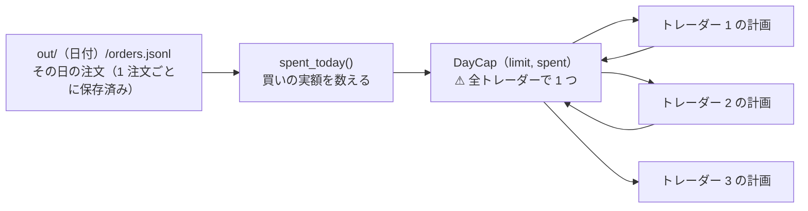

# 1 日の買いの上限を「1 日の合計」で数える

作成日: 2026-09-20。利用者の指示（2026-09-20）: **「その方法で直して」**（＝ 起動時にその日の `orders.jsonl` を読んで合計する）。
関連: [live-trading.md §0-2（上限）・§0-9（1 日 1 回のまま）](../../specs/experiments/live-trading.md)。TODO の **D14**。

✅ **2026-09-20 に実装して閉じた**。`plan.DayCap` ＋ `plan.spent_today()` ＋ `run_day` が起動時にその日の `orders.jsonl` を読む。
`build_plan` も 1 つの上限を共有する。既存の呼び方（数値を渡す）はそのまま使える。記録は `end` の `day_spent_usd` ／ `day_cap_usd`。
テスト **6 件**（`tests/test_day_cap.py`: 数え方 ／ トレーダーをまたぐ ／ 起動をまたぐ ／ 数値の互換 ／ ⚠ **通しで 2 人 × 2 回**）。
⚠ **黄金の集計値（`sim1`・`sim2`）は変わらなかった** ＝ 上限に当たっていない日常の動きは 1 ビットも変えていない【実測】。

## 0. 目的 — いま上限が効いていない

`--max-day-usd`（既定 $1,000）は「**1 日の買いの合計の上限**」のつもりだが、実際は `plan.size_intents` の中の
ローカル変数 `day_total` で数えているだけなので、⚠ **トレーダーごと・1 起動ごとに 0 から始まる**【実測 2026-09-20】。

| 穴 | いま | 効き方 |
| --- | --- | --- |
| トレーダーをまたがない | 関数がトレーダーごとに呼ばれる | ⚠ **3 人なら上限 × 3 まで買える**（1 日 1 回の起動でも） |
| 起動をまたがない | ローカル変数 | 同じ日に 2 回起こせばさらに 2 倍（⚠ [§0-9](../../specs/experiments/live-trading.md) で 1 日 1 回に決めたので当面は効かない） |

⚠ **予算そのもの**（1 人 $300・合計 $1,000）は別の仕組み（`state` から取得原価と受渡し待ちを引く）で効いている。
効いていないのは**1 日の買いの合計**だけ。

## 1. 直し方 — 記録を正本にして数え直す（DB は足さない）

> この図の主張: その日いくら買ったかは既に `orders.jsonl` に書いてある。起動時にそれを読み、全トレーダーで 1 つの残りを分け合う。

| 決めごと | 中身 |
| --- | --- |
| 数える元 | ⚠ **その日の `orders.jsonl`**（ファイルが正本。⚠ **DB もキャッシュも足さない**） |
| 数えるもの | **口座へ出した買い**（`mode == "submit"`）。約定したものは**約定額**、まだ分からないものは**注文額**（⚠ 保守側）。取消・拒否・エラー・dry-run は数えない |
| 共有の仕方 | `DayCap(limit, spent)` を 1 つ作り、全トレーダーの計画で使い回す（買いが通るたびに `spent` が増える） |
| 拒んだとき | いまのまま `over_day_cap` の事象（⚠ **いままで一度も出たことがない**ので、出るようになること自体が確認になる） |
| 互換 | `size_intents(..., max_day_usd=600.0)` のように数値を渡す既存の呼び方も残す（内部で `DayCap` に包む） |
| 記録 | その日の合計を `end` の事象に `day_spent_usd` として残す（画面で見える） |

## 2. 影響範囲

| ファイル | 変更 |
| --- | --- |
| `experiments/live-trading/plan.py` | `DayCap`・`spent_today()`・`size_intents` が `DayCap` を受ける |
| `experiments/live-trading/run_day.py` | 起動時にその日の `orders.jsonl` を読んで `DayCap` を作り、全トレーダーに渡す。`end` に `day_spent_usd` |
| `tests/test_plan.py`・`tests/test_run_day.py` | 単体（数え方・共有）と通し（同じ日に 2 回起こしても合計で効く） |
| `docs/specs/experiments/live-trading.md` | §0-2 の上限の行・§0-9 末尾の宿題を「直した」に |

⚠ **既定値（$1,000）は変えない**。⚠ **規模 B（$10,000）の扱いも変えない**。

## 3. テスト方針

| 確かめること | どう見るか |
| --- | --- |
| 数え方 | 約定は約定額・未確定は注文額・取消 ／ 拒否 ／ エラー ／ dry-run ／ 売りは数えない |
| トレーダーをまたぐ | 2 人ぶんを同じ `DayCap` で計画 → 2 人目が `over_day_cap` で止まる（⚠ いまは止まらない ＝ 直す前に落ちるテスト） |
| 起動をまたぐ | 同じ日に 2 回 `run_day` を起こし、⚠ **2 回目の買いが合計で上限に収まる**（モック・`--ignore-window`） |
| 壊れた記録 | `orders.jsonl` が無い ／ 壊れた行があっても落ちない（0 として続ける） |
| 回帰 | 黄金の集計値（`sim1`・`sim2`）が**変わらない**こと（⚠ 上限に当たっていないので変わらないはず） |
