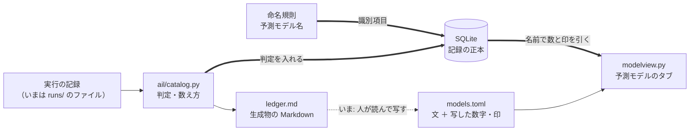
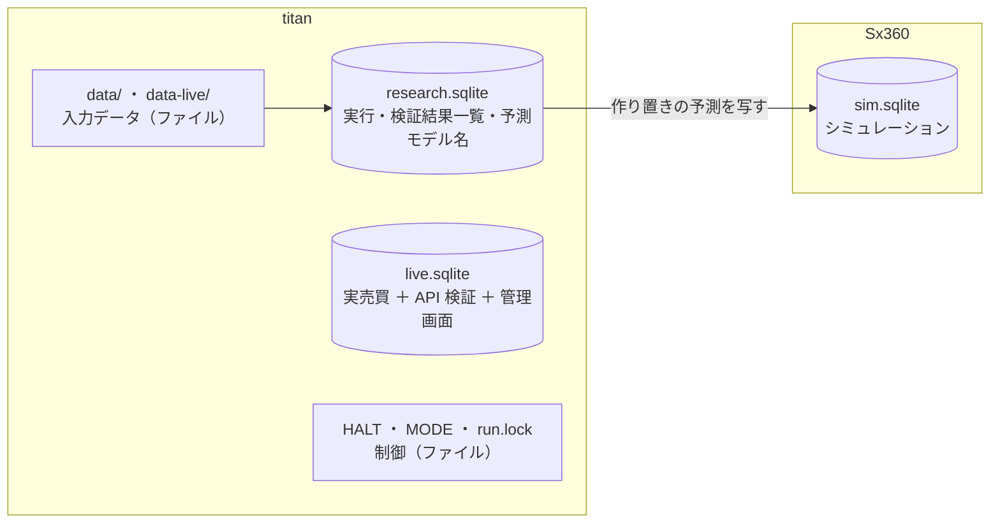
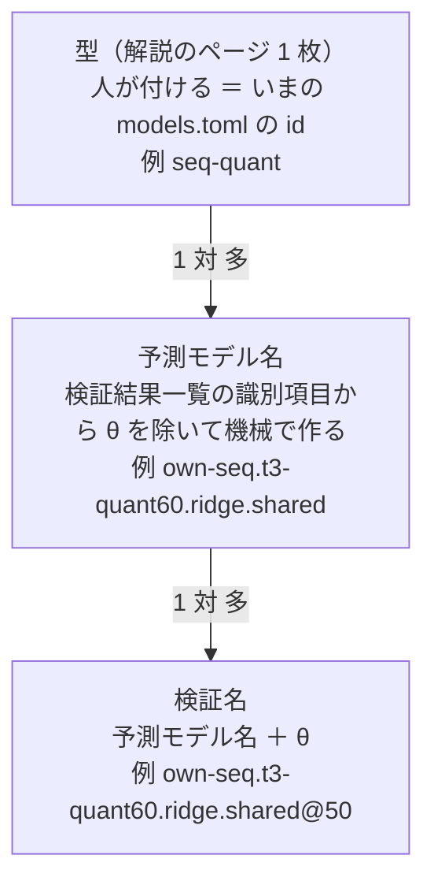
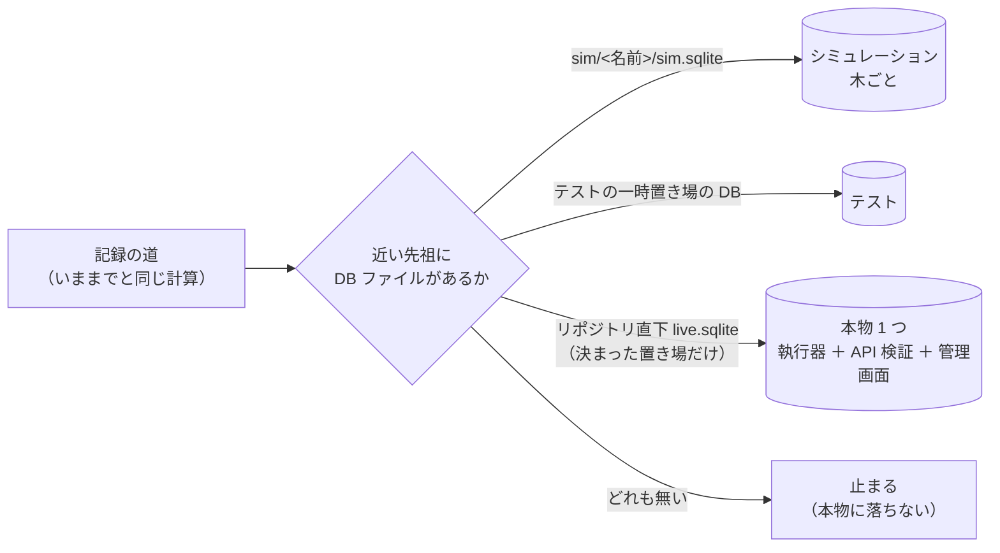

# 予測モデルの解説と DB での永続化を、いっしょに進める

2026-09-21 作成。利用者の指示（2026-09-21）: **TODO にある予測モデルの解説と DB での永続化を同時にやった方が良い**。
対象のタスク（[TODO.md](../../../TODO.md)）:

- 「DBを使ったデータの永続化を行う」（2026-09-20。何を入れるか・どの DB かはプランで利用者と決める）
- 「vibeboard の「予測モデル」タブを、予測モデルを詳しく解説するものにする」（[プラン](../vibeboard-models-tab-deep.md)。Phase 0〜4 は済み・Phase 5 の一覧のページは裁定待ち）
- 「名前の付け方（英語名）をそろえるか決める」（裁定待ち）→ ⚠ 2026-09-21 の裁定 ④ で**このプランの最初の段**になった

## 0. 再開するとき（2026-09-25 に閉じた。⚠ 最初にここを読む）

言葉は CLAUDE.md の「言葉」の表（検証結果一覧 ＝ 旧 台帳 ／ 検証 ＝ 旧 試行 ／ 識別項目 ＝ 旧 台帳の鍵 ／ 評価期間 ／ 実行タブ ／ 売買履歴 ／ 識別名 ／ 許可 ／ 資格情報）。

| 段 | 状態 | 残り |
| --- | --- | --- |
| Phase 0 裁定 | ✅ | — |
| Phase 1 予測モデル名 | ✅ 綴りも確定（2026-09-21 の利用者の裁定: 学習範囲を `shared` ／ `each` に） | — |
| Phase 2 研究の記録を DB へ | ✅ 控え（C ドライブ）・sidecar の入れ直し・実行ディレクトリ 255 と `runs/queue/` の削除まで（2026-09-21） | — （控えは Sx360 にも写した ＝ 2026-09-21 の利用者の報告） |
| Phase 3 予測モデルのタブが DB を読む | ✅ `ledger_rows`・経緯の行の `names`・DB との突き合わせのテスト（2026-09-21） | 経緯の表に載っていない試しを載せるか（`models.toml` を読む利用者。§10） |
| Phase 4 「詳しく」の【実測】を DB から | ✅ 門の数字と較正の係数の 32 か所を差し込みに（2026-09-21） | 範囲・桁のそろわない並び・いくつもの実行にまたがる数字は人が写したまま（§10） |
| Phase 5 小さな記録（`feature-discovery/out/`・`tastytrade-api-sample/out/`・`dashboard/data/`） | ✅ `feature-discovery/out/` は表 `outputs` へ（2026-09-21・ファイルも消した）。`tastytrade-api-sample/out/`・`dashboard/data/` は Phase 6 といっしょに `live.sqlite` へ（2026-09-21 夜・`HALT` はファイルのまま） | 古いファイルの削除は Phase 6 の残りと同じ |
| Phase 6 実売買とシミュレーション | ✅ 2026-09-21 夜に前倒し（§11）。9/22 朝のテスト・9/23 に DB の作りで本番投入・9/25 から 13500t の `live.sqlite` で本番 | ⚠ titan の古いファイルの削除（利用者。下の「閉じたとき」）／ 執行器のメッセージの「台帳」→「売買履歴」（別タスク） |

**閉じたとき（2026-09-25）**: 残りは別のタスクに分けて、この親を DONE へ移した（TODO の 3 本 ＝ ① 実売買のいままでのファイルを消す〔利用者〕／ ② 経緯の表に載っていない試しを載せるか〔利用者〕／ ③ 執行器のメッセージの「台帳」→「売買履歴」）。

- titan の古いファイルの突き合わせ【実測 2026-09-25】: `live-trading/out` 一致 17 ／ `tastytrade-api-sample/out` 一致 65 ／ `sim-predict` 一致 384 ／ `dashboard/data`（`demo` を除く）一致 6 ／ `live-trading/state` 一致 2・食い違い 3（`cert/journal.jsonl`・`cert/test_a.json`・`prod/journal.jsonl` ＝ 9/21 の古い写し。DB がその後に書き足されたため ＝ 欠けではない）
- 消す前の控え: titan の `/mnt/c/Users/akira/ai-income-lab-backup/live-files-2026-09-25.tar.gz`（555 項目・839 KB・sha256 `673758753b4b…bcdbcf4f`）
- ⚠ `dashboard/data/demo` は DB の対象外（デモ）＝ `verify` ／ `remove` に渡すと止まる。ディレクトリごとに渡す

**利用者の返事**（2026-09-21 夜）: ① 綴り ＝ 学習範囲を単語に（`shared` ／ `each`）／ ② 控え ＝ C ドライブ ＋ Sx360 ／ ③ 実行ディレクトリ ＝ 消す（sidecar の入れ直しも Claude が）／ ④ `ledger_rows` ＝ 書いてよい。

**注意**:

- 実験を回すと、記録は DB にしか入らない（実行ディレクトリは作られない）。`cli.db verify` が突き合わせる相手はもう無い
- 検証結果一覧を吐き直すと `ledger_rows` も入れ直される。⚠ **経緯の表に当たる試しが増えると、管理画面のテスト `test_real_history_matches_the_db` が落ちる** ＝ 記録で確かめて `models.toml` の数・印・文を直す（DB を正とする）
- 実験は回していない（`n_trials` は 667 のまま）
- 実売買（`experiments/live-trading/`）には触らない（2026-09-22 本番投入）

## 1. 目的・背景 ＝ なぜ重なるか

「予測モデル」タブの**事実の部分**（試した結果の印・試した経緯の「何通り・内訳」・「詳しく」の【実測】の数字）は、**いま人が記録から手で写している**。機械で引けないのは、引く先が無いから:

| 確かめたこと | 分かったこと | 出典 |
| --- | --- | --- |
| 判定（採る ／ 保留 ／ 落とす）はどこにあるか | ⚠ **生成物の Markdown（`ledger.md`）にしか無い**。`ail/catalog.py` の `ledger()` が毎回 `runs/` から組み立て、Markdown に吐くだけ | [dashboard.md §17-3](../../specs/dashboard.md)・`ail/catalog.py:670` |
| タブの読み手（vibeboard の sidecar）は `runs/` を読めるか | ⚠ **読まない決まり**（標準ライブラリだけ・`runs/` は titan にしか無く git 管理外・解釈に pandas が要る） | §17 の図・`modelview.py` の冒頭 |
| 手で写した結果 | ⚠ **2026-09-20 の書き直しで 10 か所あまりの誤り**（「逆だった」「数が違った」「計算を直す前の行だった」） | §17-6 |
| 解説のページと検証結果一覧の行を結ぶ名前 | ⚠ **無い**。ページの識別名は `models.toml` の `id`（`own-ridge`）、トレーダーの設定は実験名 ＋ 数字の選び方・作り方の登録名（`trade_ownseq_ridge_a` ＋ `T3 QUANT（60日窓）`）、検証結果一覧の識別項目は 12 列（`catalog.KEY`）。⚠ 実験名は識別項目ではない（[rules.md 10-1](../../specs/experiments/feature-discovery/rules.md)）。⚠ 検証結果一覧の「モデル」列は `Ridge` などの学習器で、利用者の言う「予測モデル」（入力データ・数字の選び方や作り方・学習器・学習範囲・較正の組）とは別物 | `catalog.KEY`・`config/traders/T3.toml` |

> この図の主張: いまは事実が人の手を 1 度通ってから画面に出る。命名規則で「予測モデル」に名前を付け、DB に記録を入れると、事実は名前で引く機械の経路で届き、人が書くのは文だけになる。

## 2. 裁定（2026-09-21・利用者）

| | 問い | 裁定 |
| --- | --- | --- |
| ① | 何を DB に入れるか | **予測モデルを作るときの入力データ以外**（「これで良いかも教えて」→ §3） |
| ② | DB の役割 | **2 か所には置かない。DB に入れたらファイルは削除**（＝ DB が正本） |
| ③ | どの DB | **SQLite** |
| ④ | 解説のどこを DB から引くか | **予測モデルの命名規則を作らないと解説に使えない** → 命名規則を Phase 1 にする（§5） |
| ⑤ | §3 の線引きと §4 の 5 点 | ✅ **「5 点問題ないので進める」**（2026-09-21）＝ 「データ」は実行や売買が生んだ記録 ／ 「1 実行 1 記録」への書き換え ／ 消す前に書き戻しの一致を確かめ、消すのは結果を見た利用者の了承のあと ／ DB の控えを置く ／ 実売買は 20 営業日のあと ／ DB ファイルは 3 つ |

## 3. ① の答え ＝ 「入力データ以外」で良いか

⚠ **良い。ただし「データ」を「実行や売買が生んだ記録」に限る**のを推す。設定・コード・文書・秘密・制御のファイルは「データ」に数えず、今までどおりファイル（git）に置く。

| 置き場 | 中身 | 大きさ【実測 2026-09-21】 | DB に入れるか |
| --- | --- | --- | --- |
| `feature-discovery/runs/` | 実行 1 本ごとの設定の写し・入力の指紋・結果・日次・持ち高・学んだ係数・ログ | 2.2GB（`daily.csv` 202 本で 1.95GB ／ `holds.csv` 0.29GB ／ `fitted/` 1,089 本で 0.01GB）。実行 255 本・検証結果一覧の行 1,155〔検証 667〕＋ leak 対照 992 | ✅ 入れる（Phase 2） |
| `feature-discovery/out/` | 診断・突き合わせ | 0.4MB | ✅ 入れる |
| `live-trading/out/`・`state/`・`state-backup/`・`journal.jsonl` | 実売買の注文・約定・売買履歴・控え | 0.3MB | ✅ 入れる（⚠ 時期は §4 の 4） |
| `live-trading/sim/`・`sim-predict/` | シミュレーションの記録・作り置きの予測 | 3.8MB（`sim-predict/`） | ✅ 入れる（⚠ 本物とは別の DB ファイル。§4 の 5） |
| `tastytrade-api-sample/out/` | API 検証の記録（2026-09-05〜） | 0.5MB | ✅ 入れる |
| `dashboard/data/` | 管理画面の監視・操作の履歴 | 0.1MB | ✅ 入れる |
| `feature-discovery/data/`・`data-live/`・外部系列 | ⚠ **入力データ**（日足・金利・為替など） | 4.5GB ／ 70MB | ❌ 入れない（裁定 ①） |
| `config/`・`models.toml` などの TOML・`docs/`・`ledger.md` | 設定・言葉の正本・文書（`ledger.md` は DB から作る**報告書**） | — | ❌ 入れない（git で差分を見て直すもの。⚠ `ledger.md` は「2 か所目」ではなく DB から作る読み物として残すのを推す） |
| `HALT`・`MODE`・`run.lock` | ⚠ **止める・切り替える・排他の仕組み** | — | ❌ 入れない（停止ボタンと起動の拒否がファイルの有無で決まる作り。DB が壊れても止められるようにする） |
| `.env` | 秘密 | — | ❌ 絶対に入れない |
| `dashboard/demo/` | デモのモックの記録（git 管理） | 0.6MB | ❌ 入れない（テストの部品） |
| `i7-dataset/out/` | 生成した評価セット（配るための成果物） | — | ❌ 推す（打ち切ったやり方・配るときはファイル） |

## 4. ② で変わること（⚠ 利用者の確認が要る 5 点）

1. ⚠ **`CLAUDE.md` の「緩めないもの」にある「1 実行 1 ディレクトリ」を書き換えることになる**（[rules.md 10 章](../../specs/experiments/feature-discovery/rules.md) も）。中身の意図 ＝ 実行ごとに記録を分け・上書きせず・設定の写しと入力の指紋を必ず残す、は DB でも守れる。★ 書き換え案: **「1 実行 1 記録（実行の識別名で分け、上書きしない。設定の写し・入力の指紋・種・結果を同じ識別名で残す）」**
2. ⚠ **消すと戻せない**（`runs/` は git 管理外で、ほかに写しが無い）。★ 消す前に「DB から書き戻したものが元のファイルと一致する」を全部の実行で確かめ、一致しなかった実行は消さない。消すのは確かめの結果を見た利用者の了承のあと
3. ⚠ **DB が 1 つ壊れると全部を失う**（ファイルなら壊れるのは 1 本）。記録を失うと試した数（`n_trials`）を数え落とし、判定が甘くなる。★ **控え（SQLite の `.backup` で日付つきの 1 ファイル）を別の機械かディスクに置く**。控えは使う場所ではなく戻すためだけのもの ＝ 「2 か所に置かない」には当たらない、と考えるが、利用者の判断を待つ
4. ⚠ **実売買の執行器の書き込みを DB に替える時期**。明日（2026-09-22）が本番投入で、Phase 6 は「執行の差と無人運転の成立」を 20 営業日で見る。途中で書き込みの作りを替えると、無人運転の成立を同じ作りで測れなくなる。★ **20 営業日のあとに替える**（それまで実売買の記録はファイルのまま ＝ 同じ記録が 2 か所に置かれることはない）。早めるなら週末に執行器を止め、`mockrun.sh`・`sim2` を通してから
5. ★ **DB ファイルは 3 つに分ける**（研究 ／ 実売買 ／ シミュレーション）。本物とシミュレーションを混ぜない決まり（live-trading.md §0-7）をファイルの単位で守れる・実売買の書き込みが研究の長い書き込みを待たない。1 つの記録が置かれるのはどれか 1 つだけ

> この図の主張: 記録はどれも DB ファイルの 1 つにだけ置かれ、入力データと制御のファイルは今までどおりファイルのまま。

## 5. 命名規則（Phase 1 の案。⚠ 利用者の裁定）

⚠ 土台は [rules.md 10-1](../../specs/experiments/feature-discovery/rules.md)（既存の名前は 1 つも変えない・計算が変わる変更は必ず名前を変える・名前から中身を読まない）。**新しい名前は別名として足す**。

> この図の主張: 名前は 3 段で、下の 2 段は検証結果一覧の識別項目から機械で作る。人が付けるのは一番上の「型」だけ。

| 段 | 何の単位か | 作り方（案） | いまの名前との関係 |
| --- | --- | --- | --- |
| 型 | 解説のページ 1 枚（いま 12） | 人が付ける。どの予測モデル名が入るかは型ごとの決まり（数字の選び方・作り方 ／ 学習器 ／ 入力データの組）で決める | `models.toml` の `id` をそのまま使う（リンクを切らない） |
| 予測モデル名 | トレーダーが使う単位（θ はトレーダーの側） | `catalog.KEY` から θ を除いた 11 列を、決まった順に短い綴りで並べる。⚠ **既定の値は書かない**（rules.md 10-1 の「水準」と同じ）＝ 日足・1 日・`adjusted`・既定の期間（2018-01-31 から）と銘柄数（63）・較正 `std` は書かず、外れたときだけ `~p1995`・`~cal-old` のように足す | 実験名（`trade_own_ridge_a`）は変えない。DB が実験名 → 予測モデル名の対応を持つ |
| 検証名 | 検証結果一覧の 1 行 ＝ `n_trials` の 1 | 予測モデル名 ＋ `@θ` | 検証結果一覧の行と 1 対 1 |

いま動かす 3 人の例（2026-09-21 に確定した綴り ＝ 学習範囲は利用者の裁定で `shared` ／ `each`。入力データの部分は検証結果一覧の「特徴量の層」の空白を `-` にした機械の綴りで、実験名の略 `ownex`・`ownseq` とは別。`60` は観測期間 60 日の印）:

| トレーダー | 検証結果一覧の識別項目（θ 以外で既定から外れる列） | 予測モデル名（案） | 型 |
| --- | --- | --- | --- |
| `T1` | 全部使う（基準）× Ridge × `own` × 63 × 共通 × std | `own.all.ridge.shared` | `own-ridge` |
| `T2` | 全部使う（基準）× LightGBM × `own cs rel ex` × 48 × 共通 × std | `own-cs-rel-ex.all.lgbm.shared~n48` | `ownex-lgbm` |
| `T3` | T3 QUANT（観測期間 60 日）× Ridge × `own seq` × 63 × 共通 × std | `own-seq.t3-quant60.ridge.shared` | `seq-quant` |

守ること（テストにする）:

- ⚠ **検証結果一覧の識別項目が違えば予測モデル名も必ず違う**（1 対 1。いまの 1,155 行 ＋ leak 992 行の全部で確かめる）
- ⚠ **言葉を決める**: 「予測モデル」＝ 入力データ・数字の選び方や作り方・学習器・学習範囲・較正の組 ／ 「学習器」＝ 検証結果一覧の「モデル」列（`Ridge` など）／ 「型」＝ 解説のページ。検証結果一覧の「モデル」列の名前は変えない（識別項目なので）が、画面と文書では「学習器」と呼ぶ
- ⚠ 名前は `n_trials` を動かさない（数え方は `catalog.is_trial` のまま）

## 6. 対応方針

⚠ **実装で決めた形（2026-09-21）**: 研究の DB は **ファイルの中身をそのまま 1 行ずつ入れる**（`runs`・`files`・`queue_state` の 3 つのテーブル。`ail/rundb.py`）。下のテーブルの案（`trials`・`gates`・`calibration` に分けて入れる）はやめた。理由:

- ⚠ **1 ビットも違わないことを確かめられる**（`sha256`。取り込みの前後で `ledger.md` が 1 文字も変わらない）。列に分けて入れると、CSV の数字の書き方（丸め・空欄・列の順）で戻したものが元と食い違い、「同じ記録か」を確かめられない
- ⚠ **判定の規則を 2 か所に書かない**（検証結果一覧の行・判定は今までどおり `catalog.ledger()` が記録から作る）
- 書き手・読み手の直しが入出力だけで済む（計算のコードは 1 行も変えていない ＝ 既定経路の指紋テストがそのまま通る）
- JSON は文字列のまま入れるので、DB の中で `json_extract` で引ける。CSV は zlib で縮めるだけ（2,321.7 MB → 313.4 MB【実測】）

⚠ **解説のタブ（Phase 3）が要るのは検証結果一覧の行と判定**で、これは pandas の要る `catalog` が作るので、標準ライブラリだけの sidecar は作れない。→ Phase 3 では **検証結果一覧を吐き直すときに、同じ `ledger()` の結果を DB のテーブル `ledger_rows` にも書く**（`ledger.md` と同じ生成物。毎回まるごと作り直す。⚠ 利用者に確かめる ＝ §10）。

以下は 2026-09-21 の最初の案（経緯として残す）。

- ⚠ **判定・数え方・識別項目は `ail/catalog.py` のまま**（DB は記録の置き場。判定の規則を 2 か所に書かない）。`ledger.md` は DB から作る報告書として残し、**DB に移す前後で 1 文字も変わらない**ことを確かめる
- 研究の DB（`research.sqlite`）のテーブル（⚠ Phase 2 の前に列まで決める）: `runs`（実行の識別名 ＝ いまのディレクトリ名・設定の写し・入力の指紋・種・コードの版・ログ）／ 結果のテーブル（`result`・`summary`・`daily`・`per_symbol`・`holds`・`selected`・`topk` ＝ いまの CSV と同じ列 ＋ 実行の識別名）／ `checks`（いまの `checks.json`）／ `fitted`（学んだ係数。JSON と `.pt` を中身ごと）／ `names`（実験名 → 予測モデル名 → 型）
- 書き手（`cli.run`・`cli.scenario`・`cli.queue`・`cli.predict` の作り置き）と読み手（`catalog.py`・`app/experiments.py`・`dashboard/vibetab.py`・`cli.report`）を DB に替える。⚠ `cli.queue` の再開（どこまで回ったか）も DB の実行の識別名で
- sidecar は標準ライブラリの `sqlite3` で**読み取り専用**に開く（`file:…?mode=ro`）。DB が無い機械では今までどおり TOML の文だけを出し、「DB が無い」の注を付ける
- ⚠ 画面の決まり（やさしい言葉・くらべる文を書かない・本数を数えない・売買結果を出さない・bp を本文に書かない）は変えない
- ⚠ 実売買の書き込みを替えるまで（§4 の 4）、`experiments/live-trading/`・`dashboard/app/` の記録の読み書きには触らない

## 7. Phase

- ✅ **Phase 0**: 裁定 ① 〜 ⑤（2026-09-21）
- ✅ **Phase 1（命名規則）**（2026-09-21。綴りも確定 ＝ §10）: §5 の案を詰めて rules.md 10-1 の次の節に書く（⚠ **綴りは利用者の裁定**）。検証結果一覧の全行に名前を付けて 1 対 1 を確かめるテスト。既存の名前は変えない
- ✅ **Phase 2（研究の DB）**（2026-09-21。ディレクトリを消すところまで ＝ §10）: テーブルを作る → 書き手・読み手を DB に替える → いまの 255 本を取り込む → `ledger.md` が変わらない・`n_trials` 667 のまま・書き戻したものが元のファイルと一致、を確かめる → ⚠ **利用者の了承のあと** `runs/` のファイルを消す → `CLAUDE.md`・rules.md 10 章の「1 実行 1 ディレクトリ」を書き換える（⚠ 文面は利用者の了承）
- ✅ **Phase 3（解説のタブが DB を読む）**（2026-09-21 ＝ §10）: 試した経緯の行に予測モデル名を書き、何通り・内訳・いつを DB から出す。`result.verdict` と DB の判定が食い違えばテストが落ちる。⚠ 食い違いが見つかったら、どちらが正しいかを記録で確かめて直し、§8 に残す
- ✅ **Phase 4（「詳しく」の【実測】）**（2026-09-21 ＝ §10）: 較正の係数・門の数字などを、DB の値の差し込みに替える（出典の実行の識別名つき）
- **Phase 5（小さな置き場）**: `feature-discovery/out/`・`tastytrade-api-sample/out/`・`dashboard/data/`（管理画面の読み書きを替える）
- **Phase 6（実売買 ＋ シミュレーション）**: ⚠ **§4 の 4 の時期に**。執行器・控え・売買履歴・`paper.py`・`reconcile.py`・`recovery.py`・管理画面の読み手を `live.sqlite` に、シミュレーションを `sim.sqlite` に。`mockrun.sh`・`sim2`・執行器の pytest を通す。⚠ 本番で起動し直すのは利用者
- 予測モデルのタブの **Phase 5（一覧のページの形）** は元のプランのまま（裁定待ち。このプランとは独立）
- 後片付け: `TODO.md` → `DONE.md`・プランを archive へ・仕様（`dashboard.md` §17・rules.md 10 章・各 README）を直す

## 8. 影響範囲

| Phase | 直す | 直さない |
| --- | --- | --- |
| 1 | rules.md 10-1 の次の節・`ail/`（名前を作る関数）・テスト | 既存の名前（実験名・モデル名・選び方や作り方の登録名・`models.toml` の `id`） |
| 2 | `cli/run.py`・`cli/scenario.py`・`cli/queue.py`・`cli/report.py`・`ail/catalog.py`（読むところだけ）・`dashboard/app/experiments.py`・`dashboard/vibetab.py`・`.gitignore`・`CLAUDE.md`・rules.md 10 章 | 判定・数え方・識別項目（`catalog.judge`・`is_trial`・`KEY`） |
| 3〜4 | `dashboard/modelview.py`・`dashboard/models.toml`・`dashboard/tests/`・`dashboard.md` §17 | `traderview.py` の画面・vibeboard 本体 |
| 6 | `experiments/live-trading/` の記録の読み書き・`dashboard/app/` の記録の読み手・`tastytrade-api-sample/record.py` | 許可の 3 段・`HALT`・`MODE`・`run.lock`・`Masker`（DB に書く前も通す） |

- 反映: `modelview.py`・`vibetab.py` を直すので **sidecar（3015）の入れ直しが要る**（⚠ 利用者。§12-3 の罠）
- 費用: 追加の費用なし（SQLite は Python に同梱。titan の版は 3.45.1【実測 2026-09-21】）

## 9. テスト方針

- `cd experiments/feature-discovery && .venv/bin/python -m pytest -q tests`（名前の 1 対 1・DB の書き読み・`ledger.md` が変わらない・`n_trials` が変わらない・書き戻しの一致・既定経路の指紋テスト `tests/test_trading_run.py`・`tests/test_predict.py`）
- `cd dashboard && .venv/bin/python -m pytest -q tests`（いま 218 本＋。DB あり ／ なしで画面が壊れない）
- Phase 6 は `cd experiments/live-trading && ../feature-discovery/.venv/bin/python -m pytest -q tests`・`./mockrun.sh`・`./run-sim.sh --fresh --speed max`（⚠ titan では `LT_MODE_DIR` を scratch に向ける）
- 手元で見る: `python3 dashboard/vibetab.py --port 3016` → `http://127.0.0.1:3016/models/view?item=own-ridge`（3010・3015 に触らない）
- 【実測】で残す: 取り込みの所要時間・DB ファイルの大きさ（いまの `runs/` 2.2GB との比）・sidecar がページを返す時間

## 10. 進み具合と【実測】（2026-09-21）

### Phase 1（命名規則）

- `ail/names.py`・`config/names.toml`・`tests/test_names.py`（16 本）・rules.md 10-2
- 検証結果一覧の全行で識別項目 ↔ 名前が 1 対 1【実測】: 行 1,155 ＝ 検証名 1,155 ／ 予測モデル名 591（うち検証数に数える行を持つもの 333）／ leak 対照 992 行も 1 対 1 ／ いちばん長い名前 52 文字
- ✅ **綴りを確定した**（2026-09-21 の利用者の裁定: 学習範囲を `a` ／ `b` ではなく `shared` ／ `each` に ＝ `T1` `own.all.ridge.shared` ／ `T2` `own-cs-rel-ex.all.lgbm.shared~n48` ／ `T3` `own-seq.t3-quant60.ridge.shared`）。直したのは `config/names.toml` の 2 行だけで、記録は直していない（名前は識別項目から作り直せる）。1 対 1 は変わらない（検証名 1,155 ／ 予測モデル名 591）・いちばん長い名前 57 文字

### Phase 2（研究の DB）

| 確かめたこと | 【実測】 |
| --- | --- |
| 取り込み（`python3 -m cli.db import`） | 実行 255 ・ ファイル 3,479 ・ キューの状態 10 ／ 26.2 秒 ／ 2,321.7 MB → 313.4 MB（DB のファイル 316.7 MB） |
| 突き合わせ（`python3 -m cli.db verify`） | **一致 255 ／ 食い違い 0**（DB から取り出したバイト列の sha256 ＝ ディスクの sha256）・キューの状態も一致・5.0 秒 |
| 検証結果一覧 | **直す前のコード（ディレクトリ）で作った検証結果一覧と、DB だけ（ディレクトリの無い置き場）で作った検証結果一覧が 1 文字も違わない**（512,428 文字）・`n_trials` 667 のまま |
| 実行タブ（`app/experiments.py`） | 直す前（ディレクトリ）と直した後（DB）で一覧・詳細が同じ（本物 140 ・ leak 113） |
| テスト | 研究側 497 本（`test_rundb.py` 9 本・`test_names.py` 16 本を足した）・管理画面 218 本が通る |

- 書いたその場で入れる形にした理由: `cli.run` は自分の `summary.csv` が検証結果一覧に入った状態で `n_trials` を数える（`checks.n_trials_now`）。閉じるときにまとめて入れると 1 本数え落とす（DSR が甘くなる向き）。`tests/test_checks.py` が「閉じる前に数える」を確かめる
- `cli.report --recheck` は ⚠ **`checks.json` のある実行を書き換えない**ように直した（無い実行にだけ足す）
- ✅ **消した**（2026-09-21 夜・利用者の了承のあと）: 下の「Phase 2 の仕上げ」

### Phase 2 の仕上げ（2026-09-21 夜）

| 手順 | 【実測】 |
| --- | --- |
| 突き合わせ（`cli.db verify`） | 一致 255 ／ 食い違い 0 ／ キューの状態の食い違い 0（6.7 秒） |
| 控え（`cli.db backup`） | 316.7 MB・整合性 ok。ext4 の上で取り、`/mnt/c/Users/akira/ai-income-lab-backup/research-2026-09-21.sqlite` へ写して sha256 が一致（`f0731085…`）・写しも整合性 ok・実行 255。⚠ Dropbox・OneDrive の下には置かない（外に出る）。⚠ C ドライブは WSL の仮想ディスクと同じ物理ディスクの可能性がある ＝ **Sx360 にも写す（利用者）**: Sx360 から `scp titan:/mnt/c/Users/akira/ai-income-lab-backup/research-2026-09-21.sqlite <置き場>/`（titan から Sx360 へは ssh が届かない【実測】） |
| sidecar（3015）の入れ直し | 古い sidecar（2026-09-20 起動・実行ディレクトリを読む ＝ 「検証 140 件」）を、3016 で新しいコードの全タブが 200 を返すのを確かめてから入れ替えた（`setsid nohup python3 dashboard/vibetab.py`。前の sidecar と同じ起こし方。vibeboard 3010 には触らない）。実行タブは「実行 140 件」＝ DB を読む。vibeboard の中継（`/ext/…`）も 200 |
| 消す（`cli.db remove-dirs --i-verified`） | 消した実行ディレクトリ 255 ／ 残した（食い違い）0 ／ キューの状態も消した（7.4 秒）。`runs/` は 2.5 GB → 303 MB（DB だけ） |
| 消した後の確かめ | DB だけで作った検証結果一覧がコミット済みの `ledger.md` と 1 文字も違わない（512,484 文字）・`n_trials` 667 ／ 研究側のテスト 497 本 ／ 管理画面のテスト 218 本 ／ 実売買の経路（`run-live.sh`・`cli/predict.py`・執行器）は `runs/` を読まないことをコードで確かめた |

### Phase 3（予測モデルのタブが DB を読む。2026-09-21 夜）

- 書き手: `cli/ledger.py` の `store`（`ledger_items` ＝ 行ごとに検証名・予測モデル名・`is_trial`・判定・閉じる・実行の最初と最後の日・実行一覧・行まるごとの JSON）を `cli.report --catalog` と `cli.queue` の吐き直しから呼ぶ。テーブルは `ail/rundb.py` の `ledger_rows`（`write_ledger` がまるごと入れ直す）。`meta` に `ledger_built_at`・`ledger_n_trials`
- 本物の DB に入れた【実測】: 本体 1,155 行（`n_trials` に数える 667 ＝ 保留 116 ／ 落とす 551）・leak 対照 992 行・2.5 秒。`ledger.md` は 1 文字も変わらない
- 読み手: `dashboard/modelview.py` の `ledger_rows`（読み取り専用・無い DB は作らない）・`counted`（`fnmatch`。θ はまとめて数える）。`models.toml` の経緯の行に `names` を書いた（26 行のうち 24 行）。DB の無い機械・`names` の無い行は TOML の数（DB がある機械では「人が写した数」の印）。見張りに `meta.ledger_built_at`
- ⚠ **突き合わせの結果: 人が写した 24 行の数は DB の数と全部同じ**（食い違い 0）。`when` も全部 DB の実行の日の範囲に入る。印（`result.verdict`）も DB の数でのいちばん良い印と同じ
- `names` を書けなかった 2 行: `ownex-lgbm` の 2026-09-13（株の外の数字を直す前の回し直し。検証結果一覧では直した後の回し直しと同じ 1 行にまとまる ＝ 「再現 ⚠ 3 実行・幅 133.72bp」）／ `cgan-scenario`（検証結果一覧の外の物差し）
- ⚠ **経緯の表に載っていない試し**（数の誤りではない。載せるかは `models.toml` を読む利用者が決める）: `trend-gates` の計算を直す前の「見る株の組を変えた 2 つ」（`~n70~cal-old`・`~n74~cal-old` の 42 検証。2026-09-12）／ `own-ridge` の期間や見る株を変えた形（`~p1995-02-10`・`~p2018-06-27~n48`・`~p2018-09-10~n48` など）
- テスト: 研究側 `tests/test_ledger_rows.py`（2 本。本物の検証結果一覧を一時 DB に入れ、同じ行・判定・`n_trials` ＝ `ledger.md` の数・入れ直しで増えない）／ 管理画面 `tests/test_models_tab.py` の `test_history_counts_come_from_the_db`（小さな DB で、DB の数・印・注・読み取り専用・無い DB を作らない）と `test_real_history_matches_the_db`（本物の DB と `models.toml` の突き合わせ。DB が無い機械では飛ばす）
- sidecar（3015）は `modelview.py` を直したので、もう一度入れ替えた（同じ手順）

### Phase 4（「詳しく」の【実測】を DB から。2026-09-21 夜）

- 形: `models.toml` の `[model.detail.*]` の文に差し込み `{{gate|<実行>|<数字の選び方・作り方>|<項目>|<桁>|<控え>}}` ／ `{{calib|…}}`（`dashboard/modelview.py` の `PLUG`）。`gate` ＝ `checks.json` の `gate.methods[…]` の auc ／ width_pt ／ auc_folds ／ width_folds、`calib` ＝ `fitted/calibration_f1..N.json` の a ／ b を fold の順に。桁の頭の `+` で正の数に ＋・負は −・並びは「 ／ 」
- 読み手 `RunFacts`: 読み取り専用・引くのは `checks.json` と `fitted/calibration_f*.json` だけ・差し込みのあるページだけ DB を開く・無い DB は作らない。DB の値は点線の下線（title に実行の識別名 ＝ 出典）・囲みの下に「機械で引いた値」の注。DB が無い機械では控え ＋「人が写した」の注
- 差し込みにしたもの（32 か所）: `own-ridge`（較正 a・b ＝ 09-13T08-57-34、門の AUC・幅と fold 別）／ `ownex-lgbm`（a ＝ 09-17T16-58-20、門）／ `seq-quant`・`minirocket`・`hydra`（09-15T10-38-12 の門と a。`hydra` の幅の fold 別は桁がそろわないので写したまま）／ `patchtst`（09-15T14-04-35）／ `symbolic-regression`（09-16T10-18-18 の門）
- ⚠ **突き合わせの結果: 32 か所の控えは DB の値と全部同じ**（食い違い 0）
- 差し込めずに人が写したままのもの: 範囲（`trend-gates`・`entry-exit-gates`・`mlp`・`gan-augment` の「0.491〜0.512」など）・桁のそろわない並び（`own-ridge` の較正「旧」の a、`hydra` の幅）・`result.csv` や記録の文書から写した数（保有日率・取引の数・上乗せ）・シミュレーションの集計
- テスト: `tests/test_models_tab.py` の `test_detail_plugs_come_from_run_records`（小さな DB で書き方・title・注・控え・読み取り専用）と `test_real_detail_plugs_match_the_db`（本物の 32 か所の形と、控え ＝ DB の値。DB が無い機械では形だけ）。管理画面 222 本
- sidecar（3015）は入れ替えた（同じ手順・vibeboard の中継でも差し込みが出る）

### Phase 5 のうち `feature-discovery/out/`（2026-09-21 夜）

- 中身【実測】: 56 ファイル・0.23 MB ＝ `diag/`（`cli/calibdiag.py` の診断 14 回ぶん）・`crosscheck_2026-09-08.json`（`cli/crosscheck.py`）・`gan_ownex/`（2026-09-14〜15 に手で回したキューのログ）。⚠ コードで読む手は無い（記録の文書が出典として道を書いているだけ）。実売買の経路（`run-live.sh`・`cli/predict.py`・執行器）は読まない
- 置き場: 研究の DB の表 `outputs`（道 ＝ `out/` からの相対のまま・中身は元のバイト列・`sha256`・書き換えも削除もトリガーが拒む・同じ道には入れ直さない）。⚠ 実行（`runs`）には入れない ＝ 検証結果一覧・実行タブ・`n_trials` に出ない
- 書き手: `cli/calibdiag.py`（`diag/<時刻>_<名前>/folds.csv`・`meta.json`・`theta.csv`・`auc_width.csv`）・`cli/crosscheck.py`（`crosscheck_<日>.json`。`--out` を書けばファイルの写しも）を `runs.put_output` に。出力のバイト列はいままでのファイルと同じ書き方
- 道具: `cli.db import-out`（取り込み。2 回目は増えない・違う中身なら止まる）／ `verify-out`／ `remove-out --i-verified`（突き合わせて一致したファイルだけ消す・空のディレクトリも）／ `export-out --prefix … --to …`（書き戻し）／ `stats` に出力の数
- 【実測】: 取り込み 56 ／ 突き合わせ 一致 56 ／ 食い違い 0。DB は 316.7 → 320.1 MB（`ledger_rows` と `outputs`）
- テスト: `tests/test_rundb.py` に 2 本（そのまま入る・書き換えと削除を拒む・取り込み → 突き合わせ → 食い違いは残して消す → 書き戻しが 1 ビットも違わない）
- ✅ **消した**（2026-09-21 夜・利用者の了承「消す＋控え取り直し」）: 消した 56 ／ 食い違い 0（`out/` ごと無くなった）→ 控えを取り直した `/mnt/c/Users/akira/ai-income-lab-backup/research-2026-09-21-2.sqlite`（320.1 MB・sha256 一致 `f8d5fcfe…`・整合性 ok・実行 255 ／ 出力 56 ／ `ledger_rows` 2,147）。前の控え（`outputs` を入れる前）も残してある。研究側のテスト 501 本
- 2026-09-21 夜: 利用者が控え（`research-2026-09-21-2.sqlite`）を Sx360 へ scp した（利用者の報告。⚠ titan から Sx360 へは ssh が届かないので、Claude は写しの中身を確かめていない。確かめるなら Sx360 で `sha256sum` が `f8d5fcfe9aba58a5dd114ef467623716a056cd41ff5f83567ffdcceaa3c99649`）

## 11. Phase 5 の残りと Phase 6 を本番投入の前に（2026-09-21 夜）

利用者の指示（2026-09-21 夜）: **本番投入前に進めて、明日テストするようにする**。裁定: ① 実売買の DB は **1 つにまとめる**（シミュレーションは本物と混ぜない ＝ 木ごとに別のファイル）／ ② 作り替える前にいまの変更をコミットして push（✅ `acc5f9f` ＝ **戻す点**）／ ③ 範囲は全部（執行器・紙上の対照・シミュレーション・管理画面の読み手 ＋ API 検証の記録 ＋ 管理画面の履歴）。
⚠ 先に書いた懸念（利用者の了承済み）: 本番投入の前夜に実弾の執行器の記録の書き方を替える ＝ 壊れると注文と売買履歴が食い違う・無人運転の成立を同じ作りで測れなくなる（§4 の 4）。→ 明日の朝に通しで確かめ、だめなら `acc5f9f` へ戻す。

> この図の主張: 記録の道の決め方は 1 行も変えず、「どの DB に入るか」は道の近くにある DB ファイルで決まる。本物は 1 つ、シミュレーション・テストはそれぞれの置き場に自分の DB を持つ。

| 決めたこと | 形 | 理由 |
| --- | --- | --- |
| 部品 | `experiments/tastytrade-api-sample/livefs.py`（標準ライブラリだけ）。執行器・API 検証・管理画面の 3 つが既に import している置き場 | 1 か所に書く |
| DB の選び方 | 記録の道から親へたどり、最初に見つかった `live.sqlite` ／ `sim.sqlite` ／ `demo.sqlite` に入る。本物 ＝ リポジトリ直下の `live.sqlite`。⚠ 本物に入れてよいのは決まった置き場（`experiments/live-trading/out`・`state`・`mode.log`・`experiments/tastytrade-api-sample/out`・`dashboard/data`〔`demo` を除く〕）だけで、ほかは止まる | 道の決め方（`LT_OUT_DIR`・`LT_STATE_DIR`・シミュレーションの木・テストの一時置き場）がそのまま効く ＝ テストが本物に書く事故が起きない |
| 表 | `lines`（いままでの `*.jsonl`・`*.log`。1 行 1 行・足すだけ ＝ 書き換えも削除もトリガーが拒む）／ `docs`（丸ごと書き換えるもの ＝ 売買履歴 `state/<env>/<名前>.json`・紙上の対照 `daily.csv` など。書き換えの前の中身は `docs_history` に残る） | 行は元の文字のまま ＝ 取り込んだファイルと 1 ビットも違わないことを確かめられる |
| ファイルのまま | `HALT`・`MODE`・`run.lock`・シミュレーションの `control.json`・`status.json`・入力の `data.json`・設定・プロセスの画面の写し（`mock.log`・`run_day` のログ） | 止める・切り替える・排他の仕組み（§3）と入力 |
| 控え | `run-live.sh` の submit の回の控えは `state-backup/<時刻>.sqlite`（SQLite の backup） | いままでの `state/` の写しと同じ役 |

**明日のテスト**（⚠ 本番の前に全部通す。1 つでも外れたら `acc5f9f` に戻して本番は今までの作りで行う）:

1. 06:35 sandbox の照会（予定どおり）＋ `test_a` を cert で submit（新しい作りで 控え → 発注 → 約定 → 売買履歴 → 控えを閉じる）→ `livefs.py cat` で記録・売買履歴・控えを読む
2. `reconcile.py --env cert show`（口座 − 売買履歴 ＝ 0）・`paper.py`（`daily.csv` が DB に）
3. 管理画面（3012）で `/`・`/traders/<名前>`・`/records`・`/judge`・`/ops` の履歴が出る
4. 本番の dry-run（`run-live.sh --traders T1,T2,T3 -- --env prod --allow-prod-dry-run`）
5. 12:45〜 本番投入（利用者）→ 13:05〜 確認（全注文の `final_status`・口座 − 売買履歴 ＝ 0・秘密の grep は `livefs.py dump`）

### 11-1. 2026-09-21 夜にやったこと

| 部品 | 直したこと |
| --- | --- |
| `experiments/tastytrade-api-sample/livefs.py`（新） | 道 → 近い DB・`lines`（足すだけ）・`docs`（書き換えの前は `docs_history`）・取り込み ／ 突き合わせ ／ 書き出し ／ 控え ／ `dump`。⚠ 読みは厳しい（どの DB にも当たらない道は止まる。管理画面だけ `missing_ok=True`） |
| 執行器 | `run_day.DayRecorder`・`state.load/save`・`journal`・`recovery.load_all_states`・`reconcile`（建玉の記録・売買履歴の有無・`reconcile.log`）・`mode`（`mode.log`・本物の建玉の確かめ。作業用の置き場には DB を作る）・`signals`（予測）・`paper`（記録・`daily.csv`） |
| シミュレーション | `simdata.write_tree` が木に `sim.sqlite`・`simrun`（筋書きの記録・`--fresh` で接続を閉じてから消す）・`simctl check`・`simpredict`（作り置き ＝ `sim-predict/sim.sqlite`・木に置く予測） |
| `run-live.sh` | 予測を回ごとの道へ `livefs.py append`・`--prepare` の日付の確かめ・控えは `livefs.py export`・`out/` を mkdir しない |
| API 検証・管理画面 | `record.Recorder`・`app/live.py`・`records.py`・`monitor.py`（監視のイベント）・`ops.py`（操作の履歴）・`devtools.py`（ジョブの履歴）・`config.ensure_dirs`（デモ・Docker・テストの置き場に DB、デモの執行器の記録を demo.sqlite へ） |
| スクリプト | `mockrun.sh`・`selftest.sh`（作業用の置き場の DB。⚠ selftest の記録はもう本物に残らない） |
| テスト | 執行器・管理画面の conftest が一時置き場に DB を作る。記録を読む ／ 置く所を `livefs` に（`tests/_records.py`） |

【実測】: 執行器の pytest 142 本・管理画面 222 本・`mockrun.sh`・`sim2`（64 日 18 秒・2,536 行・`reconcile show` の差は注入した BAC だけ・控えの未完 0）・`selftest.sh`・`run-live.sh --date 2026-09-18 --mode plan`（作業用の置き場。40 秒）・本物の管理画面の全ページ 200（本物の DB から）。取り込み: 本物 93 ファイル・作り置き 384 ファイル・**一致 477 ／ 477**。⚠ テスト・シミュレーションを流しても本物の `live.sqlite` は作られなかった（＝ 本物に落ちていない）。

⚠ **ファイルはまだ消していない**: 明日の本番投入が新しい作りで済むまで、`acc5f9f`（ファイルの作り）に戻すときの足場として残す。戻したときは、明日の朝の cert の試しの分だけファイルが古い（cert の `test_a` は往復して建玉なしになる見込み ＝ 食い違わない。食い違ったら `reconcile.py`）。
⚠ g3plus は `809104f` のまま（自動では更新されない）。更新するときは `/data` のファイルを `livefs.py import` してから（dashboard.md §13-1）。
