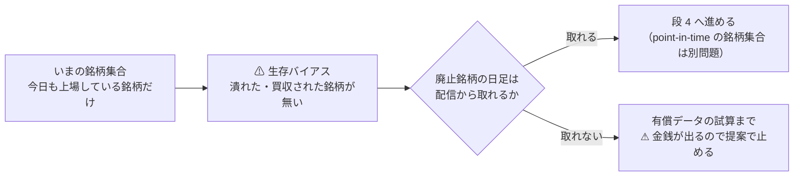
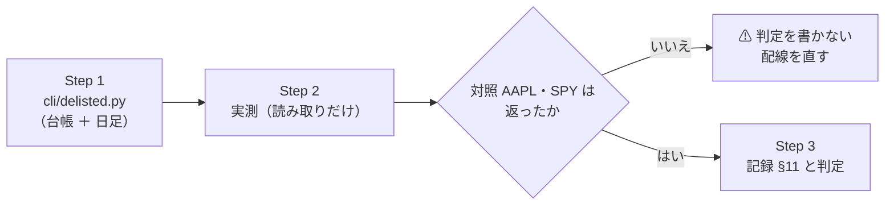

# 上場廃止銘柄の日足が取れるか確かめる（段 4）

作成: 2026-09-17 ／ **完了: 2026-09-17** ／ ⚠ **結果は [universe-widening.md §11](../../specs/experiments/universe-widening.md)**（廃止銘柄は日足 0 本 ＝ 配信からは組めない）
対象: `experiments/feature-discovery/`（`cli/delisted.py` を新設）
派生元: [universe-widening.md §5・§6](../../specs/experiments/universe-widening.md)（銘柄集合を広げる・段 4）
関連: [rules.md](../../specs/experiments/feature-discovery/rules.md) ／ [tastytrade-api-sample.md](../../specs/experiments/tastytrade-api-sample.md)（API の挙動の記録）

## 1. 目的・背景

⚠ **いまの銘柄集合（us63・us74・中位 48 本）は、どれも「今日も上場している銘柄」だけで作ってある。**
⚠ **これは生存バイアスであり、どの実験にも同じ向きに効く**（潰れた銘柄・買収された銘柄が標本から落ちている）。

> この図の主張: ⚠ **標本から落ちているのは「結果が悪かった銘柄」に偏る。** 取れるかどうかで、消せるか諦めるかが決まる。

⚠ **確かめるのは安い**（読み取りの API 呼び出しだけ）。⚠ **これは「API の挙動」なので [CLAUDE.md](../../../CLAUDE.md) の 2026-09-05 の例外に当たり、実測してよい。**
⚠ **発注系には触れない。** ⚠ **資金は動かさない。**

## 2. 対応方針

### 2-1. 2 段階で見る

| 段 | 見るもの | 経路 | ⚠ 注意 |
| ---: | --- | --- | --- |
| A | 銘柄の台帳に行が残っているか（`active` の値・`instrument-type`） | REST `GET /instruments/equities/{symbol}` | ⚠ **本番（prod）の資格情報でしか相場側は出ない**（sandbox の `/market-data` は全経路 502） |
| B | ⚠ **日足が何本返るか・最古と最新はいつか** | DXLink の `Candle`（`ail/data/sources/tastytrade.py` と同じ経路） | ⚠ **1 購読 約 8,000 本で頭打ち**・⚠ **`toTime` は無視される**（実測済みの制約） |

⚠ **A が残っていても B が 0 本なら「取れない」。** ⚠ **判定は B で決める**（欲しいのは値動きであって台帳ではない）。

### 2-2. ⚠ 銘柄は結果を見る前に決める（【推測】の廃止日つき）

⚠ **廃止の日付は記憶に基づく【推測】で、この検証の主張には使わない**（使うのは「日足が返るか」だけ）。

| 枠 | 銘柄 | ⚠ 事由【推測】 |
| --- | --- | --- |
| 破綻 | `SIVB` `FRC` | 2023-03 ／ 2023-05 に破綻して上場廃止 |
| 非公開化 | `TWTR` | 2022-10 に買収され非公開化 |
| 買収（現金・株式） | `ATVI` `VMW` `SPLK` `PXD` `XLNX` `CERN` `ABMD` | 2022-02〜2024-05 に買収完了 |
| ⚠ **改名の対照** | `FB`（→ `META`） | ⚠ **廃止ではなくティッカー変更。** 「消えた」と「名前が変わった」を分ける |
| ⚠ **生きている対照** | `AAPL` `SPY` | ⚠ **これが 0 本なら配線か資格情報の問題**（判定の前に気づく） |

### 2-3. 判定の規則（結果を見る前に決める）

| 結果 | 判定 | 次の一手 |
| --- | --- | --- |
| 廃止銘柄で ⚠ **日足が廃止日まで返る**（対照も返る） | ✅ **取れる** | 段 4 を「配信から組む」で設計する。⚠ **ただし point-in-time の銘柄集合（いつ指数に入っていたか）は別途要る** |
| ⚠ **0 本**（対照は返る） | ❌ **取れない** | 有償データ（point-in-time）の費用の試算まで。⚠ **金銭が発生するので提案・試算で止める** |
| 一部だけ返る | ⚠ **条件つき** | 返る／返らないの境目（廃止からの年数・事由）を記録に残し、そこまでで段 4 の射程を決める |
| 対照（`AAPL` `SPY`）が 0 本 | ⚠ **測れていない** | 判定を書かない。配線・資格情報を直してから測り直す |

## 3. Step

> この図の主張: ⚠ **対照が返ることを確かめてから、廃止銘柄の結果を読む。**

| Step | 中身 | 完了の判定 |
| ---: | --- | --- |
| 1 | `cli/delisted.py`（A の台帳照会 ＋ B の日足。結果は `out/delisted.json`。⚠ **`out/` は git 管理外**） | ⚠ **`--dry-run` でモックに通る**（資格情報なしで壊れない） |
| 2 | 本番の資格情報で 1 回だけ回す（⚠ **読み取りだけ・発注系に触れない**） | `out/delisted.json` に 12 銘柄ぶんの行 |
| 3 | [universe-widening.md](../../specs/experiments/universe-widening.md) §11 に実測と判定。⚠ **API の挙動は [tastytrade-api-sample.md](../../specs/experiments/tastytrade-api-sample.md) からも辿れるようにする** | §2-3 の規則どおりの判定が書いてある |

## 4. 影響範囲

| 対象 | 影響 |
| --- | --- |
| `experiments/feature-discovery/cli/delisted.py` | 新設（⚠ **読み取り専用**。`ail/data/sources/tastytrade.py` の DXLink の経路を使い回す） |
| `experiments/feature-discovery/out/` | 実測の記録（git 管理外） |
| 記録 | `universe-widening.md` §11（新設）／ `tastytrade-api-sample.md` に 1 行 |
| ⚠ **触らないもの** | 取得済みの `data/raw/`・銘柄集合の config・発注系のコード。⚠ **`sample.py` の発注系の鍵には一切触れない** |

## 5. テスト方針

- ⚠ **資格情報なしで壊れないこと**（`--dry-run` でモックの応答を通す）
- ⚠ **対照（`AAPL` `SPY`）が返ることを判定の前提にする**（返らなければ判定を書かない）
- ⚠ **記録に残す数字は【実測】と明記**し、廃止日は【推測】と断る
- ⚠ **資金は動かさない**（2026-08-27 の方針）。ネットワークは tastytrade の**読み取り**だけ
