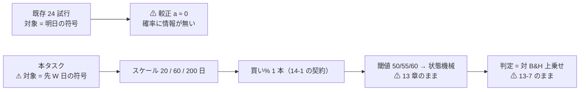
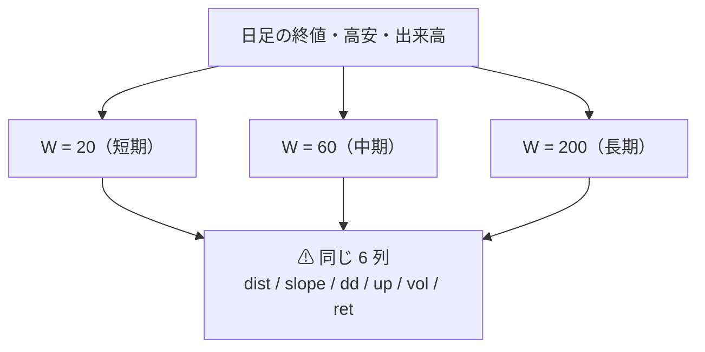
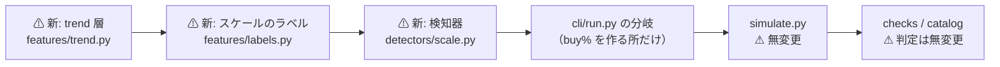
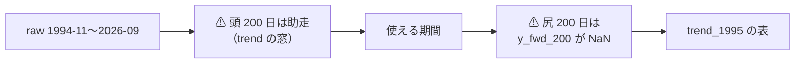

# 下降トレンドの検知の検証（長期・中期・短期）

作成日: 2026-09-12。派生元: [TODO の同名タスク](../../../TODO.md)（利用者の指示 2026-09-11）。
規約: [rules.md](../../specs/experiments/feature-discovery/rules.md)（**正本**。9・11・13・14 章が前提）。
物差し: [threshold-trading.md §7](../../specs/experiments/threshold-trading.md)（対 B&H 上乗せ）。
判定力: [validation-power.md](../../specs/experiments/feature-discovery/validation-power.md)。台帳: [ledger.md](../../specs/experiments/feature-discovery/ledger.md)。

> ⚠ **これは投資助言ではなく調査資料である。** 特定の銘柄・売買を推奨しない。
> ⚠ **資金は動かさない**（2026-08-27 の方針）。取得済みの日足だけを使う。

## 0. このプランが決めること

> この図の主張: ⚠ **動かす軸は 1 つだけ ― 予測の対象を「明日の方向」から「これから W 日が下げか」に変える。** 検証の後ろ（閾値・シミュレータ・判定）は 13 章のまま触らない。

| 決めること | 本プランの答え | どこ |
| --- | --- | --- |
| 何を予測対象にするか | ⚠ **先 W 営業日の累積対数リターンの符号**（W = 20 / 60 / 200） | §2-2 |
| スケールをどう定義するか | ⚠ **窓 W だけで定義し、各スケールに同形の 6 列を与える** | §2-1 |
| 検知器の出力 | ⚠ **買い% 1 本**（14-1 の出力の契約） | §2-3 |
| 門（14-5）をどう扱うか | ⚠ **測って残すが、門前でも回す**（理由は §2-6。⚠ **結果を見る前に決めた**） | §2-6 |
| n_trials | ⚠ **7 手法 × 3 閾値 = 21 試行**（139 → **160**） | §2-7 |

## 1. 問い — この物差しで測れる大きさか

⚠ **回す前に「測れるか」を確かめる**（14-2）。1995 表の検出限界は **2.02bp/日**【実測】（[validation-power.md §8-2-2](../../specs/experiments/feature-discovery/validation-power.md)）。

| 量 | 値 | 出所 |
| --- | ---: | --- |
| 検出限界（符号 5/5・確率 0.8） | **2.02bp/日 ＝ 2,673bp/fold** | 【実測 2026-09-11】 |
| B&H ポートフォリオの 2022 年の下げ | **−2,953bp** | 【実測】validation-power.md §3-2 |
| 検証期間内の 10% 以上の下げ | **11 回** | 【実測】rules.md 14-4 |
| 1 回の下げを完全に休めたときの上乗せ【推測】 | 1,000〜3,000bp（fold に 2〜3 回） | 下げ幅からの試算 |

⚠ **レジーム級なら限界の上に出うる**（validation-power.md §3-2 の読み 3 が名指しでこのタスクを指している）。⚠ **ただし「1 fold に 2〜3 回」なので、限界の 1〜2 倍の位置**であり、⚠ **外れても不思議はない大きさである。**

⚠ **実効標本は日数ではなくエピソードの回数**（14-8）。検証期間 11 回では検定にならないので、⚠ **エピソード表は成果物であって採否には使わない。**

## 2. 事前固定するもの（⚠ 結果を見て動かさない）

⚠ **14-9 に従い、事前固定するのは構造だけ**（スケールの定義・出力が買い% 1 本であること・θ の水準・試す構成の数）。⚠ **「中期 −10% で売り」のような数値は 1 つも手で置かず、訓練分割の内側で学習させる。**

### 2-1. スケール ― 窓だけで定義し、3 つに同じ形の 6 列を与える

> この図の主張: ⚠ **3 スケールの違いは窓 W だけにする。** 列の顔ぶれが違うと、勝ち負けが「スケールの差」か「列の差」か分からなくなる。

新しい特徴量の層 `trend`（`own_` 接頭辞。⚠ **その銘柄自身の履歴だけ**）を足す。W ∈ {20, 60, 200} の各々に:

| 列 | 定義 | ねらい |
| --- | --- | --- |
| `own_trend{W}_dist` | log(終値 / W 日 SMA) | 移動平均に対する位置（古典フィルタの素） |
| `own_trend{W}_slope` | 対数終値の W 日 OLS 傾き × W | トレンドの向きと強さ |
| `own_trend{W}_dd` | log(終値 / W 日の最高値) | 直近の高値からの下落率 |
| `own_trend{W}_up` | W 日のうち上げた日の割合 | 幅（breadth の時間版） |
| `own_trend{W}_vol` | W 日の日次対数リターンの標準偏差 | ⚠ **ボラティリティ・ゲートの通り道**（Moreira-Muir 2017 の方向） |
| `own_trend{W}_ret` | W 日の累積対数リターン | モメンタム |

⚠ **既存の `own` 層（35 本）は 1 列も変えない。** `trend` は別の層で、⚠ **既存の実験の表には入らない**（`feature_layers` に書いた実験だけが持つ）。

### 2-2. ラベル ― 先 W 日の符号（⚠ 下げ幅は置かない）

| # | 決め | ⚠ 理由 |
| ---: | --- | --- |
| 1 | 学習の対象 = **`y_fwd_{W}` ＝ 先 W 営業日の累積対数リターン**。買い% = ⚠ **P(y_fwd_W > 0) の較正**（Platt） | ⚠ **「これから W 日持って得か」がそのまま知りたいこと**。θ=50 は「先 W 日が上がる確率が五分を切ったら休む」のベイズ規則に当たる |
| 2 | ⚠ **下げ幅（−10% など）を置かない** | ⚠ **手で置いた数値は 1 つずつが自由度**（14-9）。符号なら窓 W 以外に選ぶものが無い |
| 3 | 損益（P&L）のラベルは ⚠ **今までどおり 1 日の `y`** | シミュレータは 13-4 のまま。⚠ **学習の対象と損益の対象を混ぜない** |
| 4 | ⚠ **パージは最長ラベルを暦で覆う 300 日**（＝ 営業日 200 本 ≈ 暦 290 日を保守側に丸めた） | 14-7。⚠ **営業日とカレンダーのずれを楽観側に落とさない** |
| 5 | ⚠ **訓練内の holdout も日付で切り、W 日ぶんパージする** | ⚠ **既定の `tail_holdout` は行数で 28 日ぶんしか空けない。** 200 日ラベルでは holdout と頭のラベルが重なり、⚠ **較正と門の値が楽観側に外れる**（§4 Step 2-2） |

### 2-3. 検知器の出力の契約（14-1）

⚠ **検証側は中身を知らない。** 受け取るのは「銘柄 s・日 t の買い% 1 本」だけ。
実装は registry に `detector` の種類を足し、`fn(訓練, 検証, 列, ctx) -> 買い%` で統一する。

| # | 手法 | 中身 | 数える |
| ---: | --- | --- | :-: |
| 1 | `D1 短期ゲート（20日・学習）` | W=20 の 6 列 → Ridge → Platt（対象 `y_fwd_20`） | ✅ |
| 2 | `D2 中期ゲート（60日・学習）` | W=60 の 6 列 → 同上 | ✅ |
| 3 | `D3 長期ゲート（200日・学習）` | W=200 の 6 列 → 同上 | ✅ |
| 4 | `D4 合成ゲート（3スケール平均）` | D1・D2・D3 の買い% の**単純平均**（⚠ **重みを手で置かない**） | ✅ |
| 5 | `C1 短期 SMA20 フィルタ` | `own_trend20_dist > 0` なら買い% 100、そうでなければ 0 | ✅ |
| 6 | `C2 中期 SMA60 フィルタ` | 同上（W=60） | ✅ |
| 7 | `C3 長期 SMA200 フィルタ` | 同上（W=200）。⚠ **Faber 10 か月 ≈ 200 営業日** | ✅ |

⚠ **C1〜C3 は学習しない**ので θ の 3 水準で結果が同じになる（買い% が 0/100 のため）。⚠ **それでも 3 試行として数える**（13-3 の 5・13-9 の 3。数え落とさない側に倒す）。

### 2-4. 閾値・形式 ― 13 章のまま

θ ∈ {50, 55, 60}（事前固定。13-3）。形式は **(A) 銘柄共通 1 本だけ**。
⚠ **(B) 銘柄別は回さない** — 全 12 試行で (A) 以下という実測があり（[threshold-trading.md §4](../../specs/experiments/threshold-trading.md)）、⚠ **回せば n_trials が倍になるだけだから。**

### 2-5. 基準線（13-5 ＋ ⚠ 14-6 の 2 本）

| 基準線 | 実装 | 数える |
| --- | --- | :-: |
| 期初買い・期末売り（B&H） | 買い% を常に 100（13-5） | ❌ |
| 直前リターンの符号 | 既存のまま | ❌ |
| ⚠ **各スケール単独**（14-6 a） | D1・D2・D3 がそのまま単独スケール。⚠ **D4 はこの 3 本の最良に勝って初めて意味がある** | （D は試行） |
| ⚠ **同じ保有日率の乱択ゲート**（14-6 b） | ⚠ **その手法のポジション系列を銘柄ごとに巡回シフト**する（種固定）。⚠ **保有日数はそのまま・休む日だけでたらめ**（⚠ 売買回数は巡回の継ぎ目で ±1 まで動く — 実装時に確認した） | ❌ |

⚠ **巡回シフトを選んだ理由**: 日をでたらめに選び直すと保有日率は合っても**売買回数が跳ね上がり**、コストの差で負けるので「正しい日を休んだか」を分離できない。⚠ **シフトは保有日数と売買回数を保ったまま、日付の対応だけを壊す。**

### 2-6. ⚠ 門（14-5）の扱い ― 測って残し、門前でも回す

⚠ **これは結果を見る前に決める**（規律 1「門が先」を守るため、先に決めて先に書く）。

| # | 決め | ⚠ 理由 |
| ---: | --- | --- |
| 1 | 門の 2 指標（holdout AUC・買い% 幅）を **全検知器について測り `checks.gate` に残す** | 隠さない（14-5） |
| 2 | ⚠ **水準は動かさない**（AUC 0.52・幅 20 点） | 14-5 の事前固定。⚠ **動かしたら門が自由度になる** |
| 3 | ⚠ **門前でも回す**（`--ignore-gate`）。回した分は**全部 n_trials に数える** | ⚠ **門の AUC は大きさを見ない。** 順位だけの指標なので、⚠ **「下げ日の大きさ」に乗るレジームの効果を落としうる**（2022 年の下げ −2,953bp は日数では少数日）。⚠ **門は 1 日地平の確率手法のために作られた指標**である。数える側に倒すので DSR が甘くなる向きではない（14-5 規律 3 の形。1995 表の橋渡し対と同じ扱い） |
| 4 | 門の値は ⚠ **採否に使わない** | 14-5 |

### 2-7. n_trials の数え方

| 内訳 | 数 |
| --- | ---: |
| 検知器 7 本 × θ 3 水準 | **21** |
| 基準線（B&H・直前符号・乱択・乱択ゲート） | 0（数えない。13-9 の 4） |
| leak 対照 | 0（台帳に入らない） |
| ⚠ **合計 n_trials** | **139 → 160**【推測。台帳が数える】 |

⚠ **DSR の基準はそのぶん厳しくなる。それが正しい向きである**（11 章 規約 4）。

## 3. 影響範囲

> この図の主張: ⚠ **触るのは「予測の前」だけ。** シミュレータ・判定・台帳の配線は 1 行も変えない。

| ファイル | 変更 | ⚠ 既存への影響 |
| --- | --- | --- |
| `ail/features/trend.py` | **新規**（`trend` 層・18 列） | 無し（この層を書いた実験だけが持つ） |
| `ail/features/labels.py` | スケールのラベル `y_fwd_{W}` を足す | ⚠ **既定は空**。`label_scales` を書いた実験だけに出る |
| `ail/contracts.py` | `y_fwd_` を説明変数から外す | ⚠ **外し忘れると学習対象がそのまま特徴量になる**（最悪の先読み） |
| `ail/detectors/scale.py` | **新規**（7 本の検知器） | 無し |
| `ail/registry.py` | 種類に `detector` を足す | 無し |
| `ail/models/holdout.py` | 日付で切る holdout を足す | ⚠ 既存の `tail_holdout` は触らない |
| `ail/models/calibrate.py` | 予測と対象を外から渡せる口を足す | ⚠ 既存の `fit` の既定は変えない |
| `ail/validation/simulate.py` | 巡回シフトの乱択ゲートを足す | ⚠ `simulate` 本体は無変更 |
| `ail/validation/gate.py` | 検知器の枝 | 選別の枝は無変更 |
| `ail/validation/checks.py` | エピソード表・乱択ゲートの診断 | ⚠ 判定の量は無変更 |
| `cli/run.py` ／ `cli/build.py` | 検知器の分岐・`trend` 層の並び | ⚠ 既存の経路は無変更（テストで固定） |
| `config/experiment/trend_scales_1995.toml` | **新規** | — |
| `runs/` ／ `ledger.md` ／ `rules.md` 15 章 ／ 記録 | 追記 | ⚠ **既存の行は 1 行も書き換えない** |

## 4. Phase / Step

### Phase 1: 表（特徴量とラベル）

> この図の主張: ⚠ **表の両端が削れる。** 頭は 200 日の助走、尻は 200 日の先読みラベルで、⚠ **どちらも手で選んでいない。**

- Step 1-1: `trend` 層（18 列）と `y_fwd_{W}`（3 列）を実装し、⚠ **先読みの検査を通す**（`tests/test_no_lookahead.py` に列を足す）
- Step 1-2: `config/experiment/trend_scales_1995.toml` を書き、表を作る（⚠ **表も実行も 1 つの config**）。⚠ **開始日は手で選ばない**（助走が終わった日）
- Step 1-3: ⚠ **14-7 の検算** — fold の長さ ≥ 200 営業日 × 6 を実測で確かめる。⚠ **足りなければ fold 数を減らす**（期間はもう延ばせない）

### Phase 2: 検知器と検証の配線

> この図の主張: ⚠ **訓練の内側をもう 1 回割る。** 頭でモデルを学び、⚠ **W 日空けた**尻で較正と門を測る。

- Step 2-1: registry に `detector` を足し、7 本を実装（`ail/detectors/scale.py`）
- Step 2-2: ⚠ **日付で切る holdout**（`date_holdout`）を実装し、⚠ **W 日ぶんパージする**。既定の行数 gap（28 日相当）では 200 日ラベルが重なる
- Step 2-3: `cli/run.py` に検知器の枝。⚠ **buy% を作る所だけ**差し替え、シミュレータ以降は共有
- Step 2-4: 14-6 の乱択ゲート（巡回シフト）と、14-8 のエピソード表を `checks` に足す
- Step 2-5: 日次ポートフォリオ系列を `runs/<実行>/daily.csv` に残す（⚠ **validation-power.md §1 が「保存されていない」と書いた穴を塞ぐ**）

### Phase 3: 回す

- Step 3-1: ⚠ **leak 対照を先に通す**（13-10）。⚠ **上乗せが跳ねなければ配線が壊れている。** 跳ねるまで本番を回さない
- Step 3-2: 本番 1 実行（7 手法 × 3 閾値）。⚠ **門の値は記録するが回す**（§2-6）
- Step 3-3: 台帳を吐き直し、⚠ **既存の 245 行が 1 行も変わらないことを確かめる**

### Phase 4: 記録

- Step 4-1: 記録 `docs/specs/experiments/downtrend-detection.md`（判定・エピソード表・銘柄別 bp・回さなかったもの）
- Step 4-2: `rules.md` に 15 章（⚠ **変更規約の 2 問に先に答える**）
- Step 4-3: `ledger.md` の再生成・`TODO.md` → `DONE.md`・プランを `archive/` へ

## 5. テスト方針

| # | 検査 | ⚠ 落とすもの |
| ---: | --- | --- |
| 1 | ⚠ **先読み**: `trend` の全列と `y_fwd_{W}` が、行を後ろから削っても過去の値を変えないこと | 窓が未来で閉じている事故 |
| 2 | ⚠ **`y_fwd_{W}` が説明変数に入らないこと** | ⚠ **学習対象がそのまま特徴量になる最悪の形** |
| 3 | ⚠ **holdout のパージ**: 頭の最後の日付 ＋ W 日 ≤ 尻の最初の日付 | 較正と門が楽観側に外れる |
| 4 | ⚠ **leak 対照が跳ねる**（上乗せが大きく正・符号 5/5） | 配線が死んでいるのに「効かない」と読む事故 |
| 5 | ⚠ **既存の実験の表と結果が 1 ビットも変わらないこと**（`own_1995` を作り直して突き合わせ） | 既存の数字を黙って動かす事故 |
| 6 | 乱択ゲートが保有日率と売買回数を保つこと | 「休んだだけ」との分離が効かなくなる |
| 7 | `pytest -q tests` 全件 | — |

## 6. 事前の予想（⚠ 外れても成果）

⚠ **予想を先に書く**（[threshold-trading.md §0](../../specs/experiments/threshold-trading.md) が「プラン §5 が事前に予想した形であり、それ自体が成果」と書いた形）。

| # | 予想【推測】 | 根拠 |
| ---: | --- | --- |
| 1 | ⚠ **長期（200 日）が最も上乗せが出やすい。** ただし符号 5/5 は通らない | 下げは fold あたり 2〜3 回しか無く、fold 1 本が外れれば符号が割れる |
| 2 | 短期（20 日）は ⚠ **売買回数が増えてコストに負ける** | 既存 24 試行の (B) と同じ形 |
| 3 | 合成 D4 は ⚠ **最良の単独スケールに勝たない** | 平均は最良を薄める向き |
| 4 | 古典フィルタ C3（SMA200）は ⚠ **学習ゲート D3 と同程度**。学習の上積みは小さい | 6 列のうち効くのが `dist` だけなら同じものになる |
| 5 | ⚠ **生存バイアスが「下げを避けた」の読みを甘くする** | 12-1。⚠ **消えた銘柄が 1 本も無い母集団での回復である** |

⚠ **どれが当たっても外れても、「この設定では効いた／効かなかった」を検証して記録すればタスクは完了である**（採用・収益性を前提にしない）。

## 7. ⚠ 回さないもの（と理由）

| 候補 | 扱い | ⚠ 理由 |
| --- | --- | --- |
| triple-barrier ／ トレンドスキャニングのラベル | 見送り | ⚠ **どちらも下げ幅・倍率という手で置く数値が要る**（14-9 の向きと逆）。符号ラベルで空振りなら、ラベルを凝っても同じ場所に戻る公算が大きい |
| HMM ／ 変化点検知 | 見送り | 状態数・事前分布という自由度が増え、⚠ **1 実行で n_trials が跳ねる。** 本タスクで「スケールに情報があるか」を先に確かめる |
| ボラティリティ・ゲート単独 | ⚠ **各スケールの 6 列に `vol` として入れた**（単独の手法にはしない） | 単独にすると ＋3 試行。まず同じ枠の中で効くかを見る |
| 12 か月モメンタム | 見送り | ⚠ **`own_trend200_ret` が同じ情報**（200 営業日 ≈ 10 か月）。別手法にすると数が増えるだけ |
| (B) 銘柄別 | 見送り | 全 12 試行で (A) 以下という実測（threshold-trading §4） |
| LightGBM ほかのモデル | 見送り | ⚠ **モデルは別の処置**（軸を 2 つ同時に動かさない）。⚠ **足すなら 21 試行がもう 1 組増える** |
