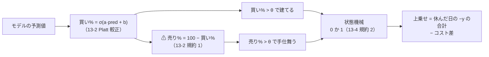
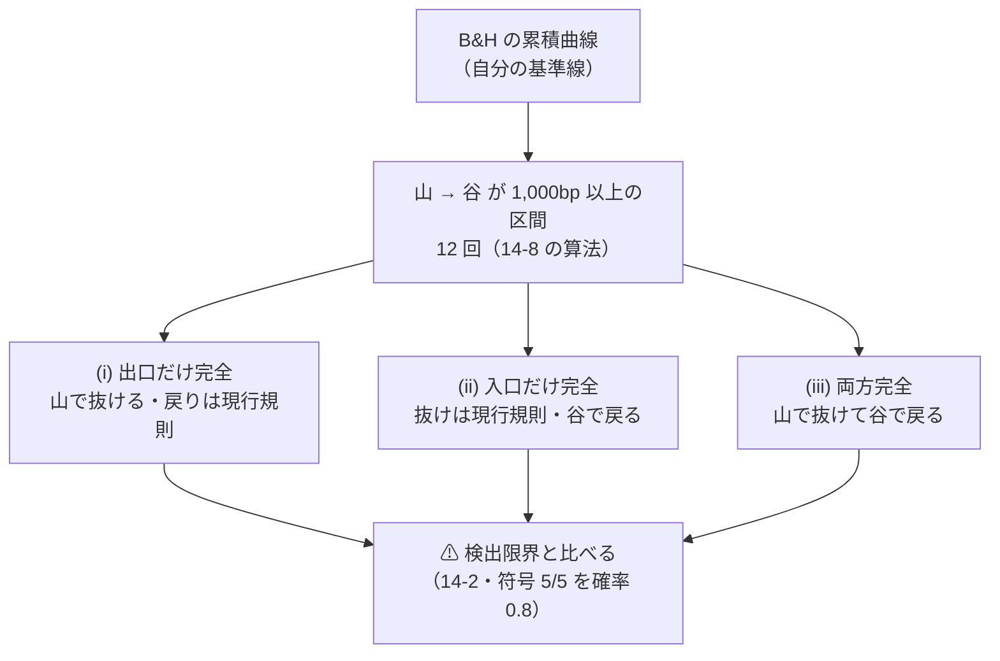
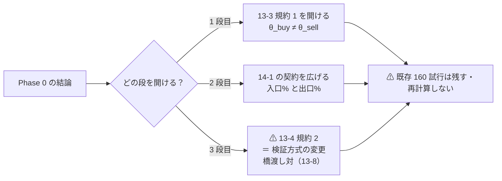
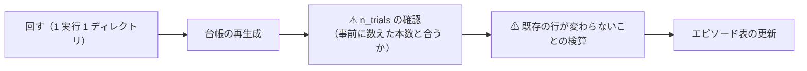

# 下降トレンドでの売買のタイミングを他のパターンでも検証する

- 親タスク: `TODO.md`「下降トレンドでの売買のタイミングを他のパターンでも検証する」
- 派生元: [downtrend-detection.md](../specs/experiments/downtrend-detection.md)（✅ 2026-09-12 完了）
- 記録の置き場: [entry-timing.md](../specs/experiments/entry-timing.md)（Phase 0 から書き足していく）

利用者の指示（2026-09-12）: **下降トレンドでの売買のタイミングを他のパターンも検証したい**
利用者の指示（2026-09-12・追加）: **下降トレンドを主眼にしているけど、上昇トレンドを使うことに意味があるのかも検討する**

## 0. 目的と背景

前タスクで分かったことは 1 行で書ける。⚠ **下げは検知できている。検知できても儲からない。**

5 fold 合計の対 B&H 上乗せを区間で割ると、下げで稼いだ額より回復で取り損ねた額のほうが大きい【実測 2026-09-12】。

| 区間（C3 長期 SMA200・θ=50） | 上乗せ bp |
| --- | ---: |
| 山 → 谷 | ＋17,624 |
| ⚠ 谷 → 回復 | **−21,009** |
| それ以外 | −4,867 |
| 合計 | **−8,252** |

⚠ **だから「もっと良い下げ検知」を足しても効かない。** 動かす軸は退出と再進入のタイミングそのものである。

## 1. ⚠ いまの配線では上昇と下降は別物ではない

> この図の主張: ⚠ **検知器の出力は 1 本しかなく、上昇と下降はその 1 本を上から読むか下から読むかの違いでしかない。**

⚠ **B&H は検証期間ずっと買い持ちなので、持っている日には上乗せが 1bp も生まれない。**
⚠ **上昇の情報に値段が付くのは「休みを終える日」だけである。**

### 1-1. 開ける梯子は 3 段

| 段 | 何を開けるか | 何ができるようになるか | ⚠ 代償 |
| ---: | --- | --- | --- |
| 1 | [13-3](../specs/experiments/feature-discovery/rules.md) 規約 1（θ_buy = θ_sell） | 保有帯を非対称にする（入りにくく／出にくく） | ⚠ **帯をずらすだけ。入口に別の時間スケールを持たせられない**。n_trials は水準の積で増える |
| 2 | [14-1](../specs/experiments/feature-discovery/rules.md)（出力の契約 ＝ 買い% 1 本） | 入口% と出口% を別の検知器から出す（入口は短期・出口は長期） | 契約の変更。⚠ **変更規約の 2 問に先に答える** |
| 3 | [13-4](../specs/experiments/feature-discovery/rules.md) 規約 2（0 か 1・買い増しなし） | 建玉に段階を持たせる。⚠ **保有中の上昇の強さに値段が付くのはこの段だけ** | ⚠ **検証方式の変更 ＝ 橋渡し対（13-8）が要る** |

## 2. Phase 0 — ⚠ 回す前に上限を見積もる（[14-2](../specs/experiments/feature-discovery/rules.md)）

### 2-1. 主張

> この図の主張: ⚠ **神託は「エピソードの日付を知っている」ところまでに限る。** 日ごとの正解を知る神託は上限が無意味に大きくなる。

### 2-2. 算法

⚠ **新しい試行は 1 つも増やさない。** 保存済みの `runs/2026-09-12T15-15-12_trend_scales_1995/daily.csv`（手法 × 閾値 × {`純利bp`, `hold`, `rand`} × 日）だけを読む。

| # | 手順 | ⚠ 注意 |
| ---: | --- | --- |
| 1 | B&H の日次純利 bp から累積を作り、`checks.py` の `_episodes` と同じ算法で 12 エピソードを拾い直す | ⚠ **記録（§5）と一致することを確かめる**。一致しなければ算法の読み違い |
| 2 | 検証日を **山 → 谷 ／ 谷 → 回復 ／ それ以外** に割り、手法ごとに上乗せを 3 つに分ける | ⚠ **[§4](../specs/experiments/downtrend-detection.md) の表を再現できることを確かめる**（C1・C2・C3・D2・D4） |
| 3 | 神託 3 種の上乗せを出す。⚠ **エピソード級の神託では 谷 → 回復 と それ以外 の上限はちょうど 0**（B&H と同じ持ち方になるため） | ⚠ **売買コストを引く**（片道 2.5bp × 2 × 12 回） |
| 4 | 神託 3 種の**日次上乗せ系列**から σ を出し、検出限界（符号 5/5 を確率 0.8）を fold 単位で計算する | ⚠ **14-4 の 2,673bp/fold をそのまま借りない**（σ は手法の張り方で変わる）。この実行の fold 長で計算し直す |
| 5 | 上限 ÷ 検出限界で「測れるか」を判定する | ⚠ **1 桁以上小さければ回す前に打ち切ってよい**（14-2） |
| 6 | ⚠ **銘柄別の神託も出す**（表から各銘柄の山と谷を拾う）。現行規則は銘柄ごとに動くので、⚠ **市場タイミングの神託だけでは上限を低く見積もる** | ⚠ **古典フィルタは学習しない**（「乖離が正なら持つ」）ので表から完全に組み直せる。⚠ **組み直した B&H と C3 が記録と合うことを先に確かめる** |

✅ **2026-09-12 実施。** 道具は `experiments/feature-discovery/cli/ceiling.py`（`python3 -m cli.ceiling --run <実行>`）。
結果は [entry-timing.md](../specs/experiments/entry-timing.md)。⚠ **`runs/` は 44 本のまま・`n_trials` は 160 のまま。**

### 2-3. 出すもの

- (i)(ii)(iii) の上乗せ bp（合計・fold 単位・日次）
- ⚠ **(ii) が上昇トレンドを追う価値の上限** ＝ 追加指示への数字での答え
- 各神託の検出限界と、その比
- ⚠ **生存バイアスの効き方**（12 回が 12 回とも回復した標本なので (ii) は構造的に大きく出る。[12-1](../specs/experiments/feature-discovery/rules.md)）

### 2-4. Phase 0 で決めること

| 決めること | 選択肢 |
| --- | --- |
| どの型を試すか | `TODO.md` の候補から本数を固定（⚠ **事前に数える**） |
| 梯子の何段目まで開けるか | 1 段目だけ ／ 2 段目まで ／ 3 段目（橋渡し対） |
| そもそも回すか | ⚠ **上限が検出限界を下回るなら「測れない」で打ち切る** |

## 3. Phase 1 — 規約の更新

⚠ **変更規約の 2 問（なぜ変えたか ／ 変える前の結果をどう扱うか）に先に答えてから書く。** 動かす条は Phase 0 の結論で決まる。

✅ **2026-09-12 完了 — 開けたのは 2 段目だけ**（[rules.md 16 章](../specs/experiments/feature-discovery/rules.md)）。

| Phase 1 で決めたこと | 答え |
| --- | --- |
| 開けた条 | **14-1 の出力の契約**（買い% 1 本 → 入口% と出口%）と **13-2 規約 1**（売り% = 100 − 買い%）の 2 つだけ |
| 開けなかった条 | ⚠ **13-3（θ は共通・3 水準）・13-4（0/1 の状態機械）・13-7（物差し）。** ⚠ **検証方式は変えていない**ので 13-8 の橋渡し対は要らず、既存 **217** 試行と直接比べられる |
| ⚠ **なぜ対称構成を回さないか** | ⚠ **Platt 較正はラベルを反転すると係数が反転するだけ**なので、同じ窓で出口を独立に較正しても厳密に 100 − 入口% になる（16-2）。⚠ **非対称性は窓の違いからしか生まれない** |
| 試す構成の本数（⚠ **結果を見る前に固定**） | 窓の順序対 **6**（20/60・20/200・60/200 ＋ ⚠ **逆向き 3 つは対照**）× 系統 **2**（D 学習ゲート・C 古典フィルタ）× θ **3** ＝ ⚠ **36 試行** |
| 代償【実測 2026-09-12】 | n_trials **217 → 253** ／ DSR（`n_obs` 6,336・年率 0.85）**0.9291 → 0.9221** |
| 動かさない軸 | 形式 (A) だけ ／ 表は `trend_scales_1995`（us63・1995）1 本 ／ モデル Ridge ／ ⚠ **出来高は足さない**（別の処置） |

## 4. Phase 2 — 実装

入口と出口を別に持てる形にする。触る先は `ail/detectors/` と `ail/validation/simulate.py`。

⚠ **leak 対照が跳ねることを先に確認する**（[7 章 規約 7](../specs/experiments/feature-discovery/rules.md)）。非対称なタイミングを入れると配線が複雑になるので、`LEAK_` 列で跳ねなければ実装を疑う。

## 5. Phase 3 — 回して記録

## 6. テスト方針

| 段 | 何を確かめるか |
| --- | --- |
| Phase 0 | ⚠ **エピソード 12 回と §4 の 3 分割が記録と一致すること**（一致しなければ算法の読み違い） |
| Phase 2 | feature-discovery のテストが通ること ／ ⚠ **leak 対照が跳ねること** ／ 対称な設定にすると既存の結果と一致すること（退化の検査） |
| Phase 3 | ⚠ **既存の台帳の行が 1 行も変わらないこと** ／ n_trials が事前に数えた本数と合うこと |

## 7. 影響範囲

| 段 | 触る | 触らない |
| --- | --- | --- |
| Phase 0 | ⚠ **何も触らない**（読むだけ・新しい実行を作らない） | — |
| Phase 1 | `docs/specs/experiments/feature-discovery/rules.md` | 既存の `runs/` ／ 台帳の既存行 |
| Phase 2 | `ail/detectors/` ／ `ail/validation/simulate.py` ／ テスト | ⚠ **物差し（13-7）は変えない** |
| Phase 3 | `runs/`（新規）／ `ledger.md`（再生成） | 既存の `runs/` |

⚠ **管理画面は触らない**（検証タブは `runs/` を読むだけ。[dashboard.md §10](../specs/dashboard.md)）。
