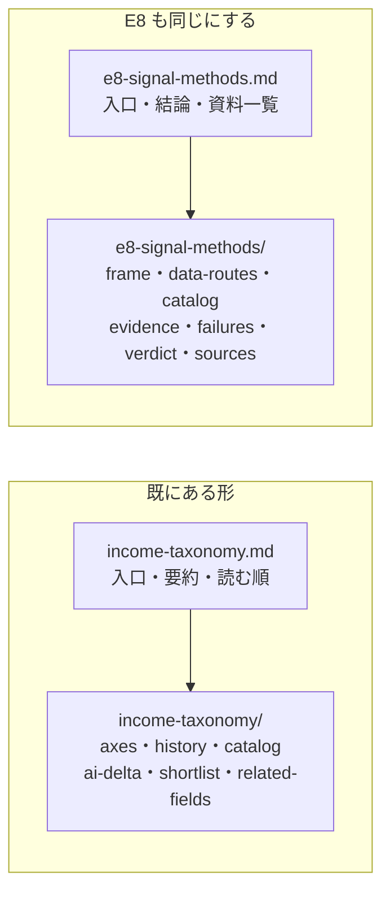

# E8 の記録（846 行）を分割して、トップに資料一覧と概要を置く

作成日: 2026-09-08。対象: [docs/specs/experiments/e8-signal-methods.md](../../specs/experiments/e8-signal-methods.md)（**846 行**）。

## 1. 目的と背景

2026-09-08 に E8（譲渡益を繰り返し実現する運用）の判定を 1 ファイルに書いた。
**カタログ 93 件・失敗台帳・出典 42 件・判定が 1 本に同居していて、開いた人がどこを読めばよいか分からない。**

利用者の指示（2026-09-08）は 3 本。

| # | 指示 | プランでの形 |
| --- | --- | --- |
| 1 | **ファイル分割して見やすくして** | 節の単位で 7 本に割る。§3 |
| 2 | **トップが資料一覧と概要** | `e8-signal-methods.md` を**入口**にし、結論 ＋ 資料一覧 ＋ 読む順 ＋ 記号の早見表だけを置く。§3-1 |
| 3 | **その下に調査ごとの資料がぶら下がる** | `e8-signal-methods/` を作って Phase 単位のファイルを置く。§3-2 |

⚠ **対象はこの 1 本だけ。** `docs/specs` 全体の作り直しは行わない（利用者が 2026-09-08 に範囲を確定した）。

## 2. 既にあるお手本 — income-taxonomy と同じ形にする

> この図の主張: このリポジトリには既に「入口の 1 枚 ＋ 中身のディレクトリ」の形がある。**E8 をそれに揃えるだけで、新しい約束事は増えない。**

⚠ **vibeboard は Specs タブでディレクトリを再帰的に辿り、`README.md` があればその見出しをディレクトリ名に併記する**（`vibeboard/src/server.ts` の `listTree`）。
本件は `README.md` を作らず、**入口を 1 階層上の `e8-signal-methods.md` に置く**（income-taxonomy と同じ）。⚠ **ディレクトリ名とファイル名が対になるので、vibeboard のツリーでも隣に並ぶ。**

## 3. 分割の割り方

### 3-1. トップ（入口）

`docs/specs/experiments/e8-signal-methods.md` に残すもの。

| 中身 | 元 |
| --- | --- |
| 前書き（投資助言ではない・資金を動かしていない） | 現状の冒頭 |
| **結論** | §0 |
| ⚠ **資料一覧**（どのファイルに何があるか・行数） | **新規** |
| ⚠ **目的別の読む順** | **新規** |
| ⚠ **記号の早見表**（当てにいくもの 4 種・粒度 L0〜L3・根拠 強/中/弱・失敗の型 X1〜X12） | **新規**（いまは §1-2 と §6-3 に散っている） |

### 3-2. ぶら下げるファイル（`e8-signal-methods/`）

| ファイル | 中身 | 元の節 | 行数の目安 |
| --- | --- | --- | ---: |
| `frame.md` | 調査の枠（Phase 0）。入力の線引き・属性・物差し・回転数とコスト・破産確率・⚠ 法令上の上限・商品の段 | §1 | 約 130 |
| `data-routes.md` | 使えるデータ経路（Phase 1）。⚠ **tastytrade で過去の足が取れた【実測】** | §2 | 約 70 |
| `catalog.md` | 手法カタログ（Phase 2）。**12 系統 93 件**と周回の記録 | §3 | 約 195 |
| `evidence.md` | 根拠の強さと反証（Phase 3）。3 段の判定・年 1000% 級の実在・decay・5 ゲート・**達成率** | §4・§5 | 約 180 |
| `failures.md` | 失敗台帳。台帳・再検査・**型ごとの件数** | §6 | 約 90 |
| `verdict.md` | 判定（Phase 4）と、方針との関係・この調査の限界・再現の仕方 | §7・§9 | 約 70 |
| `sources.md` | 出典 42 件 | §8 | 約 75 |

⚠ **§4 と §5 は分けない。** どちらも Phase 3（周回 6・7）で、⚠ **根拠を付ける工程と絞る工程は続けて読まないと達成率の意味が取れない**ため。
⚠ **§7 と §9 も分けない。** 判定と「その判定の限界」は隣に置く。

### 3-3. ⚠ 節番号は変えない

§1〜§9 の番号はそのまま残す。**変えると DONE.md・他の spec からの参照（「§2-1 の Candle」など）が全部ずれる**ため。
⚠ **ファイルをまたぐ参照だけリンクにする**（例: `§1-4` → `[枠 §1-4](e8-signal-methods/frame.md)`）。
⚠ **同じファイル内の参照は素の `§1-4` のまま**にする。

## 4. 影響範囲

| 対象 | 何が要るか |
| --- | --- |
| `docs/specs/experiments/e8-signal-methods.md` | 中身を入れ替え（入口に） |
| `docs/specs/experiments/e8-signal-methods/` | **新規 7 ファイル** |
| 内部の節参照 | ⚠ **ファイルをまたぐものをリンクに書き換える**。⚠ `§1256`・`§31`（税法・SEC）と「プラン §4-4」等の**外部参照は触らない** |
| 相対パス | ⚠ サブファイルからは 1 階層深くなる。`../online-tradable-assets.md` → `../../online-tradable-assets.md` |
| 他の spec からの参照 6 件 | ⚠ **入口のパスは変わらないので切れない。** ただし「§2-1」のように**節を名指ししているものは、その節のファイルへ向け直す** |
| `DONE.md` | 成果物の行にファイル構成を 1 行足す |
| CLAUDE.md | ⚠ **触らない**（`docs/specs/experiments/` は「1 手法 1 ファイル」と書いてあるが、⚠ **入口が 1 ファイルである点は変わらない**ので約束は破らない） |

## 5. テスト方針

| # | 見るもの | やり方 |
| ---: | --- | --- |
| 1 | ⚠ **文章が 1 行も落ちていない** | 分割前後で本文の行を突き合わせる（見出しと新規節を除いて差分ゼロ） |
| 2 | リンクが切れていない | 相対リンクの実在チェック（前タスクで使ったスクリプト） |
| 3 | 表の桁が崩れていない | 各表の `|` の数が行ごとに一致するか |
| 4 | ⚠ **カタログ 93 件と型の集計が変わっていない** | ID を数え直し、型ごとの件数を再集計して本文と照合 |
| 5 | ⚠ **またぐ節参照が全部リンクになっている** | `§` の残りを目視で分類（外部参照だけが素で残る） |

## 6. Phase

| Phase | 中身 |
| --- | --- |
| **1** | サブファイル 7 本を切り出す（相対パスの深さも直す） |
| **2** | トップを入口に書き換える（結論 ＋ 資料一覧 ＋ 読む順 ＋ 記号早見表） |
| **3** | またぐ節参照をリンクに書き換える |
| **4** | 他の spec からの参照を、節を名指ししているものだけ向け直す |
| **5** | §5 の 5 項目で検証し、DONE.md を更新してプランを archive へ |
