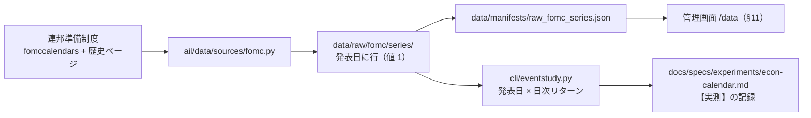

# 経済指標の発表日（暦）を取り、発表日と株価の関連を検証する

作成: 2026-09-09 / 記録: [docs/specs/experiments/econ-calendar.md](../../specs/experiments/econ-calendar.md)（Phase 4 で作成）

## 目的・背景

利用者の指示（2026-09-09）: **雇用統計の発表日など経済に影響を与える状況も取得する。⚠ 重要なのは発表日と株価との関連**。

これまでの外部系列（為替・災害など）と種類が違い、⚠ **値ではなく「暦」である**。
発表の予定日は事前に公表されるので、⚠ **「明日は発表日」を特徴量にしても先読みにならない**
（発表された**値**のほうは発表時刻まで知り得ない。値まで使うなら `ex_` 層のずらし規約に載せる）。

## 対応方針

> この図の主張: ⚠ **暦も他の外部系列と同じ経路に載せる**（source → raw → manifest → 検証と管理画面）。検証だけが event study で別。

| # | 決めごと | ⚠ 理由 |
| ---: | --- | --- |
| 1 | ⚠ **Phase 1 は規約**（いつもの順番）。実測の結果は下の表 | 「取れるか」より先に「取ってよいか」で落ちる |
| 2 | ⚠ **BLS（雇用統計・CPI）は採らない** — www / download とも、連絡先入りの UA でも **403** を実測（2026-09-09）。拒否ページに「ポリシーに従わないボットは禁止」と明記 | SPC・Stooq と同じ扱い。⚠ **UA の偽装で回り込まない。** 雇用統計の発表日は FRED の releases API でも取れるが、⚠ **FRED は既に「要判断」**（TODO「データの取得元を広げる」）なのでそちらに合流 |
| 3 | 今回は **FOMC（政策決定の発表日）** を取る。BEA（GDP）は残作業 | FOMC は robots.txt 無し（404）＋ 米政府の著作物で判断の外側。⚠ **「発表日と株価の関連」の検証は FOMC だけで成立する**（2018〜 で約 70 回） |
| 4 | 暦は「発表日に行がある系列」（値 1）として `raw/fomc/series/` に置く | 災害・地震と同じ形（⚠ **行が無い日 = 事象が無い日**）。既存の取得・検査・manifest・管理画面の経路がそのまま使える |
| 5 | ⚠ **予定（未来の日付）も残す** | 暦の本質は「事前に公表されること」。検証は過去分だけを使う |
| 6 | 検証は **event study**（`cli/eventstudy.py`）。発表日・前日・翌日・その他で日次リターンの分布を比べる | ⚠ **選別パイプライン（`cli.run`）の形ではない**。仮説は「方向」ではなく「分布が変わる（ボラが上がる）」 |
| 7 | ⚠ **曜日をそろえた対照を必ず併置する** | FOMC の発表はほぼ水曜。⚠ **「発表日 vs 全日」では曜日効果と区別できない**。同じ曜日の非発表日と比べ、並べ替え検定で p を出す |
| 8 | 枠は「本命」、仮説を取得の前に宣言（`config/dataset/econ_calendar.toml`） | ⚠ **仮説: 政策決定の発表日は値動きの分布が変わる（ボラが上がる）** |

### Phase 1 規約【実測 2026-09-09】

| 取得元 | robots.txt | 判定 |
| --- | --- | :-: |
| ⚠ **BLS**（`www.bls.gov` / `download.bls.gov`） | ⚠ **robots.txt 自体が 403（Access Denied）**。連絡先入り UA でも同じ | ⚠ **採らない** |
| **連邦準備制度**（`www.federalreserve.gov`） | 無し（404） | ✅ 公有 |
| **BEA**（`www.bea.gov`） | Drupal の管理系パスのみ禁止。ニュース発表は対象外 | ✅ 公有（今回は残作業） |

## 影響範囲

- `experiments/feature-discovery/ail/data/sources/fomc.py` — **新設**（現行ページ 2021〜 ＋ 歴史ページ 2018〜20 を解析。1 秒間隔）
- `experiments/feature-discovery/config/dataset/econ_calendar.toml` — **新設**（枠・仮説の宣言）
- `experiments/feature-discovery/config/sources.toml` — `fomc` を追記（規約の判定。⚠ 暦なので `lag_days` は無し）
- `experiments/feature-discovery/cli/eventstudy.py` — **新設**（発表日 × 日次リターンの event study）
- `experiments/feature-discovery/tests/` — `test_fomc.py`（解析）・`test_eventstudy.py`（日の分類と対照）
- `docs/specs/experiments/econ-calendar.md` — **新設**（記録と判定）
- 管理画面はコード変更なし（`raw_fomc_series.json` と config の宣言を §11 の経路がそのまま拾う）

## テスト方針

| # | 検証 | どうやって |
| ---: | --- | --- |
| 1 | 解析が両方の形式を読める | 固定 HTML 断片: 現行（month ＋ `27-28*`）と歴史（`Jul/Aug 31-1 Meeting - 2018` の月またぎ含む） |
| 2 | 発表日 = 会合の最終日 | `January 30-31` → 01-31。月またぎ `Jul/Aug 31-1` → 08-01 |
| 3 | event study の日の分類 | 発表日・前日・翌日が取引日ベースでずれないこと（週末を挟む場合） |
| 4 | 曜日対照 | 対照群が同じ曜日だけから作られること |
| 5 | 管理画面 | 取得後に `/data` の外部系列に fomc が枠・仮説つきで出る |

## Phase / Step

- Phase 1: 規約の実測（済み。上の表）
- Phase 2: 取得 — `fomc.py`・`econ_calendar.toml`・`sources.toml`・解析テスト → `cli.fetch --exog econ_calendar`
- Phase 3: 検証 — `cli/eventstudy.py`（曜日対照 ＋ 並べ替え検定）→ SPY で実測
- Phase 4: 記録 — `docs/specs/experiments/econ-calendar.md`（判定つき）、管理画面の確認、TODO → DONE
