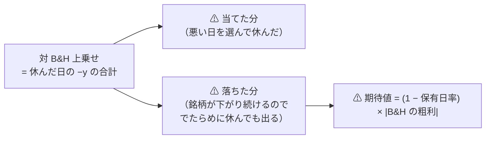

# 段 1 の後始末 — 物差しの穴と、先物を転がす ETF の扱い

- 親タスク: `TODO.md`「物差しの穴を検討する」／「先物を転がす ETF の扱いを事前に決めて回し直す」
  ⚠ **2 タスクで 1 プラン**（順番に依存があるため。物差しの結論が出ないと回し直しの物差しが決まらない）
- 派生元: [universe-lowcorr-trade.md](../../specs/experiments/universe-lowcorr-trade.md)（✅ 2026-09-12 完了）
- 記録: [edge-drift-bias.md](../../specs/experiments/edge-drift-bias.md)

## 0. 何が起きたか

⚠ **段 1 で、追加 11 本の上乗せの 99.3% が UNG と USO の 2 本に集中した。**
⚠ **その 2 本は買って持つだけで壊滅する**（B&H −57,308bp・−16,780bp）。

> この図の主張: ⚠ **上乗せは「当てた分」と「基準線が落ちた分」の**和**である。** 分けないと読めない。

## 1. 調べること

| # | 問い | 答え方 |
| ---: | --- | --- |
| 1 | 上乗せのうち「でたらめに休んだだけ」で出る分はいくらか | ⚠ **保存済みの `per_symbol.csv` から銘柄ごとに計算する**（新しい実行を作らない） |
| 2 | UNG・USO の上乗せは、その分を引いても残るか | 同上 |
| 3 | 物差し（13-7）を変えるべきか | ⚠ **変えると 190 試行が全部別定義になる**（13-8 の橋渡し対が要る）。⚠ **変えずに済むかを先に見る** |
| 4 | 先物を転がす ETF をどう扱うか | ⚠ **結果を見て外すと選別になる。** ⚠ **取得の前に決められる基準で規則を書く** |

⚠ **既に道具はある**: [14-6 b](../../specs/experiments/feature-discovery/rules.md) の**乱択ゲート**が「正しい日を休んだのか、ただ休んだだけか」を分ける基準線である。
⚠ **ただしポートフォリオ単位でしか出していない。** ⚠ **銘柄ごとには保存していない。**

## 2. Phase

### Phase 0: 測る（⚠ 新しい実行を作らない）

⚠ **同じ日数をでたらめに休んだときの上乗せの期待値**を銘柄ごとに出し、上乗せから引く。
期待値 ＝ **−(1 − 保有日率) × B&H の粗利**（休む日が無作為なら、落とす損益は全体に比例する）。

### Phase 1: 物差しをどうするか決める

| 選択肢 | ⚠ 代償 |
| --- | --- |
| (i) 13-7 を変える（ドリフト調整した上乗せを採否に使う） | ⚠ **190 試行が全部別定義になる。** 橋渡し対が要る |
| (ii) 変えない。⚠ **診断列として併記する**（14-3 と同じ形） | ⚠ **採否は変わらない。** 読み違いを防ぐだけ |

### Phase 2: 先物を転がす ETF の規則を事前に書く

⚠ **規則は取得の前に決められる基準で引く**（商品の仕組み。⚠ **測った成績では引かない**）。
⚠ **書いてから回す。** ⚠ **別の試行として数える。**

### Phase 3: 回して記録

⚠ **leak 対照を通す ／ 台帳を再生成して既存行が変わらないことを検算する。**

## 3. 影響範囲

| 触る | 触らない |
| --- | --- |
| 分析の道具（新規）／ 記録 ／ `config/universe/`（新規 1 本）／ `runs/`（新規） | ⚠ **`ail/` の実行経路 ／ 既存の config ／ 既存の `runs/`** |

## 4. テスト方針

⚠ **道具を足すならテストを付ける**（期待値の式・保有日率 1.0 で 0 になること・符号）。
⚠ **既存の台帳の行が変わらないこと。**
