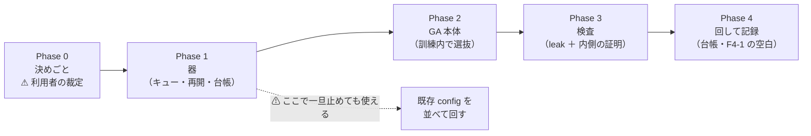
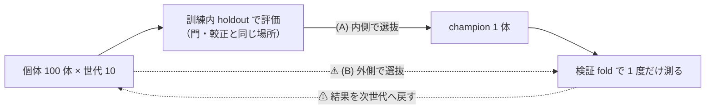
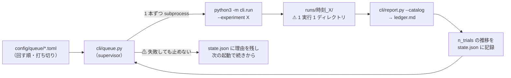
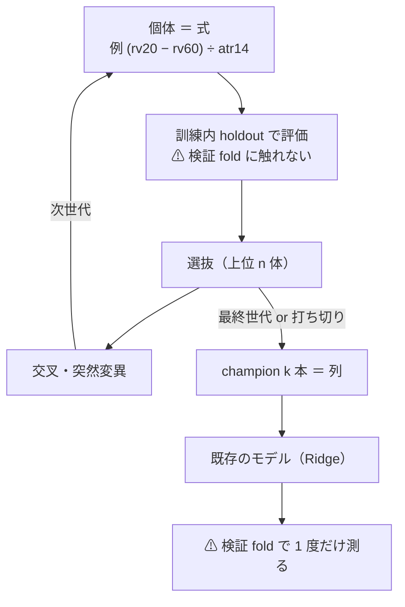
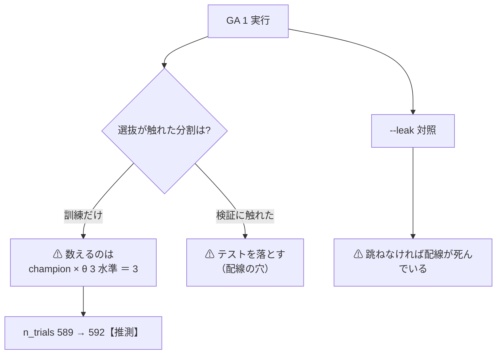

# 進化的探索の実行を継続して回せる仕組み — 実装プラン

> ⚠ **これは投資助言ではなく調査資料である。** 数字のうち【実測】以外は【推測】である。

TODO: 「DeepLearning と進化的探索（遺伝的アルゴリズム）を使った検証をかなり増やす。進化的探索の実行を継続して回せる仕組みを入れる」の残り 1 件。
関連: [rules.md](../specs/experiments/feature-discovery/rules.md) ／ [ledger.md](../specs/experiments/feature-discovery/ledger.md) ／ [ts-trend-ai-survey.md §7](../specs/experiments/ts-trend-ai-survey.md)（優先 1・判定「採る」）

---

## 0. 何を作るか

⚠ **2 つある。混ぜない。**

| | 作るもの | ⚠ 単体で価値があるか |
| --- | --- | --- |
| **器** | 実験を**並べて回し続ける**仕組み（キュー・失敗時の再開・台帳の自動更新） | ✅ **ある。** GA が無くても、既存の config を並べて回すだけで効く |
| **中身** | **進化的探索**そのもの（個体を対決させ、勝者から次世代を作る） | ⚠ **器が無いと 1 世代ごとに手で起動することになる** |

⚠ **収益は期待しない。** 採る 0 件・落とす 511 件のいま、これは「**探索を増やす器**」であって収益化の手段ではない（[14-10](../specs/experiments/feature-discovery/rules.md)）。

各 Phase の位置づけ:

---

## 1. 背景

- 利用者の指示（2026-09-10）: **DeepLearning と GAN を使った検証をかなり増やす。GAN の実行を継続して回せる仕組みを入れる**。⚠ **「GAN」は遺伝的アルゴリズム（進化的モデル探索）の意味**（2026-09-10 に改題）
- ⚠ **手法を増やす側は 2026-09-15 に閉じた**（優先 2・3 とも「落とす」）。⚠ **残るのがこの器である**
- [ts-trend-ai-survey.md §7](../specs/experiments/ts-trend-ai-survey.md) の総括: 「次のタスクの主役は、**優先 1（進化的探索の基盤）**に参加者を載せる構成」

---

## 2. ⚠ 核心の問題 — 選抜をどこでやるか

⚠ **進化的探索は「選抜」を含む。選抜を検証 fold の結果で行うと、検証データで最適化したことになる**（[rules.md 3 章 B](../specs/experiments/feature-discovery/rules.md)）。⚠ **これが決まらないと、数える規則も、結果の読み方も決まらない。**

この図の主張: ⚠ **同じ GA でも、選抜を置く場所で「1 試行」にも「1,000 試行」にもなる。**

| | (A) 訓練分割の内側で選抜 | ⚠ (B) 検証 fold の結果で選抜 |
| --- | --- | --- |
| 検証 fold に出るもの | ⚠ **champion だけ**（fold ごとに 1 体） | 個体 × 世代の全部 |
| n_trials | **＋3**（champion × θ 3 水準） | ⚠ **＋1,000**【推測】 |
| 規約 | ✅ [3 章 B](../specs/experiments/feature-discovery/rules.md)・[14-9](../specs/experiments/feature-discovery/rules.md)（数値の組み合わせは訓練の内側で学習させる）に合う | ⚠ **3 章 B 違反** |
| 数えない根拠 | ✅ [14-5](../specs/experiments/feature-discovery/rules.md) の門と同型（⚠ **訓練内 holdout しか見ていないものは、偶然の最大値を作る母集団に入らない**。[validation-power.md §5-4 問 2](../specs/experiments/feature-discovery/validation-power.md)） | — |
| 実行時間 | 1 実行で完結 | 世代ごとに検証を回すので ⚠ **10 倍以上** |

**推奨: (A)。** ⚠ **(B) は「速く良い数字が出る」が、その数字は検証データに合わせただけである。** ⚠ **(B) を選ぶなら、規約として rules.md に「世代 × 個体を全部数える」と書いてからでないと回さない。**

⚠ **(A) でも消えないもの**: champion は**訓練内 holdout に対して過適合しうる**。⚠ **だから検証 fold の数字は「探索した結果の代表 1 体」であり、探索の上限ではない。**

---

## 3. Phase 0: 決めごと（⚠ 利用者の裁定が要る）

| # | 決めること | 選択肢 | ⚠ 推奨 |
| ---: | --- | --- | --- |
| **(a)** | **選抜の位置** | (A) 訓練分割の内側 ／ (B) 検証 fold | ✅ **(A) に決定（2026-09-16・利用者の裁定）** |
| **(b)** | **個体は何か** | (1) 式（記号回帰 ＝ **F4-1**） ／ (2) 特徴量の部分集合（F2-4） ／ (3) 設定の組み合わせ | ✅ **(1) 式 に決定（2026-09-16・利用者の裁定）** |
| **(c)** | **打ち切り条件** | 世代数の上限 ／ 時間の上限 ／ 改善が止まったら止める | ✅ **3 つとも事前固定に決定（2026-09-16・利用者の裁定）**（§3-2） |

✅ **(a) は 2026-09-16 に (A) で決まった。** ⚠ **これで以下が固定される** — GA は `te`（検証 fold）を**受け取らない**（渡したら落ちるテストを Phase 3 で書く）／ 検証 fold に出るのは fold ごとの champion 1 体だけ ／ ⚠ **n_trials は ＋3**（champion × θ 3 水準）で、⚠ **世代 × 個体は数えない**（[14-5](../specs/experiments/feature-discovery/rules.md) の門と同型）／ 既存 589 試行と同じ土俵で読める。
⚠ **(A) でも「探索したら儲かる」は示せない。** 示せるのは ⚠ **探索が出した代表 1 体がどこに着地したか**だけである（champion は訓練内 holdout に過適合しうる）。

⚠ **(b) で (2) を選ぶと、2026-09-16 の見送りを覆すことになる。** 理由はまだ生きている — ⚠ **F2-1 が 1 fold で約 440 通りを探索して B&H を 3 θ とも超えなかった**【実測】ので、⚠ **2^35 通りを探しても増えるのは多重検定だけである**。
⚠ **(1) を選ぶと、台帳の空白「F4-1 遺伝的プログラミング・記号回帰（手間 大・n_trials の数え方を先に決める）」が同時に埋まる。** ⚠ **前提だった「数え方」は (a) が決めれば決まる。**

### 3-2. ⚠ 事前固定（構造だけ。2026-09-16・回す前に書いた）

⚠ **[14-9](../specs/experiments/feature-discovery/rules.md) の要件**: 事前固定するのは**構造**だけで、⚠ **式の中の数値は訓練分割の内側で学習させる**。⚠ **結果を見て動かさない。**

**個体 ＝ 式**

| 項目 | 値 | ⚠ 理由 |
| --- | --- | --- |
| 入力 | `own_2018` の 35 列 | ⚠ **表は作り直さない**（[13-8](../specs/experiments/feature-discovery/rules.md)。表の差を混ぜない） |
| 演算子 | `＋ − × ÷`（保護）・`log|x|`・`sqrt|x|`・`neg`・`abs` の **8 つ** | ⚠ **時間方向の演算子（lag・rolling）は入れない** — ⚠ **先読みが入りやすく**（[7 章](../specs/experiments/feature-discovery/rules.md)）、既存の列が既に窓を持っている |
| 定数 | あり（生成時 [−1, 1] の一様乱数） | ⚠ **値は訓練の内側で決まる**（14-9 そのもの） |
| 大きさの上限 | 深さ 6 ／ ノード 30 | ⚠ **膨張を止める。** 同点なら短い式を採る |

**GA の構造**

| 項目 | 値 |
| --- | --- |
| 個体数 ／ 世代数の上限 | **100** ／ **20** |
| 選抜 | トーナメント（サイズ 3）＋ エリート 2 体 |
| 交叉率 ／ 突然変異率 | 0.7 ／ 0.2 |
| 種 | 0（config の `validation.seed`） |

**適合度 — ⚠ 訓練分割の内側だけで測る**

| 項目 | 値 | ⚠ 理由 |
| --- | --- | --- |
| 測る場所 | 訓練分割の尻 `tail_holdout`（frac 0.1） | ⚠ **門・較正と同じ場所**（[13-2 の 2](../specs/experiments/feature-discovery/rules.md)）。⚠ **検証 fold には特徴量にも触れない** |
| 指標 | その式 1 列と y の **Spearman 順位相関の絶対値** | 符号は後段の Ridge が学ぶ |
| 無効な式 | 適合度 0（定数・NaN 過多） | ⚠ **0 で埋めるのはここだけ**（測れないのではなく「使えない」ため） |

**champion の作り方 ／ 打ち切り（⚠ 3 つとも）**

| 項目 | 値 |
| --- | --- |
| champion | 上位から、⚠ **既に選んだ式と `|ρ| > 0.9` のものを落としながら** k = **16** 本 |
| 打ち切り 1（主） | 世代数 **20** |
| 打ち切り 2（保険） | 1 fold あたり **600 秒** |
| 打ち切り 3 | ⚠ **訓練内 holdout の最良適合度が 5 世代改善しなければ止める** |

**検証側（⚠ 既存と 1 つも変えない）**: 表 `own_2018` ／ モデル Ridge ／ k 16 ／ θ {50, 55, 60} ／ 形式 (A) shared ／ folds 5 ／ purge あり ／ コスト 5bp ／ 銘柄 us63。
⚠ **動かす軸は「列の作り方」だけ**なので、先行の実行（`trade_own_ridge_a` ほか）とそのまま並べて読める。

⚠ **n_trials は 589 → 592**（champion × θ 3 水準）【推測】。

---

---

## 4. Phase 1: 器（キュー・失敗時の再開・台帳の自動更新）

この図の主張: ⚠ **器は `cli/run.py` を置き換えない。外から 1 本ずつ起動して、結果を台帳に通すだけである。**

| 作るもの | 中身 |
| --- | --- |
| `config/queue/<名前>.toml` | ⚠ **回すものと打ち切りを事前に書く**。実験名の並び（or GA の設定）・世代の上限・時間の上限・`--leak` を通すか |
| `cli/queue.py`（新規） | ⚠ **subprocess で `cli.run` を起動する**（同じ プロセスで回すと 1 本の失敗で全部落ちる）。1 本終わるごとに台帳を吐き直す |
| `runs/queue/<キュー名>.json` | ⚠ **状態**（済み・失敗・残り・各実行のディレクトリ名・n_trials の推移）。⚠ **これがあるから途中で落ちても続きから再開できる** |

⚠ **既存の規約をそのまま守る**: 1 実行 1 ディレクトリは `ail/runs.Run` が既にやる ／ seed・config・入力の指紋・git commit も既存 ／ ⚠ **`--leak` 対照は「回す」側の義務**なので、キューは本番 1 本につき leak 1 本を自動で並べる（[14-10 規約 6](../specs/experiments/feature-discovery/rules.md)）。

⚠ **台帳の自動更新は「吐き直す」だけで、数字は作らない**（`ail/catalog.py` が正本）。

---

## 5. Phase 2: GA 本体

この図の主張: ⚠ **世代を回すループは全部「訓練分割の内側」に入っている。外に出るのは champion だけである。**

- 置き場所: `ail/search/evolve.py`（新規）＋ `ail/bootstrap.py` に 1 行（[10 章 規約 4](../specs/experiments/feature-discovery/rules.md)）
- registry の種類: ⚠ **`transform`**（既存の列から**新しい列を作る**ので `selector` の契約に入らない。[selectors-small-four.md §1-1](../specs/experiments/selectors-small-four.md) と同じ判断）
- ⚠ **事前固定するのは構造だけ**（[14-9](../specs/experiments/feature-discovery/rules.md)）: 演算子の集合・個体数・世代数・選抜の規則・k・種・holdout の取り方・θ の水準
- ⚠ **式の中の数値は固定しない**（訓練の内側で学習させる。14-9 そのもの）
- ⚠ **世代の記録は `fitted/` に残す**（再現用。⚠ **次の実行では読み込まない**。[3 章 B](../specs/experiments/feature-discovery/rules.md)）

---

## 6. Phase 3: 検査

この図の主張: ⚠ **この仕組みで唯一新しいのは「数えない範囲」なので、そこを機械で確かめる。**

| 検査 | 何を確かめるか |
| --- | --- |
| **leak 対照** | ⚠ **本番 1 本につき必ず 1 本**。⚠ **跳ねなければ配線が死んでいる**（先行例: t 17.14） |
| **内側の証明**（新規テスト） | ⚠ **GA に渡す表に検証 fold の行が 1 行も入っていないこと**を機械で確かめる（`te` を渡したら落ちるテスト） |
| **数える規則** | `catalog.is_trial` が champion の行だけ数え、⚠ **世代の記録を数えない**こと |
| **再開** | 途中で殺しても、state.json から続きが回り、⚠ **同じ実行を 2 度回さない**こと |
| **既存の回帰** | ⚠ **332 件 pass が減らないこと**（器は既存の経路を触らない） |

---

## 7. Phase 4: 回して記録

- 本番 1 ＋ leak 1 を器から回す → `docs/specs/experiments/` に記録 1 ファイル（判定・費用・n_trials の増減）
- 台帳: F4-1 の行が「未実施」から実測の行になる（⚠ **落ちても埋まる**。[14-10 規約 4](../specs/experiments/feature-discovery/rules.md)）
- ⚠ **良い数字が出たらまず疑う**: (1) leak 対照は跳ねたか (2) champion は乱択ゲートに勝ったか（[14-6 b](../specs/experiments/feature-discovery/rules.md)）(3) 保有日率は動いたか

---

## 8. 影響範囲

| 触る | 触らない |
| --- | --- |
| `cli/queue.py`（新規）・`ail/search/evolve.py`（新規）・`ail/bootstrap.py`（1 行）・`config/queue/`（新規）・テスト 2 本 | ⚠ **`cli/run.py` の中身**（器は外から呼ぶだけ）・`ail/catalog.py` の判定の規則・`ail/validation/checks.py`・既存の config・既存の `runs/` |
| `docs/specs/experiments/feature-discovery/rules.md`（⚠ **数え方の規約を 1 節足す**） | ⚠ **13-7 の採否の物差し**（変えると 589 試行が全部別定義になる） |
| `TODO.md` / `DONE.md` | ⚠ **dashboard**（`runs/` を読むだけなので自動で出る。⚠ **新しいキーを足したら §10 の対応を確かめる**） |

---

## 9. テスト方針

- ⚠ **新規テストは「内側で選抜していること」と「再開」の 2 本が主**（§6）。⚠ **成績のテストは書かない**（結果は落ちてよい）
- 既存 332 件を落とさない。⚠ **器は `--dry-run` で 1 度空回しして、実行を 1 つも作らずに並びだけ確かめられるようにする**

---

## 10. 見積り【推測】

| Phase | 作業量 | 実行時間 |
| --- | --- | --- |
| 0 決めごと | 半日（⚠ **利用者の裁定待ちを含む**） | — |
| 1 器 | 1 日 | — |
| 2 GA 本体 | 1〜2 日 | — |
| 3 検査 | 半日 | — |
| 4 回して記録 | 半日 | ⚠ **数十分〜数時間**（GA は個体 × 世代ぶん訓練を繰り返すので、⚠ **先に 1 世代の時間を測る**） |

⚠ **初期コスト 0 円**（3090 Ti は空き。⚠ **llama-server が 15.5GB 掴んでいるので、GPU を使うなら先に止める**）。⚠ **収益化までの期間は見積もらない**（この器は収益化の手段ではない）。

---

## 11. ⚠ やらないこと

- ⚠ **検証 fold の結果で選抜しない**（(B) を選ばない限り）
- ⚠ **ハイパーパラメータを外から振らない**（[13-6 規約 3](../specs/experiments/feature-discovery/rules.md)。振った水準の数だけ n_trials が増える）
- ⚠ **打ち切り条件を後から緩めない**（回し続ける仕組みは、放っておくと n_trials を無限に増やす）
- ⚠ **良い個体を手で選んで残さない**（手で選んだ 1 つ 1 つが自由度になる。14-9）
