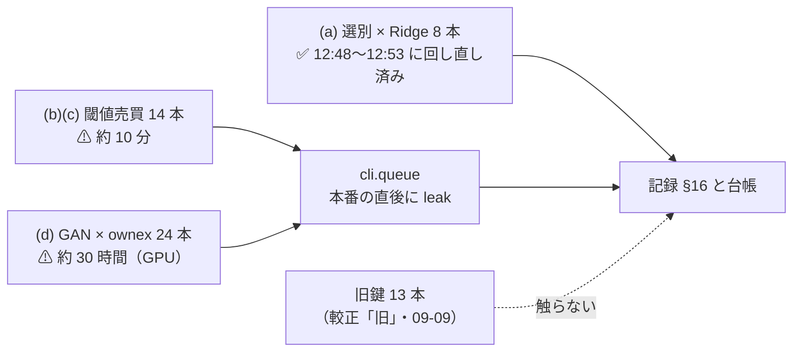
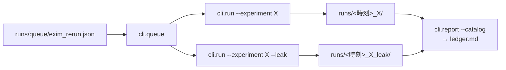

# titan で `ex_` / `im_` を使う実験を回し直し、台帳を吐き直す

作成: 2026-09-17 ／ 状態: ✅ **完了（2026-09-19）**。Phase 1〜4 と (d) GAN × ownex 24 本の追記・台帳の吐き直し・worktree の片付けまで済み。結果は [daily-data-sources.md §16](../../specs/experiments/daily-data-sources.md)
対象: `experiments/feature-discovery/runs/`・`runs/queue/`・`docs/specs/experiments/daily-data-sources.md`・`docs/specs/experiments/feature-discovery/ledger.md`（生成物）
派生元: TODO「割り当てなしの災害系列の改善を、日付をずらした偽薬で確かめる」（2026-09-17 完了。[記録 §15](../../specs/experiments/daily-data-sources.md)）
親タスク（2026-09-17）: TODO「閾値売買の記録を広げる 4 本（保有日数の分布・逆売買の診断・出来高の入力・`ex_` / `im_` の回し直し）を、配線の順序を決めて回す」
関連: [daily-data-sources.md §14-2・§14-3](../../specs/experiments/daily-data-sources.md)（塞いだ穴と Sx360 での測り直し）／ [archive/exog-z20-stale.md](exog-z20-stale.md)／ [rules.md 14-4 規約 2](../../specs/experiments/feature-discovery/rules.md)（名前を変えないなら 1 ビットも変えない）／ [ledger-role.md](../../specs/experiments/feature-discovery/ledger-role.md)

## 1. 目的・背景

### 1-1. なぜ回し直すのか

`ex_` / `im_` 層の計算が 2026-09-16〜17 に 2 回変わった（[§14-2](../../specs/experiments/daily-data-sources.md)）:

| commit | 直したもの | 影響する層 |
| --- | --- | --- |
| `127b694`（2026-09-16） | 窓が全部同じ値なら `z20` = 0 ／ 古さの検査を列ごとに ／ 0 埋めを取得元の範囲で | `ex_` `im_` |
| `b4e6dc6`（2026-09-17） | `z20` を窓ごとの直接計算に（pandas の `rolling` の誤差が系列の始まりに依存していた。最大 0.6） | `ex_` `im_` |

⚠ **台帳の代表は「同じ鍵の一番新しい実行」**（`ail/catalog.py` の `_collapse`）なので、`ex_` / `im_` を使う行は**直す前のコードの数字が代表のまま**である。
⚠ **層の名前は変えていない**（14-4 規約 2 の「名前を変えないなら 1 ビットも変えない」に反する変更ではなく、**穴を塞いだ修正**）。だから同じ鍵で回し直し、台帳の代表を現行コードの数字にする。

### 1-2. ⚠ 対象は TODO に書いた 8 本より多い — 59 実行

`runs/*/config.json` の `feature_layers` に `ex` か `im` を含む実行を数えた【実測 2026-09-17】:

| 群 | 実行 | 本数 | 直す前のコードか | 1 本の計算時間【実測。`log.txt` の更新時刻から】 |
| --- | --- | ---: | :-: | --- |
| (a) 選別 × Ridge（§9・§13） | `exog_h1`（＋leak）・`real_2018`・`placebo_2018`・`impact_2018`・`impact_ex_2018`・`impact_both_2018`・`impact_placebo_2018` | 8 | ✅ **2026-09-17 12:48〜12:53 に回し直し済み**（commit `1b539d1`。⚠ **記録も台帳も未反映**） | 1〜2 分 |
| (b) 閾値売買 × 素のモデル | `trade_ownex_{ridge,lgbm,mlp}_{a,b}`（＋leak） | 12（2026-09-13 の較正 `std` 版） | ⚠ 直す前 | 5 秒〜3 分 |
| (c) 閾値売買 × 中型株 | `midcap_ex`（＋leak） | 2 | ⚠ 直す前 | 5 秒 |
| (d) 閾値売買 × GAN 増強 | `trade_ownex_{ridge,lgbm,mlp}gan{,16k}_{a,b}`（＋leak） | 24 | ⚠ 直す前 | ⚠ **25 分〜4.8 時間**（GPU） |
| — | 2026-09-10 の `trade_ownex_*`（較正「旧」）4 本・2026-09-09 の (a) の旧実行 | 13 | 旧 | ⚠ **回し直さない**（較正「旧」の鍵は 2026-09-13 に `std` へ移っており、代表ではない） |

⚠ **(a) は TODO の「災害 5 本 ＋ §9 の 3 本」そのもの**で、今日の 12:47 の `git pull`（`1b539d1`。修正 2 つを含む）の直後に titan で回っていた。
Phase 1 はこれを**検算して記録する**だけで、⚠ **もう一度回さない**。

> この図の主張: ⚠ **回すのは (b)(c)(d) の 38 本**で、(a) は記録だけ、旧鍵の 13 本は触らない。

### 1-3. ⚠ 先に分かっていること — (a) の差は最大 1.3bp

12:48〜12:53 の実行と直す前の実行の `summary.csv` を突き合わせた【実測 2026-09-17。手法 11 ＋ 基準 2 の 13 行がすべて対応】:

| 実行 | 純利 bp の最大差 | 本数の最大差 |
| --- | ---: | ---: |
| `real_2018` | 0.19 | 0.2 |
| `exog_h1` ／ `_leak` | 1.02 ／ 0.28 | 0.4 ／ 0 |
| `placebo_2018` | 0.77 | 0 |
| `impact_2018` | 0.59 | 0.2 |
| `impact_ex_2018` | 0.56 | 1.0 |
| `impact_both_2018` | 1.28 | 0.6 |
| `impact_placebo_2018` | 0.41 | 0.6 |

⚠ **§9・§13 の結論（本命は偽薬を超えない／割り当ては効かない／割り当てなしは保留）が動く大きさではない**（Sx360 の測り直し [§14-3](../../specs/experiments/daily-data-sources.md) と同じ向き）。
⚠ **ただし台帳の「再現」欄は幅 0.1bp を超えると `⚠ 2 実行・幅 Xbp` を出す**（`_collapse` の `tol`）。⚠ **これは配線の失敗ではなく修正の差**なので、記録に理由を書いて残す（§2-4）。

## 2. 対応方針

### 2-1. 4 段で進める

| 段 | 何をする | 回す本数 | 計算時間 |
| :-: | --- | ---: | --- |
| **Phase 1** | (a) 8 実行の検算と記録（回さない） | 0 | 数分（人手） |
| **Phase 2** | (b)(c) 14 本を queue で回す | 14 | **約 10 分**【実測の合計】 |
| **Phase 3** | (d) GAN × ownex 24 本を queue で回す（⚠ **利用者の裁定つき**） | 24 | ⚠ **約 30 時間（GPU・無人）**【実測の合計】 |
| **Phase 4** | 台帳を吐き直し、記録 §16 に差分表を書く | 0 | 数分 |

⚠ **回すのは作業ツリーがきれいな commit で**（`env.json` の `git_commit` が実際のコードを指すこと。[rules.md 0 章](../../specs/experiments/feature-discovery/rules.md)）。⚠ **姉妹タスクの Phase 2（`cli/run.py` / `checks.py` の編集）が開いている間は回さない**（編集前か、コミット後）。

### 2-2. Phase 1 — (a) の検算と記録

| # | 検算 | 期待 |
| ---: | --- | --- |
| 1 | `env.json` の `git_commit` が `b4e6dc6` を含む commit（`1b539d1` 以降） | ✅ 8 本とも `1b539d1`【実測】 |
| 2 | `inputs.json` の行・列・銘柄・`panel_start` が旧実行と一致 | `impact_*` 130,134 行・47 列・06-15 始まり ／ `real_2018` 135,962 行・63 列・01-31 始まり【実測。一致】 |
| 3 | `summary.csv` の 13 行が対応し、純利の差が §1-3 の表のとおり | 最大 1.28bp |
| 4 | leak 対照（`exog_h1_leak`）が跳ねたまま | 的中率が旧と同じ水準 |

記録は Phase 4 の §16 にまとめて書く（Phase 1 では表を scratchpad に作るだけ）。

### 2-3. Phase 2・3 — queue で回す

`cli.queue` の config（`runs/queue/exim_rerun.json`・`exim_rerun_gan.json`）に実験名を並べる。`leak: true`（本番の直後に leak）・`ledger: true`（終わるたびに台帳を吐き直す）・`time_budget_s` は Phase 2 が 3,600、Phase 3 が 172,800。

| Phase | `experiments` | 備考 |
| :-: | --- | --- |
| 2 | `trade_ownex_ridge_a` `_b`・`trade_ownex_lgbm_a` `_b`・`trade_ownex_mlp_a` `_b`・`midcap_ex` | ⚠ `midcap_ex` は `dataset = midcap48_daily`・`ex_sources` 4 本。他と表が違うので同じ queue でも別の表を作る |
| 3 | `trade_ownex_{ridge,lgbm,mlp}gan_{a,b}`・`trade_ownex_{ridge,lgbm,mlp}gan16k_{a,b}` | ⚠ **(b) 形式 × batch 1,024 が 1 本 3.5〜4.8 時間**。`AIL_TORCH_DEVICE` は 3090 Ti。⚠ **順は手間の小さい順**（16k (a) 25 分 → gan (a) 3.5 時間 → 16k (b) 3 時間 → gan (b) 4.7 時間） |

⚠ **Phase 3 を回すかは利用者の裁定**。回す理由は [14-10 規約 1](../../specs/experiments/feature-discovery/rules.md)（費用は無人の GPU 時間だけで、人手は queue の config 1 つ）。回さない理由は「(a) で差が 1.3bp 以下と分かっており、[gan-threshold-ownex.md](../../specs/experiments/gan-threshold-ownex.md) の 36 行『落とす』が動く見込みが無い」。⚠ **Claude の推奨は「回す」**（代表の数字を現行コードに揃える目的は GAN の行にも同じに当てはまり、回さないと台帳に「直す前の数字が代表の行」が 36 行残る）。⚠ **回さないと決めたら、§16 にその旨と 36 行の所在を書く**。

> この図の主張: queue は `cli.run` を外から 1 本ずつ起動するだけで、⚠ **実験コードには触らない**。

### 2-4. Phase 4 — 台帳と記録

1. 台帳を吐き直す（README の手順。`cli.report --catalog > docs/specs/experiments/feature-discovery/ledger.md`）
2. 検算: ⚠ **`n_trials` は 604 のまま**（同じ鍵の再実行は行を増やさない）／ 手法の判定列が 1 行も変わらない（⚠ 変わったら §16 に理由を書く）／ 回し直した鍵の「再現」欄が `2 実行・幅 Xbp`（X は Phase 2・3 の実測）
3. `daily-data-sources.md` に **§16「titan で回し直した後の数字」** を足す: (a)(b)(c)(d) の旧→新の差分表（純利・上乗せ・fold の符号）、§9-2 / §9-3 / §13-2 / §13-3 / §14-3 の結論が変わったか、台帳の「幅」の理由。⚠ **§9・§13 の表は書き換えない**（当時の数字として残し、§16 から参照する）
4. GAN を回したら [gan-threshold-ownex.md](../../specs/experiments/gan-threshold-ownex.md) の末尾に 1 節（36 行の判定が変わったか）
5. TODO の子タスクを `DONE.md` へ

## 3. 影響範囲

| 場所 | 変更 | 既存の数字への影響 |
| --- | --- | :-: |
| `runs/` | 実行ディレクトリが 14〜38 本増える | なし（旧実行は消さない。[14-10 規約 5](../../specs/experiments/feature-discovery/rules.md)） |
| `runs/queue/*.json` | queue の config 2 つ | — |
| `ledger.md` | 生成し直し（代表・再現の欄・生成日） | ⚠ **`n_trials` と判定列は変わらない見込み**（変わったら記録する） |
| `daily-data-sources.md` | §16 を追記 | 既存の節は書き換えない |
| `gan-threshold-ownex.md` | Phase 3 を回したら 1 節 | 〃 |
| 実験コード | ⚠ **触らない** | なし |

## 4. テスト方針

| 対象 | 検算 |
| --- | --- |
| 回し直した各実行 | `inputs.json` の行・列・銘柄・指紋（`data_manifest.raw`）が旧実行と一致 ／ `env.json` の commit が修正を含む ／ leak 対照が跳ねる（13-10） |
| 台帳 | `n_trials` 604 ／ 判定列の差分が空 ／ 幅の出た行が回し直した鍵だけ |
| 記録 | §16 の差分表の値が `summary.csv` から再計算できる（scratchpad のスクリプトで出し、表だけ残す） |

## 5. 姉妹タスクとの依存

| 相手 | 関係 |
| --- | --- |
| 保有日数 Phase 2 ／ 逆売買 Phase 2 | ⚠ **触るファイルが重ならない**（こちらは `runs/` と文書だけ）。ただし ⚠ **編集中の作業ツリーで回さない**（§2-1） |
| 代表構成の回し直し（2 つの Phase 3 を兼ねる） | 独立。ただし ⚠ **台帳の吐き直しは後に回したほうが 1 回で済む**（どちらも `ledger: true` で吐くので順不同でも壊れない） |
| 出来高の入力 | 独立（`ex_` / `im_` を使わない） |

金銭・契約の発生する行動はない。
