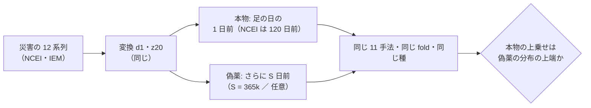
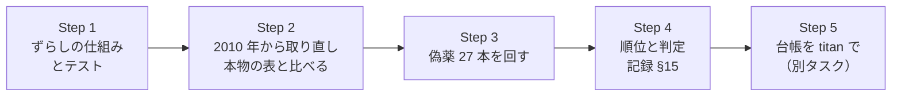

# 割り当てなしの災害系列（`ex_`）の改善を、日付をずらした偽薬で確かめる

作成: 2026-09-16 ／ **完了: 2026-09-17** ／ ⚠ **結果は [記録 §15](../../specs/experiments/daily-data-sources.md)**（本物は偽薬 27 本すべての上・p=0.036。⚠ **ただし fold 1 頼みで保留のまま**）
対象: `experiments/feature-discovery/`（`ail/features/exog.py`・`cli/build.py`・`cli/run.py`・`ail/catalog.py`）
派生元: [daily-data-sources.md §13-4](../../specs/experiments/daily-data-sources.md)（社会にインパクトを与えそうなデータ・2026-09-16 完了）
関連: [rules.md](../../specs/experiments/feature-discovery/rules.md) ／ 次の作業「titan で `ex_` / `im_` を使う実験を回し直し、台帳を吐き直す」（TODO）

> ⚠ **2026-09-17 の変更**: 作業の途中で ⚠ **origin/main に titan の 49 commit があり、Sx360 が古い土台で進めていた**ことが分かった。利用者の判断（titan を正に取り込む）でマージした。⚠ **`start_date` は titan に揃えて 2018-06-15**、⚠ **本物（`impact_ex_2018`）と価格だけ（`own_impact_2018`）もマージ後のコードで回し直してから偽薬と比べる**（§2-3 の「本物」の数字は 05-21 始まりの参考値で、判定には回し直した値を使う）。⚠ **§2-2 の本数・ずらし幅と §2-3 の規則は変えていない。**

## 1. 目的・背景

§13 で、災害の 12 系列を**割り当てなし**（全銘柄で同じ値の `ex_` 層）で足すと、列を使う 11 手法すべてで価格だけを上回った
（＋1.92〜＋6.09bp【実測】、最良 Boruta ＋3.23bp【実測】）。⚠ **ただし fold 1（コロナ期）頼み・t 0.66・DSR 0.62・乱択でも改善**なので保留にした。

⚠ **問いは「効いているのは災害の中身（その日に何が起きたか）か、列の形（全銘柄で同じ値・季節性・自己相関）か」。**
日付だけをずらした偽薬は、列の数・系列・変換・自己相関をそのまま残し、⚠ **株価の日付との対応だけを壊す**。

> この図の主張: ⚠ **偽薬は「同じ系列を過去へ S 日ずらして貼る」だけで、それ以外は本物と全部同じにする。**

## 2. 対応方針

### 2-1. ⚠ ずらし方 — 未来の値を入れない

| 案 | 中身 | 採否 | ⚠ 理由 |
| --- | --- | :-: | --- |
| 循環ずらし | 2018〜2026 の値を S 日回して、末尾を先頭へ巻き戻す | ✗ | ⚠ **巻き戻した部分に未来の値が入る**（この層の不変条件「未来は構造的に入らない」を偽薬のためだけに破る）。⚠ **継ぎ目で季節がずれる**（期間が 365 日の倍数でない） |
| ⚠ **過去へずらす（採用）** | as-of の基準日を S 日だけ前にする（`ex_shift_days`） | ✅ | ⚠ **どの足にも、その日より前の値しか貼られない。** 1 年の倍数なら季節は ±2 日で揃う |

⚠ **過去へずらすには 2018 年より前のデータが要る。** 最大 S = 2,555 日（7 年）＋ NCEI の 120 日 ＋ `z20` の 20 日 → ⚠ **2011 年初めから要る**。
⚠ **NCEI と IEM を 2010-01-01 から取り直す**（米政府の公有データの読み取り。IEM は `Crawl-delay: 120` を守る。資金・契約なし）。

⚠ **取り直しで本物の表が変わっていないかを確かめる**（NCEI は月次で過去の年も改訂される）。
変わっていたら、⚠ **本物（`impact_ex_2018`）も同じデータで回し直してから比べる**（データの版を揃える）。

### 2-2. ⚠ 偽薬の本数とずらし幅（結果を見る前に決める）

| 族 | ずらし幅 S（日） | 本数 | 残すもの ／ 壊すもの |
| --- | --- | ---: | --- |
| A 1 年ずらし | 365 × k（k = 1〜7） | 7 | 季節性・自己相関を残す ／ ⚠ **年ごとの中身を壊す** |
| B 任意のずらし | ⚠ **種 0 で [60, 2555] から一様に引き、365 の倍数から 60 日未満のものを捨てて 20 本**: 1649, 1335, 828, 162, 247, 101, 497, 2089, 1680, 2338, 1317, 1574, 2482, 1638, 2393, 2096, 1734, 66, 143, 1969 | 20 | 自己相関を残す ／ ⚠ **季節性も壊す** |

⚠ **NCEI と IEM は同じ S だけずらす**（2 つの取得元の相対の位置を保つ）。⚠ **本数は後から足さない**（足すなら理由を記録に書く）。

### 2-3. ⚠ 比べる量と判定の規則（結果を見る前に決める）

比べる相手はどれも ⚠ **価格だけ（`own_impact_2018`）との差**（⚠ **マージ後のコード・06-15 始まりで回し直した実行**）。

| # | 量 | 本物【実測 2026-09-16。05-21 始まり・参考】 |
| ---: | --- | ---: |
| 主 | ⚠ **列を使う 11 手法の「なし − 価格」の平均** | ＋4.36bp |
| 副 1 | 最良の手法の純利 | ＋3.23bp |
| 副 2 | 価格だけを上回った手法の数 | 11/11 |
| 副 3 | ⚠ **fold 1 を除いた「なし − 価格」の平均**（fold 1 頼みが偽薬にも出るか） | 未計算 |

順位の p 値 = (1 ＋ 本物以上の偽薬の数) ／ (1 ＋ 偽薬の数)。族 A・族 B・全 27 本の 3 通りで出す。

| 主の量の p（全 27 本） | 判定 |
| --- | --- |
| ⚠ **≤ 0.05**（本物が 27 本すべてを上回る） | 日付の合った災害に上乗せの形跡あり。⚠ **ただし保留のまま**（fold 1 頼み・DSR は別の問題で、偽薬を超えても「採る」にはしない） |
| 0.05 〜 0.10 | 区別できない寄り（保留） |
| ⚠ **> 0.10** | ⚠ **偽薬と区別できない ＝ 災害の中身は効いていない。** 改善は列の形によるものとして打ち切る |

## 3. Step

> この図の主張: ⚠ **データを広げても本物の表が変わらないことを先に固めてから、偽薬を回す。**

| Step | 中身 | 完了の判定 |
| ---: | --- | --- |
| 1 | `ex_shift_days`（層）・`--shift-days`（`cli.build` / `cli.run`、名前に `_shift<S>`）・台帳で偽薬の実行を試行から外す | ⚠ **ずらした値が S 日前の値と一致するテスト、0 以下を拒むテスト、台帳に入らないテスト**が通る |
| 2 | `impact_daily` の NCEI を 2010 年から、`impact_warnings` の IEM を 2010-01-01 から取り直す。退避した表と比べる | ⚠ **災害 5 本の表が 131,250 行・値まで一致**（違えば差を説明し、本物を回し直す） |
| 3 | 27 本を build → run（1 本 約 6 分【推測】） | `runs/*_shift<S>` が 27 個。⚠ **行と（銘柄, 日）の鍵が本物と一致** |
| 4 | §2-3 の量と p 値、fold ごとの形、選ばれた列を [daily-data-sources.md](../../specs/experiments/daily-data-sources.md) §15 に書く | ⚠ **判定を §2-3 の規則どおりに書く** |

## 4. 影響範囲

| 対象 | 影響 |
| --- | --- |
| `ail/features/exog.py` | `layer` が `ex_shift_days` を読む（既定 0 ＝ 今と同じ） |
| `cli/build.py` ／ `cli/run.py` | `--shift-days`（`--leak` と同じ形。表と実行の名前に `_shift<S>`） |
| `ail/catalog.py` ／ `cli/report.py` | ⚠ **`_shift<S>` の実行は試行に数えず、台帳の行にも混ぜない**（鍵が「own ex」で本物と同じなので、混ぜると代表の行を乗っ取る）。実行の一覧には残す |
| `data/raw/ncei_storm` ／ `data/raw/iem` | 2010〜2017 年が増える（git 管理外） |
| `config/dataset/impact_daily.toml` ／ `impact_warnings.toml` | 年の範囲を 2010 年から |
| `dashboard/app/experiments.py` ／ テンプレート | ⚠ **検証の画面でも偽薬を順位表から外し、別枠に出す**（実装中に足した。本物と同じタイトルで 27 本並ぶと本物が埋もれる）。仕様 [dashboard.md §10-1・§10-2](../../specs/dashboard.md) |
| `cli/fetch.py` | `--source`（1 つの取得元だけを取り直す。⚠ **同じ dataset の EPU を巻き込んで版を変えない**） |
| ⚠ **触らないもの** | `im_` 層、`own_` 等の層、`gpu_*` |

## 5. テスト方針

- `tests/test_exog.py`: ⚠ **`ex_shift_days = S` の値が「S 日 ＋ 既定のずらし」前の値と一致**／ NCEI の 120 日にも S が足される ／ 負の S を拒む
- `tests/test_catalog.py`: ⚠ **`_shift<S>` の実行が台帳の行と試行数に入らない**（名前でも config でも見分ける）
- `dashboard/tests/test_experiments.py`: ⚠ **偽薬が順位表に入らず、別枠と印が描画される**
- 既存の全テスト（Sx360 の venv に無い `lightgbm` / `torch` の 5 件は除外）
- ⚠ **資金は動かさない**（2026-08-27 の方針）。ネットワークは NCEI・IEM の読み取りだけ
