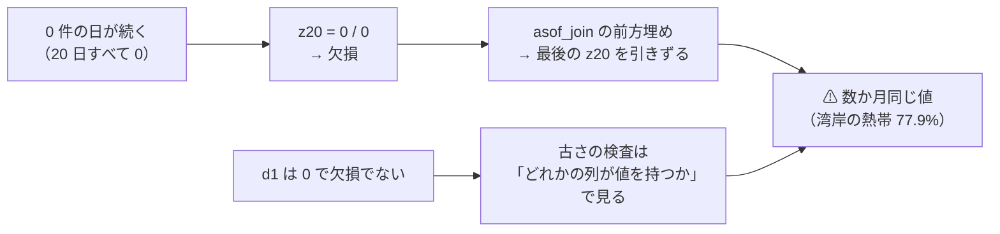
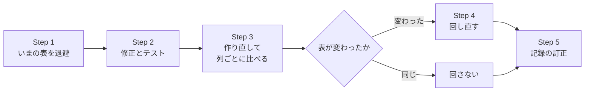

# まばらな系列の `z20` が古い値を引きずる穴を塞ぐ（`ex_` / `im_` 層）

作成: 2026-09-16 ／ 対象: `experiments/feature-discovery/ail/features/exog.py`
完了: 2026-09-16 ／ ⚠ **結果は [記録 §14](../../specs/experiments/daily-data-sources.md)**（§9 と §13 の結論は変わらなかった。災害の 5 本は 2018-05-21 始まりに戻せた）
派生元: [daily-data-sources.md §12-6](../../specs/experiments/daily-data-sources.md)（社会にインパクトを与えそうなデータ・2026-09-16 完了）
関連: [rules.md](../../specs/experiments/feature-discovery/rules.md) ／ 次の作業「割り当てなしの災害系列の見かけの改善を、日付をずらした偽薬で確かめる」（TODO）

## 1. 目的・背景

§12-6 で見つけた穴を塞ぐ。⚠ **このあとの「割り当てなしの改善は本物か」の検証は、この穴が残ったままだと測れない**
（改善を出した `ex_` の列に、穴の影響を受けた列が含まれている）。

> この図の主張: ⚠ **窓がまるごと 0 の日に `z20` が欠損になり、前の値で埋められ、しかも古さの検査をすり抜ける。**

**実測（2026-09-16。20 日の窓が全部同じ値だった割合）**

| 取得元 | 該当する系列 | 目立つもの |
| --- | ---: | --- |
| NOAA 気象 | 9 本中 3 | ⚠ **LA 空港の降水 44.9%**（§9 の偽薬・`exog_h1` に入っている） |
| NCEI Storm Events | 13 本中 9 | 熱の件数 37.0% ／ 冬季の件数 20.3% |
| IEM 警報 | 34 本中 28 | 熱帯の件数 61.1% ／ 地域 × 種類はほとんどが 45〜89% |
| 為替・金利・地震・EPU | 0 | — |

⚠ **浮動小数の誤差で標準偏差が 0 に近い正の値になる窓は 0 件だった**（`1e-9` 未満の std は無し）。

## 2. 対応方針

| # | 直すもの | 直し方 | ⚠ 理由 |
| ---: | --- | --- | --- |
| 1 | `transform` の `z{w}` | ⚠ **窓が全部同じ値（`max == min`）なら 0** | ⚠ **分子（値 − 平均）も 0 である。**「いつもと同じ」＝驚きなし。⚠ **比較は完全一致で行い、閾値を置かない**（浮動小数の誤差に頼らない） |
| 2 | `asof_join` の古さの検査 | ⚠ **列ごとに「最後に値があった日」を持つ** | ⚠ **1 列でも値があれば全列を新しいとみなしていたので、欠損の列が古い値を引きずっても見逃した** |
| 3 | `load_series` の 0 埋めの範囲 | ⚠ **系列ごと（最初〜最後の事象）→ 取得元ごと（その取得元の全系列を通した最初〜最後）** | ⚠ **最初の事象より前も「0 件」である**（取得は期間で行っている）。⚠ **末尾を系列ごとに切ると、冬に熱帯の警報が 8 日途切れただけで最新の行が欠損になる** |
| 3-2 | 0 埋めの系列が「止まった」ことの検知 | ⚠ **末尾の 0 の連続が、その系列で過去最長の空白より長ければ警告を出す** | ⚠ **#3 で末尾を 0 で埋めると、コードが変わって系列が止まっても 0 に化けて気づけない**（熱の `EH` → `XH` がまさにそれだった） |

⚠ **#1 だけでは `start_date` の問題（5 本の行が揃わない）は解けない**ので #3 と対にする。
⚠ **直したら災害の 5 本の `start_date` を元の 2018-05-21 に戻せるかを確かめる**（戻せれば `gpu-models.md` との比較もそのまま保てる）。

## 3. Step

> この図の主張: ⚠ **表が変わった実験だけを回し直す。** 変わったかは表どうしの比較で決める（推測で決めない）。

| Step | 中身 | 完了の判定 |
| ---: | --- | --- |
| 1 | `ex_` / `im_` を使う 7 本（`exog_h1` `real_2018` `placebo_2018` 災害 4 本）の表を scratchpad に退避 | 7 本の parquet が手元にある |
| 2 | §2 の #1〜#3-2 を直し、テストを足す | ⚠ **直す前のコードで落ち、直した後で通る検査**がある。全テストが通る |
| 3 | 7 本を作り直し、退避した表と列ごとに比べる。災害 5 本は `start_date = 2018-05-21` に戻して行が揃うかを見る | ⚠ **変わった列が #1〜#3 で説明できる**（説明できない差が無い） |
| 4 | 表が変わった実験を回し直す（1 本 約 4 分【実測】） | `runs/` に新しい実行 |
| 5 | §9・§13 の数字の訂正、§12-6 の状態、README・TODO・DONE | ⚠ **結論が変わったかどうかを明記** |

## 4. 影響範囲

| 対象 | 影響 |
| --- | --- |
| `ail/features/exog.py` | `transform` ／ `asof_join` ／ `load_series` |
| `ail/features/impact.py` | ⚠ **上の 3 つを import しているので同時に変わる**（コードは触らない見込み） |
| 実験の表 | `exog_h1` `placebo_2018` 災害 4 本は変わる見込み。⚠ **`real_2018`（為替・金利）は変わらない見込み**（窓が定数になる系列が無い） |
| 記録 | [daily-data-sources.md](../../specs/experiments/daily-data-sources.md) §9・§12-6・§13 ／ `gpu-models.md` §1 の注記（開始日を戻せたら外す） |
| ⚠ **触らないもの** | `own_` `cs_` `rel_` `ll_` 層、`gpu_*` の実験（`ex_` / `im_` を使わない）、管理画面 |

## 5. テスト方針

| # | 何を確かめるか | ⚠ 直す前のコードでどうなるか |
| ---: | --- | --- |
| 1 | ⚠ **20 日すべて 0 の窓で `z20` が 0** | 欠損になる |
| 2 | ⚠ **`z20` が欠損で `d1` に値がある日が `max_stale_days` を超えて続くと、`z20` は欠損になる**（古い値を貼らない） | 古い値が貼られる |
| 3 | ⚠ **同じ取得元で最初の事象が遅い系列も、取得元の最初の日から 0 で埋まる** | 最初の事象の日から始まる |
| 4 | ⚠ **末尾の 0 が過去最長の空白より長い系列は警告が出る** | 何も出ない |
| 5 | 為替のような 0 埋めしない系列は今までどおり穴のまま（既存のテスト） | 通る |

## 6. ⚠ この作業で埋まらないもの

| # | 限界 |
| ---: | --- |
| 1 | ⚠ **`z20` = 0 は「驚きなし」という解釈を入れている。** 欠損のまま行を落とす作りもありうるが、⚠ **まばらな系列ではほとんどの行が消える**ので採らない |
| 2 | ⚠ **台帳は titan で吐き直す**（Sx360 に `gpu_*` の実行が無い。別タスク） |
