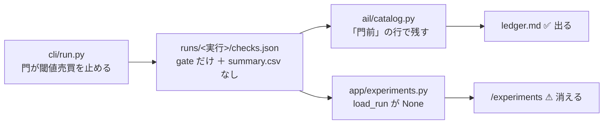
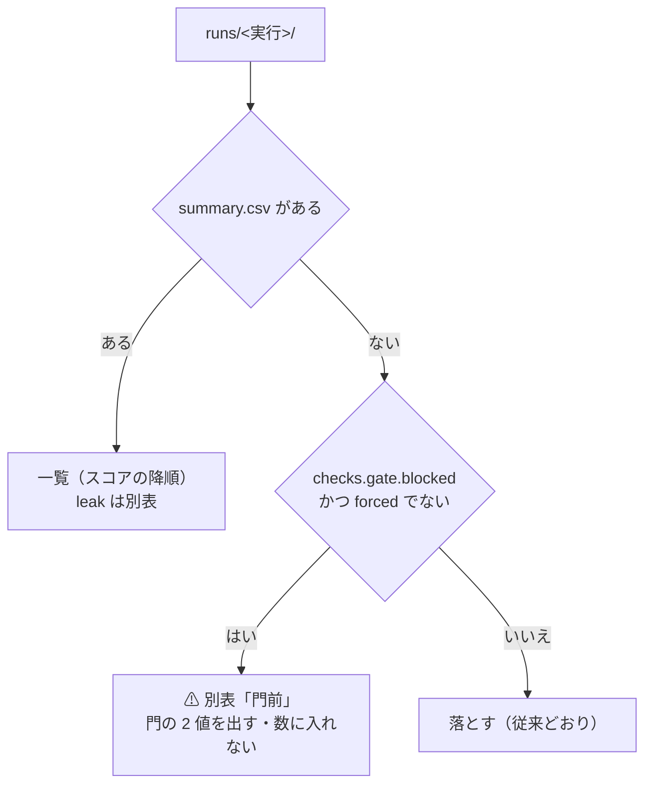
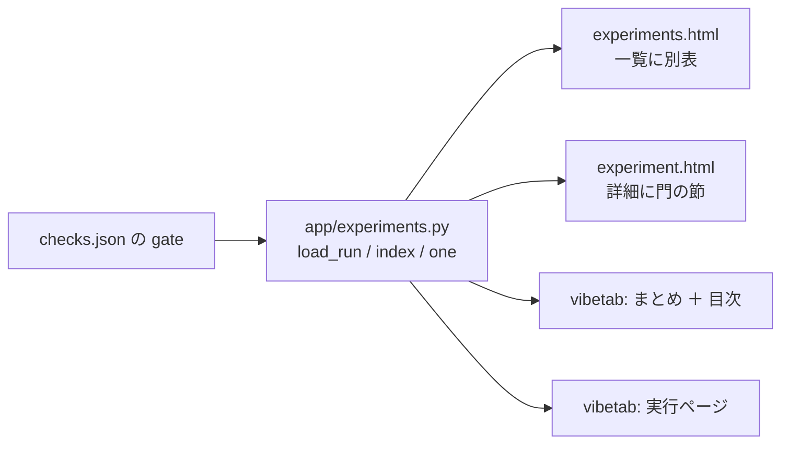

# 管理画面の検証画面に「門前」の実行を出す

- 対象: `dashboard/app/experiments.py`・`dashboard/app/templates/experiments.html`・`dashboard/app/templates/experiment.html`・`dashboard/vibetab.py`・`docs/specs/dashboard.md` §10
- 派生元: 「前置きの門の実装」（✅ 2026-09-11。[trading-gate.md](archive/trading-gate.md)）
- 関連: [rules.md 14-5](../specs/experiments/feature-discovery/rules.md) ／ [ledger.md](../specs/experiments/feature-discovery/ledger.md) ／ [dashboard.md §10](../specs/dashboard.md)

## 1. 目的と背景

2026-09-11 に前置きの門（rules.md 14-5）を入れた。全手法が門前の実行は**閾値売買を回さない**ので
`summary.csv` を書かない。ところが管理画面の `load_run`（`dashboard/app/experiments.py:111`）は
**`summary.csv` が無い実行を `None` で落とす**ので、門前の実行は一覧から黙って消える。

台帳（`ail/catalog.py`）は同じ実行を「門前」の行として残している。⚠ **台帳には出るのに画面には出ない**
という食い違いがあり、rules.md 14-5 の「門前も台帳に残す（隠さない）」を画面が満たしていない。

⚠ **これから回す実行は大半が門前になる**（検討記録 §8-1 の検算では本番 4 実行が全部門前）。
放置すると「回したのに画面に無い実行」が積み上がり、画面を見て実行の有無を判断できなくなる。

> この図の主張: ⚠ **門前の実行は記録を書いているのに、画面の入口で落ちている。**

## 2. 対応方針

**門前の実行を「配線の検査（leak）」と同じく別枠で出す。** 一覧（スコアの降順）には混ぜない。

| # | 決めたこと | ⚠ 理由 |
| ---: | --- | --- |
| 1 | 門前は**別表**に出し、`total` / `positive` には数えない | ⚠ **検証を回していないので「検証 N 件」に数えると嘘になる。** n_trials に数えない（14-5）のと同じ扱い |
| 2 | 拾う条件は**台帳と同じ**（`summary` が無い ＋ `gate.blocked` あり ＋ `forced` でない） | ⚠ **画面で門の水準を再判定しない**（CLAUDE.md「検査は実験側が書いたものを読むだけ」）。`--ignore-gate` の実行は従来どおり落とす |
| 3 | 判定の 5 列（層・純利・fold・上乗せ・DSR）は門前の行に**出さない** | ⚠ **⏳ を 5 つ並べると「計算待ち」に見える。** 門前は「計算していない」ではなく「**回していない**」 |
| 4 | 代わりに門の 2 値（訓練内 holdout の AUC・買い% 幅）と水準を**写して**出す | 画面を見ただけで「なぜ回っていないか」が読める。値は `checks.json` の `gate` の写し |
| 5 | 一部の手法だけ門前の実行（`summary` あり ＋ `blocked` あり）は**今までどおり一覧に出し**、詳細に「回していない手法」の節を足す | ⚠ **一覧のスコアは回した手法のもので正しい。** 隠れるのは「回さなかった手法」なので詳細で補う |

> この図の主張: ⚠ **実行は 3 つに分かれる。** 落とすのは「summary も門前の記録も無い」ものだけ。

## 3. 影響範囲

`load_run` は dashboard と vibeboard の検証タブが**共用**している（`vibetab.py` が `app.experiments` を
import する）。1 か所直せば 2 つの面に出るが、**表示は面ごとに足す**必要がある。

> この図の主張: 読み取りは 1 か所、出す場所は 4 つ。

| ファイル | 変えるもの |
| --- | --- |
| `dashboard/app/experiments.py` | `load_run` の早期 return・`gate` / `gated` / `gate_methods` の写し・`index` に `gated_runs` |
| `dashboard/app/templates/experiments.html` | 別表「⚠ 門前（閾値売買を回していない）」・見出しの件数 |
| `dashboard/app/templates/experiment.html` | 門前のときは 4 枚のカードの代わりに門の帯・門の表（全手法の通過 / 門前）・空の節を出さない |
| `dashboard/vibetab.py` | 目次に「門前」の組・まとめに件数と別表・実行ページに門の節 |
| `docs/specs/dashboard.md` | §10-6 として「門前の実行」を追記（§10-2 の規約 4「検査が無い実行は ⏳」との違いも書く） |
| `/api/experiments` | `gated_runs` が増える（⚠ 秘密は含まない。`Redactor` はそのまま通る） |

⚠ **`runs/` に門前の実行はまだ 1 つも無い**（40 実行すべて `summary.csv` を持つ）。
検算はテストの作り物（fixture）で行い、**`runs/` には何も書かない**（1 実行 1 ディレクトリの規約を汚さない）。

## 4. Phase / Step

- **Phase 1**: `app/experiments.py` — 門前を拾う・`index` に別枠・門の写しを持つ
- **Phase 2**: 画面 2 枚（一覧の別表・詳細の門の節）
- **Phase 3**: vibeboard の検証タブ（`vibetab.py`）の 3 か所
- **Phase 4**: 仕様 §10-6 の追記とテスト

## 5. テスト方針

`dashboard/tests/test_experiments.py` に足す（`conftest.write_experiment` は `summary.csv` を必ず書くので、
**summary を書かない fixture** を用意する）。

| # | 検査 | ⚠ 何を守るか |
| ---: | --- | --- |
| 1 | 全手法が門前の実行が `gated_runs` に出る | ⚠ **黙って消えない**（この修正の本体） |
| 2 | 門前の実行は `total` / `positive` / `kinds` に数えない | ⚠ **「検証 N 件」が水増しされない** |
| 3 | `forced`（`--ignore-gate`）で summary が無い実行は**従来どおり落とす** | ⚠ **「回したのに結果が無い」を門前と混同しない**（台帳と同じ条件） |
| 4 | `gate` も `summary` も無い実行は落とす | 壊れた実行を拾わない |
| 5 | 一部だけ門前（summary あり）の実行は一覧に残り、詳細に門前の手法が出る | ⚠ **回した手法のスコアを消さない・回さなかった手法を隠さない** |
| 6 | 一覧と詳細の画面に AUC・買い% 幅・水準（0.52 / 20 点）が出る | 「なぜ回っていないか」が画面で読める |
| 7 | vibetab のまとめ・実行ページが門前の実行で落ちない（`summary` が空） | ⚠ **空の表で 500 にしない** |

`dashboard/.venv/bin/python -m pytest -q tests` が全部通ることを確認する（現在 196 件）。
