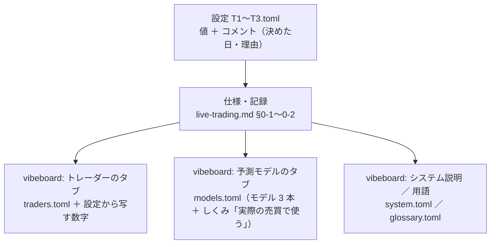

# 既存の説明を棚卸し、必要なものをまとめる（トレーダー・モデルの設定の説明 Step 1）

作成日: 2026-09-26。親: [売買に使うトレーダーやモデルの設定などの説明を分かりやすく書く](explain-trader-model-settings.md) の Step 1。

## 0. 目的・背景

トレーダー（T1〜T3）と予測モデル、その設定の説明が、設定ファイルのコメント・仕様書・記録・vibeboard のタブの文（TOML）に散らばっている。Step 2 でアウトライン（vibeboard のどこに、どう書くか）を決めるための材料として、次の 2 つを出す。

1. **どこに何が書いてあるかの一覧**（場所 ／ 扱う設定項目 ／ 読み手 ／ 状態）
2. **説明に必要なものの一覧**（読み手が知るべき項目と、それをどこから写せるか・欠けているか）

⚠ **読んでまとめるだけ**。設定・TOML の文・仕様書には手を入れない（書き直しは Step 3 以降）。⚠ 設定の値（モデル・θ・銘柄・予算・`sizing`）は変えない。

## 1. 対応方針

棚卸しは「設定項目」を軸にして、項目ごとにどこで説明しているかを縦に並べる。

### Step 1-1: 説明のある場所を集める

| 種類 | 場所 | 見るところ |
| --- | --- | --- |
| 設定（正本の値） | `experiments/live-trading/config/traders/T1〜T3.toml` | 項目とコメント（決めた日・理由） |
| 設定（候補） | `config/traders/candidates/shares/`・`notional/` | 本番と違う点・「使わない」の印 |
| 設定の読み手 | `experiments/live-trading/` の設定を読むコード | 項目の意味（`kind`・`combine`・`sizing`・`threshold` の扱い） |
| 仕様・記録 | `docs/specs/experiments/live-trading.md` §0-1〜§0-3 | 3 人の属性・予算・時間帯・sizing の決め手 |
| プラン | `docs/plans/live-trading-three-models.md` §2・`live-trading-trader-attributes.md` | トレーダーの定義・選んだ理由 |
| 研究側 | `docs/specs/experiments/feature-discovery/rules.md` 10-2 ／ `config/names.toml` | 予測モデル名の読み方 |
| vibeboard の文 | `dashboard/traders.toml`・`models.toml`・`system.toml`・`glossary.toml` | 画面に出ている説明 |
| vibeboard の仕様 | `docs/specs/dashboard.md` §16〜§18 | タブの決まり（やさしい言葉・比べない・数字は写すだけ） |
| 手順 | `CLAUDE.md` の実売買の節 | 利用者がふだん読む要約 |

見つけた場所が表の外にあれば足す（`grep` で `threshold`・`sizing`・`budget_usd`・`combine`・呼び名などを引く）。

### Step 1-2: 設定項目 × 場所の表を作る

行 ＝ 設定項目（`name`・呼び名・`test`・`budget_usd`〔規模 A ／ B〕・`symbols`・`sizing`・`combine`・`threshold`〔売買基準値〕・`[[models]]` の `kind` ／ `name` ／ `method`・種・1 日の売買回数の判断・予算の上限と執行器の守り・発注できる時間帯）。
列 ＝ Step 1-1 の場所。マスには「何を書いているか」を短く（値だけ ／ 意味 ／ 理由 ／ 決めた日）。

### Step 1-3: 食い違い・古い・欠けを印す

- **食い違い**: 同じ項目で値や言い方が違う（例: 設定と `live-trading.md` §0-1、`traders.toml` と `models.toml`）
- **古い**: 2026-09-21 の確定（整数株・5 本）や 2026-09-25 の本番の切り替えより前の書き方のまま
- **古い言葉**: CLAUDE.md の「言葉」の表の前の言葉（台帳・鍵・窓・買う線 など）
- **欠け**: 設定にあるが、どこにもやさしい言葉の説明が無い項目

### Step 1-4: 説明に必要なものをまとめる

読み手の問いから逆に引いて、「必要なもの」を一覧にする。

| 読み手の問い（例） | 必要な説明 |
| --- | --- |
| このトレーダーは誰で、何を見て売買するのか | 呼び名・使うモデル・銘柄 |
| いつ買って、いつ売るのか | 売買基準値・合成の規則・1 日の回数の判断・時間帯 |
| いくら使うのか・どこまで損しうるのか | 予算（規模 A ／ B の注記）・上限の守り・整数株 |
| 設定を変えるとどうなるのか | 「変えると新しい検証」の決まり |

各行に「写せる元（Step 1-2 のマス）」と「欠け」を付ける。

## 2. 成果物

棚卸しの結果はこのプランの末尾（§5 結果）に書く（vibeboard の Plans タブで読める）。Step 2 はこの §5 だけを見てアウトラインを組めるようにする。

## 3. 影響範囲

このプランファイルだけ。コード・設定・TOML・仕様書は変えない。

## 4. テスト方針

コードを変えないのでテストは不要。確認は次の 2 つ。

- Step 1-2 の表の行が T1〜T3.toml の項目を 1 つも落としていないこと（設定ファイルの項目名と突き合わせる）
- 食い違いとして挙げたものは、両方の場所の文を引用して示すこと（記憶で書かない）

## 5. 結果（2026-09-26）

### 5-1. 説明のある場所（Step 1-1）

説明の置き場は 4 層に分かれていて、vibeboard に出るのは下の 2 層だけ。

| 場所 | 読み手 | 書いてあること | 状態 |
| --- | --- | --- | --- |
| `config/traders/T1〜T3.toml` | 執行器・開発 | 値（`name`・`test`・`budget_usd`・`symbols`・`sizing`・`combine`・`threshold`・`note`・`[[models]]` の `kind` ／ `name` ／ `method`）と、決めた日・決め手のコメント | 正本。3 人とも同じ形 |
| `candidates/shares/`・`notional/` | 開発 | 確定前の 2 案（`notional` は `universe = "us63"`・T2 は `universe_group = "company"`） | 役目を終えた。`notional/` はトレーダーのタブが「直下に 1 人も居ないとき」だけ読む |
| `live-trading.md` §0-1 | 開発・利用者 | 属性の表（型・置き場）・3 人の表・sizing の決め方・規模 A ／ B・お金と持ち株の決めごと | いちばん詳しいが、確定前の書き方が残る（5-3） |
| `live-trading.md` §0-2 | 開発・利用者 | 予算の上限・時間帯・停止・判定の閾値 | 概ね今と合う |
| `live-trading-three-models.md` §2・`live-trading-trader-attributes.md` | 開発 | トレーダーの定義・選んだ理由（族の違い） | 経緯。説明の元にはなるが画面には出さない |
| `dashboard/traders.toml` | vibeboard の読み手 | 呼び名・いつ動くか・お金の決まり・売買基準値の文・合成規則の文・注意 | やさしい言葉。一部古い（5-3） |
| `dashboard/models.toml` の `[[model]]` × 3 | 同上 | モデルの特性・見るもの・計算の仕方・組み立て・試した経緯 | 手厚い。試し運転の前提が今と違う文がある |
| `dashboard/models.toml` の `[[page]] live` | 同上 | トレーダー ＝ モデル ＋ 売買基準値 ＋ 予算・1 日の流れ・入出力・出力スコアから注文へ | 設定の説明がいちばんまとまっている所。詳しくの囲みに古い記述（5-3） |
| `dashboard/system.toml` | 同上 | 実際の売買で守っていること（帳尻・許可・停止・シミュレーション） | 設定値は書かない決まり |
| `dashboard/glossary.toml` の `live` 節 | 同上 | トレーダー・予算・合図・合成規則・発注できる時間帯 など | 設定の語がいくつか無い（5-3） |
| `dashboard.md` §16〜18 | 開発 | タブの決まり（やさしい言葉・比べない・数字は設定から写す） | 書くときの制約として使う |
| `rules.md` 10-2・`names.toml` | 開発 | 予測モデル名の読み方 | 画面ではしくみ「名前と識別名」に要約済み |
| `CLAUDE.md` | 利用者・Claude | 3 人の要約・運用の決まり | 要約。画面の元にはしない |

### 5-2. 設定項目 × 場所（Step 1-2）

印: ◎ ＝ 意味と理由まで ／ ○ ＝ 意味だけ ／ 値 ＝ 値を写すだけ ／ — ＝ 無い。
設定 ＝ T*.toml ／ §0-1 ＝ live-trading.md ／ 人 ＝ トレーダーのタブ（traders.toml ＋ 画面）／ モ ＝ models.toml（しくみ live ＋ モデル）／ 用 ＝ glossary。

| 設定項目 | 設定 | §0-1 | 人 | モ | 用 |
| --- | --- | --- | --- | --- | --- |
| `name`（識別名） | 値 | ◎ | 値（畳んだ段） | ○（名前と識別名） | — |
| 呼び名 | — | — | ◎（`[nicks]`・コメント） | — | — |
| `test` | 値 | ◎ | ○（試験用は一覧に出ない） | — | ○ |
| `budget_usd`（規模 A ／ B） | 値 ＋ ○ | ◎ | ○（`amount_one`。規模 B の話は無い） | ○ | ○ |
| `symbols`（見る株 5 本） | 値 ＋ ◎（決め方 D3） | ◎ | 値（本数・1 本あたり） | — | — |
| 学ぶ株・予測する株と、売買する株の違い | — | ○（T2 は 48 本） | — | ○（モデルのページ・63 ／ 48 本） | — |
| `sizing` | 値 ＋ ◎（dryrun2） | ◎ | ○（`buy_way_shares`） | ○ | — |
| `combine` | 値 | ○ | ◎（合成規則の文 4 つ） | ○ | ○ |
| `threshold`（売買基準値） | 値 | ○（θ ≥ 50） | ◎（文 ＋ ものさし） | ◎ | ○（θ の項） |
| `note` | 値 | — | — | — | — |
| `[[models]]` `kind` | 値 | ◎ | — | ○（詳しく） | — |
| `[[models]]` `name` ／ `method` | 値 | ○ | 値（正式な名前） | ◎（名前と識別名） | ○（実験名・手法） |
| 種（seed） | コメント（`note`） | ○ | — | — | — |
| お金と持ち株（空き・受渡し・別々の注文） | — | ◎ | ○（`money`） | ○ | ○（予算・内部移転） |
| 1 日の回数・発注できる時間帯 | — | ○ ＋ §0-2 ◎ | ○（`when`） | ◎ | ○ |
| 上限（1 日・合計）と停止 | — | §0-2 ◎ | — | — | ○ |
| 「変えると新しい検証」 | ◎（コメント） | ◎ | ○（`[nicks]` のコメントだけ・画面には無い） | ○ | — |

### 5-3. 食い違い・古い・欠け（Step 1-3）

**食い違い**

| # | 場所 A | 場所 B | 中身 |
| --- | --- | --- | --- |
| D1 | `traders.toml` `step_learn`「2018 年から**昨日まで**の全部の日を見直して」 | `models.toml` live「答えがもう確かめられている日まで」・詳しく「asof の **2 営業日前**まで」 | 学ぶ範囲の終わりが違う（後者がコードどおり） |
| D2 | `live-trading.md` §0-1「断られたときの巻き込み: 同じ銘柄の買いは**全員ぶんを 1 注文にまとめる**（`plan.py` の `aggregate`）」 | 同じ表の「口座への注文: **トレーダーごとに別々に出す**・合算しない」 | 前者は 2026-09-19 より前の仕組み。`plan.py` に `aggregate` はもう無い |
| D3 | `live-trading.md` §0-1 の 3 人の表「T3 QUANT（**60日発注できる時間帯**）」 | 設定・`models.toml`「T3 QUANT（**60日窓**）」 | 言葉の置き換え（窓 → 発注できる時間帯）が登録名にまで入った誤り。登録名は変えない決まり |

**古い（確定前・本番切り替え前の書き方）**

| # | 場所 | 中身 |
| --- | --- | --- |
| O1 | `live-trading.md` §0 冒頭「残る未設定は銘柄集合と株数の決め方だけ」 | 2026-09-21 に確定済み |
| O2 | `live-trading.md` §0-1 末尾「`T1.toml`〜`T3.toml` は `sizing` と銘柄が決まってから書く」 | 同上 |
| O3 | `models.toml` live の詳しく「銘柄集合と sizing は dryrun2 で決まるまで `candidates/` に置いてある」・「予算 budget_usd・銘柄集合 **universe**」 | 確定済み。いまの設定は `symbols` |
| O4 | `models.toml` live の詳しく「2026-09-18 の合図: T1 買い 58 ／ 63 … 初日の注文は 120 本前後」 | 63 本・金額指定の前提。いまは 5 本・整数株（初日 10 本 ＝ 2026-09-23） |
| O5 | `models.toml` の T2 ・ T3 の特性「初日に見る株の全部を買い…」（`basis = trial`） | 出どころは sim3（63 本・金額指定）。いまの形の試し運転は sim4（整数株 5 本） |
| O6 | `live-trading.md` §0-1 の T2「48 銘柄をほぼ同時に買い、ほぼ同時に売る」・規模の表（63 本の等加重が主語） | 予測は 48 本のままだが、売買するのは 5 本 |
| O7 | `traders.toml` `unsettled`（「月曜に…確定していません」） | 直下に人が居れば出ない文。役目を終えた |
| O8 | `system.toml`・`models.toml` の本文「帳面」・詳しく「執行の窓」 | 言葉の表では 売買履歴 ／ 取引時間帯（「帳面」はやさしい言い換えとして残すかを決める） |

**欠け（どこにもやさしい言葉の説明が無い）**

| # | 中身 |
| --- | --- |
| G1 | **学ぶ株・予測する株（63 ／ 48 本）と、実際に売買する株（5 本）が別**だということ。モデルのページは 63 本・48 本、トレーダーのページは 5 本を出すので、並べて読むと食い違って見える |
| G2 | 5 本の選び方（「値段の低い順に 5 本」）と、その理由（少ない予算で 1 株単位で買うため）。設定のコメントと §0-1 にしか無い |
| G3 | 規模 A ／ B（画面には規模 A の数字しか出ず、規模 B が「使えない可能性がある」ことも無い） |
| G4 | 予算の上限（1 日・合計）・大きな含み損の警告・停止ボタンを、トレーダー 1 人の視点で書いたもの（システム説明にまとめて書いてあるだけ） |
| G5 | 「設定を変えるのは新しい人（新しい検証）」がトレーダーのページに出ない（`[nicks]` のコメントだけ） |
| G6 | 用語タブに 売買基準値（θ の項で触れるだけ）・出力スコア・整数株 ／ 金額指定（sizing）・規模 A ／ B・呼び名・識別名・予測モデル名 の項が無い |
| G7 | 設定の `note`・種（seed）はどの画面にも出ない |

### 5-4. 説明に必要なもの（Step 1-4）

| 読み手の問い | 必要な説明 | 写せる元 | 欠け ／ 直すもの |
| --- | --- | --- | --- |
| この人は誰か | 呼び名（識別名）・試験用でないこと | `[nicks]`・設定 | — |
| 何を見て決めるのか | 使うモデル 1 本・そのモデルが見るもの・出力スコア | `models.toml` の `[[model]]` | O5 |
| どの株を売り買いするのか | 5 本・選び方・学ぶ ／ 予測する株との違い | 設定のコメント・§0-1 | **G1・G2**・O6 |
| いつ買って、いつ売るのか | 売買基準値（ものさし）・合成の仕方・1 日 1 回・時間帯 | `traders.toml`・`models.toml` live | D1 |
| いくら使うのか | 予算・1 本あたり・1 株単位・売ったお金は翌日から | `traders.toml` `amount_one` ／ `money`・設定 | **G3** |
| どこまで損しうるか・どう止まるか | 上限・含み損の警告・停止ボタン・止めるのは人 | §0-2・`system.toml` | **G4** |
| 設定を変えたらどうなるか | 「新しい人 ＝ 新しい識別名と呼び名」「新しい検証」 | `[nicks]` のコメント・CLAUDE.md | **G5** |
| 名前の読み方 | 識別名・予測モデル名（設定の名前 × 数字の選び方・作り方） | `models.toml` names・rules.md 10-2 | G6 |
| 言葉の意味 | 売買基準値・出力スコア・整数株 など | glossary | **G6** |

→ Step 2 への申し送り: vibeboard に書く先は **トレーダーのタブ（人の側）** と **予測モデルのタブのしくみ「実際の売買で使う」** が中心。新しく書く必要が大きいのは G1〜G5、ついでに直すのは D1〜D3・O1〜O8（仕様書の D2・D3・O1・O2・O6 は vibeboard の外だが、説明の元なので一緒に直すかを Step 2 で決める）。
