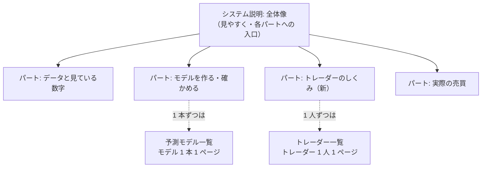

# どのように説明するかのアウトラインを決める（トレーダー・モデルの設定の説明 Step 2）

作成日: 2026-09-26。親: [売買に使うトレーダーやモデルの設定などの説明を分かりやすく書く](explain-trader-model-settings.md) の Step 2。前の段: [Step 1 の棚卸し](explain-settings-inventory.md) §5（説明のある場所・設定項目 × 場所の表・食い違い D1〜D3・古い記述 O1〜O8・欠け G1〜G7・読み手の問い）。

## 0. 目的・背景

Step 1 で、設定の説明が 4 層（設定ファイル → 仕様書 → `traders.toml` → `models.toml`）に散らばり、vibeboard には **学ぶ株と売買する株の違い（G1）・5 本の選び方（G2）・規模 A ／ B（G3）・止め方（G4）・「設定を変えると新しい人」（G5）** が無いこと、いくつかの文が確定前・本番切り替え前のままなこと（D1〜D3・O1〜O8）が分かった。

この Step では **vibeboard のどこに・どの順で・何を** 書くかを決め、利用者の了承を得る。⚠ **決めるだけで、まだ書かない**（書くのは Step 3 以降 ＝ この Step の結果を見て子タスクに割る）。置き場は vibeboard（2026-09-26 利用者決定）。

## 1. 守る決まり（アウトラインの制約）

| 決まり | 出どころ | アウトラインへの効き方 |
| --- | --- | --- |
| 文の正本は TOML（`traders.toml`・`models.toml`・`system.toml`・`glossary.toml`）。Python・HTML に説明を書かない | dashboard.md §16-3・§17-4・§18 | 新しい文は全部 TOML の項目として置き場を決める |
| トレーダーのページの大見出しは **5 つ・順と名前が固定**（テスト `test_page_shows_the_model_and_its_traits`） | `traderview.py`・`tests/test_traders_tab.py` | 大見出しを足す ＝ コードとテストも直す。まず既存の 5 つの中に入るかを考える |
| やさしい言葉（`FORBIDDEN`）・ほかの人 ／ モデルとくらべる文を書かない（`COMPARING`）・設定の数字を TOML に書かない（画面が設定から写す） | dashboard.md §16-2 | 「5 本」「$300」「63 本」を文に書けない ＝ 差し込み（`{n}` など）か、コードが設定から写す新しい差し込みが要るかを見る |
| 売買結果は出さない・`out/`・`state/`・`.env` を読まない | §16-1 | 「初日は 10 本買った」のような実績は書かない |
| システム説明のタブは **概要の 1 ページだけ** | 2026-09-21 利用者決定（system.toml のコメント） | 新しいページをシステム説明に足さない |
| 特性には「どこまで確かか」の印。確かめていない理由を言い切らない | §16-1 | 試し運転の出どころ（sim3 ＝ 63 本・金額指定）を、いまの形（5 本・整数株）と分けて書く |
| 言葉は CLAUDE.md の「言葉」の表（売買基準値・売買履歴・取引時間帯・識別名 …）。登録名 `T3 QUANT（60日窓）` は変えない | CLAUDE.md | D3 の直し方（登録名は元に戻す） |
| 設定の値（モデル・θ・銘柄・予算・`sizing`）は変えない | CLAUDE.md | 説明を書くために設定に項目を足す（例: 5 本の選び方の文）なら、値でない項目だけ・執行器が読まないことを確かめる |

## 2. 進め方

### Step 2-1: 置き場の案を決める

Step 1 §5-4 の「読み手の問い」を、どのタブ・どの段に当てるかの案を 3 つ並べ、1 つを推す。

| 案 | 中身 | 良い点 | 代償 |
| --- | --- | --- | --- |
| **A（推し）: 既存の段の中に埋める** | トレーダーのページの **4「この人の決まり」** に「どの株を売り買いするか」（G1・G2）と規模の注記（G3）、**5「気をつけること」** に止め方（G4）と「設定を変えると新しい人」（G5）を足す。しくみ「実際の売買で使う」の詳しくを直す（O3・O4・D1）。用語タブに語を足す（G6） | コードを触らない（TOML と、設定から写す差し込みだけ）。読み手は今の場所で読める。テストの大見出しの順が変わらない | 4 と 5 が長くなる。5 本の選び方の文に数字（5・$60）が要るなら差し込みを足す ＝ 小さなコード変更 |
| B: 新しいページ「売買の設定」を予測モデルのタブのしくみに足す | しくみ 5 ページ目として、設定の項目を 1 つずつ説明（`models.toml` の `[[page]]`） | 1 か所で全項目を読める。`[[page]]` の形はそろっているのでコードを触らない | 設定の数字を書けない決まりとぶつかる（しくみのページは数字を写す差し込みが無い）。トレーダーのページと 2 か所になる |
| C: トレーダーのページに大見出し 6「この人の設定」 | 設定の項目を表で出す（今は畳んだ「正式な名前」の段） | 項目の一覧性が高い | 大見出しの数・順のテストとコードを直す。用語が並ぶ表になりやさしい言葉の決まりと相性が悪い |

推す理由は A ＝ 「言葉の正本は TOML・数字は設定から写す・大見出しは固定」の 3 つの決まりを崩さずに G1〜G5 を埋められるため。⚠ 利用者が B か C を選んでもよい（2-4）。

### Step 2-2: 節の並びと、各節の出どころ・図か表か

読み手の問いの順（誰か → 何を見るか → どの株か → いつ → いくら → どこまで損しうるか → 変えたら → 名前）に節を並べ、節ごとに次を書く。

- 置き場（タブ・大見出し・TOML の項目名。新しい項目なら名前の案）
- 写せる元（Step 1 §5-2 のマス。⚠ 元の無い文は書かない）
- 差し込む数字（`{n}`・`{per}` など既存の差し込みで足りるか、新しい差し込みが要るか）
- 図か表か（CLAUDE.md: 一覧・属性は表、関係・流れ・位置だけ図。1 図 1 主張・ノード 12 個以内）。候補 ＝ **「学ぶ株 63 ／ 48 本 → 予測 → 売買する 5 本」の絞り込みの図**（G1 の主張が 1 枚で伝わる）・止め方の 3 段は表
- 「どこまで確かか」の印が要る文か

### Step 2-3: 直す既存の記述の扱い

Step 1 §5-3 の D1〜D3・O1〜O8 を、次の 3 つに分ける。

| 分け方 | 当てはまるもの（見込み） | 扱い |
| --- | --- | --- |
| vibeboard の TOML（この作業で直す） | D1（`step_learn`）・O3・O4（しくみ live の詳しく）・O5（T2・T3 の特性の出どころ）・O7（`unsettled`）・O8（帳面 ／ 執行の窓） | Step 3 以降の子タスクに入れる |
| 仕様書 `live-trading.md`（vibeboard の外） | D2（`aggregate` の古い行）・D3（登録名の誤り）・O1・O2・O6 | ⚠ **一緒に直すかを利用者に聞く**（説明の元なので直さないと次も写し間違える。ただし親タスクの範囲は vibeboard） |
| 直さない | 過去の実験の記録・済んだプラン | CLAUDE.md「変えないもの」 |

### Step 2-4: 利用者に見せて決める

- 2-1 の案・2-2 の節の一覧・2-3 の分け方を **このプランの §5** に書き、利用者に見せる
- 決まったら、Step 3 以降（書く・直す・用語を足す・テスト）を親の `TODO.md` に子タスクとして割る（1 子タスク ＝ 1 置き場が目安）
- ⚠ 決まる前に TOML を書き始めない

## 3. 影響範囲

このプランファイルと `TODO.md`（リンク・子タスク）だけ。TOML・コード・仕様書・設定は変えない。

## 4. テスト方針

コードを変えないのでテストは流さない。アウトラインの検査は次の 3 つ。

- Step 1 §5-4 の読み手の問い 9 つと、欠け G1〜G7 の全部に、置き場が 1 つ以上ある（表で突き合わせる）
- 新しく書く文の 1 つ 1 つに、写せる元（Step 1 §5-2 のマス）がある
- 文に設定の数字・`FORBIDDEN` の語・ほかの人とくらべる言い方が要らない形になっている（要るなら差し込みかコード変更として明示する）

## 5. 結果

### 5-1. 置き場（Step 2-1）— ✅ 2026-09-26 利用者決定

利用者の指示: **「全体像を見やすく説明したのち、各パートを詳しく書いていきます。ただし全ての予測モデルとトレーダーの仕様の説明は別にします」**。既存の 3 タブに当てると:

| タブ | 役目（利用者の言葉） | 書くもの | 書かないもの |
| --- | --- | --- | --- |
| **システム説明** | 全体の説明と各パートの詳細説明 | 全体像 1 ページ ＋ パートごとの詳細ページ（トレーダーのしくみ・実際の売買のしくみ を含む） | 各モデル・各トレーダーの個別の説明（値・特性） |
| **予測モデル一覧**（現在の予測モデル） | 各予測モデルの詳細 | モデル 1 本 1 ページ | どのモデルにも共通のしくみ |
| **トレーダー一覧**（現在のトレーダー） | トレーダーの詳細 | トレーダー 1 人 1 ページ（設定の値・使うモデル・決まり） | 設定の項目の一般論（それはシステム説明のパート） |

§2-1 の案 A ／ B ／ C はこの決定で置き換わった（A に近いが、**共通の説明はシステム説明に集める**点が違う）。

⚠ **含み**: 2026-09-21 の「システム説明は概要の 1 ページだけ」（しくみの 4 ページを予測モデルのタブへ移した決定）は、この決定で戻る ＝ しくみのページ（作る ／ 確かめる ／ 使う ／ 名前）は「各パートの詳細」としてシステム説明に戻す。CLAUDE.md・dashboard.md §17-7・§18 の記述もそれに合わせて直す（Step 3 以降）。

### 5-2. 節の並び（Step 2-2）— 案（2-4 で決める）

**システム説明**（`system.toml` の `[[page]]`。読み手の問いの順 ＝ 集める → 作る → 確かめる → 持たせる → 売買する）

| # | ページ | 中身（やさしい言葉の本文 ／ 詳しくの囲み） | 出どころ | 図か表 | 状態 |
| --- | --- | --- | --- | --- | --- |
| 0 | **全体像** | 何をするシステムか ／ 全体の流れの図 ／ **パートの一覧（各ページへの入口）** ／ 守っていることの要約 3 行 | 今の `overview`（守っていることの詳細は 3 へ移す） | 流れの図（今の 8 箱を **パートの境で色分け**） | 直す |
| 1 | **予測モデルのしくみ** | 材料をそろえる（毎日の値段・為替・金利を集め、モデルに入れる数字に直す）→ 学ぶ → 出力スコア → 過去を期間に分けて試す（採る・保留・落とす・検証結果一覧の合計）。⚠ 1 本ずつの話は予測モデル一覧へ | 今の `build` ＋ `verify` を 1 ページに | 今の図 2 枚（作る ／ 期間を分けて試す）をそのまま | 戻す ＋ まとめる（✅ 2026-09-26 利用者「1 と 2 はどちらもモデルの話なので 1 つの大項目に」）|
| 2 | **トレーダーのしくみ（新）** | トレーダー ＝ モデル ＋ 売買基準値 ＋ 予算 ＋ 見る株 ＋ 買い方 ／ **学ぶ株と売買する株は別（G1）** ／ 見る株の選び方の考え方（G2。値は書かない）／ 予算の規模 A ／ B（G3）／ 予算の上限・大きな含み損・停止（G4）／ **設定を変えるのは新しい人（G5）** ／ 呼び名と識別名 | `live-trading.md` §0-1・§0-2・`traders.toml` のコメント・`[nicks]` | **絞り込みの図**（学ぶ株 → 出力スコア → 売買する株。1 図 1 主張 ＝ 「別」）／ 設定項目の表（項目 ／ 意味 ／ どこに出るか） | 新規 |
| 3 | 実際の売買 | 1 日の流れ ／ 出力スコアから注文へ ／ 出力スコアの読み方 ／ 守っていること（帳尻・許可・停止・シミュレーション） | 今の `live` ＋ `overview` の「守っていること」 | 今の 1 日の図 ／ 守っていることは表 | 戻す ＋ 直す（O3・O4・D1） |
| 4 | 名前と識別名 | 今のまま（技術的な定義） | 今の `names` | 今のまま | 戻す |

**予測モデル一覧**（`models.toml` の `[[model]]`）— 形は今のまま。直すのは O5（T2・T3 の特性の出どころ ＝ sim3〔63 本・金額指定〕と明記し、今の形〔整数株 5 本〕で同じとは限らないと添える）と、組み立ての「学ぶ株 63 ／ 48 本」に「売買する株はトレーダーが決める（→ システム説明 2）」の 1 文。

**トレーダー一覧**（`traders.toml` ＋ 設定から写す）— 大見出し 5 つは固定のまま。足すのは:

| 大見出し | 足す文（TOML の項目案） | 数字 | 出どころ |
| --- | --- | --- | --- |
| 4 この人の決まり | 「売り買いするのは {n} 本（銘柄）。1 株単位で買えるように、値段の低い株から選んである。学ぶ株はもっと多い（→ システム説明 2）」（`stocks_why`） | `{n}` と銘柄は設定から | 設定のコメント（D3）・§0-1 |
| 4 この人の決まり | 予算の後ろに「この予算は口座で実際に使える規模のもの」（`budget_scale`。規模 B の話はシステム説明 2） | 無し | §0-1 |
| 5 気をつけること | 「予算の上限・大きな含み損・停止のしくみは共通（→ システム説明 2）」（`limit_stop`）／「モデル・売買基準値・見る株・予算を変えるときは、新しい人として新しい名前を付ける」（`limit_change`） | 無し | `[nicks]` のコメント・CLAUDE.md |
| （畳んだ段）正式な名前 | 項目名の横に一言（`sizing` ＝ 1 株単位 など） | 設定から | §0-1 の属性の表 |

⚠ 「値段の低い株から選んである」は今の 3 人に固有の決め方（D3）。設定ファイルに `symbols_why`（文。執行器が読まない）を足して人ごとに持たせるか、`traders.toml` の共通の文にするかは Step 3 で決める（後者は次の人が違う選び方をすると嘘になる）。

### 5-3. 直す既存の記述（Step 2-3）— 案

| 分け方 | 当てはまるもの | 扱い |
| --- | --- | --- |
| vibeboard の TOML | D1（`step_learn`「昨日まで」→「答えが確かめられている日まで」）・O3・O4（`live` の詳しく）・O5（特性の出どころ）・O7（`unsettled` を消す）・O8（帳面 ／ 執行の窓） | Step 3 の子タスク |
| 仕様書 `live-trading.md` | D2（`aggregate` の古い行）・D3（登録名「60日発注できる時間帯」→「60日窓」）・O1・O2（確定前の文）・O6（63 本が主語の規模の表） | ✅ **直さない**（2026-09-26 利用者決定）。vibeboard のシステム説明を**説明の正本**にして、仕様書の重複した説明は**削る方向で提案する**（5-5 の Step 8） |
| CLAUDE.md・dashboard.md §17-7・§18 | 「システム説明は概要だけ」の記述 | 5-1 の決定に合わせて直す（Step 3 の子タスク） |

### 5-4. 利用者の決定（Step 2-4）— ✅ 2026-09-26

| # | 問い | 決定 |
| --- | --- | --- |
| 1 | しくみの 4 ページをシステム説明に戻すか | **戻す** |
| 2 | パートの分け方 | 0 全体像 ／ 1 予測モデルのしくみ（材料 → 学ぶ → 確かめる。「1 と 2 はどちらもモデルの話」）／ 2 トレーダーのしくみ ／ 3 実際の売買 ／ 4 名前と識別名 |
| 3 | 予測モデル一覧に載せる範囲 | **全て説明する**（机上で試しただけの 9 本も今までどおり） |
| 4 | 仕様書 `live-trading.md` の古い記述 5 件 | **直さなくてよい**。**vibeboard にあるものを説明の正本**とし、仕様書の重複は**削除する方向で提案する** |
| 5 | 「材料に入れる株と出力する株は別でよい（材料 10 本 → 出力 1 本もありえる）か」 | **合っている（コードで確認）。4 つの集合 ＝ 材料に入れるもの〔株の外の数字もふくむ〕／ 学ぶ株 ／ 出力スコアを出す株 ／ 売買する株 は重要なので必ず記載する**（dashboard.md §18-2 に決まりとして書いた。Step 4 の図・Step 5・Step 6 の項目に足した） |

決定 4 の含み ＝ **正本の分け方**（新しく書く文はこれに従う）:

| 何の正本か | 置き場 | 例 |
| --- | --- | --- |
| 設定の**値** | `experiments/live-trading/config/traders/*.toml` | 予算・銘柄・売買基準値・モデル名 |
| しくみと設定項目の**説明** | vibeboard の TOML（`system.toml`・`models.toml`・`traders.toml`・`glossary.toml`） | トレーダーとは何か・項目の意味・学ぶ株と売買する株の違い |
| 決定の**経緯**と**【実測】の記録** | `docs/specs/experiments/live-trading.md`（記録として残す。説明は書き足さない） | 2026-09-21 の `dryrun2` の結果・規模 A ／ B を並べる決定・執行の差の記録 |

### 5-5. Step 3 以降の子タスク（親の `TODO.md` に割った）

| Step | 中身 | 直す古い記述 |
| --- | --- | --- |
| 3 | システム説明のタブを組み直す: しくみの 4 ページを `system.toml` に戻す（`build` ＋ `verify` → 「予測モデルのしくみ」1 ページ・`live` → 「実際の売買」に `overview` の「守っていること」を移す・`names` はそのまま）／ 全体像を直す（流れの図をパートの境で色分け・各ページへの入口）／ `tab = "models", item = …` のリンクを `system` へ ／ テスト・CLAUDE.md・dashboard.md §17-7・§18 の「概要だけ」の記述を直す | O3・O4（`live` の詳しく）・O8 |
| 4 | 「トレーダーのしくみ」のページを新しく書く（トレーダー ＝ モデル ＋ 売買基準値 ＋ 予算 ＋ 見る株 ＋ 買い方 ／ 学ぶ株と売買する株は別〔絞り込みの図〕／ 見る株の選び方の考え方 ／ 規模 A ／ B ／ 上限・含み損・停止 ／ 変えると新しい人 ／ 呼び名と識別名 ／ 設定項目の表）。⚠ 値を書かない | — |
| 5 | 予測モデル一覧を直す（12 本とも残す）: 特性の出どころ（sim3 ＝ 63 本・金額指定）を明記 ／ 組み立てに「売買する株はトレーダーが決める（→ システム説明）」の 1 文 | O5 |
| 6 | トレーダー一覧に文を足す: 4「この人の決まり」に見る株の本数と選び方の考え方・予算の規模の一言 ／ 5「気をつけること」に共通のしくみへの案内・「変えるときは新しい人」／ 畳んだ段の項目に一言 ／ `unsettled` を消す。⚠ 5 本の選び方を人ごと（設定に文の項目）にするか共通の文にするかを決めてから | D1・O7 |
| 7 | 用語タブに語を足す（売買基準値・出力スコア・整数株 ／ 金額指定・規模 A ／ B・呼び名・識別名・予測モデル名）。§0-1 を指す `where` 13 件の行き先を見直す | G6 |
| 8 | 仕様書 `live-trading.md` の重複した説明を削る**提案**を書く（正本 ＝ vibeboard。残すのは決定の日付・【実測】・数字。⚠ 提案を利用者に見せてから削る） | D2・D3・O1・O2・O6 は直さず、削る対象に含める |
| 9 | 通しで確かめる: `./run-tests.sh --fast`・vibeboard と sidecar（3015）の入れ直し・3 タブを目で見る | — |
