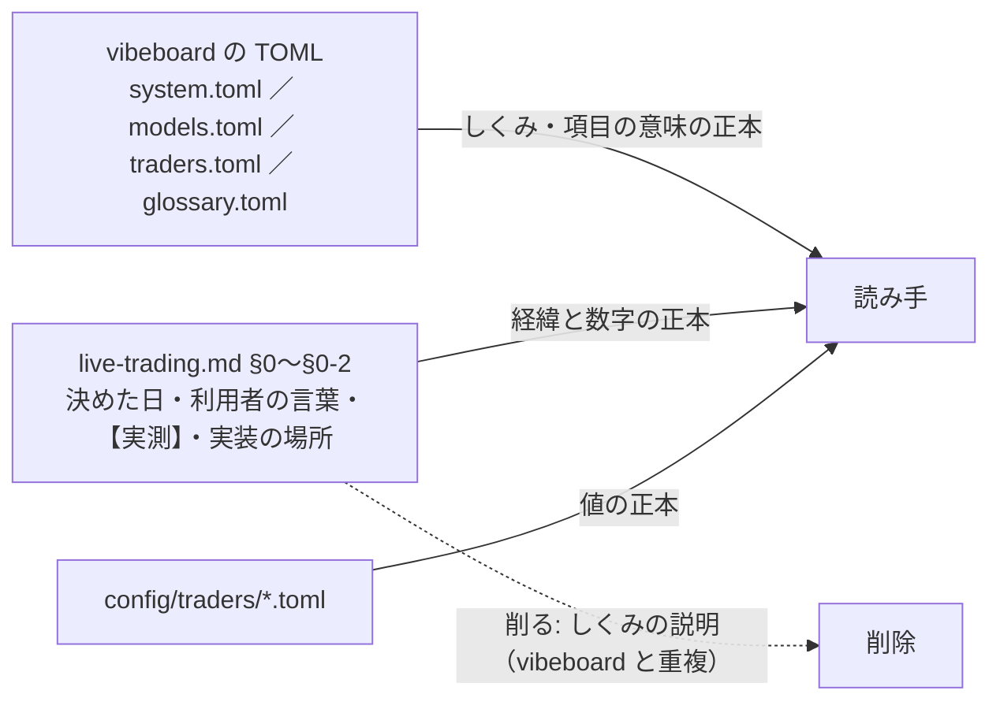

# 仕様書 `live-trading.md` の重複した説明を削る提案（トレーダー・モデルの設定の説明 Step 8）

作成日: 2026-09-26。親: [売買に使うトレーダーやモデルの設定などの説明を分かりやすく書く](explain-trader-model-settings.md) の Step 8。前の段: [アウトライン](explain-settings-outline.md) §5-4 の決定 4（利用者 2026-09-26）＝ **「仕様書の古い記述は直さなくてよい。vibeboard にあるものを説明の正本とし、仕様書の重複は削除する方向で提案する」**。

⚠ **これは提案。まだ 1 文字も削っていない。** 利用者が §5 で決めてから、決まったブロックだけを削る。

## 0. 目的・背景

Step 3〜7 で、トレーダーと設定の**しくみの説明**は vibeboard に集まった（システム説明の「トレーダーのしくみ」「予測モデルのしくみ」「実際の売買」・予測モデルのタブ・トレーダーのタブ・用語タブ）。一方 `docs/specs/experiments/live-trading.md` の §0〜§0-2 には、同じしくみの説明が確定前の書き方のまま残っている（棚卸し [Step 1](explain-settings-inventory.md) §5-3 の D2・D3・O1・O2・O6）。2 か所にあると次も写し間違えるので、**説明は vibeboard に 1 本化し、仕様書には「決めた経緯・利用者の言葉・【実測】【推測】の数字・実装の場所」だけを残す**。

> この図の主張: 正本を「説明」と「経緯・数字」で分け、仕様書からは説明だけを抜く。

## 1. 分け方の規則（この提案で使った物差し）

| 印 | 扱い | 当てはめ方 |
| --- | --- | --- |
| **残す** | そのまま | 決めた日・利用者の言葉（引用）・【実測】【推測】の数字・表の値・実装の場所（コードの名前）・後の節が参照する定義 |
| **削る** | 文ごと消し、要れば 1 行の案内（vibeboard のどのページか）に置き換える | しくみの説明・項目の意味・使い方の一般論で、vibeboard に同じ内容があるもの。⚠ 古くて嘘になっているもの（D2・O1・O2）は案内も要らない |
| **詰める** | 表の列や文のうち、説明の部分だけを抜いて短くする | 「中身」の列に説明と決定が混ざっている表 |

⚠ 削ったあとも、**vibeboard 側から仕様書へのリンク（`detail_links`・用語の `doc`）は「決めた経緯と数字」の場所として生きる**（Step 7 で `see` を足し、行き先を 2 本にしてある）。

## 2. 対象ブロックと提案

行 ＝ `live-trading.md` の 1 ブロック（見出し・段落・表）。「vibeboard の正本」＝ 同じ内容がある場所。⚠ 行番号は 2026-09-26 時点。

### 2-1. §0 冒頭（6〜9 行目）

| # | いまの中身 | vibeboard の正本 | 提案 | 理由 |
| --- | --- | --- | --- | --- |
| A1 | 「2026-09-17 の利用者決定: 属性はまだ設定しない」「2026-09-19: 候補のまま確定」 | — | **残す** | 決めた日と経緯 |
| A2 | 「⚠ **残る未設定は銘柄集合と株数の決め方だけ**（§0-3 の `dryrun2` で決まる）」 | — | **削る**（O1。2026-09-21 に確定済みで嘘） | 直すのではなく消す（決定 4 ＝ 直さない） |

### 2-2. §0-1 トレーダーの定義と、実際に動かす 3 人（11〜63 行目）

| # | いまの中身 | vibeboard の正本 | 提案 | 理由 |
| --- | --- | --- | --- | --- |
| B1 | **属性の表**（属性 ／ 型 ／ 置き場。8 行） | トレーダーのしくみ「設定項目の一覧」（表 ＋ 詳しくの表 ＝ 項目名 ／ 型 ／ 検査の規則 ／ 読む場所） | **削る** → 1 行「設定項目の意味と型は vibeboard のシステム説明「トレーダーのしくみ」→ 設定項目の一覧」 | 完全な重複。vibeboard の表のほうが検査の規則まである |
| B2 | **3 人の表**（モデル ／ θ ／ 予算 ／ 銘柄集合 ／ 状態） | 値は `config/traders/T1〜T3.toml`（正本）・画面はトレーダーのタブ | **残す**（値と確定の日付） | 経緯の記録。⚠ D3（T3 の登録名「60日発注できる時間帯」）は残す行の中の誤り。決定 4 は「直さない」だが、**残すなら `60日窓` に戻す 1 語の修正だけは利用者に勧める**（登録名は変えない決まり ＝ CLAUDE.md） |
| B3 | 「銘柄集合と `sizing` の規則（結果を見る前に固定）」の段落 ＋「2026-09-21 の結果と利用者決定」 | 選び方の考え方の「詳しく」に写しがある | **残す** | 事前固定の規則と結果 ＝ 経緯そのもの。【実測】の値段 |
| B4 | **予算の規模 A ／ B** の見出し・利用者の指示の引用・表（使えるか ／ 予算 ／ 上限 ／ 枠 ／ 含み損 ／ 使いどころ） | トレーダーのしくみ「予算の規模」（本文は説明・詳しくに数字） | **詰める**: 引用と表は残す。表の「使いどころ」の列の説明文（「先に動かすと買いが口座に断られてエラーが並ぶ」など）はそのまま残してよい（理由の記録） | 数字と決定が主。削るものはほぼ無い |
| B5 | **整数株で買える銘柄の数の表**（K ／ A の枠 ／ 買える本数 …）と前後の ⚠ 2 文 | 選び方の考え方の「詳しく」が「表は §0-1」と参照 | **残す** | 【実測】の数字。vibeboard が参照している |
| B6 | ⚠ 選んだ基準は族の違い ／ ⚠ 種 0 ／ ⚠ T2 は銘柄を選んでいない ／ ⚠ 上位 K | 予測モデルのタブの各モデルの「試した結果」に写し（要点だけ） | **残す** | 【実測】と判断の記録。⚠ O6（T2「48 銘柄をほぼ同時に買い、ほぼ同時に売る」）は 63 本の前提の文だが、**当時の観察の記録として残す**（直さない）。読み違え防止に「（売買するのは 5 本 ＝ B2）」の注は付けてもよい |
| B7 | 「`config/traders/T1.toml`〜`T3.toml` は `sizing` と銘柄が決まってから書く」 | — | **削る**（O2。書き終わっている） | 嘘になっている |
| B8 | **トレーダーのお金と持ち株**の見出しと「⚠ 目的は…按分して持つ」の 1 文 | トレーダーのしくみ「予算と買い方」 | **残す**（目的の文は決定） | — |
| B9 | お金と持ち株の表の各行のうち **説明の部分**: 持ち株 ／ 売り（内部移転しない） ／ 口座への注文（別々に出す） ／ 金額の内訳 ／ 持ち金 ／ 自分の予算枠が足りない ／ 口座全体の歯止め ／ 口座に断られた買い ／ 1 日の売買回数 | 「予算と買い方」の本文と詳しく・「上限・含み損・停止」の表 | **詰める**: 各行を「決めた日 ＋ 利用者の言葉 ＋ 代償 ＋ 実装」に絞り、しくみの説明（「空き ＝ 予算 − …」の式・「自分の持ち株だけ売れる」の一般論・見送りの意味）は vibeboard へ 1 行で案内 | 説明と決定が同じマスに混ざっている。決定（日付・引用・代償）は経緯なので残す |
| B10 | 表の行「**断られたときの巻き込み** … `plan.py` の `aggregate`」 | — | **削る**（D2。2026-09-19 より前の仕組みで、`aggregate` はもう無い） | 嘘になっている（同じ表の「口座への注文: 別々に出す」と矛盾） |
| B11 | 表の下の 2 つの「- ⚠」（資金不足のエラーコード未確認 ／ 判定に使わない） | — | **残す** | 未確認の印と判定の決まり |

### 2-3. §0-2 予算の上限・発注できる時間帯・停止条件・判定の閾値（85〜97 行目）

| # | いまの中身 | vibeboard の正本 | 提案 | 理由 |
| --- | --- | --- | --- | --- |
| C1 | 表（項目 ／ 値 ／ 執行器での実装。10 行） | 「上限・含み損・停止」（本文は説明・詳しくに値と実装） | **残す**（値と実装の正本） | 「値」の列は数字、「実装」の列はコードの名前。説明の文は少ない。⚠ 「停止」の行の「それまでの文面「発注をやめて持ち越す」は実装されていなかった」は経緯として残す |

### 2-4. 削らないもの

- §0-3 以降（dry-run の【実測】・手順書・シミュレーション・帳尻・1 日の流し方・記録の置き場・13500t）＝ 手順と記録。説明の重複ではない
- 過去の実験の記録・済んだプラン（CLAUDE.md「変えないもの」）

## 3. 削ると影響する場所（削るなら一緒に直す）

| 場所 | いまの参照 | 直し方 |
| --- | --- | --- |
| `dashboard/system.toml` の `detail_links`（6 か所: 「live-trading.md §0-1（属性の表）」「（売買する株）」「（トレーダーのお金と持ち株）」「（予算の規模）」「§0-1・§0-3」「§0-2」） | 節の名前つきで仕様書へ | B1 を削るなら「（属性の表）」の札を「（3 人の表と決めた経緯）」に。ほかはそのまま（残るブロックを指している） |
| `dashboard/glossary.toml` の `where`（§0-1 を指す 8 語 ＋ §0-2 の 3 語） | 「§0-1 トレーダーの定義」「§0-1 トレーダーのお金と持ち株」など | Step 7 で `see`（vibeboard のページ）を付けたので、しくみは `see` から引ける。`where` は残るブロックの見出し（「3 人の表」「トレーダーのお金と持ち株（決定と代償）」）に合わせて文字を直す |
| `dashboard/traderview.py` の「正式な名前」の案内（`live-trading.md` §0-1） | 「決めた経緯と数字は §0-1」 | そのまま（残るブロックの話） |
| `CLAUDE.md` の実売買の節（`live-trading.md` §0-1 を 5 か所） | 3 人の確定・規模 A ／ B・`sizing` の決め手 | そのまま（残るブロックの話） |
| `docs/specs/dashboard.md` §16〜§18・親プランの Step 1〜7 のプラン | 「§0-1」を出どころとして引用 | そのまま（経緯） |
| 済んだプラン（`docs/plans/archive/`） | 多数 | 触らない |

## 4. 手順（利用者が「削る」と決めたら）

1. §5 の決定に従い、**1 ブロックずつ**削る ／ 詰める（A2・B7・B10 は消すだけ。B1 は 1 行の案内に置き換え。B9 は行ごとに説明を抜く）
2. §3 の参照先を直す（`system.toml` の札 1 つ・`glossary.toml` の `where`）
3. `cd dashboard && .venv/bin/python -m pytest -q tests/test_vibetab.py tests/test_system_tab.py tests/test_help.py`（リンク先の実在・`see` の行き先・用語の名前）
4. 1 コミット（メッセージに「説明の正本は vibeboard」と削ったブロックの番号）。⚠ 本番の道に効く変更ではないので「デプロイ」は要らない

## 5. 利用者の決定（✅ 2026-09-27「全部おススメで直して」）

| # | 問い | 決定 |
| --- | --- | --- |
| 1 | 削る 4 つ（A2・B1・B7・B10）を削ってよいか | **削る**。4 つとも 09-27 に確かめ直した ＝ A2・B7 は 09-21 の確定で嘘・B10 の `aggregate` は実売買のコードに無い・B1 は `system.toml`「設定項目の一覧」に検査の規則つきで載っている |
| 2 | 詰める 2 つ（B4・B9）を詰めてよいか。B9 は行ごとに「決定 ＋ 代償 ＋ 実装」に絞る | **B4 は触らない**（提案自身が「削るものはほぼ無い」）。**B9 だけ行ごとに詰める**（日付・引用・代償・実装は残す） |
| 3 | 残す行の中の誤り D3（T3 の登録名）を 1 語だけ直すか（決定 4 は「直さない」） | **直す**。登録名 `T3 QUANT（60日窓）` は CLAUDE.md「変えないもの」に明記 ＝ 直すのは規則への回復（誤記はリポジトリ中で仕様書の 1 か所だけ） |
| 4 | O6（T2 の 48 銘柄の文）に「売買するのは 5 本」の注を付けるか | **付ける**（観察の文は変えず、括弧で 1 句） |

## 6. 影響範囲・テスト方針

この提案ファイルだけ（仕様書・TOML・コードは変えていない）。削るときの検査は §4 の 3。

## 7. 結果（✅ 2026-09-27。titan の Claude）

- **削った 4**: A2（§0 冒頭の「残る未設定は…」の 1 文）／ B1（属性の表 8 行 → 正本が vibeboard であることの 1 行）／ B7（「T1〜T3.toml はあとで書く」の 1 行）／ B10（表の行「断られたときの巻き込み」）
- **詰めた**: B9 の 6 行（持ち株・売り・口座への注文・持ち金・自分の予算枠が足りない・口座に断られた買い）。消したのは「自分の持ち株だけ売れる」の一般論・空きの式・見送りの意味・再送の線の写し。日付・引用・代償・実装はそのまま。金額の内訳・口座全体の歯止め・1 日の売買回数の 3 行は触らず、表の上に vibeboard への案内 1 行。B4 は触っていない
- **直した**: D3 ＝「T3 QUANT（60日窓）」／ O6 ＝ 観察の文の後ろに「（2026-09-19 の観察。63 本の候補の頃の文で、いま売買するのは上の表の 5 本）」
- **参照の直し**: `system.toml` 3 か所（`detail` の本文 1・札 2）・`glossary.toml` 2 か所（試験用トレーダー・sizing の `where`）。⚠ §3 の「札 1 つ」は数え漏れで、「属性の表」を指す箇所は 4 つあった（`glossary.toml` の sizing の `where` を含む）。テストはリンク先のファイルの実在だけを見る（`test_links_point_at_real_things`・`test_vibetab.py` の `doc` の実在）ので、札と `where` は grep で拾った
- **検査**: `test_vibetab.py`・`test_system_tab.py`・`test_help.py`・`test_traders_tab.py` ＝ 95 passed【実測 2026-09-27】。「属性の表」「60日発注できる時間帯」はリポジトリ中で済んだプラン（`docs/plans/archive/`）にだけ残る
- **決めごとの置き場**: 正本の分け方は CLAUDE.md「ドキュメントの書き方」に 1 行。⚠ `glossary.toml` は本番の管理画面にも COPY されるので、`where` の直しは次の「デプロイ」で 13500t に届く（この直しのためのデプロイは要らない）
