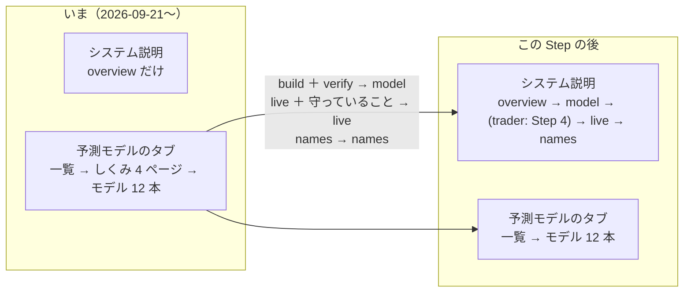

# システム説明のタブを組み直す（トレーダー・モデルの設定の説明 Step 3）

作成日: 2026-09-26。親: [売買に使うトレーダーやモデルの設定などの説明を分かりやすく書く](explain-trader-model-settings.md) の Step 3。アウトラインは [Step 2 の結果](explain-settings-outline.md) §5（✅ 2026-09-26 利用者決定）。

## 0. 目的・背景

利用者の決定（2026-09-26）: **システム説明 ＝ 全体像 ＋ 各パートの詳細（モデル・トレーダーの個別の説明はしない）**。パートは 予測モデルのしくみ ／ トレーダーのしくみ ／ 実際の売買 ／ 名前と識別名。

いまは 2026-09-21 の決定「システム説明は概要だけ」で、しくみの 4 ページ（`build`・`verify`・`live`・`names`）が `models.toml` の `[[page]]` として**予測モデルのタブ**に居る。この Step で **システム説明に戻し**、`build` ＋ `verify` を「予測モデルのしくみ」1 ページにまとめ、`live` に概要の「守っていること」を移し、全体像を各パートへの入口に組み直す。⚠ **「トレーダーのしくみ」のページを新しく書くのは Step 4**（この Step では入口に席だけ用意する）。

## 1. 守る決まり

| 決まり | 出どころ | この Step での効き方 |
| --- | --- | --- |
| 言葉の正本は TOML。Python に説明を書かない | dashboard.md §18-2 | ページの移動 ＝ TOML の `[[page]]` の移動。コードが変わるのは一覧・リンク・`[common]` の引き方だけ |
| 本文はやさしい言葉（`FORBIDDEN`）・設定の数字と `$`・bp を本文に書かない・用語は「詳しく」だけ | §16-2・§18-2（テスト） | 移した文はそのまま同じ検査を受ける（`test_system_tab.py` に検査を移す） |
| 1 図 1 主張・箱 12 個以内 | CLAUDE.md | 全体像の図は今の 8 箱のまま（パートの境で色分け） |
| 「詳しく（用語あり）」は畳まない・白地 | §18-2 | 変えない |
| `models = true`（型ごとのしくみ）・`ledger = true`（検証結果一覧の合計）の段は `modelview.section_html` が描く | §17-7・§18-2 | `system.toml` に置いても描ける（`systemview.body` は `modelview.page_body` を使う）。⚠ ただし段が使う `[common]` の札（`ledger_rows`・`ledger_adopt`・`ledger_hold`・`ledger_drop`・`ledger_note`・`no_live_models`・`card_*`…）は `models.toml` の `[common]` に在る ＝ 写さず、`systemview.load` が **`models.toml` の `[common]` を下敷きに `system.toml` の `[common]` を重ねる**（正本は 1 本のまま） |
| タブの並び「システム説明 → 予測モデル → トレーダー」は変えない | §18-2 | `vibeboard.config.json` は触らない |
| 言葉は CLAUDE.md の表（売買履歴・取引時間帯 …）。登録名は変えない | CLAUDE.md | 移すついでに O8（帳面 → 売買履歴・執行の窓 → 取引時間帯）を直す |

## 2. 対応方針

### Step 3-1: `system.toml` にページを移す（言葉の正本の移動）

| ページ（`id`） | 中身 | 元 | ついでに直すもの |
| --- | --- | --- | --- |
| `overview`（全体像） | 何をするシステムか ／ 全体の流れの図（8 箱を **パートの境で色分け**）／ **パートの入口**（4 つ。1 行ずつ ＋ リンク `tab = "system", item = …`）／ 守っていることは**要約 3 行だけ**残し、詳細は `live` へ | 今の `overview` | 入口の並びは 予測モデル → トレーダー（Step 4 まではリンク無しの 1 行）→ 実際の売買 → 名前 |
| `model`（予測モデルのしくみ） | **材料をそろえる**（集める・目盛りを直す ／ 見ている数字）→ **学ぶ・出力スコアに直す** → **型ごとのしくみ**（`models = true`）→ **過去のデータで確かめる**（期間を分けて試す図 ／ 売り買いのまねごと ／ ものさしと判定 ／ 配線の検査 ／ 試した数 `ledger = true`）。⚠ 1 本ずつの話は予測モデル一覧へのリンク | `models.toml` の `build` ＋ `verify` | 段が多くなるので、`build` と `verify` の段を **見出しの言葉をそろえて** 並べる（消さない。数は Step 3-6 で目で見て決める） |
| `live`（実際の売買） | 今の `live`（トレーダー ＝ モデル ＋ 売買基準値 ＋ 予算 ／ 1 日の流れ ／ 入るものと出てくるもの ／ 出力スコアから注文へ ／ 読み方）＋ **守っていること**（今の `overview` の段。帳尻・許可・停止・シミュレーション・見るのは差） | `models.toml` の `live` ＋ `overview` | O3（`candidates/`・`universe` の古い詳しく）・O4（63 本・120 本の合図の記述 ＝ 「いまの形の前」と分かる書き方か削除）・O8 |
| `names`（名前と識別名） | そのまま | `models.toml` の `names` | — |
| `trader`（トレーダーのしくみ） | ⚠ **この Step では作らない**（Step 4）。`overview` の入口に席だけ | — | — |

- `models.toml` から `[[page]]` × 4 を消す（`[common]` の `group_guide`・`other_pages`・`no_live_models`・`ledger_*` は残す ＝ 一覧・システム説明が使う）
- `system.toml` の `[common]`: `other_pages = "ほかのページ"` は既にある。頭のコメント（「概要の 1 ページだけ」）を書き直す

### Step 3-2: コード（一覧・リンク・`[common]` の引き方）

| ファイル | 直すもの |
| --- | --- |
| `dashboard/systemview.py` | `load()`: `models.toml` の `[common]` を下敷きに重ねる（§1）。頭の docstring |
| `dashboard/modelview.py` | `guide_pages()` と `sidebar()` の「しくみ」の束を消す（一覧 → いま使っている → 机上で試した）。⚠ 決め打ちのリンク 2 か所 ＝ `score_link`（`tab: "models", item: "live"` → `system` ／ `live`）・`flow_link`（`tab: "models", item: "build"` → `system` ／ `model`） |
| `dashboard/figures.py` | 流れの図の箱に**パートの色**を付けられるようにする（`steps[].part` か `kind` の値を足す。⚠ 任意 ＝ 無くても全体像は組める。足すなら箱 12 個以内・凡例は図の直前の主張の行に） |
| `dashboard/vibetab.py` | 触らない見込み（`/system` と `/models` の経路は id で引くだけ） |

### Step 3-3: リンクの付け替え（TOML）

| 場所 | いま | 後 |
| --- | --- | --- |
| `system.toml` 45〜48 行（`overview` の 4 リンク） | `tab = "models", item = "build|verify|live|names"` | `tab = "system", item = "model|live|names"`（入口の段に組み込む） |
| `system.toml` 80 行 | `tab = "models", item = "live"` | 同じページ内なので消す |
| `models.toml` 988 行（`build` の「名前と識別名」） | `tab = "models", item = "names"` | 移動後 `tab = "system", item = "names"` |
| `models.toml` 1224 行（`live` の「システム説明（守っていること）」） | `tab = "system", item = "overview"` | 同じページに入るので消す |
| `models.toml` 956・979・1080・1196・1237 行 | `tab = "models", item = "all"` | そのまま（移動後も予測モデル一覧を指す） |

### Step 3-4: テストを移す・直す

| テスト | いま | 後 |
| --- | --- | --- |
| `tests/test_system_tab.py::test_only_the_overview` | ページは `["overview"]` だけ | ページは `["overview", "model", "live", "names"]`（Step 4 で `trader` が入る）。`GUIDE_PAGES` の定数を新しい id に |
| `::test_real_overview_renders_and_points_at_the_model_pages` | `/#models/<guide>` へのリンク・`/#system/` 無し・`<table` 無し | 入口が `/#system/model|live|names` を指す・「ほかのページ」の並びが出る・表は置かない（入口は表でなく札） |
| `tests/test_models_tab.py` 538〜616 行（しくみのページの検査 3 本） | `models.toml` の `[[page]]` を見る | **`test_system_tab.py` へ移す**（やさしい言葉・手厚さ〔各段に詳しくか図〕・id の重なり・リンク先が在る・描ける）。`test_real_guide_pages_render` の「一覧 → しくみ → …」は「一覧 → いま使っている → 机上で試した」に |
| `tests/test_models_tab.py` のモデルのページの検査 | 「モデルのページから `/#models/build` へ」 | `/#system/model` へ |
| `tests/test_traders_tab.py`・`test_help.py` | — | 変えない見込み（流して確かめる） |

### Step 3-5: 文書を直す（決定の記録）

| 文書 | 直すもの |
| --- | --- |
| `CLAUDE.md` の「予測モデルのタブ」「システム説明のタブ」の項 | 「しくみの 4 ページ」「2026-09-21 から概要の 1 ページだけ」→ 2026-09-26 の決定（全体像 ＋ 各パート。モデル・トレーダーの個別の説明はしない） |
| `docs/specs/dashboard.md` §17-7 | 経緯として残し、頭に「✅ 2026-09-26 にシステム説明へ戻した（利用者の決定）」を足す |
| `docs/specs/dashboard.md` §18・§18-1 のページの表 | ページ ＝ overview ／ model ／ trader（Step 4）／ live ／ names。`[common]` の下敷きの決まり |
| `docs/specs/dashboard.md` §9 更新履歴 | 2026-09-26 の行 |
| `system.toml`・`models.toml`・`systemview.py` の頭のコメント | 「概要だけ」「しくみのページはここ」を書き直す |

### Step 3-6: 通しで確かめる

1. `cd dashboard && .venv/bin/python -m pytest -q tests/test_system_tab.py tests/test_models_tab.py tests/test_traders_tab.py tests/test_help.py`
2. `./run-tests.sh --fast`
3. sidecar（3015）の入れ直し（コードを変えたので要る。⚠ vibeboard 本体〔3010〕は利用者の端末の前面 ＝ 入れ直しは利用者に頼む）→ 3 タブを目で見る: 全体像の入口 → 予測モデルのしくみ（段の数が多すぎないか）→ 実際の売買 → 名前 ／ 予測モデルのタブの一覧にしくみの束が無い ／ モデルのページの「共通の流れ」がシステム説明へ飛ぶ

## 3. 影響範囲

- 変える: `dashboard/system.toml`・`models.toml`・`systemview.py`・`modelview.py`・（任意）`figures.py`・`tests/test_system_tab.py`・`tests/test_models_tab.py`・`CLAUDE.md`・`docs/specs/dashboard.md`
- 変えない: `traders.toml`・`traderview.py`・`vibetab.py`・`vibeboard.config.json`（タブの並び）・管理画面（`dashboard/app/`。g3plus に載る側には触れない ＝ **「デプロイ」は要らない**）・執行器・設定の値
- ⚠ URL が変わる: `/#models/build|verify|live|names` → `/#system/model|live|names`（古い URL は 404。外から参照しているのは TOML のリンクとテストだけ）

## 4. テスト方針

- Step 3-4 のテストを先に直してから TOML を動かす（赤 → 緑で移動の漏れを見つける）
- 移した文は 1 文字も変えずに移す（O3・O4・O8 の直しだけ別のコミットに分ける ＝ 差分で「移動」と「直し」を見分けられるように）
- 通しの検査は Step 3-6。⚠ `LT_MODE_DIR` ／ `AIL_MODE_DIR` は conftest が tmp に向ける（本物の `MODE` を読まない）

## 5. 結果（✅ 2026-09-26）

- 3-1〜3-5 をプランどおりに実装。pytest 4 本 67 ✅・`./run-tests.sh --fast` 237 ✅・`python3 dashboard/vibetab.py --port 3016` で 4 ページ（overview 4 段 ／ model 14 段 ／ live 6 段 ／ names 2 段）と、予測モデルのタブの一覧（一覧 → いま使っている → 机上で試した）・モデルのページからのリンク（`#system/model`・`#system/live`）を確認
- ⚠ プランからの違い: `systemview.load` で `models.toml` の `[common]` を下敷きにする代わりに、`models = true`・`ledger = true` の段が使う札（`no_live_models`・`ledger_*`）を **`system.toml` の `[common]` へ移した**（段は `system.toml` のページにしか無いので、正本は 1 本のまま。`open_page` だけ `models.toml` に残る）
- 図のパート色は任意としていたが実装した（`figures.flow_svg(parts=…)`。凡例は使ったパートだけ・文字は TOML）
- ⚠ 動いている sidecar（3015）は古いコードのまま。**vibeboard の入れ直しは利用者**（3010 は端末の前面）。入れ直した後に 3 タブを目で見る
- 「トレーダーのしくみ」（`trader`）は Step 4。全体像の入口には席だけ（リンク無しの 1 行）
