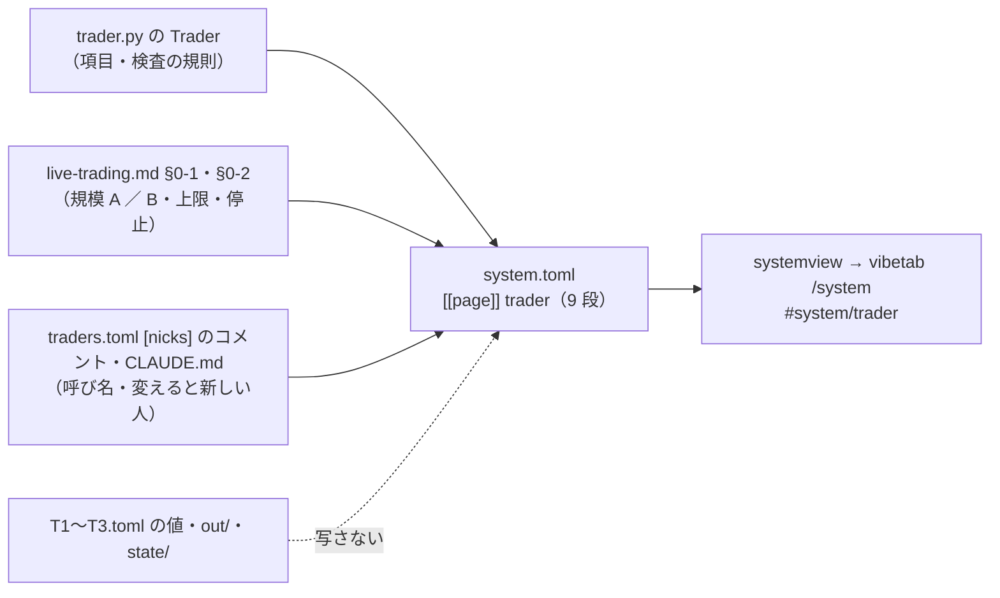

# 「トレーダーのしくみ」のページを新しく書く（トレーダー・モデルの設定の説明 Step 4）

作成日: 2026-09-26。親: [売買に使うトレーダーやモデルの設定などの説明を分かりやすく書く](explain-trader-model-settings.md) の Step 4。アウトラインは [Step 2 の結果](explain-settings-outline.md) §5（✅ 2026-09-26 利用者決定）。前の段は [Step 3](explain-settings-system-tab.md)（システム説明を「全体像 ＋ パートごとの詳細」に組み直した。`trader` は入口に席だけ）。

## 0. 目的・背景

システム説明のタブは 全体像（`overview`）→ 予測モデルのしくみ（`model`）→ **トレーダーのしくみ（`trader`。⚠ まだ無い）** → 実際の売買（`live`）→ 名前と識別名（`names`）の 5 ページになる予定で、`trader` だけが未着手（全体像の入口に「ページは準備中」の 1 行があるだけ）。

Step 1 の棚卸しで、vibeboard に無いと分かったもの（G1〜G5）はほとんどがトレーダーの側の話 ＝ このページで埋める。

| 欠け | 中身 | このページの段 |
| --- | --- | --- |
| G1 | 学ぶ株・出力スコアを出す株と、売買する株は別 | 2（4 つの集合。✅ 2026-09-26 利用者決定「4 つの集合は重要なので記載する」＝ [dashboard.md §18-2](../../specs/dashboard.md)） |
| G2 | 売買する株の選び方の考え方（⚠ 値は書かない） | 3 |
| G3 | 予算の規模 A ／ B（B は「実際の取引では使えない可能性がある」） | 6 |
| G4 | 予算の上限・大きな含み損・停止（トレーダー 1 人の視点で） | 7 |
| G5 | 設定を変えるのは「新しい人」（新しい識別名と呼び名・新しい検証） | 8 |

⚠ **書くのは共通のしくみと設定項目の意味だけ**。各トレーダーの値・特性は書かない（利用者決定「各モデル・各トレーダーの説明はしない」＝ 1 人ずつはトレーダーのタブ）。⚠ **設定の値（モデル・θ・銘柄・予算・`sizing`）は変えない**。

## 1. 守る決まり

| 決まり | 出どころ | このページへの効き方 |
| --- | --- | --- |
| 言葉の正本は `system.toml`。Python・HTML に説明を書かない | dashboard.md §18-2 | 文は全部 `[[page]] trader` の項目。コードが変わるのは図の種類を足すときだけ（§2 Step 4-2） |
| 本文はやさしい言葉（`FORBIDDEN`）・用語・正式な名前・コードの場所・細かい数字は `detail*` にだけ | §16-2・§18-2（`test_system_tab.py`） | `sizing`・`universe`・θ・執行・成行・端株 は本文に出せない → 「買い方」「見る株」「売買基準値」「その場で注文」「1 株単位 ／ 金額を決めて」 |
| 本文に実売買の設定の数字（予算・売買基準値・本数）と `$`・bp を書かない | §18-2（テストは `$`・63・48・55・45・bp を弾く） | 「5 本」「$300」「$60」「20%」も本文に書かない（`detail` に【実測】と出典つきで） |
| 本文で「点」と裸の「スコア」を使わない | `test_the_model_output_is_called_output_score` | 「出力スコア」だけ |
| ほかの人・ほかのモデルとくらべる文を書かない・呼び名を本文に出さない | §16-1（`COMPARING`。トレーダーは 1 人のときも 10 人のときもある） | 本文に アキ ／ T1 ／「3 人」を書かない（`detail` は可）。⚠ `\d+ 人` に当たる書き方（「1 人ずつ」）も避ける |
| 4 つの集合を必ず書き分ける（材料に入れるもの〔株の外の数字も〕／ 学ぶ株 ／ 出力スコアを出す株 ／ 売買する株） | §18-2（2026-09-26 利用者決定） | 段 2 は**売買する株の側から**書く（モデルのページは前の 3 つ）。⚠ 材料を「株」と呼ばない |
| 1 図 1 主張・箱 12 個以内・図はサーバで組む SVG（Mermaid は使えない） | CLAUDE.md・§18-2 | 図は 2 枚まで（4 つの集合 ／ 守りの 3 段は**表**） |
| パートのページは手厚く（前書き・図 1 つ以上・どの段にも「詳しく」） | `test_part_pages_are_deep` | 全段に `detail` を置く |
| 言葉は CLAUDE.md の表（売買履歴・取引時間帯・識別名・呼び名・売買基準値）。登録名は変えない | CLAUDE.md | 「台帳」「窓」「鍵」を書かない |

## 2. 対応方針

> この図の主張: ページの文は 3 つの正本（設定の読み手・仕様書・言葉の TOML）から写すだけで、値は設定に置いたまま画面には出さない。

### 2-1. 段の並び（`[[page]] trader`。読み手の問いの順 ＝ 誰か → どの株か → いつ → いくら → どこまで → 変えたら → 名前 → 項目の一覧）

| # | 段の題（案） | 本文（やさしい言葉） | 「詳しく（用語あり）」 | 図か表 | 出どころ |
| --- | --- | --- | --- | --- | --- |
| 1 | トレーダー ＝ モデル ＋ 売買基準値 ＋ 予算 ＋ 売買する株 ＋ 買い方 | 売り買いを決める 1 つの単位を人に見立てたもの。持ち物は 5 つで、始める前に決めて設定のファイルに書く。モデルは 1 本以上。人は増えたり減ったりする | 設定 ＝ `config/traders/<識別名>.toml`・読み手 `trader.py` の `Trader`・`kind = experiment ／ file ／ fixed`（試験用は `test = true` が要る） | — | §0-1 の属性の表・`trader.py` |
| 2 | 売買する株 — 4 つの集合を、売買する株の側から | 4 つの集合（材料に入れるもの〔株の外の数字もふくむ〕／ 学ぶ株 ／ 出力スコアを出す株 ／ 売買する株）のうち、トレーダーが決めるのは最後の 1 つだけ。出力スコアを出す株の中から選ぶ（出力の無い株は売買できない）。前の 3 つはモデルの側 | `symbols`（または `universe`）／ config の `targets`・学習範囲 `shared ／ each`・いまの 3 人の本数【実測】（材料 ⊃ 出力 と 材料 ＝ 出力 の 2 種類・売買は 5 本） | **図**（4 つの集合の絞り込み。§2-2）＋ **表**（集合 ／ だれが決めるか ／ どのタブのどこに出るか） | §18-2・`model` ページの段「4 つの集合」（重ならないよう向きを変える） |
| 3 | 売買する株の選び方の考え方 | 予算を本数で等しく割った 1 本あたりの金額で 1 株が買える株だけ選べる（少ない予算では値段の低い株から）。結果を見る前に決めて、途中で入れ替えない。株の詰め合わせ商品を出力しないモデルの人は、それを入れない | D3（会社株のうち終値の低い順に 5 本・1 銘柄の枠 $60【実測 2026-09-18】）・`dryrun2` の結果（金額指定は最低 $5・端株は 1 本 $0.10 ＝ §0-3【実測 2026-09-21】）・⚠ これはいまの 3 人に固有の決め方 | — | §0-1（銘柄集合と `sizing` の規則）・`T1.toml` のコメント |
| 4 | 売買基準値と、モデルが 2 本以上あるときの合わせ方 | 持っていない株は出力スコアが売買基準値を上回ったら買い、持っている株は「100 − 売買基準値」を下回ったら売る。売買基準値はまん中より上にしか置けない。2 本以上なら合わせ方（そのまま ／ 平均 ／ 多数決 ／ 全員一致）を先に決める。動くのは 1 日 1 回（流れは「実際の売買」） | `threshold ≥ 50`（rules.md 13-3）・`combine = asis ／ mean ／ majority〔奇数本〕／ unanimous`（`trader.py` の検査）・`plan.decide` | — | `trader.py`・`traders.toml` の `line_band`・`combine_*` |
| 5 | 予算と買い方 | どの株にも同じ金額まで（予算 ÷ 本数）。空き ＝ 予算 − 持っている株の買値 − 売ったばかりで次の日まで使えないお金。もうけても損しても、空きは予算までしか戻らない。買い方は 1 株単位（1 株に満たない株は見送る）か、金額を決めて買う | `per_symbol_usd`・`state.cost_in_use`・`unsettled`（T+1・保守側）・`sizing = shares ／ notional`・`too_small`・⚠ `over_budget` は現在の経路では出ない（CLAUDE.md） | — | §0-1「トレーダーのお金と持ち株」・`plan.size_intents` |
| 6 | 予算の規模 — 2 つの規模を並べる | 予算には 2 つの規模があり、小さい方が口座で実際に使える規模。大きい方は「実際の取引では使えない可能性がある」ので、紙上の対照と机上の検証にだけ使う。数字を出すときは必ずそう添える | 規模 A $1,000（$300 × 3 ＋ 予備 $100。執行器の既定）／ 規模 B $10,000（`--max-total-budget 10000 --max-day-usd 10000` を明示したときだけ。⚠ 実際の取引では使えない可能性がある）・口座の残高【実測 2026-09-16】 | — | §0-1「予算の規模」・`T1.toml` のコメント |
| 7 | 予算の上限・大きな含み損・停止 | 守りは 3 段 ＝ 全員の予算の合計と 1 日の買いの合計に上限（超える買いは見送る）／ 大きな含み損は**警告だけで、止めるのは人**（自動で投げ売りしない）／ 停止ボタン 1 つで新しい注文を止め、出ている注文を取り消す。決まった時間の外・休みの日・半日の日は注文しない | `--max-total-budget`・`--max-day-usd`（既定 1000。全員・全起動の合計。`over_day_cap`）・`drawdown_warning`（予算の 20%・rc は変えない）・`HALT`・取引時間帯 15:45〜16:05 ET | **表**（守り ／ だれが決める ／ 何が起きるか） | §0-2 |
| 8 | 変えるときは新しい人 — 呼び名と識別名 | モデル・売買基準値・売買する株・予算・買い方・合わせ方のどれかを変えるときは、同じ人の設定を書き換えず**新しい識別名と新しい呼び名**を付ける（記録がつながらなくなる・新しい検証として数える）。呼び名は意味の無い名前。記録と URL は識別名 | 識別名 ＝ ファイル名 `name`・呼び名 ＝ `traders.toml` の `[nicks]`・試験用（`test = true`）は本物の人が居れば一覧から外す（`live.show_test_traders`）・`n_trials`（CLAUDE.md） | — | `[nicks]` のコメント・CLAUDE.md・§13-1 |
| 9 | 設定項目の一覧 | 項目をやさしい言葉で（何を決める項目か ／ トレーダーのページのどこに出るか）。⚠ 値は書かない | `detail_table` ＝ 項目名（`name`・`test`・`budget_usd`・`symbols` ／ `universe`〔`universe_group`〕・`sizing`・`combine`・`threshold`・`note`・`[[models]]` の `kind` ／ `name` ／ `method` ／ `path` ／ `buy` ／ `exit`）／ 型 ／ 検査の規則 ／ 読む場所 | **表 ＋ 詳しく表** | §0-1 の属性の表・`trader.py` の `_load` と `__post_init__` |

- ページの下の「ほかのページ」は今の描き方のまま（`modelview.page_body`）。リンクは 1 →「トレーダーのタブ（1 人ずつ）」、2 →「予測モデルのしくみ」（4 つの集合の前の 3 つ）、4・7 →「実際の売買」、8 →「名前と識別名」
- ⚠ `live` ページの段 1「トレーダー ＝ モデル ＋ 売買基準値 ＋ 予算 ＋ 見る株」は**残す**（テストが題を固定）。本文は今のまま、`links` に `trader` を足す。`detail` の 1 行目（設定の項目の列挙）は段 9 に移し、2 行目（確定の経緯【実測】）は `live` に残す ＝ 同じ文を 2 か所に置かない

### 2-2. 4 つの集合の図 — 図の種類を 1 つ足す（推し）か、今の流れ図で代えるか

| 案 | 中身 | 良い点 | 代償 |
| --- | --- | --- | --- |
| **A（推し）: 入れ子の図 `kind = "nest"` を `figures.py` に足す** | 4 つの四角を大きい順に入れ子で描く（外 ＝ 材料に入れるもの・内 ＝ 売買する株）。箱の文字・主張は TOML（`sets = [{t, s, part}]`・`parts` の塗り分けは流れ図と同じ `PART_FILLS`・凡例も同じ） | 「絞り込み」＝ 部分集合の関係が 1 目で分かる。`model` ページの流れ図（左 → 右）と向きが違うので、同じ図の繰り返しにならない | コード 40 行前後 ＋ テスト 1 本（描ける・箱の数・エスケープ・`figure_html` の出し分け）。`test_figures_have_a_claim_and_few_nodes` に `nest` の枝 |
| B: 今の流れ図（`kind = "flow"`・`parts` で塗り分け） | `model` ページの段「4 つの集合」と同じ 4 箱。`kind = "out"` を「売買する株」に置き換えて主張だけ変える | コードを触らない | `model` ページとほぼ同じ図が 2 ページに並ぶ（主張の文だけ違う） |

A を推す理由 ＝ 利用者が「4 つの集合は重要」と言っており、トレーダーのページでは「売買する株は出力のある株の**中から**選ぶ」という包含の関係が主張になるため（流れ図では順序しか言えない）。⚠ **図の種類を足しても箱の文字はすべて TOML**（説明をコードに書かない）。利用者が B を選べば Step 4-2 は飛ばす。

### 2-3. Step（実装の順）

| Step | 中身 | 変えるファイル |
| --- | --- | --- |
| 4-1 | **テストを先に直す**（赤 → 緑で漏れを見つける）: `PART_PAGES = ("model", "trader", "live", "names")`（並びは overview → model → trader → live → names）／ `test_part_pages_are_deep` に `trader`（前書き・図 1 つ以上・表 1 つ以上・全段に `detail`）／ 新しいテスト `test_trader_page_is_about_settings_not_people` ＝ 本文（`detail*` の外）に 呼び名・`T\d`・ほかの人とくらべる言い方（`COMPARING`）が無い・「4 つの集合」の段に図と表がある・「設定項目」の段に `detail_table` がある ／ `test_real_part_pages_render` に `trader`（`<svg`・`<table`・`/#traders`・`/#system/live` へのリンク）／ `test_real_overview_is_the_entrance_to_the_parts` は `PART_PAGES` を見るので自動で `/#system/trader` を求める | `dashboard/tests/test_system_tab.py` |
| 4-2 | **図の種類 `nest`**（§2-2 の A。⚠ 利用者が B なら飛ばす）: `figures.nest_svg(fig)`・`figure_html` の出し分け・`MAX_NODES`・凡例。テスト `test_nest_figure`（最小の置き場の `SYSTEM` に段 D を足す） | `dashboard/figures.py`・`tests/test_system_tab.py` |
| 4-3 | **`system.toml` に `[[page]] trader` を書く**（§2-1 の 9 段。`model` と `live` の間に置く）。⚠ 出どころの無い文は書かない・値は `detail` にだけ（【実測】と出典つき）・本文に本数・`$`・呼び名を書かない | `dashboard/system.toml` |
| 4-4 | **入口とリンク**: `overview` の「パートごとの説明」の points から「（ページは準備中）」を消し、`links` に `{ label = "トレーダーのしくみ", tab = "system", item = "trader" }` を model の次に足す ／「全体の流れ」の `after` の「4 つの集合」の 1 文に「売買する株の側は「トレーダーのしくみ」」を足す ／ `live` の段 1 に `trader` へのリンク・`detail` の 1 行目を段 9 へ移す ／ `model` の段「4 つの集合」の `after` に「売買する株の側から見た説明はトレーダーのしくみ」の 1 文とリンク | `dashboard/system.toml` |
| 4-5 | **文書とコメント**: `dashboard.md` §18-1 の `trader` の行（「⚠ これから書く」→ 中身）・§18-2 の 4 つの集合の行（「Step 4」→ ✅）・§9 更新履歴 ／ `CLAUDE.md` のシステム説明の項（「書くのはこれから」→ 段の要約）／ `system.toml`・`systemview.py`・`test_system_tab.py` の頭の「Step 4 で書く」 | `docs/specs/dashboard.md`・`CLAUDE.md`・3 ファイルの頭のコメント |
| 4-6 | **通しで確かめる**: `cd dashboard && .venv/bin/python -m pytest -q tests/test_system_tab.py tests/test_models_tab.py tests/test_traders_tab.py tests/test_help.py` → `./run-tests.sh --fast` → `python3 dashboard/vibetab.py --port 3016` で `http://127.0.0.1:3016/system/view?item=trader` と全体像の入口・`live`・`model` からのリンクを目で見る（段の数・図・表・「詳しく」が畳まれていない・白地）。⚠ 動いている sidecar（3015）と vibeboard（3010）の入れ直しは**利用者**（3010 は端末の前面） | — |

## 3. 影響範囲

- 変える: `dashboard/system.toml`（新しいページ ＋ 入口・リンク 3 か所）・`dashboard/tests/test_system_tab.py`・（案 A のとき）`dashboard/figures.py`・`docs/specs/dashboard.md` §18・`CLAUDE.md`・頭のコメント 3 か所
- 変えない: `traders.toml`（Step 6）・`models.toml`（Step 5）・`glossary.toml`（Step 7。⚠ このページから用語タブへのリンクは Step 7 の後で足す）・`traderview.py`・`modelview.py`・`systemview.py`（描き方は `page_body` のまま）・`vibetab.py`・`vibeboard.config.json`・実売買の設定の値・執行器・`dashboard/app/`（g3plus に載る側には触れない ＝ **「デプロイ」は要らない**）
- URL が増えるだけ（`/#system/trader`）。既存の URL は変わらない

## 4. テスト方針

- Step 4-1 のテストを TOML より先に直す（`test_pages_are_overview_then_parts` と入口のテストが赤になる → 4-3・4-4 で緑）
- やさしい言葉・数字・「点」の検査は既存の `test_plain_text_uses_plain_language_and_no_config_numbers` ほかがそのまま新しいページも見る（`_plain` は全ページを歩く）
- 図の種類を足すなら（案 A）、最小の置き場でのテスト（描ける・箱の上限・`<`・`>` のエスケープ・`parts` の塗りと凡例）＋ 本物の TOML の `test_figures_have_a_claim_and_few_nodes` に `nest` の枝（`sets` が 2〜12 個・全部に `t`）
- 通しは Step 4-6。⚠ `LT_MODE_DIR` ／ `AIL_MODE_DIR` は conftest が tmp に向ける（本物の `MODE` を読まない）
- 文の検査（機械で見られないもの）は目で: 各段の文に §2-1 の「出どころ」があること ／ 本文に 5 本・$60・20%・T1〜T3・呼び名が無いこと ／ 4 つの集合の 4 つの名前が §18-2 と 1 文字も違わないこと

## 5. 結果（✅ 2026-09-26。利用者決定「推しで進めて」＝ 案 A）

- 4-1〜4-5 をプランどおりに実装（Sx360 の作業ツリー。⚠ 未コミット ＝ コミットと push は利用者の依頼で）。`system.toml` の `trader` は 9 段・図 1（`nest`）・表 4（4 つの集合 ／ 守り ／ 設定項目 ／ 設定項目の詳しく）・全段に「詳しく」。`test_system_tab.py` 21 ✅・`./run-tests.sh --fast` 239 ✅ ／ 1 ❌
- ⚠ 落ちた 1 本は `test_models_tab.py::test_real_detail_plugs_match_the_db`（「DB から引けない」）で、**この変更と無関係**（`git stash` した元の状態でも落ちる）。Sx360 の `experiments/feature-discovery/runs/research.sqlite` が 0.1 MB・実行 0 の空（2026-09-26 16:57 にできた）で、テストの「DB の無い機械では形だけ見る」に入らない。⚠ `run-deploy.sh` の関門は Sx360 で流すので、空の DB を消すか、テストを「空の DB ＝ 無い」と扱うかを**利用者が決める**（このプランの範囲外）
- プランからの違い: 流れ図の塗り（`_colors`）と凡例（`_legend`）を `figures.py` の共通の関数に切り出し、`nest_svg` と共有した（流れ図の出力は変えていない）。`live` の段 1 の `detail` は「設定の項目の列挙」だけを `trader` の段 9 へ移し、確定の経緯【実測】は残した。`overview` の points の「（ページは準備中）」は消し、入口のリンクを model の次に足した
- 目で見る段（3016 ／ 3010）は利用者。⚠ 動いている sidecar（3015）は古いコードのまま ＝ 図の種類 `nest` が出るのは sidecar の入れ直しの後（TOML の文だけなら 5 秒で入れ替わるが、`figures.py` を変えたので要る）
