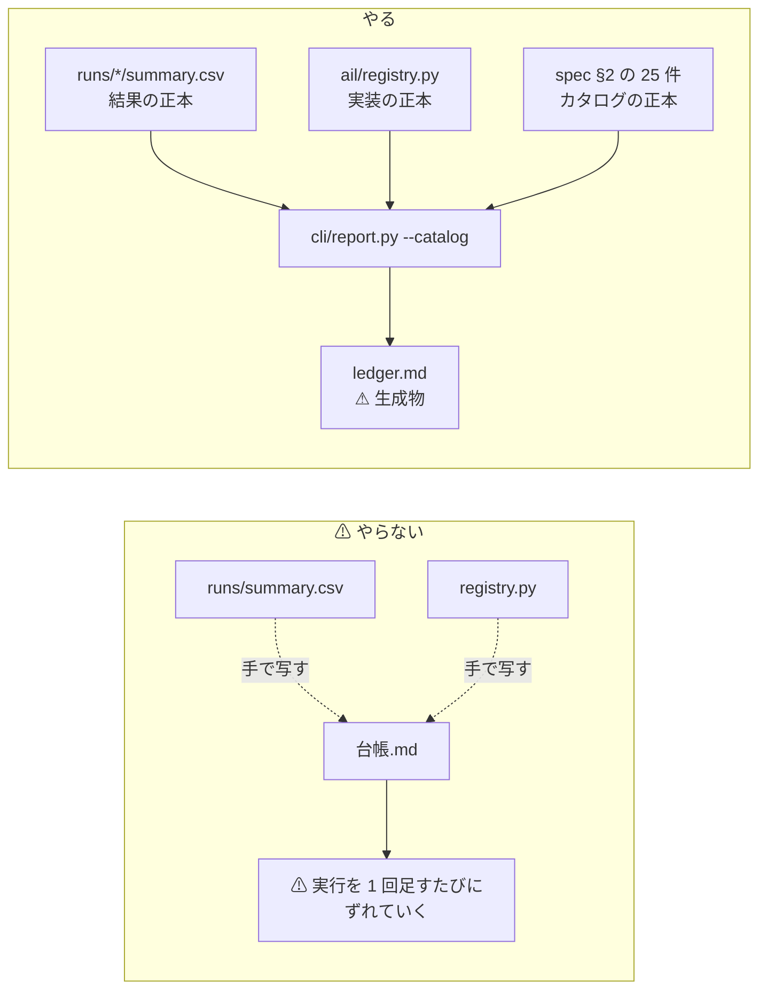
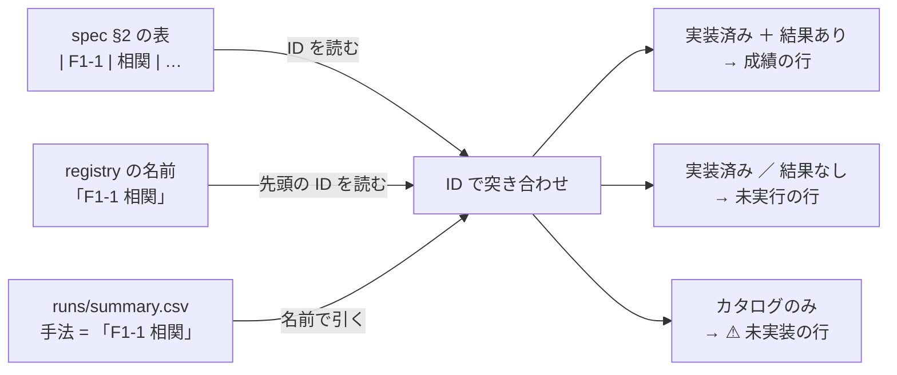

# 試した分析手法の台帳（specs に一覧を置く）

作成: 2026-09-08 ／ 対象コード: `experiments/feature-discovery/`
関連: [rules.md](../../specs/experiments/feature-discovery/rules.md) ／ [feature-discovery.md](../../specs/experiments/feature-discovery.md) ／ [e8-signal-methods.md](../../specs/experiments/e8-signal-methods.md)

## 1. 目的と背景

利用者の指示（2026-09-08）: **分析手法をいろいろ試すが、一覧で見えるように specs に書く。**

⚠ **いま「何を試して、どうだったか」がどこにも一望できない。**

| 今ある物 | 何が載っているか | ⚠ 何が載っていないか |
| --- | --- | --- |
| [feature-discovery.md §2](../../specs/experiments/feature-discovery.md) | 手法のカタログ 25 件（**やる前の一覧**） | ⚠ **どれを実際に試したか** |
| `runs/<実行>/summary.csv` | 1 実行ぶんの成績（**結果の正本**） | ⚠ **git 管理外・実行ごとにバラバラで、横に並べられない** |
| `ail/registry.py` | 実装した手法の名前（**実装の正本**） | ⚠ **成績と結び付いていない** |
| feature-discovery.md §3-3・§4-3 | 1 分足・日足の結果の表 | ⚠ **条件（層・粒度・地平）が本文に散っていて、行だけでは読めない** |

⚠ **25 件のうち実装済みは 9 件**（F1-1/2/3/5・F2-3・F3-1/2/3/5）。
⚠ **残り 16 件が「まだ試していない」のか「試して落とした」のかが、今どこにも書いていない。**

### 1-1. ⚠ 一番やってはいけないこと

> この図の主張: ⚠ **台帳を手で書くと必ずずれる。** 正本 3 つを突き合わせて**生成する**ものにする。

⚠ **正本は 3 つとも既にある。** 台帳はそれを突き合わせた**生成物**にし、手では書かない。

## 2. 対応方針

### 2-1. 1 行 = 1 回の試行

⚠ **手法ごとに 1 行にすると潰れる。** 同じ手法を条件違いで何度も試すためである。
行の粒度は **手法 × 粒度 × 地平 × 特徴量の層 × データの層**（＝ 1 実行 × 1 手法）。

### 2-2. 突き合わせの鍵は「カタログの ID」

> この図の主張: ⚠ **カタログ側に ID が無いと突き合わせられない。** ID は spec §2 の表に既にある（`F1-1` など）ので、**registry の名前の先頭から拾う**。

⚠ **カタログを別ファイルに書き写さない。** `docs/specs/experiments/feature-discovery.md` §2 の表を**その場で読む**。
写しを作った瞬間に二重管理になり、§2 を直しても台帳が古いままになる。

### 2-3. 「まだ試していない」も行として出す

⚠ **未実装の 16 件を空白にしない。** 実装の有無を `registry` との差分から出し、**未実施として 1 行ずつ載せる。**
「次に何をすれば試せるか」だけは機械では出せないので、⚠ **`config/catalog_notes.toml` の 1 か所にだけ**書いて台帳に流し込む。

### 2-4. 判定は 3 値、落とした理由は E8 の型

⚠ **判定も手で書かない。** 数字から機械的に決める。

| 条件 | 判定 | 型 |
| --- | --- | --- |
| 純利 > 0 かつ fold の符号が全部正 | **採る** | — |
| 純利 > 0 だが fold の符号が割れる | **保留** | ⚠ 平均だけ正（rules.md 11 章 規約 5） |
| 純利 ≤ 0 かつ 粗利 > 0 | **落とす** | **X2** コストで消える |
| 純利 ≤ 0 かつ 粗利 ≤ 0 | **落とす** | **X2 ＋ X9** コスト以前に優位性が無い |
| ⚠ 日足 × データの層が `raw` | **保留** | ⚠ **無効・要再測**（[§6-3](../../specs/experiments/feature-discovery.md) の分割調整の誤り） |
| ⚠ 先読みの列を混ぜた実行 | 台帳の対象外 | 配線の検査。**別表に出す** |
| registry に無い | **未実施** | — |

⚠ **日足の `raw` を消さずに「保留（無効・要再測）」として載せる**（利用者の指示）。
⚠ **1 分足の `raw` は保留にしない。** 目盛りの誤りは日足にしか無いことが [§3](../../specs/experiments/feature-discovery.md) で確認済みである。

### 2-5. 既存の結果（§3-3 ／ §4-3）の流し込み

⚠ **日足（§4-3）は `runs/` に既にある**（`_repro_oldcsv` ほか 3 実行）。そのまま拾える。
⚠ **1 分足（§3-3）は `runs/` に無い。** 当時の `evaluate.py` は構造化のときに消えており、fold ごとの生データも残っていない。

⚠ **ここで数字を手で打ち直さない。** spec の表を**そのまま読む**。
読む場所と、その表を出した条件（粒度・地平・層・行数）は `config/legacy.toml` に 1 か所だけ宣言する。

| | 出所 | ⚠ 台帳での扱い |
| --- | --- | --- |
| 1 分足 §3-3 | spec の表を読む | ⚠ **旧配線・fold の符号は「—」**（生データが残っていない） |
| 日足 §4-3 | spec の表を読む | 同上。`runs/` の行と**並べて置く**（再現できていることが見える） |
| 日足 `runs/` 3 実行 | `summary.csv` ＋ `result.csv` | fold の符号まで出せる |

### 2-6. ⚠ データの層を運用者の記憶に頼らない

⚠ **今は `cli/run.py --layer` が「記録に残すだけ」の自己申告である。** `cli/build.py --layer raw` で作った表を
`cli/run.py --layer adjusted` で回しても誰も止めない。⚠ **台帳の「データの層」の列がそのまま嘘になる。**

`cli/build.py` が `data/features/<実験>/<粒度>.meta.json` に層を書き、`cli/run.py` がそれを読む。
⚠ **食い違ったら警告を出す**（既存の実行は自己申告のまま残る）。

## 3. 影響範囲

| ファイル | 変更 |
| --- | --- |
| `ail/catalog.py` | **新規**。spec §2 の 25 件を読む ／ registry と突き合わせる ／ `runs/` と legacy を試行の行にする ／ 判定を決める |
| `cli/report.py` | `--catalog` を足す（既定の動きは変えない） |
| `config/legacy.toml` | **新規**。旧配線の結果表の場所と条件の宣言 |
| `config/catalog_notes.toml` | **新規**。未実施の手法に「次に何が要るか」を 1 行ずつ |
| `cli/build.py` ／ `cli/run.py` | 層の sidecar（`*.meta.json`）を書く / 読む |
| `tests/test_catalog.py` | **新規**。パーサと判定の検査 |
| `docs/specs/experiments/feature-discovery/ledger.md` | **新規・生成物**。手で書き換えない |
| `README.md` ／ feature-discovery.md ／ rules.md | 台帳への導線を 1 行ずつ |

⚠ **`runs/` は git 管理外。** 台帳の markdown は commit するが、⚠ **再生成が同じ結果になるのは実行を持っている手元だけ**である。これは台帳の冒頭に書く。

## 4. Phase

| Phase | 中身 | 完了の判定 | 結果 |
| ---: | --- | --- | --- |
| 1 | 台帳の列と判定の規則を決める | §2-4 の表が spec に載っている | ✅ [ledger.md §1](../../specs/experiments/feature-discovery/ledger.md) に判定の図と規則の表 |
| 2 | `cli/report.py --catalog` で生成する | 25 件すべてが実装済み / 未実施のどちらかで出る | ✅ 回した 9 件 ＋ 未実施 16 件 |
| 3 | 既存の結果を流し込む（§3-3 ／ §4-3） | ⚠ **日足の raw が「保留（無効・要再測）」で出る** | ✅ 24 行（日足 13 ／ 1 分足 11）。⚠ **日足は全行が保留** |
| 4 | 読んだだけで次の一手が決まるか確認する | 決まらなければ列を足す | ⚠ **決まらなかったので 2 列足した**（下） |

### 4-1. ⚠ Phase 4 で足りなかったもの

⚠ **最初に出した台帳では「次に何を試すか」が決まらなかった。** 未実施 16 件が ID 順に並んでいて、
⚠ **どれが安く試せるのかも、どれが「やらないと決めた」のかも読めなかった**からである。足したのは 2 列。

| 足した列 | 何が決まるようになったか |
| --- | --- |
| **手間**（小 / 中 / 大 / 見送り） | ⚠ **上から読めば次の一手が決まる。** 小 → 中 → 大 の順に並べ、同じ手間なら根拠の強い順にした |
| **状態**（未実施 / ⚠ 見送り） | ⚠ **「まだ試していない 13 件」と「試さないと決めた 3 件」を分けた。** ⚠ **どちらも「効かない」ではないが、読み手には別の情報である** |

⚠ **もう 1 つ、生成の途中で分かったことがある。** 台帳が同じ鍵の実行をまとめたとき、
⚠ **旧配線と新配線で F3-3（並べ替え重要度）の粗利が 0.39bp 食い違っていた**（＋2.23 → ＋1.84）。
[§6-6](../../specs/experiments/feature-discovery.md) は「小数第 3 位でずれた」と書いていたが、⚠ **それは的中率での話**だった。
⚠ **台帳が機械的に拾ったので、§6-6 に大きさを言い直す 1 段落を足した。**

## 5. テスト方針

| # | 何を確かめるか | ⚠ 落ちなければ意味が無い検査 |
| ---: | --- | --- |
| 1 | spec §2 から **25 件ちょうど**読めること | ⚠ **表の書式が変わったら黙って減る。** 件数で止める |
| 2 | 系統ごとの内訳が 7 / 4 / 6 / 4 / 4 であること | 上と同じ |
| 3 | registry の選別手法の ID が**全部カタログに在る**こと | ⚠ **`F9-9` のような幽霊 ID を早く落とす** |
| 4 | legacy の表がパースでき、⚠ **全角の `＋` `−` と `**` と `—` を落とせる**こと | ⚠ **符号を取り違えると結論が反転する** |
| 5 | 判定の規則が §2-4 の表どおりに効くこと | 境目（純利 = 0・fold が割れる・日足 raw）を 1 件ずつ |
| 6 | 先読みの実行が台帳の本体に**入らない**こと | ⚠ **的中率 99% の行が台帳に混ざると全部が嘘になる** |

## 6. ⚠ この台帳でも埋まらないもの

| # | 限界 | ⚠ 効き方 |
| ---: | --- | --- |
| 1 | ⚠ **1 分足 §3-3 の fold ごとの符号は永久に出せない** | 生データが残っていない。**再測するまで「—」** |
| 2 | ⚠ **既存 4 実行の「データの層」は自己申告**（§2-6 の sidecar は今後の実行にしか効かない） | 台帳に注記を出す |
| 3 | ⚠ **未実施の 16 件の「次の一手」は人が書く** | ⚠ **1 か所（`catalog_notes.toml`）に閉じるが、機械では出せない** |
| 4 | ⚠ **判定は数字だけで決める。** 標本不足（X9）と「本当に効かない」を分けられない | [§3-4 の限界 1](../../specs/experiments/feature-discovery.md) と同じ |
