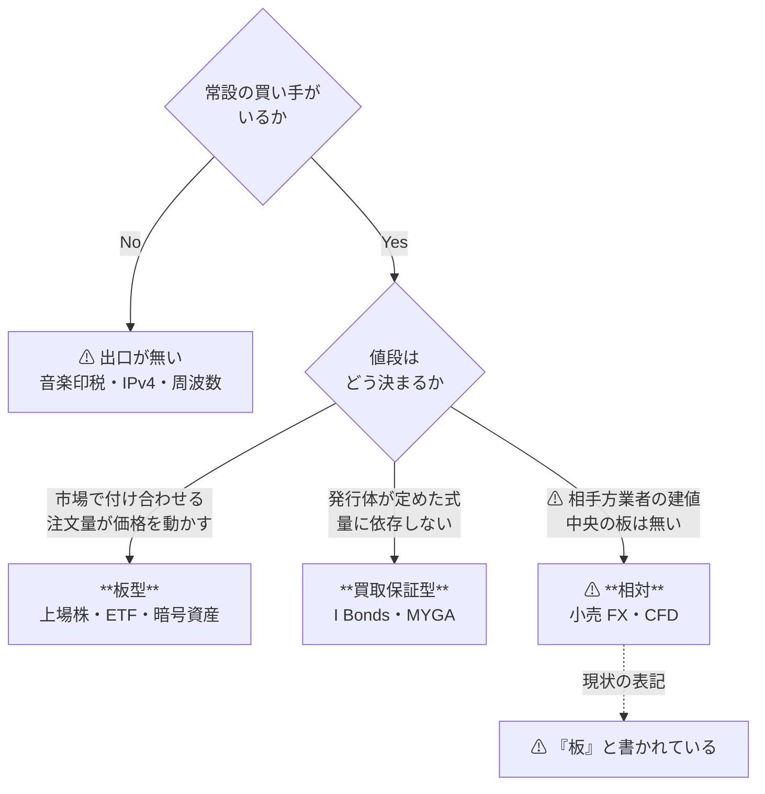
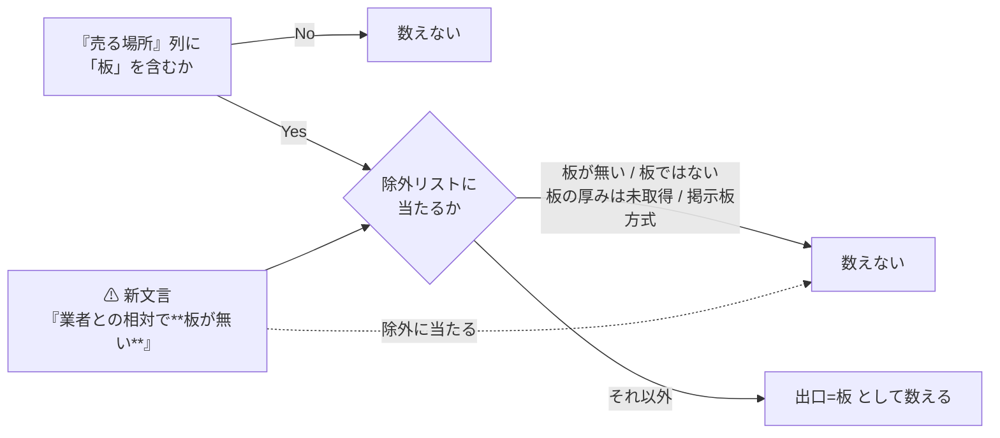
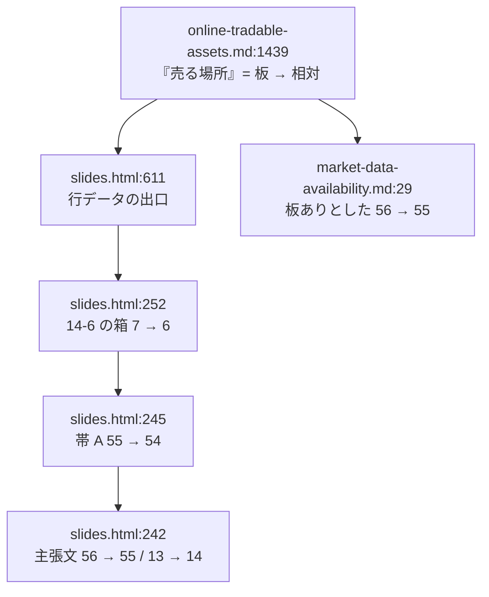

# 小売 FX・CFD（§14-6）の出口表記を「板」から相対に直す

作成日: 2026-09-01。対象: [docs/specs/online-tradable-assets.md](../../specs/online-tradable-assets.md) §14-6 の 1 行と、そこから波及する件数 4 箇所。

## 1. 目的と背景

同じ 1 件について、2 つの成果物が逆のことを書いている。

| ファイル | 記述 |
| --- | --- |
| `online-tradable-assets.md:1439` | 小売 FX・CFD ／ 買う場所 `FX 業者` ／ **売る場所 `板`** |
| `market-data-availability.md:279` | 同じ §14-6 の 7 番目。⚠ **中央の板が無い。取れるのは 1 業者の建値であって市場価格ではない** |
| `market-data-availability.md:410`（D42 Dukascopy） | ⚠ **同社 ECN の建値であって、中央の板ではない。**小売 CFD 業者ごとの建値とも別 |

後から書いた `market-data-availability.md`（2026-09-01）のほうが実態を当てており、**`online-tradable-assets.md` §14-6 が更新されずに残った**という食い違い。

### ⚠ 実態は相対（OTC）であって板ではない

小売 FX・CFD は**業者自身が取引の相手方**になる。決済は同じ業者と反対売買するだけで、
公開された中央の板に注文を出すわけではない。値段はその業者の建値である。

本書 §1「[出口は 1 種類ではない](../../specs/online-tradable-assets.md#出口は-1-種類ではない初版から流用)」の定義に照らすと、次のようになる。

> この図の主張: 小売 FX・CFD は板型ではないが、常設の買い手はいる。出口ゲートの判定は変わらず、表記だけが誤っている。

⚠ **判定ではなく表記の問題である。**常設の買い手（＝建てた業者）はいるので、
ゲート 2 の通過・落選は変わらない。直すのは「売る場所」列の 1 セルと、そこから数えている件数だけ。

## 2. 対応方針

### Phase 1 — 元文書 `online-tradable-assets.md` の 1 行を直す

`online-tradable-assets.md:1439` の「売る場所（出口）」列を次に置き換える。

| | 表記 |
| --- | --- |
| 現在 | `板` |
| 修正後 | `⚠ **業者との相対で板が無い。**常時反対売買には応じるが、値段は業者の建値` |

⚠ **文言は既存行の言い回しに揃える。**同じ一覧の中に `⚠ **板が無い。**買い手が発行体の系列 BD だけのことがある`（仕組債）、
`⚠ **相対取引で板が無い**`（IPv4）、`⚠ **個別マッチングで板ではない**`（住宅ローン債権）がある。

⚠ **`板が無い` という語をそのまま含めることには理由がある。**2026-09-01 に確定した数え方
（[slides-overview-count-fix.md](slides-overview-count-fix.md)）は
**『売る場所』列が「板」を含むか**で数え、`板が無い` / `板ではない` / `板の厚みは未取得` / `掲示板方式` を除外リストで落としている。
除外リストに既にある語を使えば、**数え方を変えずに** 1 件減る。

> この図の主張: 新しい文言は既存の除外リストに引っかかる語を含む。だから数え方の定義には手を入れない。

### Phase 2 — 波及する件数 4 箇所を直す

出口=板 が 1 件減ることで、スライドの全体像 1 枚と `market-data-availability.md` の結論が動く。

| # | 箇所 | 現在 | 修正後 |
| --- | --- | --- | --- |
| 1 | `slides.html:611` 行データの出口 | `板` | Phase 1 と同じ表記（スライド用の HTML 装飾） |
| 2 | `slides.html:252` 14-6 の箱 | `出口=板 7` | `出口=板 6` |
| 3 | `slides.html:245` 帯 A のラベル | `うち出口が板なのは 55` | `54` |
| 4 | `slides.html:242` 主張文 | `96 件中 56 件` ／ `板の無い 13 件` | `55 件` ／ `14 件` |
| 5 | `market-data-availability.md:29` | `§14 で板ありとした 56 件` | `55 件` |

> この図の主張: 直すのは元文書の 1 セルだが、そこを数えている箇所が 4 つあり、同時に動かさないと食い違う。

⚠ **`板の無い 13 件` → `14 件` の向きに注意。**帯 A（14-1〜14-7、68 件）の中で板が無いものが 1 件**増える**。

## 3. 影響範囲

### 触るファイル

| ファイル | 箇所 |
| --- | --- |
| `docs/specs/online-tradable-assets.md` | 1 行（§14-6 の 7 行目） |
| `docs/specs/online-tradable-assets-slides.html` | 4 箇所（`CATS` 1 行 ＋ 全体像スライドの SVG 3 箇所） |
| `docs/specs/market-data-availability.md` | 1 箇所（§0 の結論 2） |

### ⚠ 触らないもの

| 対象 | 理由 |
| --- | --- |
| `market-data-availability.md:15` の **L0 49 件（小売 FX 1 を含む）** | ⚠ **これはデータ粒度の話で、出口が板かどうかとは別軸。**Dukascopy（D42）から tick の bid/ask が取れることは変わらない。行の ⚠ 注記に「中央の板が無い」と既に書いてある |
| `market-data-availability.md:279` の **束 S4・データ源 D42・粒度 L0** | 同上。⚠ 注記が既に正しい。ここが今回の**正**である |
| `DONE.md` の 2026-09-01 の記録（`合計 56`・分類別 `…/7/…`） | ⚠ **完了日付きの作業ログなので書き換えない。**その時点で正しかった記録として残し、今回の変更は新しい日付で追記する |
| §14-14 の型判定の区分（デリバティブ 5 件は「枠組みが違う」） | 分配の有無で分けており、出口の表記には依存しない |
| §14-9 スニーカー / StockX の「同左」表記 | ⚠ **TODO の別項目。**同じ出口表記の問題だが、判断の中身（「同左」を板と読むか）が違うので分ける |

## 4. テスト方針

| # | 検証 | 期待値 |
| --- | --- | --- |
| 1 | `slides.html` の `CATS` から出口列を機械抽出し、除外リスト（`板が無い` / `板ではない` / `板の厚みは未取得` / `掲示板方式`）で数える | 分類別 **17/10/12/0/7/6/2/0/0/0/1 = 55**、帯 A **54** / 帯 B **1** |
| 2 | 同スクリプトで行数 | **96**、分類別 18/10/17/4/8/7/4/6/5/7/10 が**不変** |
| 3 | SVG の箱・帯・主張文の数字が 1 と一致するか目視 | 一致 |
| 4 | `grep` で古い表記が残っていないか | `出口=板 7`・`板なのは 55`・`96 件中 56 件`・`板の無い 13 件`・`板ありとした 56 件` のヒット **0** |
| 5 | 元文書とスライドの §14-6 の 7 行が商品名で一致するか | 7/7 一致 |
| 6 | SVG の XML パース | エラー 0 |
| 7 | 変更した数値トークン以外が動いていないか（`git diff --stat`） | 変更行が想定の 6 行のみ |

⚠ **数え方のスクリプトは検証用の使い捨てとし、リポジトリには残さない**（`experiments/` は 2026-08-27 の方針変更以降、新規追加しない）。

## 5. ⚠ この作業では決めないこと — 別 TODO に起票する

**この 1 行は「小売 FX」と「CFD」を 1 件にまとめているが、米国居住者から見た可否が両者で違う可能性がある。**
本書は §0 の注記どおり 2026-08-28 に米国基準へ全面改訂済みで、
⚠ **小売 CFD は米国のリテールには提供されないという理解だが、CFTC / NFA の一次情報をまだ当てていない。**

- 入口が無いなら「出口の表記」以前の問題になる（＝行の分割か、⚠ 属性への追記が要る）
- ⚠ **一次情報を当てていない以上、この作業では断定しない。**TODO に別項目として起票するところまでとする
