# g3plus の管理画面で検証（/experiments）とデータ（/data）を見られるようにする

**⚠ 中止（2026-09-10）**: 実施途中（`runs/` の rsync まで）で利用者が方向転換。
「外から検証・データを見る」は [vibeboard のカスタムタブ](vibeboard-experiments-tabs.md)（Sx360 からは既に `http://titan-income-vibeboard` で届く）で行うことになった。
g3plus へ転送した写しは削除して元に戻し、compose は変更していない。g3plus の両画面は契約どおり「空だが 200」のまま。

## 目的・背景

- g3plus の管理画面は、デプロイ契約（[dashboard.md §7](../specs/dashboard.md)）どおり `experiments/feature-discovery/` をイメージに COPY しないため、検証とデータの画面が「空だが 200」になっている
- 契約には「見せたいときだけ `AIL_RUNS_DIR` / `AIL_EXP_DIR` を volume で差す（読み取り専用でよい）」と最初から書いてある。今回はその選択肢を実施する（**契約の変更ではない**）
- 利用者の判断（2026-09-10）: 公開面（Cloudflare Access の内側）に実験結果を出してよい

## 対応方針

この図は「何をどこへ運び、コンテナがどこを読むか」を示す。

```mermaid
flowchart LR
    subgraph titan["titan（実験を回す機）"]
        R["runs/（1.2 MB）"]
        M["data/manifests/（268 KB）"]
        S["data/features/*/&#42;.meta.json（84 KB）"]
    end
    subgraph g3plus["g3plus"]
        C["~/ai-income-lab/experiments/feature-discovery/<br>（clone。コード・config は git 管理内）"]
        D["コンテナ /app/experiments/feature-discovery<br>（:ro mount）"]
    end
    R -- rsync --> C
    M -- rsync --> C
    S -- rsync --> C
    C -- "volume（読み取り専用）" --> D
```

- **転送するのは画面が読む小物だけ**（合計 約 1.6 MB）。`data/features/` の本体（1.1 GB）・`data/raw/`・`data/adjusted/` は運ばない
  - 検証の画面: `runs/*/{summary.csv, config.json, inputs.json, env.json, checks.json}`
  - データの画面: `data/manifests/*.json`・`data/features/*/<粒度>.meta.json`。`config/**.toml` は git 管理内なので clone に既にある
- **mount 先は既定パスに合わせる**: コンテナ内の既定は `REPO_ROOT(/app)/experiments/feature-discovery(/runs)`（`dashboard/app/config.py`）。
  `/app/experiments/feature-discovery` に mount すれば **env 変数の追加は不要**
- compose の変更は g3plus-ops 側（private）だけ。ai-income-lab 側のコード・契約は変えない

## 影響範囲

- g3plus-ops の `ail-dashboard/docker-compose.yml`（volume 1 行）
- g3plus の clone 内 `experiments/feature-discovery/`（git 管理外の `runs/`・`data/` に写しを置く。pull と衝突しない）
- 画面は読み取り専用の mount なので、コンテナから実験データを書き換える経路は生じない
- ⚠ **写しは手動更新**。titan で実験を回し直したら下の rsync をもう一度流す（自動同期は作らない）

## 手順

1. titan → g3plus へ rsync（3 つ。`--include` で meta.json だけ拾う）
2. g3plus-ops の compose に `:ro` volume を足して `docker compose up -d`（rebuild 不要）
3. コンテナ内ループバックで `/experiments` と `/data` に中身が出ることを確認（run 名・系列数で grep）

## テスト方針

- `/experiments`: 一覧に run が並び、`/api/experiments` の件数が titan の `runs/` のディレクトリ数と合う
- `/data`: 系列・特徴量の表に数字が出る（manifest 由来）
- 回帰: 5 画面すべて 200、非ループバック 403（fail-safe）が変わらないこと
