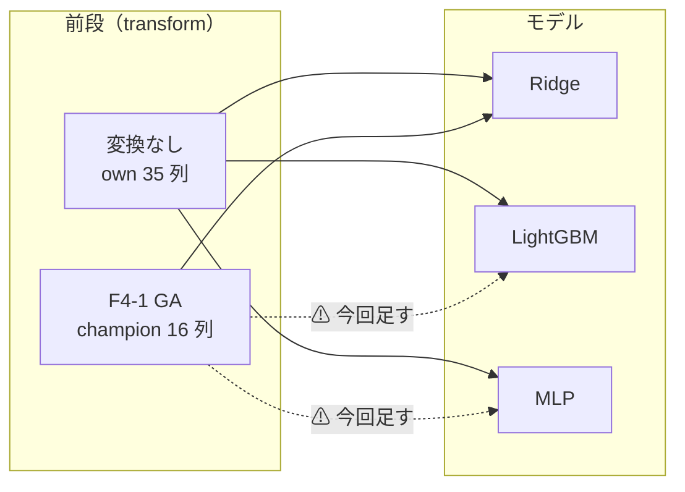
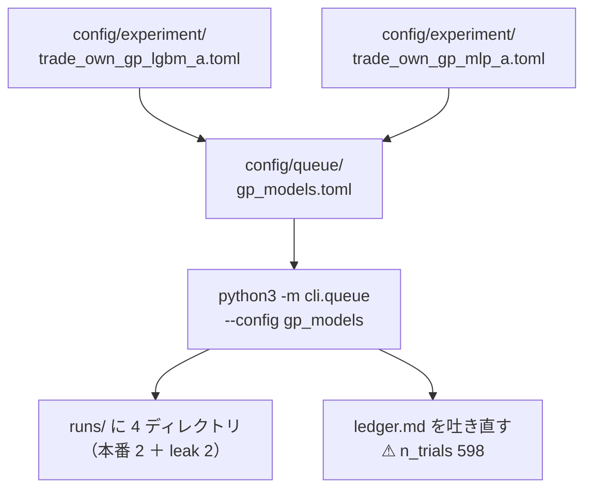

# 進化的探索を他のモデルへ広げる — GA × LightGBM ／ GA × MLP

⚠ **これは投資助言ではなく調査資料である。** 数字には【実測】/【公表値】/【推測】を必ず付ける。

親タスク: [TODO.md](../../../TODO.md) 「進化的探索を他のモデル・経路に広げる」の子 (a)
前提: [evolutionary-search.md](../../specs/experiments/evolutionary-search.md)（器と F4-1 の初回・⚠ **3 行とも落とす**）／ 規約 [rules.md](../../specs/experiments/feature-discovery/rules.md) 14-9・14-10・14-11・13-6・13-7

---

## 0. 一言

⚠ **GA が作った列（champion 16 列）を、Ridge 以外のモデルに食わせて 1 度ずつ回す。** それだけである。

⚠ **新しい実装は 1 行も書かない。** ⚠ **`model =` を 1 行替えた config を 2 本足し、できたばかりのキューに流す。**
✅ **これは「器は GA 専用ではない」の初回の再利用でもある**（[evolutionary-search.md §7](../../specs/experiments/evolutionary-search.md)）。

| | |
| --- | --- |
| 答える問い | ⚠ **F4-1 が落ちたのは「記号回帰が効かない」からか、「Ridge だったから」か** |
| 回す理由 | ⚠ **「効くはず」ではない。** [14-10 規約 4](../../specs/experiments/feature-discovery/rules.md)「未実施を『効かなかった』と読ませない」。⚠ **§7 が自分で挙げた限界（1 表・1 モデル・1 形式）を埋める** |
| 代償 | `n_trials` **592 → 598（＋6）**。時間は **10 分前後**【推測】 |
| 完了の条件 | ⚠ **採否ではない。** 6 行の判定が台帳に載り、記録が残れば完了（落とすでも完了） |

---

## 1. 背景 — ⚠ **何が空白なのか**

2026-09-16 に F4-1（記号回帰）を回して 3 行とも落とした。⚠ **だがそれは `own_2018 × Ridge × (A)` という 1 点での結果である。**

> この図の主張: ⚠ **GA は `transform`（モデルの前段）なので、モデルの軸とは直交する。** 埋まっているのは 3 × 3 の格子のうち 1 マスだけ。



⚠ **実線の 4 本はすでに台帳にある**【実測】（同じ表 `own_2018`・同じ 5 fold・同じ θ・同じコスト 5bp）:

| 前段 | モデル | θ=50 | θ=55 | θ=60 | 出所 |
| --- | --- | ---: | ---: | ---: | --- |
| 変換なし | LightGBM | 1,509.88 | 1,234.76 | 397.46 | `2026-09-13T08-57-48_trade_own_lgbm_a` |
| 変換なし | MLP | 1,583.93 | 1,122.51 | 847.96 | `2026-09-13T09-59-21_trade_own_mlp_a` |
| ⚠ **GA** | ⚠ **Ridge** | **1,432.94** | **1,267.84** | **953.42** | `2026-09-16T10-18-18_trade_own_gp_a` |
| — | ⚠ **B&H（常に上）** | **1,652.02** | **1,652.02** | **1,652.02** | ⚠ **判定の相手**（13-7） |

（単位は純利 bp/fold。⚠ **fold のポートフォリオ累計なので、他の期間の実行とは直接比べない** — [13-8](../../specs/experiments/feature-discovery/rules.md)）

⚠ **4 本とも B&H を超えていない。** ⚠ **だから今回も超えない見込みが高い。** ⚠ **それでも回すのが 14-10 の決定である。**

---

## 2. 動かす軸・動かさない軸

⚠ **動かすのはモデルだけ。** ⚠ **1 度に 2 つ動かすと、差がどちらのものか分からなくなる**（[13-8](../../specs/experiments/feature-discovery/rules.md)）。

| | 値 | ⚠ 注意 |
| --- | --- | --- |
| ⚠ **動かす** | `model` = `LightGBM` / `MLP` | ⚠ **台帳の鍵なので 1 モデルにつき ＋3 試行**（θ 3 水準） |
| 据え置き | 表 `own_2018`・層 `own`・地平 1 日・コスト 5bp | ⚠ **表は作り直さない**（表の差を混ぜない） |
| 据え置き | fold 5・`walk_forward_dates`・purge・seed 0 | |
| 据え置き | θ = 50 / 55 / 60（事前固定） | [13-3](../../specs/experiments/feature-discovery/rules.md) 規約 4 |
| 据え置き | 形式 `shared`（A）・選別「全部使う（基準）」・k=16 | ⚠ **「乱択（基準）」を足さない** — 手法名が変わり、台帳が基準線と見分けられず試行に数える（`trade_own_poly_a.toml` の教訓） |
| 据え置き | GA の水準（個体 100・世代 20・適合度 Spearman \|ρ\|・打ち切り 3 つ） | ⚠ **`ail/search/evolve.py` の既定のまま。振らない**（[14-9](../../specs/experiments/feature-discovery/rules.md)） |
| 据え置き | ハイパーパラメータ（LightGBM・MLP とも既定） | ⚠ **[13-6 規約 3](../../specs/experiments/feature-discovery/rules.md)「動かさない」。振った数だけ `n_trials` が増える** |

---

## 3. 事前登録 — ⚠ **回す前にここを書き終える**

⚠ **結果を見てから決めない**（[14-10 規約 3](../../specs/experiments/feature-discovery/rules.md)）。

| # | 事前に決めること | 値 |
| ---: | --- | --- |
| 1 | 回す本数 | ⚠ **本番 2 本 ＋ leak 対照 2 本 ＝ 4 実行**（leak はキューが自動で並べる） |
| 2 | `n_trials` の増分 | ⚠ **＋6（592 → 598）**。2 手法 × θ 3 水準。⚠ **leak 対照は台帳に行が立たないので 0** |
| 3 | 数えるもの | ⚠ **検証 fold に出た champion だけ**（世代 × 個体は数えない。[14-11 規約 2](../../specs/experiments/feature-discovery/rules.md)） |
| 4 | 判定 | ⚠ **対 B&H 上乗せの符号**（[13-7](../../specs/experiments/feature-discovery/rules.md)）。B&H ＝ ＋1,652.02bp/fold。⚠ **純利の符号では判定しない** |
| 5 | 打ち切り（GA） | 世代 20 ／ 1 fold 600 秒 ／ 5 世代改善しなければ止める（`evolve.py` の既定） |
| 6 | 打ち切り（キュー） | `max_failures = 3` ／ `time_budget_s = 7200`（2 時間） |
| 7 | leak 対照 | ⚠ **`leak = true`。切らない**（[14-10 規約 6](../../specs/experiments/feature-discovery/rules.md)）。⚠ **本番より良ければ配線の穴を疑う** |
| 8 | 失敗したら | ⚠ **直して同じコマンドで再開する。** 済んだ項目は 2 度回さない（キューの状態が持つ） |

⚠ **「良かった θ だけ報告する」はしない。** ⚠ **3 水準とも台帳に載せる**（[13-9](../../specs/experiments/feature-discovery/rules.md)）。

---

## 4. 実装 — ⚠ **足すのはファイル 3 つだけ**

> この図の主張: ⚠ **コードには触らない。** 足すのは config で、回すのは既にある器である。



| ファイル | 中身 | ⚠ 注意 |
| --- | --- | --- |
| `config/experiment/trade_own_gp_lgbm_a.toml` | `trade_own_gp_a.toml` の写しで `name` と `model` だけ違う | ⚠ **diff が 2 行になっていることを目で確かめる** |
| `config/experiment/trade_own_gp_mlp_a.toml` | 同上（`model = "MLP"`） | デバイスは `AIL_TORCH_DEVICE`（既定 auto。3090 Ti） |
| `config/queue/gp_models.toml` | 上の 2 本を並べ、打ち切り 3 つを書く | ⚠ **`leak = true` ／ `ledger = true`** |

```bash
cd experiments/feature-discovery
./.venv/bin/python -m cli.queue --config gp_models --dry-run   # ⚠ 並びと打ち切りだけ見る
./.venv/bin/python -m cli.queue --config gp_models             # 回す
```

---

## 5. テスト方針

| # | 何を確かめるか | どうやって |
| ---: | --- | --- |
| 1 | config の差が 2 行だけか | `diff` を目で見る（⚠ **写し間違いは静かに別の試行になる**） |
| 2 | 実験の名前が解決するか | `--dry-run`（⚠ **3 本目で名前違いに気づくのが一番もったいない**） |
| 3 | 既存のテストが通るか | `./.venv/bin/python -m pytest -q tests`（⚠ **既定経路を 1 ビットも変えていないことの確認**） |
| 4 | leak 対照が並んだか | 状態 `runs/queue/gp_models.json` に `_leak` 2 本が `done` で入る |
| 5 | 数え落としが無いか | ⚠ **台帳の `n_trials` が 598 ちょうどか**（事前登録の 2 と突き合わせる） |
| 6 | 配線の穴が無いか | ⚠ **leak 対照の純利が本番より大きく跳ねていないか** |

---

## 6. 影響範囲

| 触る | 触らない |
| --- | --- |
| `config/experiment/*.toml` 2 本（新規） | ⚠ **`ail/` のコード**（1 行も変えない） |
| `config/queue/gp_models.toml`（新規） | ⚠ **既存の実行・既存の判定**（[14-10 規約 5](../../specs/experiments/feature-discovery/rules.md) 消さない・再計算しない） |
| `runs/` に 4 ディレクトリ（git 管理外） | ⚠ **表（`own_2018`）** |
| `ledger.md`（生成物。器が吐き直す） | dashboard / vibeboard（⚠ **`runs/` を読むだけなので自動で追随する**） |
| 記録 `docs/specs/experiments/evolutionary-search.md` に節を足す | |

---

## 7. Phase / Step

| Phase | 中身 | 時間【推測】 |
| ---: | --- | --- |
| 1 | config 2 本＋キュー 1 本を足す（⚠ **事前登録を書き終えてから**） | 15 分 |
| 2 | `--dry-run` と `pytest` で配線を確かめる | 5 分 |
| 3 | キューを回す（本番 2 ＋ leak 2） | ⚠ **10 分前後**【推測。同じ表の LightGBM 約 2 分・MLP 約 3 分から】 |
| 4 | 記録を書く（[evolutionary-search.md](../../specs/experiments/evolutionary-search.md) に節を足す）・台帳の `n_trials` を突き合わせる | 30 分 |
| 5 | TODO / DONE の整理、プランを `archive/` へ | 10 分 |

---

## 8. 完了の定義

⚠ **採用・収益性を前提にしない。**

1. 6 行（2 モデル × θ 3 水準）の判定が台帳に載っている
2. `n_trials` が 598 で、事前登録の数と一致している
3. leak 対照 2 本が回り、跳ねていないことを確かめてある
4. ⚠ **結果が「落とす」でも、記録を残した時点で完了**（[14-10 規約 5](../../specs/experiments/feature-discovery/rules.md) 落とした行が分母になる）
