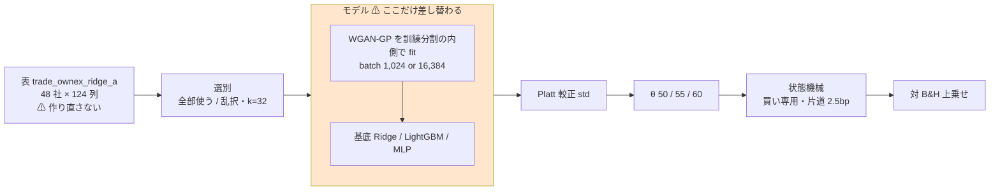
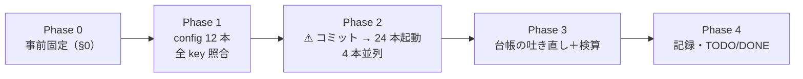

# GAN 増強 3 種 × 閾値売買 × ownex（batch 1,024 / 16,384）

親タスク: 「GPU 系を閾値売買でも回せるようにする」（利用者の指示 2026-09-13: **gpu 系も毎日往復ではない手法を実装する**）
派生元: 「GAN 増強 3 種 × 閾値売買（own）」（✅ 2026-09-14 完了。[記録](../../specs/experiments/gan-threshold-trading.md) ／ [プラン](gan-threshold-trading.md)）
規約: [rules.md 13 章](../../specs/experiments/feature-discovery/rules.md)（閾値つき売買）／ [14-10](../../specs/experiments/feature-discovery/rules.md)（空白は積極的に埋める）
台帳: [ledger.md](../../specs/experiments/feature-discovery/ledger.md)（着手時点 **n_trials 475**【実測 2026-09-14】・テスト **294 件 pass**【実測】）

✅ **利用者の決定（2026-09-14）: batch 1,024 と 16,384 を両方回す**

---

## 0. 目的と背景

⚠ **埋めるのは ownex 側のモデルの軸に残った最後の空白である。** own は 2026-09-14 に閉じた。

| モデル | 閾値売買 own a/b | **閾値売買 ownex a/b** |
| --- | :---: | :---: |
| Ridge / LightGBM / MLP | ✅ | ✅（MLP は 2026-09-13） |
| +GAN増強 3 種（batch 1,024） | ✅（2026-09-14） | ⚠ **空白** |
| +GAN増強 3 種（batch 16,384） | ✅（2026-09-14） | ⚠ **空白** |

⚠ **回す理由は「効くはず」ではない。** own では ⚠ **36 行とも「落とす」**で、batch の差（16k − 1,024）は ⚠ **18 セルで正 9・負 9** だった。
⚠ **それは回さない理由にならない**（[14-10 規約 1](../../specs/experiments/feature-discovery/rules.md)）。⚠ **目的は「ownex では未実施」を「ownex でも効かない / 効く」と区別できるようにすることだけ**（14-10 規約 4）。

⚠ **両方の batch を回す理由**（利用者の決定の背景）: (1) own と同じ組み合わせになり、own と ownex の比較に batch の違いが混ざらない
(2) ⚠ **own の 16k (A) θ=60 で起きた「ほとんど建てない」（較正の傾きが寝た）が ownex でも起きるかを見られる**
(3) ⚠ **16k は 1,024 の代わりにならない**（別の試行）。

⚠ **良い数字が出たらまず配線を疑う**（11 章 規約 7）。⚠ **own の数字と直接比べない**（表・銘柄・k・embargo が違う。13-8）。

### 0-1. ⚠ 回す前に固定すること（結果を見てから決めない）

| 固定するもの | 値 | ⚠ 動かさない理由 |
| --- | --- | --- |
| 表 | ⚠ **`trade_ownex_ridge_a` の表を読む**（`features_from`）。101,157 行 × 124 列 × 48 社・`raw 81ade06ba58c8e42` / `adjusted 1a9c6d15374af248`【実測】 | 13-8: ⚠ **既存 ownex 6 本（Ridge/LightGBM/MLP × a/b）と同じ表でなければモデルの差として読めない** |
| 入力の層 / 対象 | `own cs rel ex` ／ `targets = "company"`（48 社） | 既存 ownex 6 本と同じ |
| k / embargo | **32** ／ **1 本** | 既存 ownex 6 本と同じ（断面を見るので境目を 1 本空ける） |
| θ | **50 / 55 / 60** | 13-3 規約 1・4 |
| 選別 | `全部使う（基準）` ＋ `乱択（基準）` | 既存と同じ。⚠ **処置はモデル** |
| GAN の形 | `ail/models/gan.py` の既定（WGAN-GP・300 epoch・幅 128・潜在 32・α = 100%・合成行は前） | ⚠ **2026-09-09 に事前固定**。振ると n_trials が増える |
| batch | ⚠ **1,024（`…+GAN増強`）と 16,384（`…+GAN増強(batch16k)`）** | ⚠ **own と同じ 2 水準・同じ登録名**。別の鍵で数える（13-9 の 5） |
| 基底モデル / 種 | `linear.py` / `trees.py` / `deep.py` の既定 ／ 0（GAN は seed ＋ 1） | 13-6 の 3・4 |
| 判定 | **対 B&H 上乗せ**の符号と t（13-7） | ⚠ 純利の符号では「買って持っただけ」と区別できない |
| 門 | ⚠ **記録するだけ。フラグを付けずに回す**（2026-09-14 から既定が診断。⚠ **`--gate` は付けない**） | 14-10 規約 2。⚠ **門の修正後に回す最初の本番**なので、`gate.mode = "診断"` を検算に入れる |
| デバイス | ⚠ **`AIL_TORCH_DEVICE=cuda` を明示する** | own と同じ。⚠ `env.json` に残らないので記録に書く |
| 並列 | **4 本同時** | own の実測（4 本で 2.25 倍・8 本では増えない）。⚠ **実行の回し方であって手法ではない** |

### 0-2. 範囲 — ⚠ **削らない**

| | batch 1,024 | batch 16,384 |
| --- | ---: | ---: |
| 本番 | 6（3 モデル × (A)(B)） | 6 |
| leak 対照 | 6 | 6 |
| 数える試行 | 18（3 モデル × 2 形式 × 3 θ） | 18 |

⚠ **合計 24 本・＋36 試行。`n_trials` 475 → 511**【推測】。
⚠ **費用が見積りを超えても (B) 形式・leak 対照・θ・片方の batch を落とさない。** 回し切る。

---

## 1. 対応方針 — ⚠ **足すのは config だけ**

⚠ **コードは 1 行も書かない。** `+GAN増強` 3 種 × batch 2 水準は `ail/models/gan.py` に登録済みで、own で 24 本が完走している。

> この図の主張: ⚠ **既存 ownex 経路のうち差し替わるのは「モデル」の箱 1 つだけで、表・選別・較正・状態機械は既存 ownex 6 本と同一。**



| 触るもの | 中身 |
| --- | --- |
| `config/experiment/trade_ownex_{ridgegan,lgbmgan,mlpgan}{,16k}_{a,b}.toml` | **新規 12 本**。⚠ **`trade_ownex_lgbm_a/b.toml` を写して `name`・`model` だけ差し替える** |
| `docs/specs/experiments/gan-threshold-ownex.md` | **新規**。結果と判定の記録 |
| `docs/specs/experiments/feature-discovery/ledger.md` | ⚠ **生成物。`cli.report --catalog` で吐き直す** |
| `TODO.md` / `DONE.md` | タスクの移動 |

| ⚠ 触らないもの | 理由 |
| --- | --- |
| `ail/` `cli/` の全ファイル | 10 章: 手法を足すときに触るのは config だけ |
| 表（`data/features/trade_ownex_ridge_a/`） | 13-8 |
| 既存の `runs/` ／ 台帳の既存行 | 14-10 規約 5 |

---

## 2. 費用【推測】

⚠ **own の実測（4 本並列の 1 本あたり秒数）に、行数・銘柄数の比を掛けて引く。** GAN は起動律速で、(A) の反復数は行数に、(B) は銘柄数に比例する（own プラン §5-5・§5-6）。

| 比 | own | ownex | 比 |
| --- | ---: | ---: | ---: |
| 行（(A) と門に効く） | 135,962 | 101,157 | **0.744** |
| 銘柄（(B) に効く） | 63 | 48 | **0.762** |

| 1 本（4 本並列） | own 実測 | ⚠ ownex 見込み【推測】 |
| --- | ---: | ---: |
| 1,024 (A) | 約 16,800 秒 | 約 12,500 秒（3.5 時間） |
| 1,024 (B) | 約 22,600 秒 | 約 17,200 秒（4.8 時間） |
| 16k (A) | 約 1,900 秒 | 約 1,400 秒（0.4 時間） |
| 16k (B) | 約 13,700 秒 | 約 10,400 秒（2.9 時間） |
| ⚠ **24 本の壁時計** | 23.7 時間 | ⚠ **約 17 時間**（合計 約 249,000 秒 ÷ 4） |

⚠ **未計上で重くなる向きが 2 つある**: (1) ⚠ **列が 35 → 124**（GAN の入出力と基底モデルの fit が太る。起動律速なら効きは小さいはずだが測っていない） (2) (B) の基底モデルの fit。
⚠ **過去の見積りは外れ続けている**（own は 1,024 が −4%・16k が ＋9%）。⚠ **回しながら測り直し、記録に突き合わせる。**

GPU は 3090 Ti。着手時の使用 15,515MiB / 24,564MiB（llama-server が常駐・待機中）【実測 2026-09-14】。⚠ **1 プロセス約 800MiB なので 4 本並列でも空きは 5GB 以上残る**（own の実測）。

---

## 3. Phase 構成

> この図の主張: ⚠ **起動の前にコミットする。** own では未コミットの config で起動した 4 本の `git_commit` がずれた（[記録 §6-1](../../specs/experiments/gan-threshold-trading.md)）。



### Phase 1: config 12 本

`trade_ownex_lgbm_a.toml` / `_b.toml` の本文を写し、`name` と `model` を差し替える。⚠ **`tomllib` で全 key を突き合わせ、差が `name`・`model` だけであることを確かめる。** ⚠ **`config.resolve_experiment` が 12 本とも通ることを確かめる。**

### Phase 2: 起動

⚠ **起動の前に、門の修正（2026-09-14）と config 12 本がコミットされていること**（検算 12）。コミットは利用者の許可を得てから行う。

```bash
cd experiments/feature-discovery
# 1 本の形（フラグは付けない。門は既定で診断）
AIL_TORCH_DEVICE=cuda ./.venv/bin/python -m cli.run --experiment trade_ownex_ridgegan_b
AIL_TORCH_DEVICE=cuda ./.venv/bin/python -m cli.run --experiment trade_ownex_ridgegan_b --leak
```

24 本を 4 本並列のキューで回す（`nohup` で端末から切り離し、ログは `out/gan_ownex/`）。⚠ **重い順（1,024 (B) → 1,024 (A) → 16k (B) → 16k (A)）に並べる。**

### Phase 3: 台帳の吐き直しと検算

```bash
./.venv/bin/python -m cli.report --catalog > ../../docs/specs/experiments/feature-discovery/ledger.md
./.venv/bin/python -m pytest -q tests
```

### Phase 4: 記録と後片付け

`docs/specs/experiments/gan-threshold-ownex.md` に結果と判定を書く。own の記録（[gan-threshold-trading.md](../../specs/experiments/gan-threshold-trading.md) §7）の「未実施」を更新する。⚠ **落とす結果でも記録を残す**（14-10 規約 5）。

---

## 4. テスト方針・検算

| # | 検算 | ⚠ 落ちたら |
| ---: | --- | --- |
| 1 | `pytest -q tests` が全件 pass（着手時点 **294 件**） | 配線が壊れている |
| 2 | ⚠ **回す前の台帳の行が消えず、数字が変わらない**（足されるだけ。動いてよいのは基準線の `再現` と代表実行 ID・冒頭の件数・生成文） | 既存の試行を壊した |
| 3 | ⚠ **leak 対照の上乗せが跳ねる**（既存 ownex の対と同じ範囲） | 較正 → 閾値 → 状態機械のどこかが壊れている（13-10） |
| 4 | **n_trials 475 → 511**（＋36） | 数え落とし、または数え過ぎ |
| 5 | `checks.json` の `calibration` が `std` | 旧の較正で回っている |
| 6 | ⚠ **`inputs.json` が既存 `trade_ownex_lgbm_a`（本番）／ `_leak` と全 key 一致** | 表を作り直してしまった（13-8） |
| 7 | 3 θ とも台帳に載る | 良かった閾値だけ報告している |
| 8 | ⚠ **config が `trade_ownex_lgbm_a/b` と `name`・`model` 以外で違わない** | モデル以外の軸が動いている |
| 9 | ⚠ **24 本とも `result.csv` がある** | 途中で落ちた |
| 10 | ⚠ **`checks.json` の `gate.mode` が `"診断"`**、門前があれば `forced: true` | ⚠ **門の修正が効いていない** |
| 11 | ⚠ **基準線（B&H・直前符号）が既存 ownex 実行と「一致」** | fold の切れ目・シミュレータ・コストが既存と違う |
| 12 | ⚠ **`env.json` の `git_commit` が config 12 本と門の修正を含むコミットを指す** | 再現できない実行になる（own §6-1） |

---

## 5. ⚠ 先に書く失敗モードと限界

| # | 起こりうること | ⚠ そのときどうするか |
| ---: | --- | --- |
| 1 | 費用が見積りを大きく超える | ⚠ **範囲は削らない**（§0-2）。回し切り、記録に実測を書く |
| 2 | ⚠ (B) fold 1 の較正が `train` に落ちる（行/銘柄 ＜ 500） | ⚠ **消せない限界として記録する**（13-6 の 5）。own でも既存 ownex でも実在した |
| 3 | ⚠ (B) fold 1・2 が 1,024 と 16k で bit 一致する（1 銘柄の訓練が 1,024 行未満） | ⚠ **own と同じ理由で起きうる**。⚠ **(B) の batch の効きは一致しなかった fold からしか出ていないと明記する** |
| 4 | ⚠ 16k (A) の θ=60 が「ほとんど建てない」に潰れる | ⚠ **batch の効きとして読まない**。較正の傾き（`fitted/calibration_f*.json` の `a`）を併記する |
| 5 | 上乗せが正で fold 5/5 が揃う | ⚠ **まず配線を疑う**。取引回数・保有日率を併記する |
| 6 | leak 対照が跳ねない | ⚠ **本番の数字を読まない**。直してから回し直す |
| 7 | GPU を取り合って CPU に落ちる・プロセスが落ちる | ⚠ **`result.csv` の無い実行ディレクトリは消して、その 1 本だけ回し直す**（own の処置と同じ）。⚠ **`cuda` を明示しているので黙って CPU に落ちることはない** |

⚠ **限界（消せないもの）**: 48 社は独立でない ／ 生存バイアス ／ ⚠ **検出限界**（fold 約 340 日 × 5 では上乗せ t は 1 前後まで）／ 合成データの質は測らない。

---

## 6. 完了条件

1. `runs/` に本番 12 本と leak 12 本が 1 実行 1 ディレクトリで残っている
2. 台帳が吐き直され、既存行の数字が変わらず、`n_trials` が ＋36 だけ増えている
3. `docs/specs/experiments/gan-threshold-ownex.md` に 3 モデル × 2 形式 × 3 θ × 2 batch の結果と判定が載っている
4. ⚠ **判定が「落とす」でも完了とする**（採用を条件にしない）
