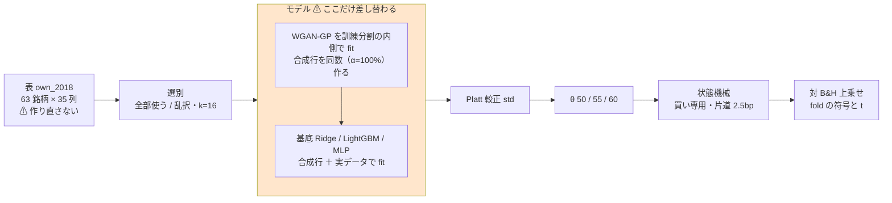
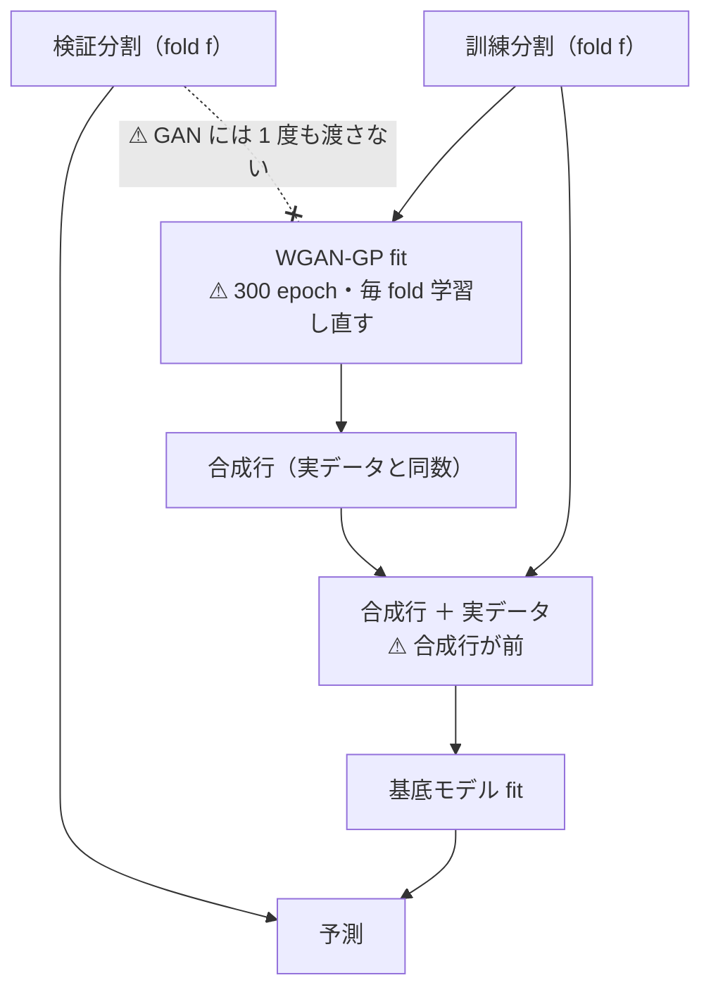
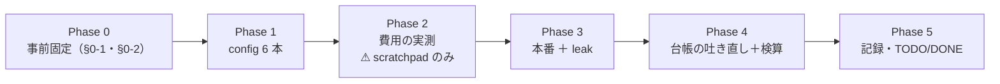

# GAN 増強 3 種 × 閾値売買 — ⚠ **モデルの軸の最後の空白**

親タスク: 「GPU 系を閾値売買でも回せるようにする」（利用者の指示 2026-09-13: **gpu 系も毎日往復ではない手法を実装する**）
派生元: 「MLP × 閾値売買」（✅ 2026-09-13 完了。[記録](../specs/experiments/mlp-threshold-trading.md)）／ 「LightGBM × 断面 × 閾値売買」（✅ 2026-09-13 完了。[記録](../specs/experiments/lasso-fix-cs-threshold.md)）
規約: [rules.md 13 章](../specs/experiments/feature-discovery/rules.md)（閾値つき売買）／ [14-10](../specs/experiments/feature-discovery/rules.md)（空白は積極的に埋める）
台帳: [ledger.md](../specs/experiments/feature-discovery/ledger.md)（着手時点 **n_trials 439**【実測 2026-09-13】・テスト **291 件 pass**【実測】）

---

## 0. 目的と背景

⚠ **埋めるのは「モデルの軸」に残った最後の空白である。** 閾値売買の台帳 534 行の内訳は
⚠ **Ridge 306 / LightGBM 71 / MLP 24 / 基準線ほか 133 で、`+GAN増強` は 0 行**【実測 2026-09-13】。
⚠ **GAN 増強 3 種は毎日往復にしか無い**（Ridge+ と LightGBM+ が 3 行ずつ。⚠ **MLP+ は実装だけあって 1 度も回っていない**）。

| モデル | 毎日往復 | **閾値売買 own a/b** | **閾値売買 ownex a/b** |
| --- | :---: | :---: | :---: |
| Ridge | ✅ | ✅ | ✅ |
| LightGBM | ✅ | ✅ | ✅ |
| MLP | ✅ | ✅（2026-09-13） | ✅（2026-09-13） |
| **Ridge+GAN増強** | ✅（3 行） | ⚠ **空白** | ⚠ **空白** |
| **LightGBM+GAN増強** | ✅（3 行） | ⚠ **空白** | ⚠ **空白** |
| **MLP+GAN増強** | ⚠ **0 行** | ⚠ **空白** | ⚠ **空白** |

⚠ **回す理由は「効くはず」ではない。** ⚠ **毎日往復では GAN 増強は両方の予測器を悪化させて「落とす」になっている**
（[gpu-models.md §4](../specs/experiments/gpu-models.md)。Ridge −4.35 → −6.02bp・LightGBM ＋1.52 → −1.08bp）。
⚠ **それは回さない理由にならない**（[14-10 規約 1](../specs/experiments/feature-discovery/rules.md)）。
⚠ **埋める目的は「GAN 増強は閾値売買で未実施」を「GAN 増強は閾値売買でも効かない」と区別できるようにすることだけである**（14-10 規約 4）。

⚠ **新旧の数字は直接比べない**（[13-8](../specs/experiments/feature-discovery/rules.md)）。⚠ **毎日往復の −6.02bp と、これから出る対 B&H 上乗せ bp は物差しが違う。**

⚠ **良い数字が出たらまず配線を疑う**（[11 章 規約 7](../specs/experiments/feature-discovery/rules.md)）。

### 0-1. ⚠ 回す前に固定すること（結果を見てから決めない）

⚠ **本節は Phase 3（本番）に入る前に書き終える。**（[14-10 規約 3](../specs/experiments/feature-discovery/rules.md)・[13-3 規約 4](../specs/experiments/feature-discovery/rules.md)）

⚠ **回す本数だけは Phase 2 の費用の実測を見てから確定する**（下の §0-2）。⚠ **費用は「結果」ではない。**
⚠ **確定したら本節を書き換え、そのあとは動かさない。**

| 固定するもの | 値 | ⚠ 動かさない理由 |
| --- | --- | --- |
| 入力の層 | `own`・表は **`own_2018` を読む**（`features_from`） | 13-8: 表を作り直すと「表の差」が混ざる。⚠ **既存 12 本（Ridge/LightGBM/MLP × a/b）と同じ表でなければモデルの差として読めない** |
| 対象 | `targets = "all"`（63 銘柄） | 既存 own 12 本と同じ |
| k | **16** | 既存 own 12 本と同じ |
| embargo | **0 本** | 既存 own 12 本と同じ（own 層は断面を見ない） |
| θ | **50 / 55 / 60** | 13-3 規約 1・4 |
| 選別 | `全部使う（基準）` ＋ `乱択（基準）` | 既存 own 12 本と同じ。⚠ **処置はモデルであって選別ではない** |
| GAN の形 | `ail/models/gan.py` の既定のまま（**WGAN-GP・300 epoch・幅 128・潜在 32・α = 100%・合成行は前**） | ⚠ **2026-09-09 に事前固定したもの**（[gpu-models.md §4-2 の 1](../specs/experiments/gpu-models.md)）。⚠ **振ると振った水準の数だけ n_trials が増える** |
| 基底モデルの設定 | `linear.py` / `trees.py` / `deep.py` の既定のまま | 13-6 の 3 |
| 種 | 0（既存 12 本と同じ。GAN は `seed + 1`） | 13-6 の 4 |
| 判定 | **対 B&H 上乗せ**の符号と t（13-7）。own の B&H は **＋1,652.02bp/fold**【実測】 | ⚠ **純利の符号では「買って持っただけ」と区別できない** |
| 門（14-5） | ⚠ **記録するだけ。門前でも回す**（`--ignore-gate` を必ず付ける） | 14-10 規約 2。⚠ **付け忘れると `result.csv` すら書かれずに終わる**（[lasso-fix-cs-threshold.md §4](../specs/experiments/lasso-fix-cs-threshold.md)） |
| デバイス | ⚠ **`AIL_TORCH_DEVICE=cuda` を明示する**（既存 12 本は `auto`） | ⚠ **`auto` はモデル呼び出しごとに空き VRAM を見る**ので、⚠ **並列で回すと 1 実行の中で GPU と CPU が混ざりうる**。⚠ **これは経路の選択であって手法の変更ではない** |

⚠ **`AIL_TORCH_DEVICE` は `env.json` に残らない**【実測 2026-09-13。`runs.Run` は seed・git・各ライブラリの版だけ書く】。
⚠ **だからここと記録（`docs/specs/experiments/gan-threshold-trading.md`）に書き残すしかない。** ⚠ **実行からは後で引けない。**

### 0-2. ⚠ 回す本数を決める規則（Phase 2 の実測に当てはめる）

⚠ **規則のほうを先に固定した。** ⚠ **測った数字を見てから規則を作っていない。**

| 実測した「本番 1 本 ＋ leak 1 本」の合計時間 | 回す範囲 | 試行数 |
| --- | --- | ---: |
| **≤ 40 分** | own a/b ＋ ownex a/b × 3 モデル（**24 本**） | ＋36 |
| **40 分 〜 2 時間** | own a/b × 3 モデル（**12 本**） | ＋18 |
| ⚠ **> 2 時間** | own a/b × 3 モデル（**12 本**）。⚠ **ownex は別タスクに切り出して TODO に残す** | ＋18 |

⚠ **どの枝でも (A) 共通と (B) 銘柄別の両方を回す**（13-6 は両方を求める。片方では既存 12 本と並ばない）。
⚠ **どの枝でも leak 対照を毎回通す**（[7 章 規約 7](../specs/experiments/feature-discovery/rules.md)・13-10）。
⚠ **「時間が足りないから (B) を落とす」はしない。** ⚠ **落とすのは表（ownex）のほうで、それは空白として TODO に残す。**

### 0-3. ✅ 当てはめた結果（Phase 2 の実測・⚠ **結果は 1 つも見ていない時点**）

⚠ **(A) 本番＋leak ＝ 4.3 時間 ／ (B) 本番＋leak ＝ 6.6 時間**【実測からの換算。§5】 → ⚠ **どちらも「> 2 時間」の枝。**

✅ **確定: own a/b × 3 モデル ＝ 本番 6 本 ＋ leak 6 本 ＝ 12 本。試行 ＋18（3 モデル × 2 形式 × 3 θ）。**
⚠ **ownex a/b × 3 モデル（＋18 試行）は回さない。** ⚠ **空白として `TODO.md` に残す**（⚠ **「効かなかった」と読ませない**。14-10 規約 4）。

### 0-4. ⚠ 範囲を 1 度広げた — **batch 16,384 を別の手法として足す**（2026-09-13・利用者の決定）

⚠ **§5-5 で「GPU がほとんど効いていない ＝ カーネル起動律速」と分かった**ので、
⚠ **batch を上げれば速くなるはずだが、それは別の手法になる**と示したところ、⚠ **利用者は「両方回す」を選んだ。**

| | batch 1,024（既定） | **batch 16,384（追加）** |
| --- | --- | --- |
| 位置づけ | 2026-09-09 に事前固定した形 | ⚠ **速さのために足した水準。だが入れた以上は普通の試行として数える**（14-9・13-9 の 3） |
| 台帳の鍵 | `Ridge+GAN増強` ほか | ⚠ **`Ridge+GAN増強(batch16k)` ほか — 別のモデル名にして鍵を割る** |
| 本数 | 12 本（＋18 試行） | 12 本（＋18 試行） |
| ⚠ 合計 | — | ⚠ **24 本・＋36 試行。`n_trials` 439 → 475**【推測】 |

⚠ **同じ鍵にまとめてはいけない**（13-9 の 5）。⚠ **まとめると「batch の差」が「再現の幅」に化ける。**
✅ **これで「batch の効き」を分離して測れる**（⚠ **他の軸はすべて同じ**なので、13-8 の橋渡しの形が成立する唯一の並べ方）。

---

## 1. 対応方針 — ⚠ **コードは 1 行も書かない**

⚠ **足りないのは `[trading]` を持つ config だけである**【実測 2026-09-13】。
`Ridge+GAN増強` / `LightGBM+GAN増強` / `MLP+GAN増強` は `ail/models/gan.py` の末尾で
⚠ **3 種とも registry に登録済み**で、閾値売買の経路（較正 → 閾値 → 状態機械）はモデルに依存しない。

> この図の主張: ⚠ **既存の own 経路のうち差し替わるのは「モデル」の箱 1 つだけで、その中に GAN が 1 段増える。**



⚠ **GAN は予測器ではない。** ⚠ **学習データの増強であり、検証は常に実データだけで行う**（`ail/models/gan.py` の冒頭）。

> この図の主張: ⚠ **GAN の fit は fold ごとに訓練分割の内側で起きる。** ⚠ **検証側の行は 1 度も GAN に見せない。**



---

## 2. 影響範囲

| 触るもの | 中身 |
| --- | --- |
| `config/experiment/trade_own_ridgegan_a.toml` / `_b.toml` | **新規**。`trade_own_ridge_a/b.toml` の `model` を `Ridge+GAN増強` に替えるだけ |
| `config/experiment/trade_own_lgbmgan_a.toml` / `_b.toml` | **新規**。同上（`LightGBM+GAN増強`） |
| `config/experiment/trade_own_mlpgan_a.toml` / `_b.toml` | **新規**。同上（`MLP+GAN増強`） |
| `docs/specs/experiments/gan-threshold-trading.md` | **新規**。結果と判定の記録 |
| `docs/specs/experiments/feature-discovery/ledger.md` | ⚠ **生成物。`cli/report.py --catalog` で吐き直す。手で書かない** |
| `TODO.md` / `DONE.md` | タスクの移動 |

| `config/experiment/trade_own_{ridgegan,lgbmgan,mlpgan}16k_{a,b}.toml` | **新規 6 本**（§0-4。batch 16,384） |
| ⚠ **`ail/models/gan.py`** | ⚠ **§0-4 で触ることになった。** batch を `ctx["gan_batch"]` で受け、⚠ **既定は 1024 のまま**。`(batch16k)` の 3 モデルを追加登録 |

| ⚠ 触らないもの | 理由 |
| --- | --- |
| `ail/` `cli/` の全ファイル（⚠ **`gan.py` を除く。§0-4**） | ⚠ **手法を足すときに触るのは config だけ**（[10 章](../specs/experiments/feature-discovery/rules.md)）。⚠ **例外は利用者の決定で入れた batch の水準だけ** |
| `ail/models/gan.py` の形（epoch・幅・α） | ⚠ **2026-09-09 に事前固定**（§0-1）。⚠ **振ると n_trials が増える** |
| `data/features/own_2018*` | 13-8: 表を作り直さない |
| 既存の `runs/` ／ 台帳の既存行 | 1 実行 1 ディレクトリ。⚠ **再計算しない・消さない**（14-10 規約 5） |

---

## 3. Phase 構成

> この図の主張: ⚠ **費用の実測（Phase 2）は本数を決めるために先に置くが、結果を見る前に規則（§0-2）が確定している。**



### Phase 0: 事前固定

⚠ **§0-1 と §0-2 が成果物。** 結果を見る前に書き終えていることが条件。

### Phase 1: config を 6 本足す

`trade_own_ridge_a.toml` / `_b.toml` を写して `model` を差し替える。
⚠ **TOML の平の key はテーブル見出しより上に書く**（10 章 規約 1）。⚠ **`features_from = "own_2018"` を消さない。**

### Phase 2: 費用を測る

⚠ **`runs/` に 1 バイトも書かない道具**（scratchpad）で WGAN-GP 1 fit の時間を fold ごとに測り、
fit 数（(A) 20 本 ／ (B) 1,260 本）を掛けて 1 実行を見積もる。⚠ **§0-2 の規則に当てはめて本数を確定する。**

⚠ **`cli/calibdiag.py` は (A) と同じ回数だけモデルを呼ぶ**ので、⚠ **GAN では診断が本番と同じ費用になる。**
⚠ **診断は本番の `fitted/calibration_f*.json`（a・b・source）で代用し、別立てでは回さない**（14-10 規約 1: 診断は採否に使わない）。

### Phase 3: 本番 ＋ leak 対照

```bash
./.venv/bin/python -m cli.run --experiment trade_own_ridgegan_a --ignore-gate
./.venv/bin/python -m cli.run --experiment trade_own_ridgegan_a --leak --ignore-gate
# 以下、_b / lgbmgan / mlpgan も同じ形で
```

⚠ **`--ignore-gate` を必ず付ける**（§0-1）。⚠ **時間はここでも実測して Phase 2 の見積りと突き合わせる。**

### Phase 4: 台帳の吐き直しと検算

```bash
./.venv/bin/python -m cli.report --catalog > ../../docs/specs/experiments/feature-discovery/ledger.md
./.venv/bin/python -m pytest -q tests
```

### Phase 5: 記録と後片付け

`docs/specs/experiments/gan-threshold-trading.md` に結果と判定を書き、`TODO.md` の項目を閉じて `DONE.md` へ移し、
プランを `docs/plans/archive/` へ移す。⚠ **落とす結果でも記録を残す**（14-10 規約 5）。

---

## 4. テスト方針・検算

| # | 検算 | ⚠ 落ちたら |
| ---: | --- | --- |
| 1 | `pytest -q tests` が全件 pass（着手時点 **291 件**【実測】） | 配線が壊れている |
| 2 | ⚠ **回す前の台帳の行が 1 行も消えず 1 バイトも変わらない**（足されるだけ） | 既存の試行を壊した（14-10 規約 5） |
| 3 | ⚠ **leak 対照の上乗せが跳ねる**（既存の対は ＋16,108〜25,131bp・t 7.9〜27.0・5/5）【実測】 | 較正 → 閾値 → 状態機械のどこかが壊れている（13-10） |
| 4 | **n_trials が 439 → 457（＋18）**（§0-2 の枝で決まる） | 数え落とし、または数え過ぎ |
| 5 | ⚠ **`checks.json` の `calibration` が `std`** | 旧の較正で回っている（鍵が割れる） |
| 6 | ⚠ **`inputs.json` の表の指紋が既存 own 12 本と一致**（135,962 行 × 35 列 × 63 銘柄・`raw 81ade06ba58c8e42`） | 表を作り直してしまった（13-8） |
| 7 | ⚠ **3 θ とも台帳に載る** | 良かった閾値だけ報告している（13-3 の 3） |
| 8 | ⚠ **config が既存と `model`・`name` 以外で違わない**（`tomllib` で全 key を突き合わせる） | モデル以外の軸が動いている（13-8 の橋渡しが壊れる） |
| 9 | ⚠ **`result.csv` が書かれている**（門で空振りしていない） | `--ignore-gate` の付け忘れ |
| 10 | ⚠ **`gan.py` を触っても既定経路が 1 ビットも変わらない** — ✅ **指紋 `467508e45cae76e6…` が編集の前後で一致**【実測 2026-09-13】 | ⚠ **走行中・待機中の batch 1024 の 12 本を黙って別物にしてしまう**（⚠ **8 本はまだ起動前で、起動時に新しい `gan.py` を読む**） |
| 11 | ⚠ **`batch16k` が本当に別の結果になる** — ✅ **指紋 `0b9e19be7eaf244b…` で 1024 と違う**【実測】 | 鍵だけ割れて中身が同じ ＝ 台帳に嘘の 2 行が立つ |
| 12 | ⚠ **`env.json` の `git_commit` が実際に走ったコードを指している** | ⚠ **`runs.Run` は `rev-parse HEAD` しか書かず、作業ツリーの汚れを記録しない**【実測】。⚠ **`gan.py` を直したまま未コミットで回すと、再現できない実行になる** |

---

## 5. 費用 — ⚠ **Phase 2 で実測した**

⚠ **MLP の実測係数（1 fit 124ms）は流用しない**と決めていた（⚠ **GAN は fit の中身が違う**）。
⚠ **代わりに「WGAN-GP 1 反復あたりの時間」を測り、反復数から引いた。**

### 5-1. 測った素の数字【実測 2026-09-13】

| 測ったもの | 行 | 反復数 | ⚠ 実測 | 1 反復 |
| --- | ---: | ---: | ---: | ---: |
| (A) fold 1 の訓練分割まるごと | 22,461 | 22 batch × 300 epoch ＝ 6,600 | **127.64 秒** | **19.3ms** |
| (B) fold 1 の 1 銘柄（AAPL） | 359 | 1 batch × 300 epoch ＝ 300 | **5.34 秒** | **17.8ms** |
| 同上・50 epoch（並列の基準） | 22,461 | 1,100 | 21.89 秒 | 19.9ms |

⚠ **行が 63 倍違っても 1 反復の時間は 1 割しか変わらない** ＝ ⚠ **起動律速である**（MLP で見たのと同じ形）。
⚠ **だから「反復数 × 19.5ms」で引ける。** ⚠ **1 反復 ＝ critic 5 回 ＋ 生成器 1 回 ＋ 勾配罰則の二重逆伝播。**

### 5-2. ⚠ 並列度 — **4 本同時で 2.25 倍。8 本では増えない**【実測 2026-09-13】

⚠ **GPU 利用率が 40% しかなかった**ので、同じ fit を K 本同時に起動して壁時計を測った。

| 同時本数 | 1 本あたり | ⚠ 全体の処理量 | 対 1 本 |
| ---: | ---: | ---: | ---: |
| 1 | 21.89 秒 | 0.0457 fit/秒 | 1.00 |
| **4** | 38.9 秒 | **0.1028 fit/秒** | ⚠ **2.25 倍** |
| 8 | 80.9 秒 | 0.0989 fit/秒 | 2.16 倍（⚠ **4 本より遅い**） |

✅ **4 本並列で回す。** ⚠ **8 本にしても増えないので増やさない**（VRAM は足りるが飽和している）。
⚠ **これは実行の回し方であって手法ではない。** ⚠ **判定の数字は 1 つも変わらない。**

### 5-3. 引いた見積り【推測】

| 本 | 反復数 | ⚠ 直列の見込み |
| --- | ---: | ---: |
| ⚠ **前置きの門**（どの実行にも必ず付く） | ⚠ **1 選別** × 299 batch × 300 epoch ＝ **89,700** | **0.50 時間** |
| (A) 共通 1 本（門を除く） | 2 選別 ×（較正用 ＋ 予測用）× 300 epoch ＝ **380,400** | **2.10 時間** |
| (B) 銘柄別 1 本（門を除く） | 63 銘柄 × 同上 ＝ **567,000** | **3.13 時間** |
| (A) 1 本 **＋門** | 470,100 | **2.60 時間** |
| (B) 1 本 **＋門** | 656,700 | **3.63 時間** |
| **3 モデル ＝ 12 本** | **6,760,800** | ⚠ **37.4 時間（直列）／ 約 17 時間（4 本並列）** |

### ⚠ 5-3-1. 見込みの直し（2026-09-13 14:41・門の実測）

⚠ **門を 2 倍多く数えていた。** ⚠ **門は「全部使う（基準）」1 本にしか掛からない** — `gate.is_gated` が
⚠ **基準線（「基準 」で始まる名前と「乱択（基準）」）を除く**ので、config に選別を 2 本書いても門は 1 本しか測らない。

| | 書いていた見込み | ⚠ 実測・訂正 |
| --- | ---: | ---: |
| 門の反復数 | 198,000〜201,000 | ⚠ **89,700** |
| 門の壁時計（4 本並列） | 1.8 時間 | ✅ **3,288 秒 ＝ 54.8 分**【実測】 |
| 4 本並列の処理量 | 113.1 反復/秒（K4 の試験） | ✅ **109.1 反復/秒**（⚠ **本番でも 3.5% 以内で再現した**） |

✅ **処理量の実測が試験と一致したので、以後の見込みはこの係数で引ける。**

⚠ **着手時の見込み「1 本 1.5〜2 時間」より (B) が 2.2〜2.6 倍重い。** ⚠ **過去 4 回は過大に外していたが、今回は過小だった。**

### 5-4. ⚠ **門が全実行に 0.50 時間ずつ乗る** — ⚠ **使わないと決めた診断に費用の 15.9% を払っている**

⚠ **`cli/run.py` は `--ignore-gate` を付けても `gate.evaluate_gate` を必ず先に回す**（値を `checks.json` に残すため）。
⚠ **その中で 5 fold × 1 選別 ＝ 5 回モデルを fit する**ので、⚠ **GAN では 1 実行あたり 0.50 時間になる**（12 本で **6.0 時間**）。
（⚠ **当初「1.07 時間・12.9 時間・24%」と書いたのは、門が 2 選別を測ると誤って数えていたため。§5-3-1 で直した。**）

⚠ **それでも切らない。** 理由は 2 つ。

| # | 理由 |
| ---: | --- |
| 1 | ⚠ **切るには `cli/run.py` を触ることになる**（§2 の「触らないもの」）。⚠ **手法を足すときに触るのは config だけ**（10 章） |
| 2 | ⚠ **門の値は台帳に残る列である。** ⚠ **既存 12 本（Ridge/LightGBM/MLP × a/b）は門の値を持っている**ので、⚠ **ここだけ欠けると横に並べられない**（13-8 の橋渡し） |

⚠ **これは「門が規約と食い違っている」タスク（`TODO.md`）に費用の観点を 1 つ足す**【実測 2026-09-13】。
⚠ **14-10 規約 2 は門を診断に降格したのに、費用は降格していない。** ⚠ **本タスクでは 12.9 時間がそこに乗った。**

### 5-5. ⚠ **GPU がほとんど効いていない** — ⚠ **計算ではなくカーネル起動を待っている**【実測 2026-09-13】

⚠ **「GPU なのになぜこんなに遅いのか」を測った。** ⚠ **答えは「この設定では GPU を使い切れていない」。**

| 経路 | 1 反復 | 読み |
| --- | ---: | --- |
| GPU（単独） | **19.9ms** | — |
| CPU（4 スレッド） | **31.4ms** | ⚠ **GPU の利得は 1.6 倍しかない** |
| CPU（1 スレッド） | 48.8ms | — |
| CPU（16 スレッド） | 40.6ms | ⚠ **4 スレッドより遅い**（小さなテンソルではスレッドの管理費が勝つ） |

⚠ **決定的なのは batch を振ったときの形である。**

| batch | 1 反復 | 1 行あたり |
| ---: | ---: | ---: |
| 256 | 37.2ms | 145.40µs |
| **1,024（既定）** | **38.7ms** | **37.84µs** |
| 4,096 | ⚠ **29.6ms**（むしろ速い） | 7.24µs |
| 16,384 | 46.9ms | **2.86µs** |
| 65,536 | 150.7ms | 2.30µs |

⚠ **データを 64 倍にしても 1 反復は 37ms → 47ms にしかならない** ＝ ⚠ **1 行あたりの効率は 50 倍良くなる。**
⚠ **網が 128 幅 × 3 層と小さく、1 反復が「critic 5 回 ＋ 勾配罰則の二重逆伝播 ＋ 生成器 1 回」＝ 100 個以上の小さなカーネル起動でできている**ためである。
（⚠ **この表は本番 4 本と GPU を取り合いながら測ったので絶対値は 2 倍ほど膨らんでいる。形だけ読む。**）

### 5-6. ⚠ **batch を上げても (B) はほとんど速くならない** — ⚠ **見積りを 1 度訂正した**

⚠ **「batch 16,384 なら 2〜3 時間」と最初に言ったが、実際は 7.7 時間だった。**

| | batch 1,024 | batch 16,384 | 倍率 |
| --- | ---: | ---: | ---: |
| 門 | 201,000 反復 | 13,800 反復 | **14.6 倍** |
| (A) 共通 本体 | 402,000 反復 | 27,600 反復 | **14.6 倍** |
| **(B) 銘柄別 本体** | 604,800 反復 | **378,000 反復** | ⚠ **1.6 倍だけ** |

⚠ **(B) は 1 銘柄あたりの訓練が 359〜1,797 行しかなく、もともと 16,384 より小さい。**
⚠ **`min(16384, 行数)` で頭打ちになり、1 epoch が 2 batch → 1 batch に減るだけである。**

| | 4 本並列の壁時計 |
| --- | ---: |
| batch 1,024（12 本） | **17.2 時間**（⚠ **門を数え直して 20.8 → 17.2 に訂正**） |
| batch 16,384（12 本） | **6.5 時間** |
| **合計 24 本** | ⚠ **約 23.7 時間**（⚠ **開始 2026-09-13 13:46 → 完了 09-14 13:30 ごろ**【推測】） |

⚠ **この見込みは 4 本並列の処理量 109.1 反復/秒【実測】で引いてある。**
⚠ **(B) の本体には基底モデルの fit が 1,260 回乗る**ので、⚠ **さらに遅くなる方向の未計上がまだある。**

GPU は 3090 Ti（着手時の空き **8,731MiB**【実測 2026-09-13】。
⚠ **llama-server が 15.5GiB 常駐しているが待機中で、空きは既定の閾値 4GB を超えている。止めていない**）。
⚠ **1 プロセスが使うのは約 800MiB**（CUDA コンテキスト込み）なので、4 本並列でも空きは 5GB 以上残る。

---

## 6. ⚠ 先に書く失敗モードと限界

| # | 起こりうること | ⚠ そのときどうするか |
| ---: | --- | --- |
| 1 | ⚠ **費用が見積りを大きく超える** | ⚠ **§0-2 の規則どおり表（ownex）を落とす。** ⚠ **(B) 形式や leak 対照や θ を落とさない** |
| 2 | ⚠ **(B) fold 1 の較正が `source = "train"` に落ちる**（行/銘柄 ＜ MIN_TRAIN 500） | ⚠ **消せない限界。そのまま記録する**（13-6 の 5）。⚠ **Ridge・LightGBM・MLP の 12 本すべてで実在した** |
| 3 | ⚠ **(B) の GAN が 1 銘柄 360 行で fit される**（fold 1） | ⚠ **同上。** ⚠ **合成の質は測らない**（[gpu-models.md §4-2 の 3](../specs/experiments/gpu-models.md)）。⚠ **(B) の数字を (A) と直接比べない** |
| 4 | 上乗せが正で fold 5/5 が揃う | ⚠ **まず配線を疑う**（11 章 規約 7）。取引回数・保有日率を必ず併記する（13-10） |
| 5 | leak 対照が跳ねない | ⚠ **本番の数字を読まない。** 直してから回し直す |
| 6 | ⚠ **`--ignore-gate` を付け忘れる** | ⚠ **`result.csv` が無い実行はやり直す。** ⚠ **中断した実行ディレクトリは消す**（[lasso-fix-cs-threshold.md §4](../specs/experiments/lasso-fix-cs-threshold.md) と同じ処置） |
| 7 | ⚠ **GAN は種を固定しても GPU の非決定性で厳密再現しないことがある** | ⚠ **厳密一致を検算に使わない**（検算 2 は台帳の**既存**行についてのもの） |
| 8 | GPU が llama-server と取り合って CPU に落ちる | ⚠ **落ちてもよい。** `env.json` にどちらで回ったかが残る。⚠ **ただし CPU では現実的な時間で終わらないので、そのときは止めて空きを作ってから回し直す** |

⚠ **限界（消せないもの）**: (a) ⚠ **63 銘柄は独立でない**（12 章 限界 2）／ (b) 生存バイアス（12 章 限界 1）／
(c) ⚠ **検出限界**（fold 360 日 × 5 では上乗せ t は 1 前後まで — [validation-power.md](../specs/experiments/feature-discovery/validation-power.md)）／
(d) ⚠ **合成データの質そのものは測らない**（売買の判定は変わらないため。gpu-models.md §4-2 の 3）。
⚠ **本タスクはこれらを改善しない。空白を埋めるだけである。**

---

## 7. 完了条件

1. `runs/` に本番と leak が 1 実行 1 ディレクトリで残っている（§0-2 の枝で決まる本数）
2. 台帳が吐き直され、⚠ **既存行が 1 バイトも変わっていない**・`n_trials` が足した試行数ぶんだけ増えている
3. `docs/specs/experiments/gan-threshold-trading.md` に 3 モデル × 形式 × 3 θ の結果と判定が載っている
4. ⚠ **判定が「落とす」でも完了とする**（14-10 規約 5。⚠ **採用を条件にしない**）
5. ⚠ **§0-2 で落とした範囲があれば、それが `TODO.md` に空白として残っている**（⚠ **「効かなかった」と読ませない**）
