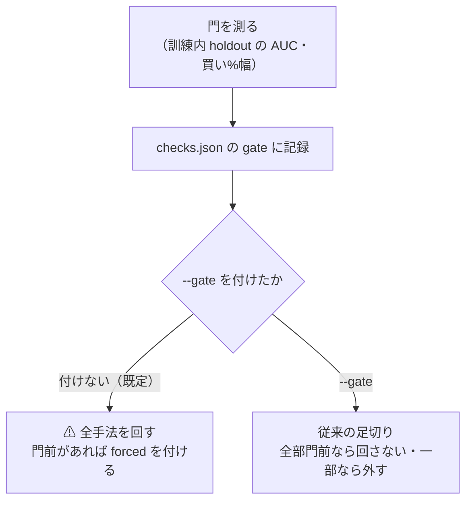
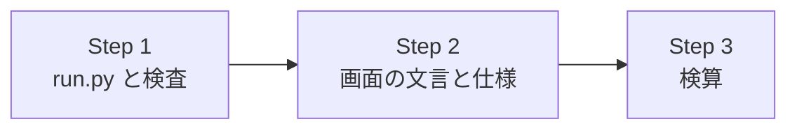

# 門（`apply_gate`）の既定を「止めない」にする

利用者の決定（2026-09-14）: **(a) `apply_gate` の既定を「止めない」に変え、止める側は `--gate` で opt-in にする**

## 1. 目的・背景

- [rules.md 14-10 規約 2](../../specs/experiments/feature-discovery/rules.md) は 2026-09-12 に **「門は診断に降格。値は記録するが、回すかどうかを門で決めない。門前の非計上も使わない」** と定めた
- ⚠ **実装は追随していなかった**: `experiments/feature-discovery/cli/run.py` の `apply_gate` は、いまも
  - 全手法が門前なら `None` を返し、**閾値売買を回さずに終了コード 0 で終わる**
  - 一部だけ門前なら、**門前の手法を selectors から外して回す**
- ⚠ **実害**: 2026-09-13 の断面の層は 4 手法とも門前で、`--ignore-gate` を付け忘れた 1 度目が `result.csv` すら書かずに終わった（[記録 §4](../../specs/experiments/lasso-fix-cs-threshold.md)）。これまでの実行は 53 件が `--ignore-gate` 付きで、**付け忘れの罠が毎回開いていた**

## 2. 対応方針

> この図の主張: ⚠ **既定では門の値を測って記録するだけで、実行の中身は門で変わらない。** 止めるのは `--gate` を明示したときだけ。

| 項目 | 変更前 | 変更後 |
| --- | --- | --- |
| 既定 | 門で止める・外す | ⚠ **止めない**（全手法を回す） |
| `--ignore-gate` | 止めない | ⚠ **既定と同じ動作の別名として残す**（過去の config の注記・プラン・記録のコマンドがそのまま動くように） |
| `--gate`（新規） | — | 従来の足切り。⚠ **14-10 規約 2 に反する使い方**なので、使うなら理由を記録に書く |
| `--gate` と `--ignore-gate` の同時指定 | — | argparse で拒否する |
| `checks.json` の `gate.forced` | `--ignore-gate` かつ門前があるとき `true` | ⚠ **「門前の手法も回した」とき `true`**（既定でも立つ）。⚠ **台帳・画面が読む意味（回したので門前の行を作らない）は変わらない** |
| `checks.json` の `gate.mode`（新規） | — | `"診断"`（既定・`--ignore-gate`）／ `"足切り"`（`--gate`）。どう呼んだかを実行に残す |

### 決めたこと

- ⚠ **台帳（`ail/catalog.py`）は変えない。** `forced` の読み方がそのまま使えるので、既存 53 件の `forced` 実行も新しい実行も同じ扱いになる
- ⚠ **`--gate` で止めた実行の「門前」行は、いまの台帳どおり n_trials に数えない**（14-5 の経緯の扱い）。⚠ 14-10 規約 2「門前の非計上も使わない」とは食い違うが、⚠ **既定で `--gate` を使わない限り門前の行は生まれない**。数え方を変えるのは別の裁定にする（実行は現在 0 件なので、変えても既存行は動かない）
- ⚠ **既存の実行は再計算しない**（14-10 規約 5）。門の値は `checks.json` に残り続ける

## 3. 影響範囲

| 場所 | 変更 |
| --- | --- |
| `experiments/feature-discovery/cli/run.py` | `apply_gate` の引数を `enforce` に・既定を診断に。`--gate` を足し、`--ignore-gate` を別名に |
| `experiments/feature-discovery/tests/test_gate.py` | `apply_gate` の検査を新しい既定に合わせる（既定・`--gate`・引数の排他） |
| `dashboard/app/templates/experiment.html` ／ `experiments.html` ／ `dashboard/vibetab.py` | 「後から `--ignore-gate` で回したら数える」「`--ignore-gate` で回した実行」の文言を、14-10 に合わせて直す（判定のロジックは変えない） |
| `docs/specs/experiments/feature-discovery/rules.md` | 14-5・14-10 に「実装が追随した（2026-09-14）」を追記 |
| `docs/specs/dashboard.md` §10 | 規約 5 の `--ignore-gate` の書き方を直す |

⚠ **変えないもの**: 門の水準（AUC 0.52・幅 20 点）／ 門の計算（`ail/validation/gate.py`）／ 台帳の数え方 ／ 過去の config の注記（`--ignore-gate` は別名として動くので書き換えない）

## 4. テスト方針

- `apply_gate`: 既定で全部門前 → 全手法を返し `forced` が立つ ／ 既定で一部門前 → 外さない ／ 門前なし → `forced` を立てない ／ `enforce=True` で全部門前 → `None` ／ 一部門前 → 外す ／ `mode` が記録される
- 引数: 既定は診断 ／ `--ignore-gate` も診断 ／ `--gate` は足切り ／ 両方指定はエラー
- 検算: feature-discovery と dashboard の pytest が全件 pass ／ ⚠ **台帳を作り直して `ledger.md` の差分が 0**（catalog を触っていないことの確認）

## 5. Step

> この図の主張: コードを先に直し、文言と仕様は動作に合わせて後から直す。

| Step | 中身 |
| --- | --- |
| 1 | `cli/run.py` の既定を診断に（`--gate` 追加・`--ignore-gate` は別名）＋ `tests/test_gate.py` |
| 2 | 画面の文言（テンプレート 2 枚・`vibetab.py`）と仕様（rules.md 14-5 / 14-10・dashboard.md §10） |
| 3 | 検算（pytest 2 系統・台帳の差分 0） |
