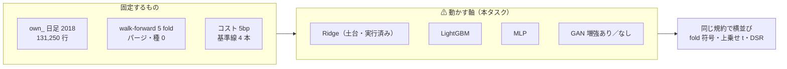
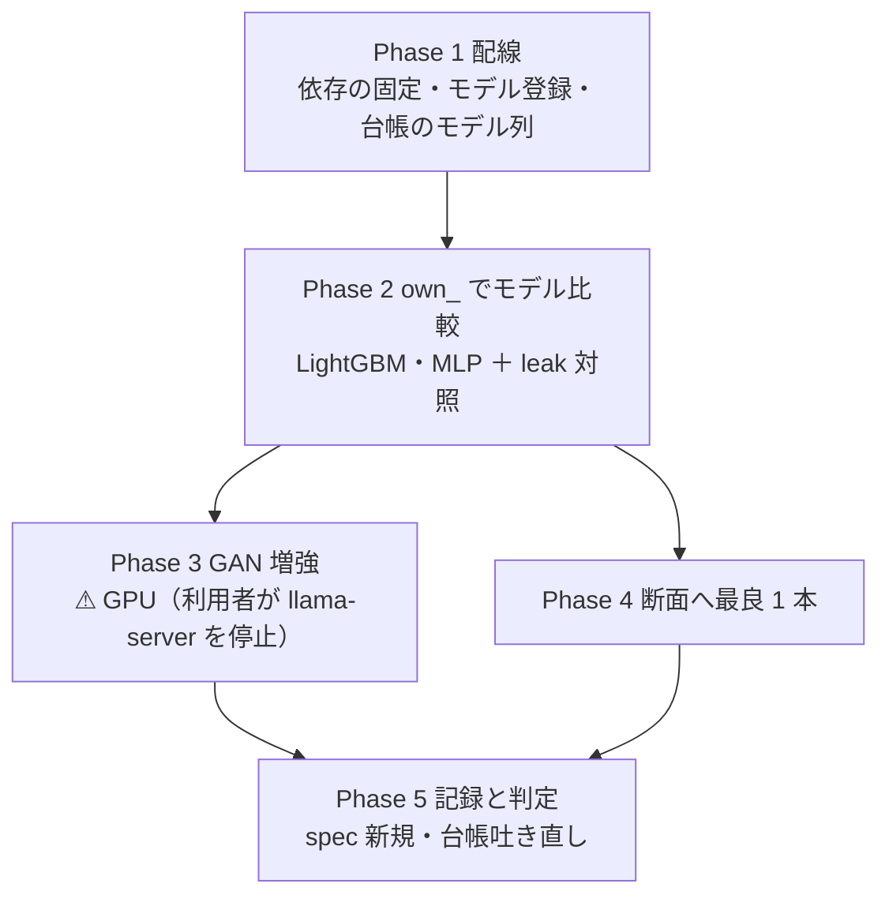

# 3090 Ti を使った機械学習で予測モデルを検証する

作成日: 2026-09-09。対象: `experiments/feature-discovery/`。
派生元: [特徴量を見つけ出す手法の検証 §9-2](../specs/experiments/feature-discovery.md)（「やらずに閉じたもの」の**非線形モデル**）。
規約: [rules.md](../specs/experiments/feature-discovery/rules.md)（⚠ **これが正本。本プランと食い違ったら rules.md を正とする**）。

利用者の指示（2026-09-09）:

- **3090Ti 24GB があるので、それを使用した機械学習での予測モデルの検証をする**
- **モデル候補に GAN（敵対的生成ネットワーク）を加える**

## 0. 目的と、期待値の管理

⚠ **問いは 1 つ**: §9 の結論「価格だけからは方向が出ない」は、**モデルを Ridge から非線形に替えても変わらないか**。

これまで比べてきたのは**選別の手法**であって、モデルは Ridge 1 本に固定してきた（[§3-1](../specs/experiments/feature-discovery.md) の決めごと 4）。
本タスクはその固定を外す。⚠ **ただし外すのはモデルの軸だけで、他は全部固定する**（データ・期間・地平・コスト・fold・種・選別）。

> この図の主張: ⚠ **動かすのはモデルの軸だけ。** 他の軸を同時に動かすと、差が出てもどの軸のせいか分からない。

⚠ **期待値の管理（TODO の警告をそのまま引き継ぐ）**

| # | 警告 | 本プランでの扱い |
| ---: | --- | --- |
| 1 | ⚠ **「GPU で大きいモデルを回せる」と「情報が増える」は別物** | 入力は変えない。⚠ **悪い数字が出たら、それが結論**（§9 の補強） |
| 2 | ⚠ **良い数字が出たら、まず先読み（rules.md 7 章）を疑う** | leak 対照実験を**モデルごとに**通す（§3-3） |
| 3 | ⚠ **n_trials が掛け算で跳ねる** | 選別を 4 本に絞る。見積りは 45 → 約 58【推測】（§3-4） |
| 4 | ⚠ **実効標本数が深層・GAN に一番効く** | own_ 2018 の実効観測数は **4,087**【実測】（63 系列 → 実効 4.7 系列）。⚠ **131,250 行を標本数と読まない** |

⚠ **資金は動かさない**（2026-08-27 の方針）。データは取得済みの読み取りだけ。
⚠ **数字は【実測】/【公表値】/【推測】を必ず明示する。**

## 1. 決めごと 1 — どのモデル

| 系統 | 採否 | 実装 | GPU | 理由 |
| --- | --- | --- | --- | --- |
| 勾配ブースティング | **採る** | LightGBM（`LGBMRegressor`） | ⚠ **不要** | 表形式データの非線形の定番。⚠ **この規模（13 万行 × 35 列）なら CPU で数秒〜数分**【推測】 |
| 深層（表形式） | **採る** | MLP（PyTorch） | あると速い | 「深層にすれば出るのか」への最短の答え。入力は他モデルと**同じ行** |
| GAN | **採る（増強）** | WGAN-GP（PyTorch） | **要る** | ⚠ **予測器ではなく学習データの増強に使う**（§2 で決める） |
| 系列モデル（LSTM 等） | ⚠ **見送り** | — | — | 下の注記 |

⚠ **系列モデルを見送る理由**: LSTM に意味のある長さの系列を食わせるには、**行の形を「特徴量ベクトル」から「銘柄ごとの窓」に作り直す**必要がある。
それは**入力の表現を変える**ことであり、⚠ **モデルの軸と入力の軸が混ざって、差が出てもどちらのせいか言えなくなる**（§0 の原則に反する）。
いまの表にある系列情報はリターンのラグ 7 本までで、これを LSTM に通しても MLP と実質同じである。
⚠ **Phase 2 で非線形に兆し（「常に上」への上乗せ t > 1）が出た場合だけ、入力の作り直しごと別プランで立てる。**

**ハイパーパラメータは事前に固定し、チューニングしない**（⚠ **振った水準の数だけ n_trials が増える**。rules.md 11 章 規約 4）。
値はすべて【推測】（このデータでの探索はしていない、という意味での事前値）。

| モデル | 固定する値 |
| --- | --- |
| LightGBM | `num_leaves=31, learning_rate=0.05, n_estimators≤500, min_child_samples=100, feature_fraction=0.8`。早期打ち切りは訓練分割の末尾 10% で |
| MLP | 隠れ層 `[64, 32]`・ReLU・dropout 0.2・AdamW `lr=1e-3`・batch 4096・最大 200 epoch。早期打ち切りは同上 |
| WGAN-GP | 生成器・判別器とも 3 層幅 128・潜在 32・critic 5 回・勾配ペナルティ 10・約 300 epoch・batch 1024 |

⚠ **早期打ち切りの検証は「訓練分割の内側の末尾」を時刻順で切り、地平ぶんパージする**（rules.md 3 章 B・9 章。検証 fold には触れない）。
⚠ **種は config の `seed` から取り、torch は決定的モードで回す**（rules.md 10 章）。

## 2. 決めごと 2 — GAN の役割は「増強」

⚠ **GAN は予測器としては使わない。学習データの増強（合成データ）に使う。** 理由は 3 つ。

| # | 理由 |
| ---: | --- |
| 1 | GAN は**分布からサンプルを引く道具**であって点予測の道具ではない。予測に使うには条件付き GAN のサンプル平均が要り、それは「不安定な学習で回り道した回帰」にしかならない |
| 2 | ⚠ **実効観測数 4,087**【実測】で判別器と生成器の均衡を安定させる根拠がない。増強なら、失敗しても「効かなかった」という結果が残る |
| 3 | 金融の時系列では合成データによる増強が通例（TimeGAN, Yoon ら 2019 ほか）。⚠ **通例どおり「増強あり／なし」を同じ規約で比べる形にする**（TODO の指示どおり） |

> この図の主張: ⚠ **GAN は「標本から学ぶ変換」（rules.md 3 章 B）なので、fold ごとに訓練分割の内側で fit し、検証には触れない。**

| # | 規約 |
| ---: | --- |
| 1 | GAN は **(X, y) の同時分布**を学ぶ（ラベルも合成する）。⚠ **fit に使うのは訓練分割だけ**なので先読みにはならない |
| 2 | 合成の量は**実データと同数（α = 100%）に固定**。⚠ **α を振ると水準の数だけ n_trials が増える**ので 1 水準にする |
| 3 | ⚠ **検証分割は常に実データのみ。** 合成行が検証に混ざったら測定にならない（テストで確かめる。§5） |
| 4 | 増強を試す予測器は **Ridge と、Phase 2 の最良の非線形 1 本**の 2 本に固定 |
| 5 | GAN の重みは保存せず、**種＋コード版＋入力の指紋で再現する**（⚠ **既存の配線も StandardScaler を保存していない**。同じ扱い） |

⚠ **増強の対照は「増強なし」**: 同じ予測器・同じ規約の既存実行（Phase 2）がそのまま対照になる。追加の実行は要らない。

## 3. 決めごと 3 — どの入力で、同じ規約で

### 3-1. 入力

| Phase | 入力 | 土台 | 理由 |
| --- | --- | --- | --- |
| 2・3 | **`own_` 日足 2018**（35 本・131,250 行【実測】） | `own_impact_2018`（実行済み: `runs/2026-09-09T12-22-33`） | ⚠ **Ridge の対照が既にある**ので、モデルの差だけが出る |
| 4 | **断面 134 本**（own 35 ／ cs 26 ／ rel 13 ／ ll 60） | `cross_section_h1`（実行済み: `runs/2026-09-08T19-42-54`） | §8 で唯一正の行が出た入力。⚠ **最良の非線形 1 本だけ**回す（n_trials を絞る） |
| — | `ex_`・`im_` | ⚠ **足さない** | `ex_` は §9 で偽薬を超えず、モデル比較の軸を汚す。`im_` は **impact-data の Phase 4（`im_` 対 `im_pb_`）の判定待ち**（TODO の依存） |

### 3-2. 実験の形 — TOML を足すだけ、配線は 1 か所だけ直す

**1 実験 1 ファイル・1 モデル**の形を守る（`impact_*` 4 本が「違うのは層だけ」だったのと同じで、⚠ **違うのはモデルだけ**にする）。

| TOML | model | 内容 |
| --- | --- | --- |
| `gpu_lgbm_2018` | `LightGBM` | own_ 日足 2018。`own_impact_2018` と model 以外は完全に同じ |
| `gpu_mlp_2018` | `MLP` | 同上 |
| `gpu_ridge_gan_2018` | `Ridge+GAN増強` | Phase 3。増強なしの対照は `own_impact_2018` |
| `gpu_<最良>_gan_2018` | `<最良>+GAN増強` | Phase 3 |
| `gpu_<最良>_cs` | `<最良>` | Phase 4。断面（`cross_section_h1` と model 以外は同じ） |

**選別は 4 本に絞る**: `全部使う（基準）`・`乱択（基準）`・`F3-3 並べ替え(MDA)`（own_ 2018 の Ridge で最良だった選別【実測】）・`F3-1 Lasso`（疎な代表・軽い）。
⚠ **モデルの比較の主役は「全部使う × モデル」の行**である（選別の優劣は前タスクで決着済み。選別×モデルの格子を全部埋めない）。

⚠ **配線で 1 か所だけ直すものがある — 台帳の鍵にモデルが無い。**
`ail/catalog.py` の `KEY` は（鍵・粒度・地平・特徴量の層・データの層）で、⚠ **同じ選別を別モデルで回すと 1 行に潰れて「⚠ N 実行・幅 X bp」の偽警告になる。**
`KEY` に**モデル**を足し、台帳の表にもモデル列を出す（旧実行は `model` 未指定 = Ridge として読む。⚠ **既存の台帳の行数が変わらないことをテストで確かめる**）。

### 3-3. 検証の規約（rules.md 9 章・11 章をそのまま）

| # | 規約 | 本タスクでの形 |
| ---: | --- | --- |
| 1 | ウォークフォワード 5 fold・パージ・種 0 | `own_impact_2018` と同一（TOML を写す） |
| 2 | 基準線の併記 | 常に上・直前リターンの符号・全部使う・乱択 |
| 3 | コスト往復 5bp・純利で判定 | 同一 |
| 4 | fold ごとの符号・「常に上」への上乗せ t | `checks.json` に自動で残る（既存の配線） |
| 5 | 実効標本数で t・DSR を割り引く | 同上（own_ 2018 は実効 4,087【実測】） |
| 6 | ⚠ **leak 対照実験をモデルごとに通す** | `--leak` で**各モデルが**的中率を跳ね上げること。⚠ **跳ねないモデルは「配線が壊れている」であって「堅牢」ではない** |
| 7 | ⚠ **良い数字はまず先読みを疑う** | 非線形は交互作用で漏れを拾うのも上手い。良い数字 → leak・fold 符号・DSR を通すまで報告しない |

### 3-4. n_trials の数え方【推測】

⚠ **数え落とすと DSR が甘くなる**（rules.md 11 章 規約 4）。数える規則を先に決める:

- カタログ ID を持つ行（従来どおり）＋ ⚠ **「全部使う × モデル ≠ Ridge」の行**（モデルが処置なので試行として数える）
- 「乱択」「常に上」「直前符号」は従来どおり基準線（数えない）
- 実装は `ail/catalog.py` の数え方をこの規則に直し、`n_trials_now` が自動で拾う形にする

| Phase | 増える行 | 累計【推測】 |
| --- | ---: | ---: |
| 現在（台帳） | — | **45**【実測 2026-09-09】 |
| 2: LightGBM・MLP | (全部使う + F3-3 + F3-1) × 2 = 6 | 51 |
| 3: GAN 増強 × 2 予測器 | (全部使う + F3-1) × 2 = 4 | 55 |
| 4: 断面 × 最良 1 本 | 全部使う + F3-3 + F3-1 = 3 | **約 58** |

## 4. 進め方（Phase）

> この図の主張: ⚠ **GPU 待ちで止まるのは Phase 3 だけ。** LightGBM と MLP は CPU で回せる規模【推測】なので、llama-server の停止を待たずに Phase 2 まで進める。

| Phase | 内容 | 待ち |
| --- | --- | --- |
| 1 | **配線**: `requirements.txt` に torch・lightgbm を固定 ／ `ail/models/trees.py`（LightGBM）・`ail/models/deep.py`（MLP）・`ail/models/gan.py`（増強）を登録 ／ `bootstrap.py` に 2 行 ／ ⚠ **台帳の鍵にモデル列** ／ tests | なし |
| 2 | **own_ 日足 2018 でモデル比較**: `gpu_lgbm_2018`・`gpu_mlp_2018` を build → run → leak 対照 → 判定 | なし（CPU で可【推測】） |
| 3 | **GAN 増強**: `gpu_ridge_gan_2018`・`gpu_<最良>_gan_2018` → 増強あり／なしを横並び → 判定 | ⚠ **GPU**（下） |
| 4 | **断面**: `gpu_<最良>_cs` → §8 の 3 手法・基準線と横並び → 判定 | なし（最良が MLP なら GPU が望ましい） |
| 5 | **記録**: `docs/specs/experiments/gpu-models.md`（新規・1 手法 1 ファイル）／ 台帳の吐き直し ／ TODO・DONE ／ プランを archive へ | なし |

**GPU の現状【実測 2026-09-09】**: llama-server（PID 537）が VRAM **22,180 / 24,564 MiB** を掴んでいる。
⚠ **何を配信しているか分からないので止めるのは利用者**（Claude は止めない）。
⚠ **正直な注記**: この規模（13 万行 × 35〜134 列）に 3090 Ti は必須ではない。GPU が効くのは **WGAN-GP の学習 ×（5 fold × 2 予測器 × leak）** の反復時間で、
CPU だと数時間〜【推測】かかるところを数十分に縮める用途である。MLP は空き 2.3GB でも動く見込み【推測】だが、
llama-server と VRAM を取り合わないよう、**フル実行は停止後**に行う（デバイスは `AIL_TORCH_DEVICE`（auto/cpu/cuda）で制御し、auto は空き VRAM 4GB 未満なら CPU に落とす）。

## 5. テスト方針

| 対象 | テスト |
| --- | --- |
| 各モデル | 同じ種で同じ予測が出る（決定性）／ 出力の形と NaN なし ／ 定数入力で落ちない |
| 台帳のモデル列 | ⚠ **既存の runs/ を読んだとき、台帳の行数と n_trials(45) が変わらない**（後方互換）／ モデル違いの同じ選別が別行になる |
| GAN 増強 | ⚠ **合成行の時刻がすべて訓練分割の内側にある**（検証に混ざらない）／ 増強ありのモデルが leak 列で跳ねる |
| 先読み | 既存の `--leak` 実験を**モデルごとに**通す（実行系。テストではなく運用の規約） |

## 6. 影響範囲

| 場所 | 変更 |
| --- | --- |
| `experiments/feature-discovery/requirements.txt` | torch・lightgbm を追加・固定 |
| `ail/models/trees.py`・`deep.py`（新）・`gan.py`（新） | `@register("model", ...)` を足すだけ |
| `ail/bootstrap.py` | import 2 行 |
| `ail/catalog.py`・`cli/ledger.py` | ⚠ **台帳の鍵と表示にモデル列**・n_trials の数え方（§3-4）。`cli/run.py` は n_trials の数え上げ 1 行だけ直す（配線は触らない） |
| `config/experiment/gpu_*.toml` | 5 本（§3-2） |
| `tests/test_models.py`（新）ほか | §5 |
| `docs/specs/experiments/gpu-models.md`（新） | 記録（Phase 5） |
| 触らないもの | `cli/run.py` の配線 ／ `data/` の各層 ／ dashboard（`checks.json` を読むだけの既存の形で足りる） |

## 7. 判定の基準（先に決めておく）

| 出た数字 | 扱い |
| --- | --- |
| どのモデルも「常に上」への上乗せ t < 3 | ⚠ **悪い数字は結論**: §9 に「非線形モデルでも変わらない」を追記して打ち切り。E8 の型は X2 ＋ X9 のまま |
| どれかが基準線を超えた | ⚠ **まず先読みを疑う**（規約 7）。leak・fold 符号・実効 n の DSR（n_trials 約 58）を全部通しても、⚠ **根拠は「中」が上限**（良い数字の上限。rules.md 11 章 規約 2） |
| 増強あり ＞ 増強なし | 同上。⚠ **さらに「増強で数字が良くなる」は過剰適合の匂いが強い**ので、fold 符号の安定を重く見る |
