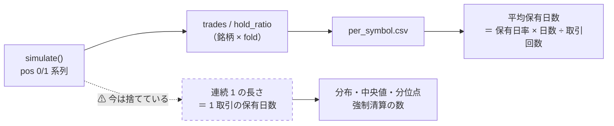
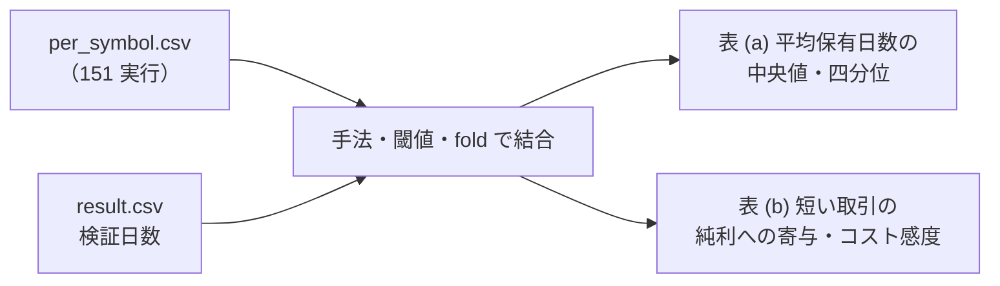
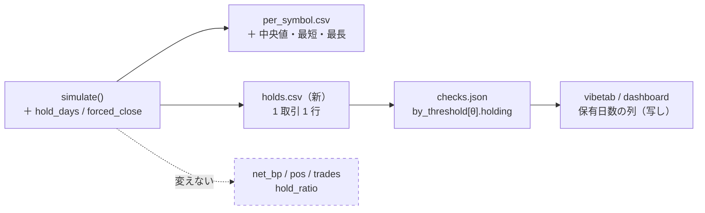

# 保有日数の分布（中央値・分位点）を出し、保有が短い取引ほどコストが重いことを数字にする

作成: 2026-09-17 ／ 状態: プラン（未着手）
対象: `experiments/feature-discovery/`（`ail/validation/simulate.py`・`cli/run.py`・`ail/validation/checks.py`・`ail/runs.py`）、`dashboard/vibetab.py`
派生元: TODO「疑問に思ったことを登録し解決していく」の子タスク「保有日数の中央値など分布が知りたい。保有日数の短い取引ほど手数料が重くなってくるので」。⚠ **2026-09-17 に利用者の指示で独立タスク「保有日数の分布（中央値・分位点）を出し、保有が短い取引ほどコストが重いことを数字にする」になった**
関連: [rules.md 13-4](../specs/experiments/feature-discovery/rules.md)（状態機械とコスト）／ [rules.md 15-7](../specs/experiments/feature-discovery/rules.md)（日次系列を残す）／ [dashboard.md §10-5](../specs/dashboard.md)（閾値売買の画面）
親タスク（2026-09-17）: TODO「閾値売買の記録を広げる 4 本（保有日数の分布・逆売買の診断・出来高の入力・`ex_` / `im_` の回し直し）を、配線の順序を決めて回す」。⚠ **順序は 本プランの Phase 2 → 逆売買の Phase 2 → 回し直し 1 回（2 つの Phase 3 を兼ねる。子タスク「代表 1 構成 ＋ leak 対照を 1 回だけ回し直す」）**。2 つの Phase 2 は同じ `cli/run.py` / `checks.py` / テスト 3 本を触るので同時に開かない。「既定経路の不変」の指紋テスト（§4）は本プランで作り、逆売買と出来高が流用する

## 1. 目的・背景

### 1-1. 疑問

閾値つき売買（rules.md 13 章）では、建てた日と手仕舞った日にだけ片道 2.5bp（往復 `cost_bp` = 5.0【推測。config の値】）を引く。
コストは **1 取引あたり定額**なので、⚠ **保有が短い取引ほど 1 日あたりのコストが重い**。

| 保有日数（営業日） | 1 日あたりのコスト【計算。5bp ÷ 保有日数】 | 参考: B&H のドリフト【実測。rules.md 13 章の表】 |
| ---: | ---: | --- |
| 1 | 5.00bp/日 | 2018 表 4.59bp/日 ／ 1995 表 3.49bp/日 |
| 2 | 2.50bp/日 | 〃 |
| 5 | 1.00bp/日 | 〃 |
| 20 | 0.25bp/日 | 〃 |

つまり ⚠ **保有 1〜2 日の取引は、B&H が平均で稼ぐ 1 日ぶんに匹敵するコストを払っている**。
手法の取引がどの保有日数に集まっているかが分からないと、「純利が伸びない理由がコストか、予測か」を切り分けられない。

### 1-2. 今の記録で分かること・分からないこと

| 量 | 今の記録 | 場所 |
| --- | :-: | --- |
| 銘柄 × fold の取引回数・保有日率・見送り日数 | ✅ ある | `per_symbol.csv`（`simulate()` の `trades` / `hold_ratio` / `skip_days`） |
| fold の検証日数 | ✅ ある | `result.csv` の `検証日数` |
| **1 取引あたりの平均保有日数** | ⚠ **計算で出る**（保有日率 × 検証日数 ÷ 取引回数） | 上の 2 つから |
| **1 取引ごとの保有日数（分布・中央値・分位点）** | ❌ **無い** | ポジション系列は銘柄別には保存していない（`daily.csv` の `hold` はポートフォリオ平均） |
| fold 末の強制清算で切れた取引の数 | ❌ 無い | — |

> この図の主張: 平均は既存の記録から出るが、**分布はシミュレータが 1 取引ごとの長さを吐かないと出ない**。

### 1-3. 用語

- **保有日数** = ポジション系列で 1 が連続した営業日数。足 t の終値で建て、足 t+k の終値で手仕舞うと **k 日**（pos は t〜t+k−1 が 1）。最短は 1
- **強制清算** = fold 末尾でまだ保有していて清算された取引（rules.md 13-4 の 4）。⚠ **右側で打ち切られた観測**なので、分布を出すときは含む／含まないを分けて示す（D 系のように保有日率 ≈ 1 の手法は「fold 長 × 1 取引」になり、これを混ぜると中央値が fold 長になる）

## 2. 対応方針

### 2-1. 3 段で答える

| 段 | 何をする | 再実行 | 得られるもの |
| :-: | --- | :-: | --- |
| **Phase 1** | 既存 151 実行の `per_symbol.csv` ＋ `result.csv` から **平均保有日数とコストの重み**を集計する（読むだけ） | 不要 | 手法 × 閾値ごとの平均保有日数の分布（銘柄 × fold 単位）、1 日あたりコスト、コストの取り分（コスト ÷ 粗利） |
| **Phase 2** | シミュレータに **1 取引ごとの保有日数**を吐かせ、記録と検査（`checks.json`）と画面に載せる | ⚠ **数字は変えない**（出力を足すだけ） | 以後の実行で中央値・分位点・強制清算の割合が残る |
| **Phase 3** | 代表 1 構成（＋ leak 対照）を回し直して **正確な分布**を出し、疑問への答えを文書にする | 代表 1 構成だけ | 答え（中央値・分位点・短い取引の割合とそのコスト）。⚠ 同じ鍵の再実行なので台帳の行は増えない |

### 2-2. Phase 1 — 既存記録からの近似（読むだけ）

集計スクリプトは `experiments/feature-discovery/cli/` に置かず、⚠ **一時的な集計として scratchpad で回し、結果の表だけを文書に残す**（一度きりの読み取りで、実験の正本にしない）。

| 列 | 定義 | 注意 |
| --- | --- | --- |
| 平均保有日数 | 保有日率 × 検証日数 ÷ 取引回数（銘柄 × fold） | 取引回数 0 の行は除く。⚠ **fold 末の強制清算を含む** |
| 1 日あたりコスト bp | 純利と粗利の差 ÷ 保有日数（＝ 保有日率 × 検証日数） | `cost_bp_total` は per_symbol に無いので **粗利 − 純利** で出す（定義上一致する） |
| コストの取り分 | （粗利 − 純利）÷ |粗利| | 粗利 ≤ 0 の行は分けて数える |
| cost_bp の感度 | 純利(c) = 粗利 − (粗利 − 純利) × c ÷ 5 | ⚠ **算術だけで出る**（再実行しない）。c = 2.5 / 5 / 10 の 3 水準。⚠ **採否には使わない**（`cost_bp` は config の固定値。判定のために動かすのは自由度になる） |

出す表は 2 つ: (a) 手法 × 閾値ごとの平均保有日数の**中央値と四分位**（銘柄 × fold を標本に）、(b) 「平均保有日数 ≤ 2 日」の銘柄 × fold が純利に占める寄与。
⚠ **これは「1 取引ごとの分布」ではなく「銘柄 × fold の平均の分布」**である。答えの文書にはその旨を明記する。

> この図の主張: Phase 1 は既存ファイルの 2 つを結合して割り算するだけで、実験コードには触らない。

### 2-3. Phase 2 — 1 取引ごとの保有日数を記録する

⚠ **rules.md 14-4「名前を変えないなら既定の計算を 1 ビットも変えない」に従う。** 足すのは戻り値と出力ファイルだけで、`net_bp` / `pos` / `trades` / `hold_ratio` の計算経路は触らない。

| # | 変更 | 場所 | 中身 |
| ---: | --- | --- | --- |
| 1 | `simulate()` の戻り値に **`hold_days`**（各取引の保有日数の list）と **`forced_close`**（末尾で強制清算したか）を足す | `ail/validation/simulate.py` | 状態機械のループで建てた足の添字を覚え、手仕舞った足で差を push する。⚠ **既存の鍵は 1 つも変えない** |
| 2 | `shifted_gate()` の戻り値にも同じ鍵が付く（`simulate()` を呼ぶだけなので自動） | 〃 | 乱択ゲートは保有日数を保つはず（巡回の継ぎ目で ±1 だけ）。⚠ **検算に使える** |
| 3 | 1 取引 1 行の **`holds.csv`** を実行ディレクトリに書く | `cli/run.py` ＋ `ail/runs.py` に `Run.holds()` | 列: 手法・閾値・fold・銘柄・建てた日・保有日数・強制清算。⚠ **成果物であって採否には使わない**（`per_symbol.csv` と同じ扱い） |
| 4 | `per_symbol.csv` に **保有日数中央値・最短・最長**の 3 列を足す | `cli/run.py` | 既存の列は動かさない（末尾に追加） |
| 5 | `checks.json` の `by_threshold[θ]` に **`holding`** を足す | `ail/validation/checks.py` `compute_trading` | 最良手法の 1 取引ごとの分布の要約: 取引数・中央値・p10 / p25 / p75 / p90・**保有 1 日・2 日以下の割合**・強制清算の割合・（強制清算を除いた）中央値。`random_gate` / `episodes` と同じく **「⚠ 採否には使わない」の注記付き** |
| 6 | 画面に **「保有日数 中央値（p25–p75）」** の列を足す | `dashboard/vibetab.py`（閾値ごとの成績の表）／ `dashboard/`（`/experiments` の詳細） | ⚠ **checks.json の写しを出すだけ**（画面で数え直さない。dashboard.md §10 の原則）。旧実行には鍵が無いので「—」 |
| 7 | 規約と仕様に 1 行ずつ足す | `rules.md` 13-4 の 5（記録するものに「1 取引ごとの保有日数」）／ 15-7（`holds.csv`）／ `dashboard.md` §10-5 の詳細ページの行 | 「成果物であって採否には使わない」を明記 |

> この図の主張: 追加は「状態機械 → 記録 → 検査 → 画面」の各段に **出力を 1 つ足すだけ**で、既存の矢印は変えない。

### 2-4. Phase 3 — 代表構成の回し直しと答え

- **どれを回すか**: 台帳（`cli/ledger.py`）で採用 / 保留の最上位にある閾値売買の 1 構成と、その leak 対照（7 章 規約 7。毎回通す）。⚠ **回すと決めるのは結果を見る前**（rules.md 14-10）
- **同じ鍵の再実行**なので台帳の行は増えず、`summary.csv` / `per_symbol.csv` の既存列が旧実行と**一致する**ことが「1 ビットも変えていない」検算になる（⚠ 一致しなければ配線を疑う）
- **答えとして書くもの**（`docs/specs/experiments/feature-discovery/holding-days.md`。[dsr.md](../specs/experiments/feature-discovery/dsr.md) と同じ「解説であって規約ではない」形）
  1. 保有日数の中央値・分位点（強制清算を含む／除く）— 手法・θ ごと
  2. 保有 1 日・2 日以下の取引の割合と、それらが払ったコストの合計 ÷ 全コスト
  3. 1 日あたりコストの表（§1-1）を実測の分布に重ねて、「どの帯の取引がコスト負けしているか」
  4. Phase 1 の近似（銘柄 × fold の平均）と Phase 3 の実測（1 取引ごと）の差 — 近似がどれだけ使えるか
  5. ⚠ **答えない**こと: `cost_bp` を変えて採否を変えること（自由度）／ 保有日数で取引を選別すること（後知恵の出口規則。やるなら 16 章の出口% と同じく事前に仮説を書いて新しい試行として数える）
- TODO の子タスクには答えの要点をメモで残して `DONE.md` へ移す（親の「疑問」タスクは残す）

### 2-5. ⚠ 実費の手数料について（答えに 1 節だけ添える）

シミュレータの 5bp は【推測】で、tastytrade の株の売買手数料は **$0**【公表値。[trading-fee-comparison.md §4](../specs/trading-fee-comparison.md)】。
つまりモデルのコストは**手数料ではなくスプレッド・滑りの見積り**であり、保有日数で重くなるのはこの部分。
売り側に乗る規制費（SEC Section 31 fee・FINRA TAF）は**株数・約定金額比例の少額**で、5bp に比べて桁が小さいと見込むが、⚠ **料率は改定されるので答えを書く時点で公式ページを当たり、取得日付きの【公表値】で書く**（取れなければ【推測】のまま）。⚠ **実費の【実測】は取りにいかない**（CLAUDE.md の方針）。

## 3. 影響範囲

| 場所 | 変更 | 既存の数字への影響 |
| --- | --- | :-: |
| `ail/validation/simulate.py` | 戻り値に 2 鍵を追加 | なし（既存鍵の計算は同じ） |
| `cli/run.py` | `holds.csv` の行を集める・`per_symbol` に 3 列追加 | なし（既存列は同じ値） |
| `ail/runs.py` | `Run.holds()` とファイル一覧の docstring | なし |
| `ail/validation/checks.py` | `by_threshold[θ].holding` と最上位への写し | なし（`best` / `edge_vs_bh` / `dsr` は同じ） |
| `dashboard/vibetab.py`・`dashboard/` の検証画面 | 列を 1 つ追加（鍵が無ければ「—」） | なし |
| `rules.md` 13-4・15-7、`dashboard.md` §10-5 | 記録するものを 1 行ずつ追記 | — |
| 台帳（`ail/catalog.py`） | ⚠ **触らない**（保有日数は鍵にも判定にも入れない） | なし |

## 4. テスト方針

| 対象 | テスト | 場所 |
| --- | --- | --- |
| `simulate()` | `sum(hold_days) == pos.sum()`、`len(hold_days) == trades`、建てて翌日手仕舞いは `[1]`、末尾で保有中なら最後の要素が `forced_close=True` で長さは末尾までの日数、`exit_pct` を渡す経路でも同じ | `tests/test_trading.py` |
| `shifted_gate()` | 巡回シフト後の `sum(hold_days)` が元と一致（継ぎ目で本数は ±1 まで） | 〃 |
| 既定経路の不変 | 小さな固定パネルで実行前後の `per_symbol.csv` 既存列・`summary.csv`・`checks.json` の `best` / `edge_vs_bh` / `dsr` が **1 ビットも変わらない**（指紋の照合。rules.md 14-4 の 2 と同じ手順） | `tests/test_trading_run.py` |
| `checks.json` | `holding` の要約が `holds.csv` から手計算した中央値と一致。取引 0 回のときは鍵を省く | `tests/test_checks.py` |
| 画面 | `holding` がある実行では列が出る・無い旧実行では「—」。秘密が出ないことの既存テストはそのまま通る | `dashboard/tests` |
| Phase 3 の検算 | 回し直した実行の `summary.csv` が同じ鍵の旧実行と一致する（台帳の「再現の幅」が 0） | 手で確認して記録に書く |

## 5. 作業量・順序・計算時間

計算時間は 2026-09-17 に測った（Phase 1 は本物のファイルで、シミュレータは合成データで。実行時間は `runs/queue/*.json` の `seconds`）。

| Phase | 計算時間 | 根拠 | 人手の作業量【推測】 | 依存 |
| :-: | --- | --- | --- | --- |
| 1 | **1 秒**（151 実行・651,534 行の読み込み 0.7 秒 ＋ 結合と集計 0.2 秒）【実測】 | `per_symbol.csv` 46MB ＋ `result.csv` 2.3MB を pandas で読むだけ | 集計スクリプトと表 2 つで半日 | なし |
| 2 | **増分は 1 秒未満**【実測】: 1 実行ぶん（2,836 銘柄 × fold × θ、n=360）の `simulate` ＋ `shifted_gate` が **0.6 秒**。保有日数の list を足しても桁は変わらない | シミュレータは Python の for 1 本で、実行時間の主は特徴量の構築とモデルの fit | コード 4 ファイル ＋ テスト ＋ 規約 3 行で 1 日 | なし（Phase 1 と並行可） |
| 3 | **代表構成しだいで 0.2 分〜60 分 × 2 本（本物 ＋ leak）**【実測】 | Ridge・LightGBM・MLP の `trade_own_*` は **0.1〜0.6 分**、`trade_ownseq_mp_a` 1.9 分、`trade_ownseq_tsf_a` は **60 分**（系列特徴量の構築が重い）。PatchTST は queue に記録が無く【推測】数時間（GPU） | 回し直し ＋ 解説ページで半日 | Phase 2 |

⚠ **計算は待ち時間にならない。** 支配的なのは人手（コードとテスト、文書）で、合計 2 日【推測】。

金銭・契約の発生する行動はない。

## 6. Phase 1 の先取り（2026-09-17 の計測で見えたもの）

計算時間を測るために §2-2 の割り算を全 151 実行で流したところ、銘柄 × fold の**平均保有日数**の分位点は次のとおりだった【実測。強制清算を含む・全手法と基準線を混ぜた粗い値】。

| p10 | p25 | p50 | p75 | p90 |
| ---: | ---: | ---: | ---: | ---: |
| 2.0 日 | 2.1 日 | 13.3 日 | 360 日 | 1,254 日 |

⚠ **二山になっている**: 下の山（2 日前後）は毎日反転に近い取引、上の山（360 日・1,254 日 ＝ fold 長）は B&H に退化した「1 取引で fold を持ち切る」もの。
⚠ **これは基準線と D 系の退化を含む粗い値**なので答えには使わず、Phase 1 で手法 × θ に分けて出し直す。ただし §1-1 の懸念（保有 1〜2 日にコストが集中する）は**実在する形**だと分かった。
