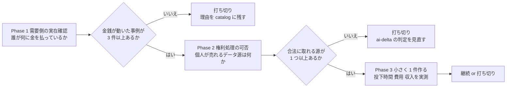
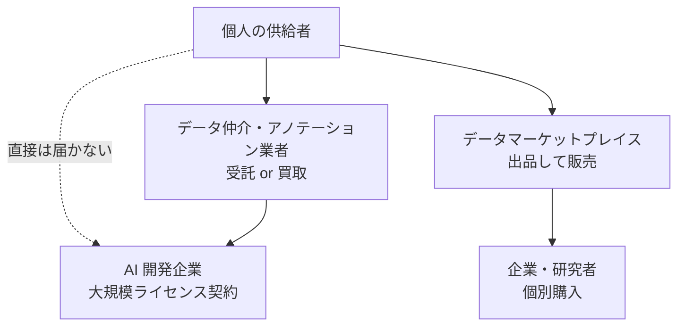
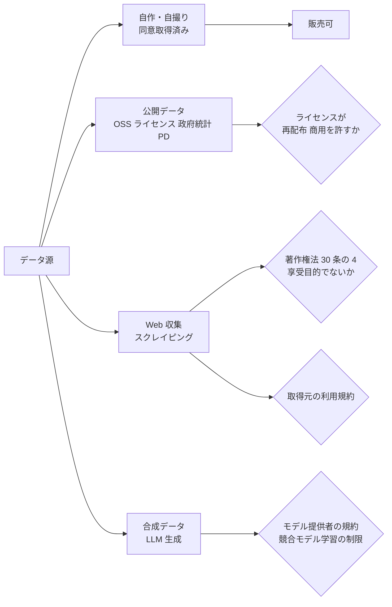
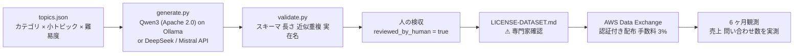

# I7 独自データセットの提供・販売 — 検証

> 2026-08-26 打ち切り。Phase 1・2 は完了、Phase 3 はユーザー判断で実施せず。結果: [docs/specs/experiments/i7-dataset.md](../../specs/experiments/i7-dataset.md)

## 目的・背景

[shortlist.md](../../specs/income-taxonomy/shortlist.md) の全セグメント推奨 1 位。
[ai-delta.md](../../specs/income-taxonomy/ai-delta.md) で「新規」（AI 以前には需要が存在しなかった）と判定した 3 件のうち、元手ゼロで入れる唯一の枠。
一方で [catalog.md](../../specs/income-taxonomy/catalog.md) の典型的な失敗理由は「データの権利処理を怠り、公開後に使えなくなる」で、
**権利処理が手法の本体**である。

作る前に「本当に買い手がいるのか」「個人が合法に売れるデータは何か」を確定しないと、
制作の投下時間が丸ごと無駄になる。本タスクはその 2 点を先に潰し、通ったら小さく 1 件作って実測する。

セグメント（[decide-segment.md](decide-segment.md) で確定）: 資金 大 × 週 5〜15 時間 × 回収 6 ヶ月〜1 年。
元手はあるが時間が薄いので、**制作に人手を要しないデータ源**を優先する。

## 対応方針（3 Phase）

この図の主張: 需要と権利の 2 関門を通過したものだけが制作に進む。どちらかで落ちたら打ち切り理由を残して終わる。

### Phase 1: 需要側の実在を確認する

「AI 企業がデータを買っている」は総論としては知られているが、**個人が供給側に回れる経路**があるかは別問題。
買い手を 3 種に分け、それぞれで実際に金銭が動いた事例と、個人が入れる入口を調べる。

この図の主張: 買い手は 3 種いて、個人が直接届くのは右 2 つだけ。左は仲介業者を経由する。

調べる項目:

1. 大規模ライセンス契約の実例（誰が誰に、公表額があるか）— 市場の存在証明として
2. データ仲介・アノテーション業者で個人が供給者として登録できるもの、報酬の形
3. データマーケットプレイスで個人が出品できるもの、手数料、実際に売れている価格帯
4. 日本語データの需要（国内 LLM 開発の動向、日本語データ不足の指摘があるか）
5. 需要のあるデータの種類（対話・評価・ドメイン特化・音声・画像 など）と、どれが「公開情報の学習では埋まらない」か

### Phase 2: 権利処理の可否を確認する

⚠ 著作権法・個人情報保護法・取得元の利用規約・AI モデル提供者の規約に触れる。**法的助言ではなく、着手前の論点整理**として扱い、
実際に販売する前に専門家確認を入れる。

この図の主張: データ源ごとに通る法域が違う。自作・同意取得済みだけが全関門を素通りする。

調べる項目:

1. 著作権法 30 条の 4（情報解析）と 47 条の 5 が、**第三者への提供（販売）**をどこまで許すか。文化庁「AI と著作権に関する考え方」（2024）の整理
2. 個人情報保護法: 個人情報を含むデータの第三者提供の要件、匿名加工・仮名加工の使い分け
3. 主要な取得元（SNS・EC・ニュース・ゲーム 等）の利用規約がスクレイピングと再配布をどう扱っているか
4. 合成データ: OpenAI / Anthropic / Google / Meta 各規約の「出力を使った競合モデル学習」の扱い
5. 不正競争防止法の「限定提供データ」と、販売時の契約（ライセンス条項）で何を縛るべきか

出力: データ源 × 論点 の可否表と、**個人が今すぐ合法に作れるデータ源の短リスト**。

### Phase 3: 小さく 1 件作って実測する

Phase 1・2 を通過した場合のみ。Phase 2 の短リストと Phase 1 の需要リストの交点から 1 テーマを選ぶ。

| 記録項目 | 内容 |
| --- | --- |
| 投下時間 | 制作・出品・対応の合計を【実測】 |
| 投下費用 | API 利用料・出品手数料・外注費を【実測】 |
| 得られた収入 | 【実測】。ゼロならゼロと書く |
| 継続 / 打ち切り | 打ち切る場合は理由を残す |
| 体系へのフィードバック | 「新規」判定が実測と食い違ったら ai-delta.md を書き換える |

## 影響範囲

- 新規: `docs/specs/experiments/i7-dataset.md`（Phase 1・2 の調査結果と Phase 3 の実測記録）
- 更新: `TODO.md`（Phase の子タスク）、`docs/specs/income-taxonomy/catalog.md`（I7 に【実測】追記、Phase 3 後）
- 更新（条件付き）: `docs/specs/income-taxonomy/ai-delta.md`（判定が食い違った場合）

## テスト方針

1. Phase 1: 実際に金銭が動いた事例が 3 件以上、出典 URL 付きで挙がっているか。個人が供給側に入れる経路が 1 つ以上あるか
2. Phase 2: データ源 × 論点 の可否表が埋まり、「今すぐ合法に作れる源」が 1 つ以上残るか（残らなければ打ち切り判断）
3. 数値（価格帯・報酬額）はすべて出典付きの【実測】か、【推測】と明示されているか
4. 図テスト: Phase ごとに図が 1 枚以上あり、直前に主張の 1 行が付いているか
5. 記憶ベースの法解釈・規約は Web で一次情報を確認し、確認できなかったものはその旨を残す

## Phase 3 の実施計画（2026-08-26 決定: A・B 並行）

Phase 1・2 の交点（[i7-dataset.md](../../specs/experiments/i7-dataset.md)）から、案 A（自分の声）と案 B（自作＋合成の評価セット）を並行する。

この図の主張: B は「生成 → 機械検査 → 人の検収」を通ったものだけを出品し、本文を書くモデルは許諾上問題のないものに固定する。

### 3-A 自分の声を AI 音声ライブラリに登録する

| Step | 内容 | 担当 | 状態 |
| --- | --- | --- | --- |
| A-1 | ElevenLabs Voice Library の日本からの受取可否・月額・PVC 要件、AILAS の個人登録可否を確認する | Claude（調査） | 完了（受取可。AILAS は外す） |
| A-2 | 録音・登録（本人の声が要るのでユーザー作業）。投下時間と月額を【実測】 | ユーザー | **中止**（2026-08-26 ユーザー判断） |
| A-3 | 3 ヶ月観測。入金ゼロなら打ち切り | — | 中止 |

### 3-B ソフトウェア開発の日本語評価セットを出品する

| Step | 内容 | 担当 | 状態 |
| --- | --- | --- | --- |
| B-1 | 設計とパイプライン（`experiments/i7-dataset/`: topics / generate / validate / ライセンス条項ドラフト） | Claude | 完了 |
| B-2 | 生成経路の確定。環境は GPU なし・RAM 15 GB・CPU 12。**パイロットは Ollama + qwen3:8b（CPU、費用ゼロ）** | Claude | 完了 |
| B-3 | パイロット 10 件を生成し、validate.py を通す。生成時間・失敗率を【実測】 | Claude | 完了（10/10、295 秒/件、問題 0） |
| B-4 | ~~パイロットの検収~~ → **人による品質検収は行わない**（2026-08-26 ユーザー決定）。validate.py の機械検査のみ。出品時に「未検収」を開示する | — | 決定済み |
| B-5 | 本生成 200 件 → validate.py | Claude | **中止**（1 件生成で停止） |
| B-6 | ライセンス条項の専門家確認 ⚠ | ユーザー | 中止 |
| B-7 | AWS Data Exchange の provider 登録（AWS アカウント・W-8・JCT 番号・受取口座）と出品 ⚠ JCT は税務判断 | ユーザー | 中止 |
| B-8 | 6 ヶ月観測。売上ゼロなら打ち切り | — | 中止 |

### 権利処理をコードに落とした点

- 本文は Apache 2.0 / MIT の重みを自前ホストしたモデル（既定 Qwen3）か DeepSeek / Mistral API で生成する。**Claude・OpenAI・Gemini で本文を書かない**
- プロンプトに第三者の著作物を貼らない。実在の製品名・企業名を出さないよう指示し、validate.py で検査する
- 全件に provenance（モデル・ライセンス・日時・プロンプト版）を付ける
- 配布は認証付き経路のみ（限定提供データの電磁的管理性）
