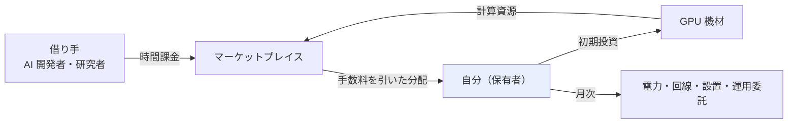
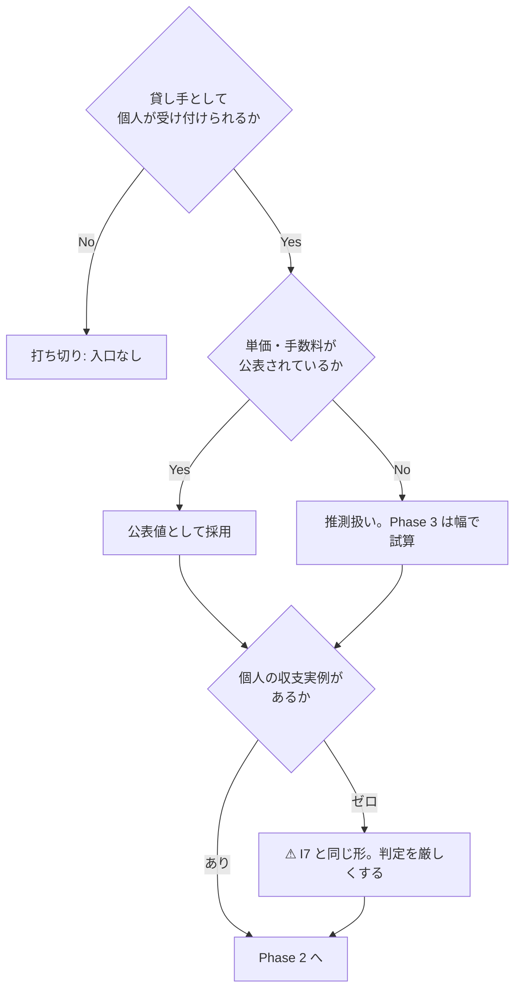
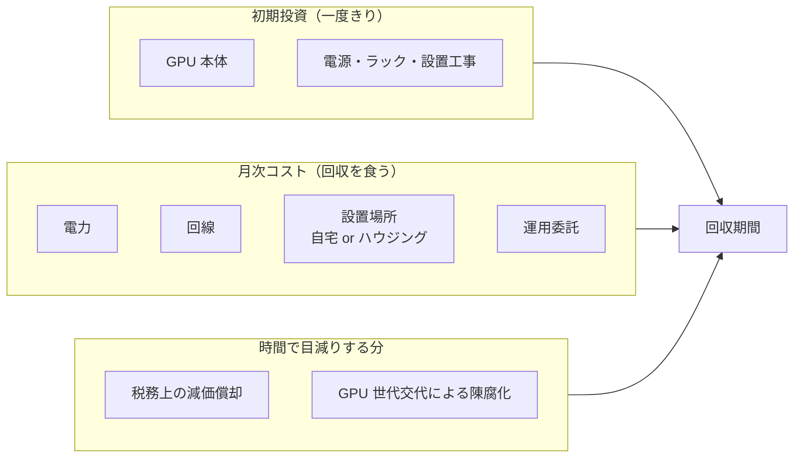
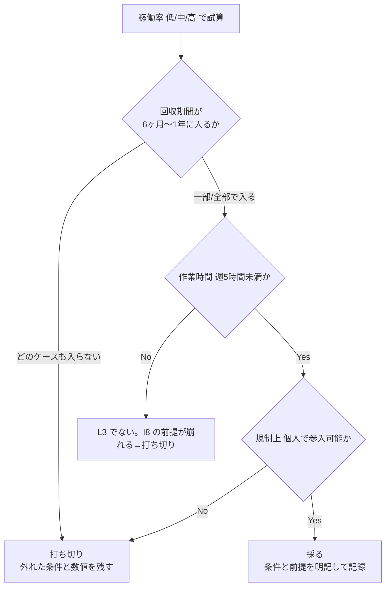

# I8 計算資源の貸出（GPU）を分析する

調査プラン。**実行はしない**（機材購入・契約・出品を行わず、一次情報と試算で採否を判定する）。

## 目的・背景

確定セグメント（資金 大 1,000 万円〜 × 週 5〜15 時間 × 回収 6 ヶ月〜1 年）で解禁された候補のうち、
I8 は **新規かつ L3（人が関与しない）** の本命。[shortlist.md](../../specs/income-taxonomy/shortlist.md#確定セグメントの候補2026-08-26) から起票。

一方で懸念が 2 つある。この 2 つを潰せるかがこの調査の主題。

| 懸念 | 内容 | どの Phase で見るか |
| --- | --- | --- |
| 時間軸 | 回収 1 年は GPU 貸出としては短い。ハード償却が間に合わない可能性 | Phase 3 |
| 関与度 | 障害対応・再起動が発生すると L3 でなく L1 に落ちる。運用委託が前提 | Phase 2 |

収入の発生経路。**自分が触るのは「設置と委託の決定」だけで、以降の取引に人が入らない**ことが L3 の条件。

## 判定条件

Phase 3 の試算で以下をすべて満たせば「採る」、1 つでも外れたら理由を残して打ち切る。

- 初期投資が資金枠（1,000 万円〜）に収まる
- 想定稼働率での回収期間が **6 ヶ月〜1 年** に入る
- 月あたりの自分の作業時間が **週 5 時間未満**（L3 を維持できる。超えるなら I8 の前提が崩れる）
- 法規制上、個人・個人事業主で参入できる（届出が必要なら手続きの重さを含めて判断する）

## Phase 1: 需要側（マーケットプレイスの実在と単価）

貸し手側として実際に収入が発生している経路があるかを一次情報で確認する。

- [ ] GPU マーケットプレイス（Vast.ai / RunPod / Salad / io.net 等）の**貸し手向け**ページを当たり、実在と受付状況を確認する
- [ ] 【公表値】として、GPU 種別ごとの時間単価・プラットフォーム手数料・支払通貨・日本からの受取可否を集める（出典 URL と取得日を付ける）
- [ ] 公表されている稼働率、または稼働率の実績を出している第三者情報を探す。**無ければ「不明」と書き、Phase 3 では幅で試算する**
- [ ] 個人の貸し手が収支を公開している事例があるか探す（I7 の教訓: 実例ゼロなら入口が無い可能性を疑う）

## Phase 2: コスト側と規制（⚠ ここが本丸）

収入側より、こちらの見落としで回収期間が壊れる。

- [ ] ⚠ **電気通信事業法**の届出要否を総務省の一次情報で確認する（計算資源の貸出が「電気通信事業」に当たるか。当たらない場合もその根拠を残す）
- [ ] ⚠ 他に掛かる規制を洗う（消防法・電気事業法の受電容量、自宅設置なら賃貸契約・用途地域、事業所得の扱い）
- [ ] 電力: 必要容量と契約種別、単価（円/kWh）を【公表値】で押さえ、24 時間稼働時の月額を試算する
- [ ] 冷却・設置: 自宅設置とデータセンター/ハウジングの 2 案でコストを比較する
- [ ] 償却: ハードの耐用年数（税務上）と、GPU 世代交代による**実質的な陳腐化期間**を分けて見積もる
- [ ] 運用委託: 障害対応を委託できるか、費用はいくらか。委託できないなら関与度 L3 が崩れる

コスト構造。**回収期間を壊すのは初期投資ではなく月次コストと稼働率**という仮説を検証する。

## Phase 3: 試算と判定

- [ ] 最小構成 1 台の構成を決め、初期投資・月次コストを積み上げる（すべて【推測】、根拠に Phase 1・2 の【公表値】を紐づける）
- [ ] 稼働率を **低 / 中 / 高** の 3 ケースで振り、ケース別の月次粗利と回収期間を出す
- [ ] 判定条件 4 つに照らして採否を判定する。打ち切る場合は「どの条件が、どの数値で外れたか」を残す
- [ ] 結果を [docs/specs/experiments/i8-gpu-rental.md](../../specs/experiments/i8-gpu-rental.md) に記録する

## 影響範囲

| 対象 | 変更内容 |
| --- | --- |
| `docs/specs/experiments/i8-gpu-rental.md` | 新規作成。調査結果・試算・判定を記録 |
| `docs/specs/income-taxonomy/catalog.md` | I8 エントリへ調査結果を追記（出典・取得日つき） |
| `docs/specs/income-taxonomy/ai-delta.md` | I8 の「新規」判定が調査と食い違った場合のみ修正 |
| `TODO.md` / `DONE.md` | 完了時に移動 |

## 検証方針

実行しない方針のため、成果物の正しさは**数値の出所**で担保する。

- 数値はすべて【公表値】（出典 URL + 取得日）か【推測】（計算式と前提）のどちらかに区分する。区分の無い数字を書かない
- 【公表値】は可能な限り事業者・官公庁の一次情報を当たる。ブログ・まとめ記事しか無い数値は【推測】に落とす
- 稼働率のように取得できない可能性が高い値は、単一値で置かず幅で試算する
- Phase 1 で入口が無い / Phase 2 で規制に阻まれる場合は、Phase 3 に進まず打ち切る（I7 と同じ形）
