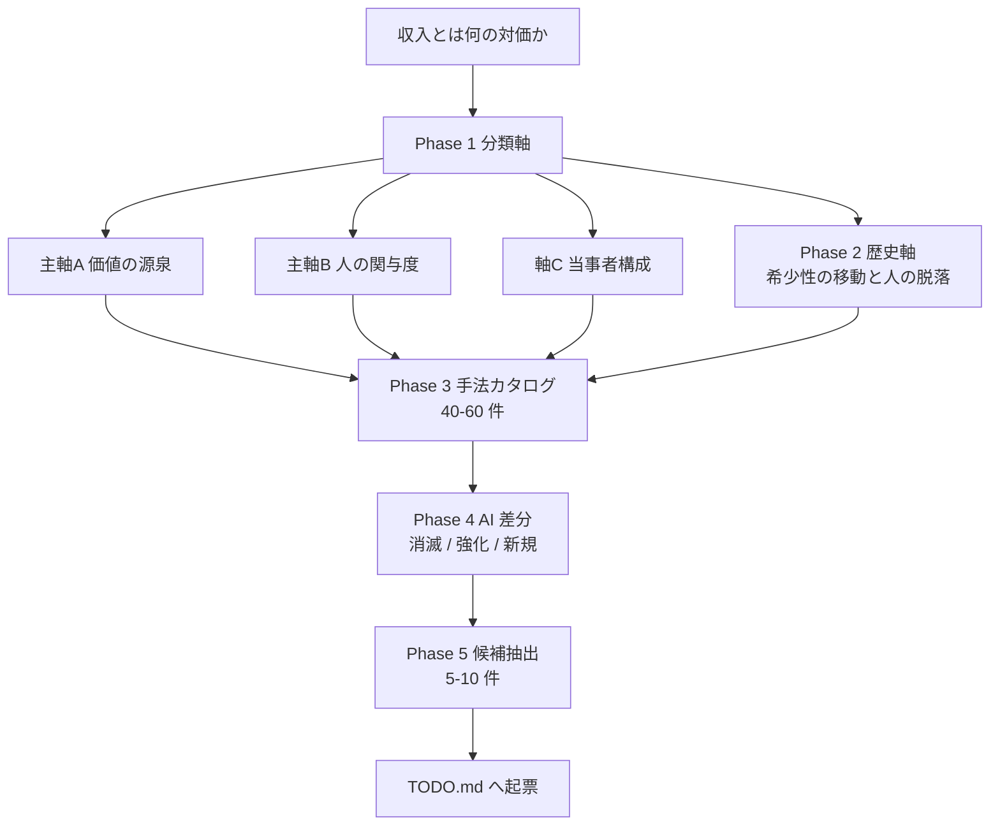
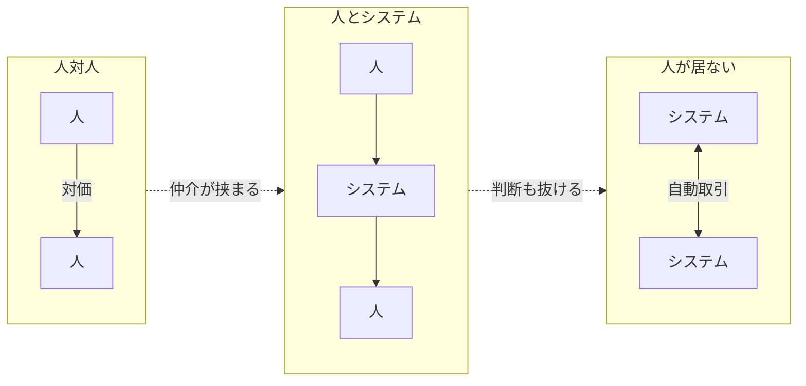
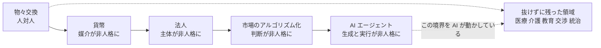
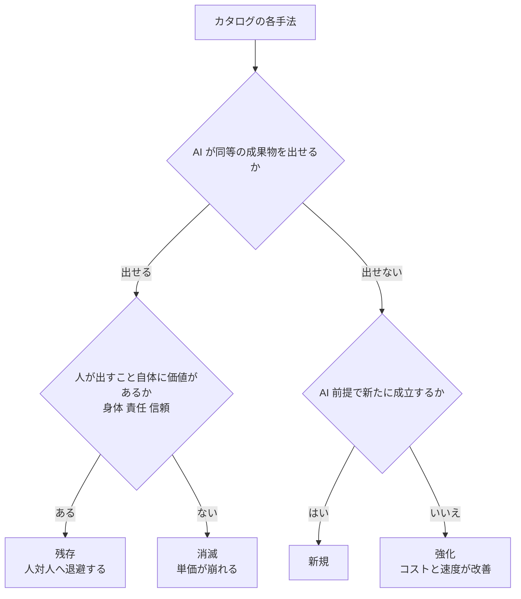
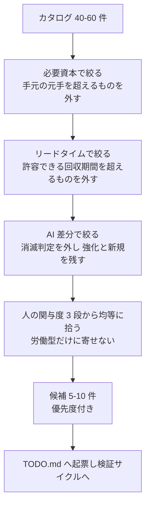

# 収入手法の分類化 — 人類と収入の体系化

## 目的・背景

「AI で収入を稼ぐ方法」を探す前提として、まず **AI に限らず、そもそも金銭がどう発生するか** の
全体地図を作る。AI 単体で発想すると「AI で書ける記事を売る」「AI ツールを作る」のような
足元の思いつきに偏り、収入手法の空間全体のどこを触っているのかが見えない。

先に収入手法そのものを体系化しておけば、

- AI は **既存手法のどのパラメータを変えるのか**（コスト・スピード・必要スキル・スケール上限）
- AI で **消える手法／強化される手法／新たに成立する手法** はどれか
- 自分の資本・スキル・時間で **現実的に取れる手法** はどこか

を、思いつきではなく地図上の位置として判断できるようになる。

体系の対象範囲は **人が働いて得る収入に限定しない**。次の両端をどちらも含める。

- **人対人**: 相手が目の前にいて、信頼・関係・身体性が価値の中心にあるもの（施術、接客、教育、交渉、介護）
- **人の視点がないもの**: 人が毎回関与しない、あるいはそもそも人が当事者でない金銭の流れ
  （資本の利子・配当、地代、権利が自動で生む収入、アルゴリズム取引、API 課金、
  法人・国家・DAO といった非人格の主体、そして AI エージェント同士の取引）

この両端を同じ体系に載せることが本タスクの肝になる。片方だけでは「AI が何を変えるのか」が見えない
（AI は人対人の領域を侵食する側であり、同時に人抜きの収入を個人の手に届かせる側でもある）。

成果物は `docs/specs/income-taxonomy.md`（体系そのもの）とする。本プランはその作成手順。

## 対応方針

体系化を「分類軸」「歴史軸」「カタログ」「AI 差分」の 4 層で積み上げる。
先に軸を決め、あとからカタログを流し込む順序にする（カタログから始めると軸が後付けになり破綻するため）。

### 中核となる 2 つの仮説

体系の背骨に置き、各時代・各手法をこの 2 文に接続できる形で記述する。

1. **収入とは「その時代に希少なものを、必要としている相手に渡す」ことの対価である。**
   何が希少かは時代とともに移り、そのたびに主要な収入手法が入れ替わってきた。
2. **経済史は「取引から人を抜いていく」方向に進んできた。**
   物々交換（人対人）→ 貨幣（非人格の媒介）→ 法人（非人格の主体）→ 市場・アルゴリズム
   → AI エージェント、と段階的に人が抜けてきた。
   **抜けずに人対人に残ったものが、その時点で人にしか出せない価値**であり、
   AI はこの境界線を再び動かしている。

### 図の方針

本タスクの成果物は文章だけでは頭に入らないので、**各層に必ず 1 枚は図を置く**。
図は Mermaid で書く（vibeboard が mermaid@11 でレンダリングするため、`docs/` 配下でそのまま閲覧できる）。

体系の全体像:

図を描くときの原則:

- **1 図 1 主張**。その図で何を言いたいのかを図の直前に 1 行で書く
- **表で足りるものは表にする**。図は「関係・流れ・位置」を示すときだけ使う（一覧・属性は表）
- ノードは 12 個以内。超えたら分割する
- 図と本文で食い違いが出たら本文を正とし、図を直す（図の作り直しを惜しまない）

### Phase 1: 分類軸の設計

収入手法を並べるための軸を定義する。候補は以下（Phase 1 で取捨選択・確定させる）。

**主軸 A: 価値の源泉** — 何と引き換えに金銭を得ているか

労働時間 / 技能 / 成果物 / 資本 / 権利・ライセンス / リスク引受 / 仲介 / 注目（アテンション） /
土地・自然資源 / データ・計算資源

**主軸 B: 人の関与度** — 一回の入金に人手がどれだけ要るか

| 段階 | 内容 | 例 |
| --- | --- | --- |
| 毎回関与 | 入金のたびに人が働く | 施術、接客、受託開発、登壇 |
| 初回のみ関与 | 一度作って置いておくと売れ続ける | 書籍、ソフトウェア、コンテンツ、特許 |
| 関与しない | 人が居なくても回り続ける | 利子・配当、地代、アルゴリズム取引、自動販売、API 課金 |

従来の「線形 ↔ 非線形（スケールするか）」はこの軸の帰結として説明できるので、独立の軸にはしない。

**軸 C: 当事者構成** — 誰が誰に渡しているか（「取引相手は誰か」もここに統合する）

| 構成 | 内容 | 例 |
| --- | --- | --- |
| 人 → 人 | 相手が特定の個人。関係・信頼・身体性が価値 | 訪問介護、家庭教師、理容、対面営業 |
| 人 → 多数の人 | 一対多。相手は顔が見えない群 | 出版、配信、広告収入 |
| 人 → システム | 納品先が機械・プラットフォーム | データ提供、API 向けコンテンツ供給、アルゴリズムへの入力 |
| システム → 人 | 人手を介さず人に売る | 自動販売機、SaaS の自動課金、レコメンド販売 |
| システム → システム | 人が両端に居ない | アドテクの RTB、高頻度取引、API 課金、AI エージェント間の取引 |
| 非人格の主体 | そもそも受け取り手が人でない | 法人、国家（徴税）、ファンド、DAO |

金の流れとして見ると、人が両端から抜けていく順に並ぶ（左ほど人対人、右ほど人が居ない）:

**属性（各手法に付ける）**: 必要資本（ゼロ/小/中/大） / リードタイム（即日〜数年） /
収入形態（フロー ↔ ストック） / 法的形態（雇用・業務委託・法人・投資家・権利者）

- 軸は主軸 2 本 + 当事者軸 1 本に絞り、残りは属性として扱う（軸が多いと分類が作業化して使われなくなる）
- 分類のとき「人が関与しない手法」を後回しにしない。**軸 B の『関与しない』段は必ず埋める**

### Phase 2: 歴史軸の整理（人類と収入）

時代ごとに「希少だったもの」「主要な収入手法」に加えて、**その時代に取引から何が抜けたか**を対応付ける。
現在の手法が歴史のどの層の上に載っているかを見えるようにするのが目的。

| 時代 | 希少だったもの | 代表的な収入手法 | 取引から抜けたもの |
| --- | --- | --- | --- |
| 狩猟採集 | 食料・体力 | 分配・贈与（貨幣以前） | — （完全に人対人） |
| 農耕 | 土地・収穫 | 地代、小作、年貢 | 労働と収入の直結（土地が稼ぐ） |
| 交易 | 距離・情報の非対称 | 商人、仲介、運搬 | 生産者と消費者の対面 |
| 貨幣・信用の成立 | 交換の媒介・信用 | 両替、貸付、利子 | 物そのもの（価値が数値になる） |
| 手工業・ギルド | 技能 | 職人、徒弟、独占的販売 | — （技能で人が戻る） |
| 産業革命 | 資本・機械 | 賃労働、株式、工場所有 | 職人の身体（機械が代替） |
| 法人・株式会社 | 大規模な資本集約 | 配当、経営、有限責任 | 取引主体としての個人（法人が主体に） |
| 情報・ソフトウェア | 複製コストの消失 | ライセンス、SaaS、広告 | 生産の反復（一度書けば無限に複製） |
| ネットワーク・プラットフォーム | 集約された需給 | 手数料、マッチング、レベニューシェア | 売り手と買い手の相互認知 |
| 市場のアルゴリズム化 | 速度・情報処理 | 高頻度取引、アドテク、自動マーケットメイク | 判断する人間（機械が取引する） |
| AI | 生成コストの消失 | （Phase 4 で扱う） | （Phase 4 で扱う） |

この表の「抜けたもの」の列だけを取り出すと、経済史は一本の線になる:

- 各時代について「何が希少 → 誰が払った → なぜその手法が成立した → 誰が居なくなった」を 4 行以内で書く
- 通史の網羅ではなく、**希少性の移動**と**人の脱落**の 2 本だけを追う。歴史記述に踏み込みすぎない
- 同時に「その時代でも人対人のまま残ったもの」を各行に 1 例添える（医療、教育、交渉、統治など）

### Phase 3: 手法カタログの作成

現代で実際に取れる収入手法を列挙し、Phase 1 の軸で属性を埋める。

- 目標は 40〜60 件。粒度は「動画編集の受託」「不動産賃貸」「アフィリエイト」程度に揃える
- **人が関与しない手法を最低 1/3 は入れる**。放っておくと労働型ばかりのカタログになるため、
  枠を先に確保する（配当、社債、地代、駐車場、自動販売、ドメイン、権利の相続・買取、
  インデックス投資、レンディング、API 従量課金、ボット運用 など）
- **人対人の手法も、AI 耐性の観点から手厚く扱う**（施術、介護、保育、対面営業、仲人、
  コーチング、身元保証、立会人、儀礼 — 身体・責任・信頼が絡んで代替されにくい領域）
- 各エントリの記載項目: 手法名 / 価値の源泉 / 人の関与度 / 当事者構成 / 必要資本 /
  リードタイム / 典型的な失敗理由
- 金額を書く場合は **実測値か推測値かを必ず明示する**（CLAUDE.md の方針に従う）。
  出典の無い相場は「推測」と明記し、断定しない
- 個人が取れない手法（国家の徴税、中央銀行の通貨発行、大規模金融）も、
  **体系の完全性のために枠だけは残す**。「金銭がどこから来ているか」の上流を欠くと地図が閉じないため

### Phase 4: AI による差分の重ね合わせ

Phase 3 のカタログ各エントリに対し、AI が効くパラメータを判定する。

- 判定区分: **消滅**（AI が代替して単価が崩れる） / **強化**（同じ手法を低コスト・高速化できる） /
  **新規**（AI 以前には成立しなかった）

判定は次のフローで機械的に行い、迷ったものだけ個別に議論する:

- 「生成コストが下がると、次に希少になるのは何か」を明示する
  （判断、責任、信頼、流通経路、独自データ、顧客との関係 — など。Phase 4 で確定させる）
- 本タスクで拡張した両端について、それぞれ固有の問いを立てる:
  - **人対人の側**: AI が代替しにくいと言われる領域（相談、教育、伴走、介護）に、
    実際どこまで入ってくるか。残るのは「人であること自体が価値」の部分なのか、
    「責任を引き受ける主体が要る」部分なのか
  - **人が居ない側**: これまで資本や専門性が要って個人には届かなかった「人が関与しない収入」を、
    AI がどこまで個人の手に降ろすか（運用の自動化、エージェントによる代行、
    AI エージェント同士の取引に個人が課金主体として参加できるか）
- ここが本プロジェクト固有の価値になる部分。時間をかける

### Phase 5: 自分に適用可能な候補の抽出

体系から、実際に着手する候補を絞る。

- 手持ちの資本・スキル・投下可能時間を前提条件として明文化する
- その制約でフィルタし、候補を 5〜10 件に絞って優先度を付ける
- 候補は「人の関与度」の 3 段階から偏りなく拾う
  （毎回関与＝すぐ入るが伸びない、関与しない＝伸びるが元手か時間が要る、の性質差を残したまま比較する）
- 上位候補は `TODO.md` に個別タスクとして起票し、以降は検証サイクル（試す → 記録 → 判断）に渡す

絞り込みは次の順で行う（先に前提条件を書いてから流す）:

## 影響範囲

- 新規作成: `docs/specs/income-taxonomy.md`（成果物）
- 更新: `TODO.md`（本タスクの子タスク、および Phase 5 で起票する候補タスク）
- コードへの影響なし（ドキュメントのみ）
- 想定外に大きくなった場合は、`docs/specs/income-taxonomy/` 配下に
  `axes.md` / `history.md` / `catalog.md` / `ai-delta.md` として分割する

## テスト方針（検証方針）

ドキュメント成果物のため、以下の受け入れ条件で検証する。

1. **網羅性テスト**: 実在する収入手法を 20 件無作為に挙げ、すべてが体系のいずれかに分類できるか。
   分類できないものが 3 件以上出たら軸の設計に戻る（Phase 1 へ差し戻し）
2. **両端テスト**: その 20 件に、**人対人の手法**と**人が関与しない手法**がそれぞれ 5 件以上含まれるか。
   偏っていたらカタログ側の抽出が労働型に寄っている
3. **一意性テスト**: 同じ手法が複数カテゴリに重複して入っていないか。入る場合は主軸での所属を 1 つに決める
4. **実例テスト**: 各カテゴリに、実在する具体例が最低 1 件付いているか。付かないカテゴリは机上の空論として削除する
5. **判断可能性テスト**: 「明日から始めるならどれか」を体系だけを見て答えられるか。
   答えられない場合、Phase 3 の属性（必要資本・リードタイム）が埋まっていない
6. **出典テスト**: 数値が書かれている箇所すべてに、実測か推測かのラベルが付いているか
7. **図テスト**: 分類軸・歴史・当事者構成・AI 差分・絞り込みの各層に図が 1 枚以上あり、
   それぞれ図の直前に「何を言いたいか」の 1 行が付いているか。図が本文と食い違っていないか

## 進め方の注意

- Phase 1 → 2 → 3 は順に進める。Phase 4 は Phase 3 完了後でないと意味を持たない
- Phase 3 のカタログは一度に完成させず、まず 10 件で軸の妥当性を検証してから残りを埋める。
  この 10 件には人対人・人が関与しない手法を必ず混ぜる（労働型だけで検証すると軸 B・C が試されない）
- 体系化それ自体が目的化しないよう、**Phase 5 まで到達して初めて完了** とする
