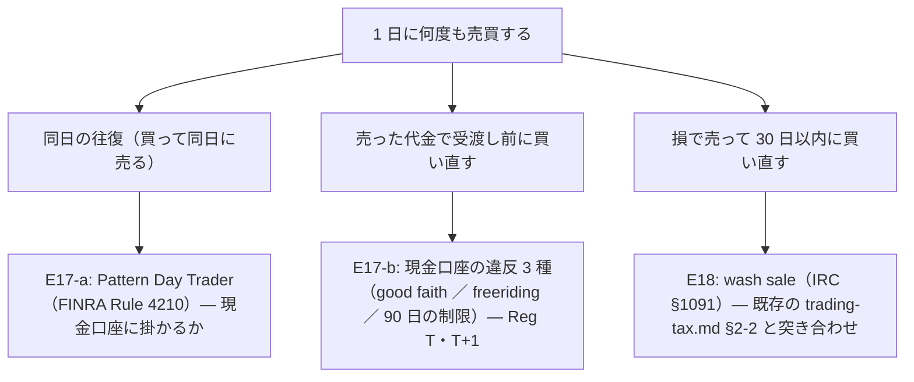

# E17・E18: 1 日に何度も売買するときの規制と wash sale を一次情報で確かめる

2026-09-18。利用者の指示「そっちで進められるのをやって」。TODO「実売買を 4 役に分け直すために決めること」の E17・E18。

## 1. 目的・背景

2026-09-18 に「1 日に何回売買するかはトレーダーの判断」と決まった（CLAUDE.md の 2 つ目の例外）。それまでの前提「1 日 1 回の執行なら同日の往復は起きない」（[プラン §4](live-trading-three-models.md)）が外れるので、**同日の往復・売った代金での買い直し**が起きうる。C9（今日買った株を今日売ってよいか）・D13（発注してよい時間帯）・D14（1 日の上限）を決める前に、規制の側の線を一次情報で引いておく。

⚠ 机上の調査だけ。口座にも執行器にも触れない。⚠ **法令・税の最終判断は利用者（と CPA）**。ここは出典つきの整理まで。

## 2. 調べること

**主張: 口座は 1 つの現金口座なので、規制は「口座単位」で 3 本ある。トレーダー別ではない。**

| # | 問い | 当たる一次情報 |
|---|---|---|
| E17-a | PDT の規則は現金口座に掛かるか。2025〜2026 年の改正（$25,000 要件の見直し）の現状 | FINRA Rule 4210・FINRA の投資家向け解説・SEC の承認状況 |
| E17-b | 現金口座で受渡し前の代金を使うと何が違反になるか。T+1 でいつ「受渡し済み」になるか | Reg T（12 CFR 220.8）・SEC ／ FINRA の投資家向け解説・SEC の T+1 規則 |
| E17-c | tastytrade は現金口座をどう扱うか（受渡し前の代金で買えるか・違反時の制限） | tastytrade のヘルプ |
| E18 | wash sale は 3 人のトレーダーが同じ口座で売買するとどう数えられるか | IRS Pub 550・IRC §1091（既存の trading-tax.md §2-2・§2-7 を確かめ、足りなければ足す） |

## 3. 成果物

- `docs/specs/experiments/live-trading.md` に「§0-6 規制の線（1 日に何度も売買するとき）」を足す（出典 URL・取得日つき。数値は【公表値】）
- 執行器が守るべき線を「C9・D13・D14 への含意」として表にする（⚠ **決めるのは利用者**。Claude は候補と理由まで）
- TODO の E17・E18 を `DONE.md` へ。含意は C9・D13・D14 のメモに付ける

## 4. 影響範囲・テスト

文書だけ（コードは変えない）。執行器に歯止めを足すかは C9・D14 の裁定の後。
